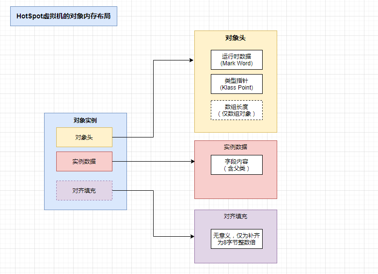
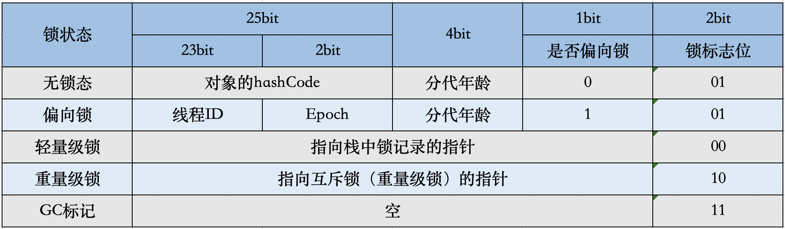
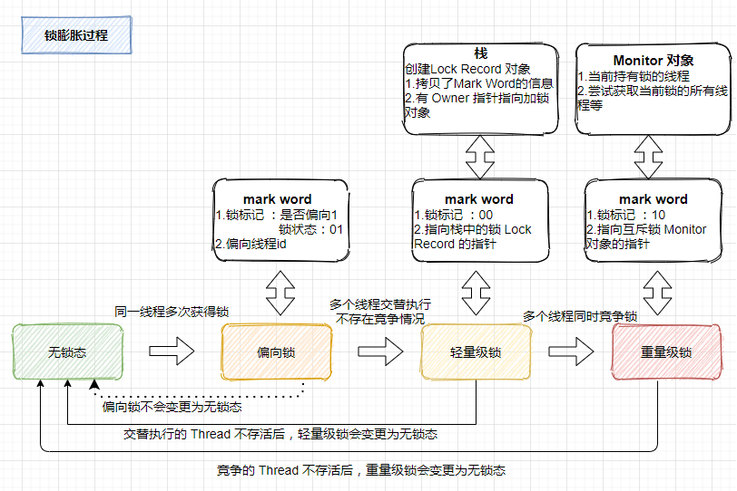
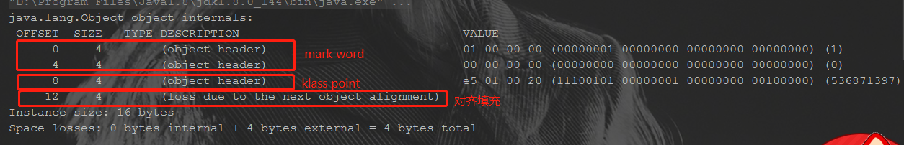
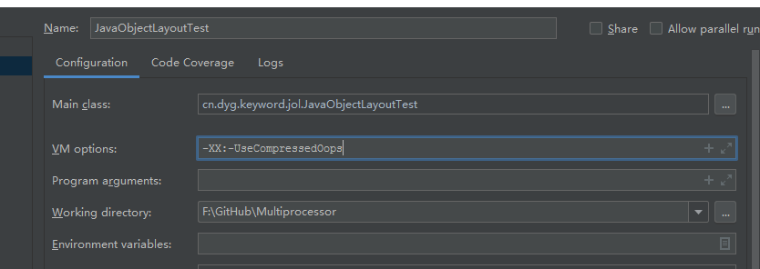
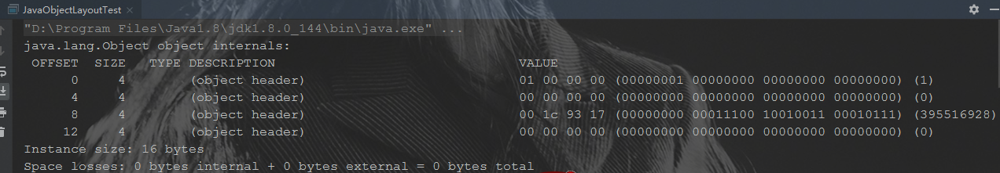
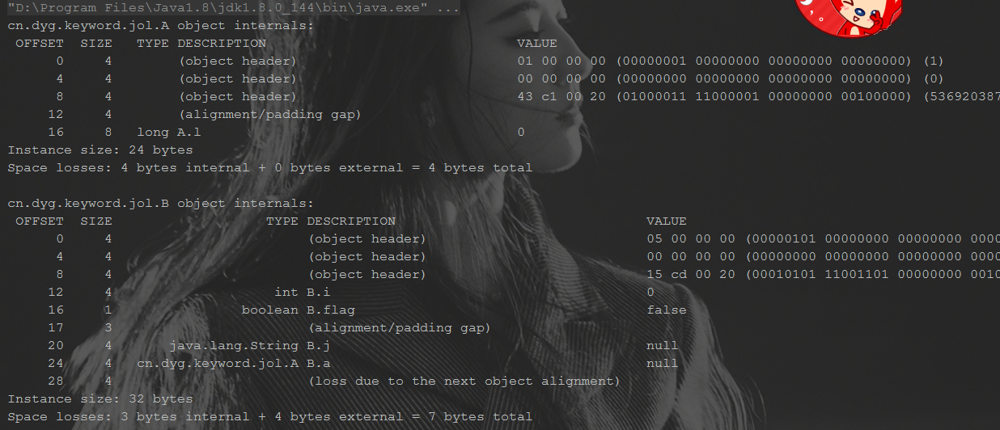
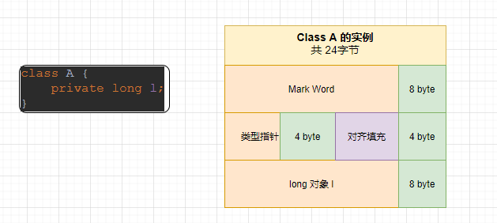
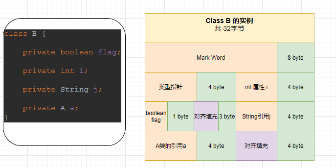

# JVM(一)：对象的内存布局

> 在学习 **synchronized** 的过程中，发现其底层实现是和对象实例的对象头高度相关的，synchronized申请锁、上锁、释放锁都与对象头有关，因此有必要学习一下对象在内存中的布局，来加深对相关知识的了解。

## 对象内存构成

当我们通过 new 来创建一个类的实例对象时，JVM会在堆中给这个对象分配一个内存地址，那么有几个问题值得探究一下：

- 这个实例对象在内存中都有些什么内容?
- 每当 new 出一个对象时，它所占用的内存到底有多大？
- 对象中的属性是如何在内存中分配的？

在JVM中，对象实例被保存在堆中，由以下三部分构成：

- **对象头（object header）**：包括两部分信息，**对象自身的运行时数据**和**类型指针**
- **实例数据（Instance Data）**：存放类的数据信息
- **对齐填充（Padding）**：无实际意义，仅为了将对象填充为8字节的倍数

内存布局示例图如下：



### 对象头

对象头由两部分组成，**对象自身的运行时数据**和**类型指针**。分别被称为 **mark word**和**klass pointer**。

另外，如果对象是个数组，那么还会有一块用于记录数组长度的数据，因为虚拟机可以通过普通Java对象的元数据信息确定Java对象的大小，但是从数组的元数据中无法确定数组的大小。

#### Mark Word

用于存储对象自身的运行时数据，如哈希码、GC分带年龄，锁状态标志、线程持有的锁、偏向线程ID、偏向时间戳等，这部分数据的长度和JVM的位相关，Mark Word在32位JVM中的长度是32bit，在64位JVM中长度是64bit。

对象需要存储的运行时数据远超32bit和64bit所能记录的限度，但是对象头信息是与对象自身定义的数据无关的额外存储成本，考虑到虚拟机的空间效率，Mark Word 被设计成一个非固定的数据结构以便在极小的空间内存储尽量多的信息，它会根据对象的状态复用自己的存储空间。

Mark Word在不同的锁状态下存储的内容不同，在32位JVM中是这么存的



在64位JVM中是这么存的


虽然它们在不同位数的JVM中长度不一样，但是基本组成内容是一致的。

- **锁标志位（lock）**：区分锁状态，11时表示对象待GC回收状态, 只有最后2位锁标识(11)有效。
- **biased_lock**：是否偏向锁，由于无锁和偏向锁的锁标识都是 01，没办法区分，这里引入一位的偏向锁标识位。
- **分代年龄（age）**：表示对象被GC的次数，当该次数到达阈值的时候，对象就会转移到老年代。
- **对象的hashcode（hash）**：运行期间调用System.identityHashCode()来计算，延迟计算，并把结果赋值到这里。当对象加锁后，计算的结果31位不够表示，在偏向锁，轻量锁，重量锁，hashcode会被转移到Monitor中。
- **偏向锁的线程ID（JavaThread）**：偏向模式的时候，当某个线程持有对象的时候，对象这里就会被置为该线程的ID。 在后面的操作中，就无需再进行尝试获取锁的动作。
- **epoch**：偏向锁在CAS锁操作过程中，偏向性标识，表示对象更偏向哪个锁。
- **ptr_to_lock_record**：轻量级锁状态下，指向栈中锁记录的指针。当锁获取是无竞争的时，JVM使用原子操作而不是OS互斥。这种技术称为轻量级锁定。在轻量级锁定的情况下，JVM通过CAS操作在对象的标题字中设置指向锁记录的指针。
- **ptr_to_heavyweight_monitor**：重量级锁状态下，指向对象监视器Monitor的指针。如果两个不同的线程同时在同一个对象上竞争，则必须将轻量级锁定升级到Monitor以管理等待的线程。在重量级锁定的情况下，JVM在对象的ptr_to_heavyweight_monitor设置指向Monitor的指针。

**拓展1：当由无锁态转变为其他状态时，原对象头信息去哪了？**

偏向锁：在未进行哈希计算的情况下，偏向锁状态将原哈希值的存储位置用来存储线程id和 epoch 内容了，若进行了哈希计算，则进入不了偏向锁状态。

轻量级锁：原 Mark Word 内容被复制到了获取到锁的线程的栈创建的 Lock Record 对象中。

重量级锁：原 Mark Word 内容被复制到了互斥锁 Monitor 对象中。`HotSpot` 虚拟机的 `Monitor` 的实现 `ObjectMonitor` 类(C++类)里有字段可以记录非加锁状态下的`Mark Word`，其中可以存储identity hash code的值。或者简单说就是重量锁可以存下identity hash code。

详情可参考：[当Java对象处在偏向锁、轻量锁、重量级锁状态时，Mark Word值存储在哪？](https://blog.sakuradon.com/index.php/archives/985/)

**拓展2：锁得膨胀过程**



#### Klass Pointer

即类型指针，是对象指向它的类元数据的指针，虚拟机通过这个指针来确定这个对象是哪个类的实例。在32位系统下，类型指针的空间大小是4字节。

在 64 位系统及 64 位 JVM 下，开启指针压缩，那么头部存放 类型指针的空间大小还是4字节，而 Mark Word 区域会变大，变成 8 字节，也就是头部最少为 12 字节。若未开启，则 类型指针的空间大小变成 8 字节。

注：JVM在 6 之后，在64位操作系统下都是默认开启的，如果想关闭，可以通过配置vm参数开启关闭指针压缩，`-XX:-UseCompressedOops`。

> 压缩指针：开启指针压缩使用算法开销带来内存节约，Java 对象都是以 8 字节对齐的，也就是以 8 字节为内存访问的基本单元，那么在地理处理上，就有 3 个位是空闲的，这 3 个位可以用来虚拟，利用 32 位的地址指针原本最多只能寻址 4GB，但是加上 3 个位的 8 种内部运算，就可以变化出 32GB 的寻址。
>
> 系统寻址的内存单位是Byte，因此是2的32次方即4GB，但Java对象均为8字节对齐的，因此，寻址的时候寻到8字节的头部往后读取就可以，因此有三个位就空闲了。

### 实例数据

如果对象有属性字段，则这里会有数据信息。如果对象无属性字段，则这里就不会有数据。根据字段类型的不同占不同的字节，例如boolean类型占1个字节，int类型占4个字节等等；

### 对齐数据

对象可以有对齐数据也可以没有。默认情况下，Java虚拟机堆中对象的起始地址需要对齐至8的倍数。如果一个对象用不到8N个字节则需要对其填充，以此来补齐对象头和实例数据占用内存之后剩余的空间大小。如果对象头和实例数据已经占满了JVM所分配的内存空间，那么就不用再进行对齐填充了。

所有的对象分配的字节总SIZE需要是8的倍数，如果前面的对象头和实例数据占用的总SIZE不满足要求，则通过对齐数据来填满。

**为什么要对齐数据**？字段内存对齐的其中一个原因，是让字段只出现在同一CPU的缓存行中。如果字段不是对齐的，那么就有可能出现跨缓存行的字段。也就是说，该字段的读取可能需要替换两个缓存行，而该字段的存储也会同时污染两个缓存行。这两种情况对程序的执行效率而言都是不利的。其实对其填充的最终目的是为了计算机高效寻址。

## 可视化内存布局

通过引入openjdk提供的 jol-core 依赖，就可以获取对象和虚拟机的信息，依赖如下：

```xml
<dependency>
  <groupId>org.openjdk.jol</groupId>
  <artifactId>jol-core</artifactId>
  <version>0.9</version>
</dependency>
```

jol-core 常用的三个方法

- `ClassLayout.parseInstance(object).toPrintable()`：查看对象内部信息.
- `GraphLayout.parseInstance(object).toPrintable()`：查看对象外部信息，包括引用的对象.
- `GraphLayout.parseInstance(object).totalSize()`：查看对象总大小

#### 普通对象

直接通过打印一个 Object 对象，来看一下对象到底都有什么

对应代码：

```java
		Object o = new Object();
    System.out.println(ClassLayout.parseInstance(o).toPrintable());
```

打印结果如下：



可以看到，对象此时大小为 16 bytes ，由于没有字段内容，所以无实例数据，仅含对象头和对齐填充，尽管是64位系统，但由于JDK8默认开启了指针压缩，所以类型指针仅4个字节，mark word则为8个字节（64 bit），对象头共 12 bytes，由于java对象以 8 bytes 作为内存访问的基本单元，所以要对齐为 8n bytes，就有 4 bytes 的对齐填充。

**拓展：小端模式**

> ps:打印结果可以看到 mark word 的第一个字节的 16 进制数是 01 ，然后前四个字节的 10 进制数结果是 1，这里存储的方案是**小端模式**，即**低位字节排放在内存的低地址端，高位字节排放在内存的高地址端。**
>
> 因此虽然第一个字节是 01 ，但实际是存储的低位字节，因此尽管看起来是 “01 00 00 00 ”，但表示的意思确实 “00 00 00 01”，所以当然其 10 进制结果是 1 了。
>
> 详情可见参考内容：[详解大端模式和小端模式](https://www.cnblogs.com/little-white/p/3236548.html)

若关闭指针压缩，可以通过配置 jvm 参数开启关闭指针压缩，`-XX:-UseCompressedOops`。

添加参数如下：



关闭后再运行输出 obj 的内存布局，可以得到以下输出：



可以看到对象头中的类型指针由 4 bytes 增加为 8 bytes，因为关闭指针压缩后，采用 64 bit 来指向类的元数据地址。

此时对象头已经变为总共 16 bytes，不需要进行对齐填充。

上述 object 对象中没有任何的属性，如果有属性的话，就会根据属性所占用的空间先进行对齐，对齐完成后如果不为 8 bytes 的倍数，会进行对齐填充。

示例代码如下：

```java
/**
 * ObjectSize 类是 估算对象大小
 *
 * @author dongyinggang
 * @date 2021-02-23 15:56
 **/
public class ObjectSize {

    public static void main(String[] args) {
        A a = new A();
        System.out.println(ClassLayout.parseInstance(a).toPrintable());

        B b = new B();
        System.out.println(ClassLayout.parseInstance(b).toPrintable());
    }
}


class A {
    private long l;
}

class B {

    /**
     * 1个字节,会补对应字节
     */
    private boolean flag;
    /**
     * 调整后,会作为对象头12个字节后的4个字节
     */
    private int i;
    /**
     * string只有引用，若开启指针压缩会占用4个字节，否则占用8个字节
     */
    private String j;
    /**
     * 只有A的引用a,若开启指针压缩会占用4个字节，否则占用8个字节
     */
    private A a;
}
```

控制台输出如下：



看 a 的输出，由于 Long 占用 8 个字节，所以不能够补充到对象头12个字节之后，构成16字节，因此会有4字节的对齐填充，然后有占用8字节的 long 类型的属性 l。因此对象 a 的总大小为 24 字节

其对齐填充后的结果如下图：



再看 b，我们知道 Mark Word - 8字节，类型指针 - 4 字节，boolean 类型 -1字节，int - 4字节，String 和 A 类的引用在开启指针压缩的情况下均为 4 字节，（如果没有开启指针压缩，则 String 引用和 A类的引用均为8字节 ），那么可以知道

b 的总字节数 = 8+4+1+4+4+4=25，由于25不是 8的倍数，因此需要补7个字节达到32字节。

再看 b 的输出，可以看到输出结果和定义顺序并不完全一致，如下：

1. int 对象 i 被提前至对象头12个字节后的4个字节进行了补充
2. 随后是 boolean 类型的属性，由于其仅占用1个字节，因此进行了3字节的对齐填充，补齐后的这4字节和接下来的 String 类型的属性的 4 字节合并成对，
3. 最后一个 A 类的引用也占用了 4字节，至此共28字节，因此最终加上4个字节进行补齐。

也就是确实一共进行了7个字节的补齐，但并不是在最后一股脑的补齐的，而是**每次都在尝试凑齐 8 字节**。

补齐后的结果如下图：



#### 数组对象

前面提到过，若是数组对象，那么对象头中会含有数组长度信息，本次测试默认开启指针压缩，测试代码如下：

```java
/**
 * arrayObjectHeader 方法是 数组的对象头信息
 *
 * @author dongyinggang
 * @date 2021/2/24 8:24
 */
private static void arrayObjectHeader(){
    String[] arrays = new String[258];
    System.out.println(ClassLayout.parseInstance(arrays).toPrintable());
}
```

输出结果如下：


解析如下

- 0-8 是 mark word
- 8-12  是压缩后的类型指针
- 12-16 是数组长度，16进制中的  01 02 即为 1\*16²+2\*16º=258，代表数组长度为258。这里是从从左向右读的，不太理解。
- 16-1048 是数组中的258个元素所占用的空间。其中存的是指向目标字符串的内存地址的指针。

**拓展：为什么对象在 Survivor 15次Minor GC 后就晋升到老年代？**

对象在 Survivor 中每熬过一次 Minor GC，年龄就增加1，当它的年龄增加到一定程度后就会被晋升到老年代中，这个次数默认是15岁，有想过为什么是15吗？

在Mark Word中可以发现标记对象分代年龄的分配的空间是4bit，而4bit能表示的最大数就是2^4-1 = 15。

## 参考内容

【1】[浅谈偏向锁、轻量级锁、重量级锁](https://www.jianshu.com/p/36eedeb3f912)

【2】[Java轻量级锁原理详解(Lightweight Locking)](https://blog.csdn.net/qq_35124535/article/details/70312553)

【3】[JVM缓存行对齐性能优化](https://blog.csdn.net/CSDN_WYL2016/article/details/109965717)

【4】[CPU Cache与缓存行](https://blog.csdn.net/u010983881/article/details/82704733)

【5】[聊一聊JAVA指针压缩的实现原理（图文并茂，让你秒懂）](https://blog.csdn.net/liujianyangbj/article/details/108049482)

【6】[JVM——深入分析对象的内存布局](https://www.cnblogs.com/zhengbin/p/6490953.html)

【7】[详解大端模式和小端模式](https://www.cnblogs.com/little-white/p/3236548.html)

【8】[当Java对象处在偏向锁、轻量锁、重量级锁状态时，Mark Word值存储在哪？](https://blog.sakuradon.com/index.php/archives/985/)