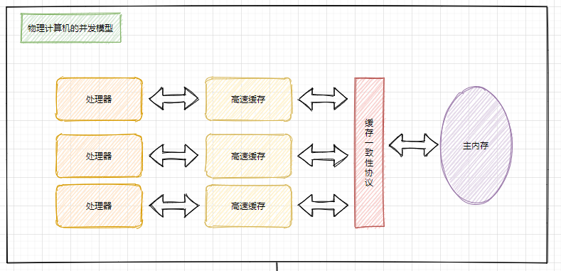
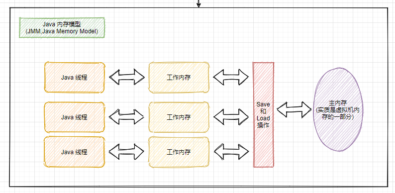
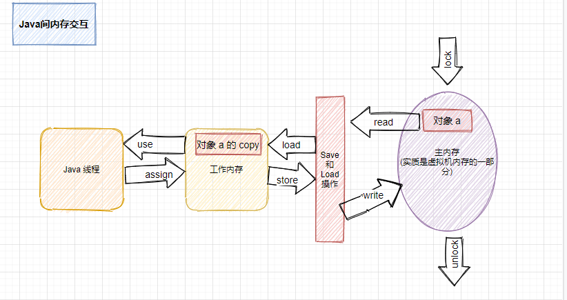

# JVM(二)：Java内存模型

> 并发处理的广泛应用是使得 Amdahl 定律代替摩尔定律成为计算机性能发展原动力的根本原因，也是人类“压榨”计算机计算能力的最有力武器。两个定律的更替代表了近年来硬件发展从追求处理器频率到追求多核心并行处理的发展过程。

## 1 硬件的效率与一致性

由于计算机的存储设备和处理器的运算速度有几个数量级的差距，所以现代计算机系统都不得不加入一层读写速度尽可能接近处理器运算速度的高速缓存（Cache）来作为内存和处理器之间的缓冲：将运算需要使用的数据复制到缓存中，让运算能够快速进行，当运算结束后再从缓存同步回内存中，这样处理器就无需等待缓慢的内存读写了。

L1和L2缓存一般是“每个核心独占”一份的。

基于高速缓存的存储交互很好地解决了处理器和内存的速度矛盾，但是也引入一个新问题：缓存一致性（Cache Coherence）。在多处理器系统中，每个处理器都有自己的高速缓存，而它们又共享同一主内存（Main Coherence），如下图所示：

当多个处理器的运算任务都涉及同一主内存区域时，将可能导致各自的缓存数据不一致，如果真的发生这种情况，那同步回主内存时以谁的缓存数据为准呢？**为了解决一致性的问题，需要各个处理器访问缓存式都遵循一些协议，在读写时需要根据协议来进行操作，这类协议有 MSI、MESI、MOSI、Synapse、Firefly及Dragon Protocol等**。缓存一致性协议可以理解为“缓存锁”，它针对的是**“缓存行”（Cache line）**，所谓“缓存行”其实就是 高速缓存 存储的最小单位。

除了增加高速缓存，处理器可能会对输入代码进行乱序执行（Out-Of-Order Execution）优化，处理器会在计算之后将乱序执行的结果重组，保证该结果和顺序执行的结果是一致的，但并不保证程序中各个与计算的先后顺序与输入代码中的顺序一致。与处理器的乱序执行优化类似，Java 虚拟机的即时编译器中也有类似的指令重排序（Instruction Reorder）优化。

## 2 Java内存模型

Java 虚拟机规范中试图定义一种 Java 内存模型（Java Memory Model，JMM）来屏蔽各种硬件和操作系统的内存访问差异，以实现 Java 的跨平台内存访问效果。

在 JDK 1.5（实现了JSR-133）发布后，Java 内存模型已经成熟和完善。

Java 内存模型如下：

可以看到，很大程度上借鉴了物理计算机的内存模型。

1. 每个线程有自己的工作内存（Working Memory，可与前面的处理器高速缓存类比），线程的工作内存保存了被该线程使用的变量的主内存副本拷贝（**线程并不会把自己访问的对象全量拷贝到自己的工作内存中，这个对象的引用、对象中某个在线程访问到的字段有可能存在拷贝，但不会有虚拟机实现成把整个对象拷贝一次**）。
2. 线程对变量的所有操作（读取、赋值等）都必须在工作内存中进行，而不能直接读写主内存中的变量。
3. 不同的线程之间也无法直接访问对方工作内存中的变量，线程间变量值的传递均需要通过主内存来完成。

## 3 内存间交互操作

Java 内存模型中定义了8种操作来完成工作内存和主内存的交互。

- **lock（锁定）**：作用于主内存的变量，把一个变量标识为一条线程独占状态。
- **unlock（解锁）**：作用于主内存变量，把一个处于锁定状态的变量释放出来，释放后的变量才可以被其他线程锁定。
- **read（读取）**：作用于主内存变量，把一个变量值从主内存传输到线程的工作内存中，以便随后的load动作使用
- **load（载入）**：作用于工作内存的变量，它把read操作从主内存中得到的变量值放入工作内存的变量副本中。
- **use（使用）**：作用于工作内存的变量，把工作内存中的一个变量值传递给执行引擎，每当虚拟机遇到一个需要使用变量的值的字节码指令时将会执行这个操作。
- **assign（赋值）**：作用于工作内存的变量，它把一个从执行引擎接收到的值赋值给工作内存的变量，每当虚拟机遇到一个给变量赋值的字节码指令时执行这个操作。
- **store（存储）**：作用于工作内存的变量，把工作内存中的一个变量的值传送到主内存中，以便随后的write的操作。
- **write（写入）**：作用于主内存的变量，它把store操作从工作内存中一个变量的值传送到主内存的变量中。

各操作场景如图：

这些基本操作的执行必须满足以下规则：

- 如果要把一个变量从主内存中复制到工作内存，就需要按顺寻地执行read和load操作， 如果把变量从工作内存中同步回主内存中，就要按顺序地执行store和write操作。但Java内存模型只要求上述操作必须按顺序执行，而没有保证必须是连续执行。
- 不允许read和load、store和write操作之一单独出现
- 不允许一个线程丢弃它的最近assign的操作，即变量在工作内存中改变了之后必须同步到主内存中。
- 不允许一个线程无原因地（没有发生过任何assign操作）把数据从工作内存同步回主内存中。
- 一个新的变量只能在主内存中诞生，不允许在工作内存中直接使用一个未被初始化（load或assign）的变量。即就是对一个变量实施use和store操作之前，必须先执行过了assign和load操作。
- 一个变量在同一时刻只允许一条线程对其进行lock操作，但lock操作**可以被同一条线程重复执行多次**，多次执行lock后，只有执行相同次数的unlock操作，变量才会被解锁。lock和unlock必须成对出现（**可重入锁的底层支持**）
- 如果对一个变量执行lock操作，将会清空工作内存中此变量的值，在执行引擎使用这个变量前需要重新执行load或assign操作初始化变量的值
- 如果一个变量事先没有被lock操作锁定，则不允许对它执行unlock操作；也不允许去unlock一个被其他线程锁定的变量。
- 对一个变量执行unlock操作之前，必须先把此变量同步到主内存中（执行store和write操作）。

## 4 对于 volatile 型变量的特殊规则

关键字 volatile 是 Java 虚拟机提供的最轻量级的同步机制。

volatile 具有两种特性：

- 可见性，每当执行引擎使用被 volatile 修饰的对象，都会从主内存中重新进行 read 和 load。
- 禁止指令重排序优化（该语义在1.5中被完全修复）

但由于它不具有原子性， 当被重新 load 到工作内存中供当前线程使用时，可能已经被其他线程进行了修改并写回，如果当前线程对对象的修改依赖其当前值（例如 i++ 操作，结果与 i 的当前值相关），那么就会导致当前线程的 assign 操作得到了错误结果，并将该错误结果 write 到了主内存中。

volatile 实现禁用指令重排时，实际是通过一个 lock 实现了一个内存屏障，指令重排序无法越过内存屏障，因此能保证 volatile 变量的上文和下文的相对位置。

volatile 的读操作的性能消耗和普通变量几乎没有什么区别，但写操作会慢一些，因为它需要在本地代码中插入许多内存屏障指令来保证处理器不发生乱序执行。即便如此，大多数场景下 volatile 的总开销仍然比锁低。

## 5 对于 long 和 double 型变量的特殊规则

Java 内存模型要求 8 种操作均具有原子性， 但对于64位的数据类型（long 和 double），在模型中定义了一条相对宽松的规定：允许虚拟机将没有被 volatile 修饰的 64 位数据的读写操作划分为两次 32 位的操作来举行，即可以不保证 64 位数据类型的 load、store、read、write 这四个操作的原子性，这就是所谓的 long 和 double 的非原子性协定。

所以，如果多线程共享一个未声明为 volatile 的 long 或 double 的变量，并且同时进行读取和修改的操作，那么某些线程会读取到一个既非原值，也不是其他线程修改值的代表了“半个变量”的数值。

但实际商用 Java 虚拟机中不会出现上述状况，因为它们都选择把 64 位数据的读写操作作为原子操作来对待，因此我们写代码时不需要将 long 和 double 变量专门声明为 volatile。

## 6 先行发生规则

1. 程序次序规则
2. 管程锁定规则
3. volatile 变量规则
4. 线程启动规则
5. 线程终止规则
6. 线程中断规则
7. 对象终结原则
8. 传递性

## 参考内容 

【1】深入理解 Java 虚拟机（第二版）

