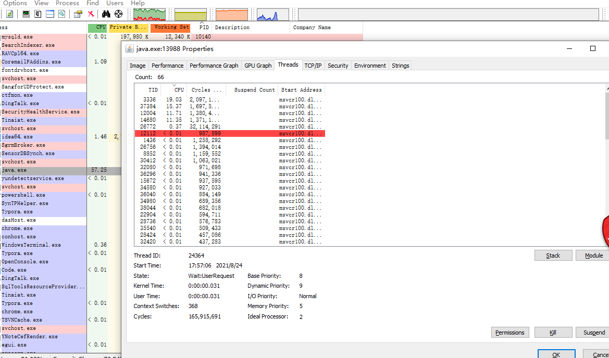

# JVM培训

JVM异常引起的问题:


查询所有的java参数

java -XX:+PrintFlagsFinal -version more


工具

jps -查询所有启动的java程序

jinfo pid 查看该pid的程序的运行参数，含VM Flags

jinfo -flag +PrintGC pid 给JVM增加运行时参数printGC，可以输出GC信息

jstat -gc pid [time] 输出程序的内存信息，time控制输出频次


查看堆内对象

jmap -histo pid


导出heap文件

```shell
jmap -dump:format=b,file=heap.hprof 13988
```

查看heap


jhat heap文件名 **不推荐**


查看堆栈报错，查看线程导致的问题

```shell
jstack 13988 >jstack.info
```


##  线程协作 join？那notify也得算


线程状态

Deadlock 线程死锁

Runnable 运行

waiting on condition 等待条件满足执行

waiting on monitor entry 等待monitor锁执行

blocked 阻塞

suspended 暂停

in Object.wait() 调用了 wait()方法

parked ？


## CPU 100%的问题定位方案

1. top -H -p pid 找到cpu占用最高的线程号
2. jstack pid >jstack.txt  获取到jstack文件 tid是jvm给的线程编号 nid是操作系统给的线程号 16进制
3. 把top获取到的10进制线程号转成16进制，去jstack文件中寻找对应的线程
4. 查看堆栈信息，会找到代码所在类及代码行数

**PSTools：**


**ProcessExplorer:**windows下使用的看进程的工具，打开后可以看到该线程的tid



**jconsole**

可以监控内存，线程状态，死锁检测，手动执行GC等。


**死锁：**


## 可视化工具

1. 针对OOM问题

IBM-heapAnalyzer（phd），MAT

2. 比较全面，可以做监控 dump,线程

jprofiler visualvm

3. jdk提供的

jconsole、jvisualvm(jdk自带的工具)

## 快照文件

phd、hprof、dump、bin、javacore（内存地址...）

## IBM-heapAnalyzer使用

1. 启动HeapAnalyzer

```shell
java -jar -Xmx2g .\IBM-HeapAnalyzer.jar
```

2. 导入heap文件
3. 点开leak suspect
4. 点击里面可能存在内存泄漏的项
5. Reference Tree 已经定位的地方，右键Locate a leak susupect
6. 再右键 go to the largest drop in substree
7. 分析原因

## MAT使用


