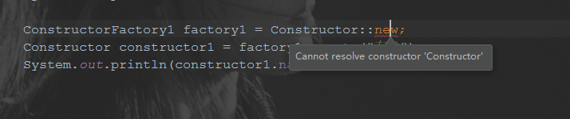

# Java 8 新特性：方法引用

> 方法引用是用来直接访问类或者实例的已经存在的方法或者构造方法。
>
> 当lambda表达式中只是执行一个方法调用时，不用lambda表达式，直接通过方法引用的形式可读性更高，方法引用本身就是一种更简洁易懂的Lambda表达式。
>
> 在方法引用中，离不开“::”（定界符、分隔符）这个操作符。

[toc]

## 应用场景

方法引用的唯一用途是支持Lambda的简写。

方法引用提高了代码的可读性，也使逻辑更加清晰。

## 组成

使用 :: 操作符将**方法名**和**对象或类**的名字分隔开。

“**::**” 是**域**操作符（也可以称作定界符、分隔符）。

| 方法引用         | 等价的lambda表达式      |
| ---------------- | ----------------------- |
| String::valueOf  | x -> String.valueOf(x)  |
| Object::toString | x -> x.toString()       |
| x::toString      | () -> x.toString()      |
| ArrayList::new   | () -> new ArrayList<>() |

## 分类

### 调用静态方法

通过定界符调用静态方法时，和直接调用类的静态方法很像，以下面代码中的 Person 的静态方法 compareByAge 方法的调用为例，正常调用是 Person.compareByAge(a,b); 通过定界符调用则是 Person::compareByAge ，在这里实际是代替了 lambda 表达式 (a,b) -> Person.compareByage(a,b) 。

参数列表是从接口 Comparator 的 compare 方法得到的。

```java
/**
 * staticMethod 方法是 通过定界符 引用静态方法 ContainingClass::staticMethodName
 * <p>
 * 本例是引用Person类的 compareByAge 方法
 *
 * @author dongyinggang
 * @date 2020/10/10 9:43
 */
private static void staticMethod() {
				System.out.println("1.调用静态方法：");
        List<Person> roster = Person.createRoster();
        for (Person p : roster) {
            p.printPerson();
        }
        Person[] rosterAsArray = roster.toArray(new Person[roster.size()]);
				/**
         * 4.调用已经存在的方法的最简形式
         *
         * 方法引用Person::compareByAge在语义上与lambda表达式相同(a, b) -> Person.compareByAge(a, b)。每个都有以下特征：
         *
         * - 它的形参列表是从复制Comparator<Person>.compare，这里是(Person, Person)。
         * - 它的主体调用该方法Person.compareByAge。
         */
        Arrays.sort(rosterAsArray, Person::compareByAge);
}

```

### 调用特定对象的实例方法

通过“::”调用特定对象的实例方法时，特定对象指类实例，通过类实例调用其实例方法，作为lambda表达式的替代。

```java
/**
 * ParticularObjInstanceMethod 类是 特定对象的实例方法的方法引用
 *
 * @author dongyinggang
 * @date 2020-10-20 18:17
 **/
public class ParticularObjInstanceMethod {

    /**
     * particularObjInstanceMethod 方法是 通过双冒号 调用 特定对象的实例方法
     *
     * @author dongyinggang
     * @date 2020/10/10 10:23
     */
    static void particularObjInstanceMethod() {
        System.out.println("2.调用特定对象的实例方法:");

        List<Person> roster = Person.createRoster();
        for (Person p : roster) {
            p.printPerson();
        }
        Person[] rosterAsArray = roster.toArray(new Person[roster.size()]);
        Person[] rosterAsArray1 = rosterAsArray.clone();

        /**
         * 1.使用Comparator的实现类作为比较器
         *
         * 声明comparator时必须用Comparator<Person> ，不能是Comparator，否则编译期报错
         * wrong 1st argument type  Found Person[] required T[]
         * 意指rosterAsArray参数不满足sort方法的参数类型，默认参数类型是泛型T[] 而非实际类型Person[]
         *
         * 当comparator未指明其泛型的类型时，尽管其使用实现类进行实例化，编译期也不能通过这种隐式的关系推断出
         * 实际类型，因此期望入参是T[]
         *
         * 当比较器的泛型被显式的指明为Person时，这时sort方法会期望两个参数分别为
         * Person[]和Comparator<Person> c
         *
         * 疑问：
         * 1. Arrays.sort方法的参数类型jre推断过程是如何的？是通过比较器的泛型的实际类型来推断么？
         *  -- Java8中对Lambda表达式中方法参数的类型推断（一） ：https://blog.csdn.net/u013096088/article/details/69367260
         */
        Comparator<Person> comparator = new ComparatorImpl();
        Arrays.sort(rosterAsArray1, comparator::compare);
        //作为Comparator的实现类,可以简写为以下形式,上面的方式实际在运行过程中会生成匿名类
        Arrays.sort(rosterAsArray1, comparator);
        /**
         * 2.引用一个普通类的方法作为比较器
         *
         * 通过双冒号引用特定对象 comparatorProvider 的实例方法 compareByAge
         * 如果直接使用 ComparatorProvider::compareByAge 会提示在 static 上下文中调用非静态方法
         */
        ComparatorProvider comparatorProvider = new ComparatorProvider();
        Person[] rosterAsArray2 = rosterAsArray.clone();
        Arrays.sort(rosterAsArray2, comparatorProvider::compareByAge);
        System.out.println("排序完成：");
        for (Person person : rosterAsArray2) {
            person.printPerson();
        }

    }
}

/**
 * Comparator的实现类
 */
class ComparatorImpl implements Comparator<Person> {

    @Override
    public int compare(Person a, Person b) {
        return a.getBirthday().compareTo(b.getBirthday());
    }
}

/**
 * 含compareByAge方法的类
 */
class ComparatorProvider {

    int compareByAge(Person a, Person b) {
        return a.getBirthday().compareTo(b.getBirthday());
    }
}
```

### 调用特定类型任意对象的实例方法

通过方法引用实现对特定类型任意对象的实例方法的调用时，形式如下：

**类名::实例方法名**

通过这种形式调用时，调用的方法应当比函数式接口的参数数量少1，并且少的是首个参数，该参数应当是调用方法所在类的实例。

相关测试代码如下：

```java
public class ParticularTypeInstanceMethod {
  private void oneParamTest() {
        System.out.println("一个参数：");
    }

    private void twoParamTest(String b) {
        System.out.println("两个参数：" + b);
    }

    private void threeParamTest(String b, String c) {
        System.out.println("三个参数：" + b + "," + c);
    }

    public static void main(String[] args) {
        ParticularTypeInstanceMethod particularTypeInstanceMethod = new ParticularTypeInstanceMethod();

        /**
         * 通过方法引用调用实例方法时,首个参数作为调用方,不在被调用方法的参数列表中,只存在于接口中
         */
        TestOne testOne = ParticularTypeInstanceMethod::oneParamTest;
        testOne.testParam(particularTypeInstanceMethod);

        TestTwo test = (a, b) -> System.out.println("两个参数：" + b);
        test.testParam(particularTypeInstanceMethod, "参数B");

        TestTwo testTwo = ParticularTypeInstanceMethod::twoParamTest;
        testTwo.testParam(particularTypeInstanceMethod, "参数B");

        TestThree testThree = ParticularTypeInstanceMethod::threeParamTest;
        testThree.testParam(particularTypeInstanceMethod, "参数B", "参数C");
    }
}

interface TestOne {
    void testParam(ParticularTypeInstanceMethod a);
}

interface TestTwo {
    void testParam(ParticularTypeInstanceMethod a, String b);
}

interface TestThree {
    void testParam(ParticularTypeInstanceMethod a, String b, String c);
}
```

## 调用构造函数

通过方法引用进行构造函数调用时，必须保证函数式接口和被调用的构造方法的参数一致。

编译器在进行参数推断时，会根据函数式接口的参数去寻找是否有同参数类型的构造方法，如果没有对应的构造方法，会有如下提示：



简单样例：

```java
public class Constructor {

    String name;

    /**
     * 无参构造
     */
    public Constructor(){
    }

    /**
     * 有参构造
     * @param name name值
     */
    public Constructor(String name){
        this.name = name;
    }
    public static void main(String[] args) {
        //通过方法调用重写create()方法
        ConstructorFactory factory = Constructor::new;
        Constructor constructor = factory.create();
        System.out.println(constructor.name);

        ConstructorFactory1 factory1 = Constructor::new;
        Constructor constructor1 = factory1.create("有参");
        System.out.println(constructor1.name);
    }
}

/**
 * ConstructorFactory 是Constructor的构造器
 */
interface ConstructorFactory{
    /**
     * create 方法是 待重写的返回Constructor实例的create()方法
     *
     * @return Constructor实例
     * @author dongyinggang
     * @date 2020/10/21 13:27
     */
    Constructor create();
}

/**
 * ConstructorFactory1 是Constructor的构造器
 */
interface ConstructorFactory1{
    /**
     * create 方法是 待重写的返回Constructor实例的create()方法
     *
     * @param name name属性
     * @return Constructor实例
     * @author dongyinggang
     * @date 2020/10/21 13:27
     */
    Constructor create(String name);
}
```

通过内置函数式接口Supplier接口实现一个集合复制功能，相关代码如下：

```java
/**
 * constructor 方法是 调用构造函数
 *
 * @author dongyinggang
 * @date 2020/10/10 15:14
 */
static void constructor(List<Person> roster){
    System.out.println("4.调用构造函数：");
    //1.通过匿名内部类实现get()方法,调用构造函数
    Set<Person> rosterSet = transferElements(roster, new Supplier<Set>(){
        @Override
        public Set get() {
            return new HashSet<>();
        }
    });
    //2.通过lambda表达式实现get()方法,调用构造函数
    Set<Person> rosterSetLambda = transferElements(roster,()->new HashSet<>());
    //3.简化lambda表达式实现get()方法,调用构造函数
    Set<Person> rosterSimple = transferElements(roster,HashSet::new);
    System.out.println("赋值完成：");
    for (Person person : rosterSimple) {
        person.printPerson();
    }
}

/**
 * transferElements 方法是 将一个collection的元素放到新的collection中去
 *
 * @param sourceCollection 源集合
 * @param collectionFactory 集合工厂,重写get()方法的Supplier接口实现类
 * @return DEST的集合对象
 * @author dongyinggang
 * @date 2020/10/20 18:52
 */
private static <T, SOURCE extends Collection<T>, DEST extends Collection<T>>
DEST transferElements(SOURCE sourceCollection,Supplier<DEST> collectionFactory) {
    //通过get方法创建一个新的集合对象
    DEST result = collectionFactory.get();
    //将源集合中的元素add进新的集合对象中
    result.addAll(sourceCollection);
    //将新的集合对象放回
    return result;
}
```

## 参考内容

- [1]  [Java 8 新特性：Lambda 表达式之方法引用（Lambda 表达式补充版）](https://blog.csdn.net/sun_promise/article/details/51190256)
- [2]  [Java8新特性之二：方法引用](https://www.cnblogs.com/wuhenzhidu/p/10727065.html)