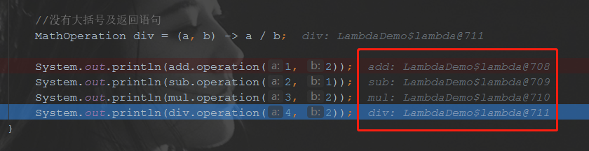

# lambda表达式

[toc]

## 概念

lambda表达式是JAVA8的新特性之一，也称为闭包。

在我看来，lambda表达式可以理解为对只有一个函数的匿名内部类的再次简化，不需要再通过写类似以下代码的匿名内部类来实现:

```java
/**
 * 4.匿名内部类 AnonymousInnerClass
 * 没有通过class关键字进行类的声明，直接通过重写FunctionalInterface接口的
 * lambda方法的方式创建了一个实现该接口的匿名类
 */
MyFunctionalInterface anonymousInnerClass = new MyFunctionalInterface() {

    @Override
    public void lambda() {
        System.out.println("这是一个匿名内部类");
    }
};
anonymousInnerClass.lambda();
```

但实际在运行过程中可以发现，它的实质还是一个被简化的匿名内部类，尽管写作格式被简化，但实际运行中与匿名内部类无异。



其中四个实例对象都是通过lambda表达式实现函数式接口 MathOperation 的 operation(int a, int b) 方法的方式来进行声明的，从红框中可以看出，这里其实是生成了四个匿名类。冒号后面实际就是内部类的地址。


## 演进过程

lambda表达式从根本上来说是用来简化代码的，简化的是函数式接口的实现形式。

以下面的代码为例，看一下代码简化的过程。

主体过程如下：

1. 普通类
2. 静态内部类
3. 局部内部类
4. 匿名内部类
5. lambda简化的匿名内部类

代码如下：

1.函数式接口

```java
/**
 * MyFunctionalInterface 类是 函数式接口
 *
 * @author dongyinggang
 * @date 2020-10-12 18:15
 **/
@FunctionalInterface
public interface MyFunctionalInterface {
    /**
     * lambda 方法是 唯一接口
     *
     * @author dongyinggang
     * @date 2020/9/4 18:00
     */
    void lambda();

}

```

2.普通类

```java
/**
 * OrdinaryClass 类是 1.普通类，最原始的类表现
 *
 * @author dongyinggang
 * @date 2020/10/12 18:14
 */
public class OrdinaryClass implements MyFunctionalInterface {

    @Override
    public void lambda() {
        System.out.println("这是一个普通类");
    }
}
```

3.演进主体代码

```java
/**
 * LambdaEvolution 类是 lambda表达式演进过程类
 *
 * @author dongyinggang
 * @date 2020-09-04 11:30
 **/
public class LambdaEvolution {

    /**
     * 2.静态内部类
     * 在主类内部定义的静态类
     */
    static class StaticInnerClass implements MyFunctionalInterface {

        @Override
        public void lambda() {
            System.out.println("这是一个静态内部类");
        }
    }

    public static void main(String[] args) {

        //1.普通类
        MyFunctionalInterface ordinaryClass = new OrdinaryClass();
        ordinaryClass.lambda();

        //2.静态内部类
        MyFunctionalInterface staticInnerClass = new StaticInnerClass();
        staticInnerClass.lambda();

        /**
         * 3.局部内部类
         * 在类的方法中定义的内部类，是没有static修饰的非静态类
         */
        class LocalInnerClass implements MyFunctionalInterface {

            @Override
            public void lambda() {
                System.out.println("这是一个局部内部类");
            }
        }

        MyFunctionalInterface localInnerClass = new LocalInnerClass();
        localInnerClass.lambda();

        /**
         * 4.匿名内部类 AnonymousInnerClass
         * 没有通过class关键字进行类的声明，直接通过重写FunctionalInterface接口的
         * lambda方法的方式创建了一个实现该接口的匿名类
         */
        MyFunctionalInterface anonymousInnerClass = new MyFunctionalInterface() {

            @Override
            public void lambda() {
                System.out.println("这是一个匿名内部类");
            }
        };
        anonymousInnerClass.lambda();

        /**
         * 5.lambda简化的匿名内部类
         * 通过lambda表达式简化了匿名内部类的创建方式
         */
        MyFunctionalInterface lambdaClass =
                () -> System.out.println("这是一个lambda简化的匿名内部类");
        lambdaClass.lambda();

    }
}
```

## 基本语法

基本语法:

**(parameters) -> expression**

或

**(parameters) ->{ statements; }**

```java
// 1. 不需要参数,返回值为 5
() -> 5
 
// 2. 接收一个参数(数字类型),返回其2倍的值
x -> 2 * x
 
// 3. 接受2个参数(数字),并返回他们的差值
(x, y) -> x – y
 
// 4. 接收2个int型整数,返回他们的和
(int x, int y) -> x + y
 
// 5. 接受一个 string 对象,并在控制台打印,不返回任何值(看起来像是返回void)
(String s) -> System.out.print(s)
```

根据以上基本语法，衍生以下实例代码：

1.数字操作函数式接口

```java
/**
 * MathOperation 类是 数字操作函数式接口
 *
 * @author dongyinggang
 * @date 2020/10/12 15:27
 */
@FunctionalInterface
interface MathOperation {
    /**
     * operation 方法是 数字计算方法
     *
     * @param a 数字a
     * @param b 数字b
     * @return 计算结果值
     * @author dongyinggang
     * @date 2020/9/4 13:19
     */
    int operation(int a, int b);
}
```

2.lambda基础使用demo

```java
/**
 * LambdaDemo 类是 lambda基础使用
 *
 * @author dongyinggang
 * @date 2020-09-04 13:15
 **/
public class LambdaDemo {

    public static void main(String[] args) {

        int c = 5;
        //带参数类型声明的lambda表达式
        MathOperation add = (a, b) -> a + b;

        //不带参数类型声明的lambda表达式
        MathOperation sub = (a, b) -> a - b;

        //带大括号和return的lambda表达式
        MathOperation mul = (a, b) -> {
            int d = a * b;
            return d * c;
        };

        //没有大括号及返回语句
        MathOperation div = (a, b) -> a / b;

        System.out.println(add.operation(1, 2));
        System.out.println(sub.operation(2, 1));
        System.out.println(mul.operation(3, 2));
        System.out.println(div.operation(4, 2));
    }
}
```

## lambda表达式变量作用域


4、方法和构造函数引用

5、Lamda 表达式作用域

6、内置函数式接口

7、Optionals