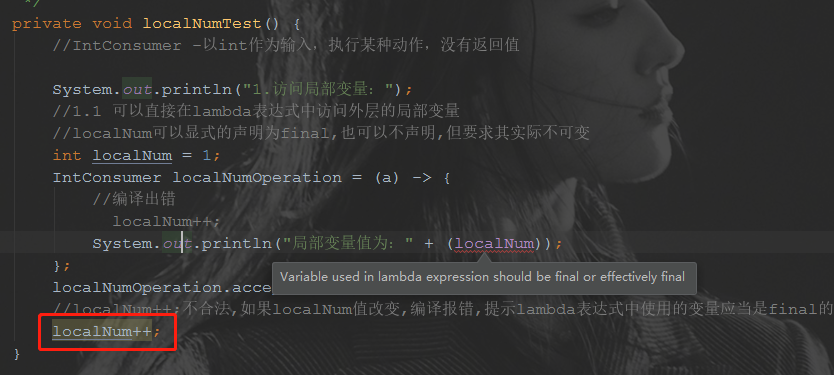
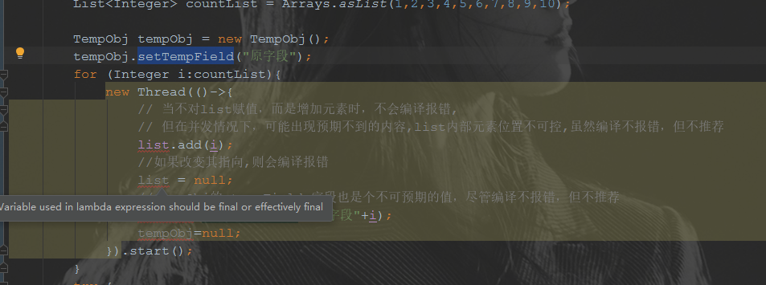
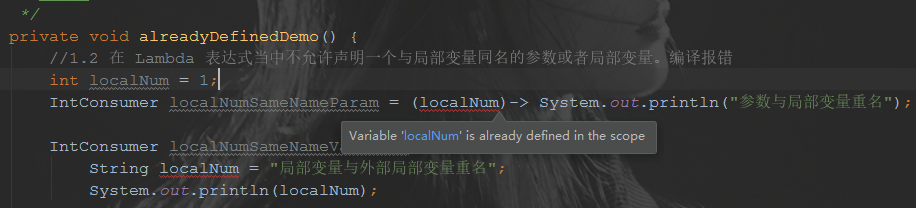
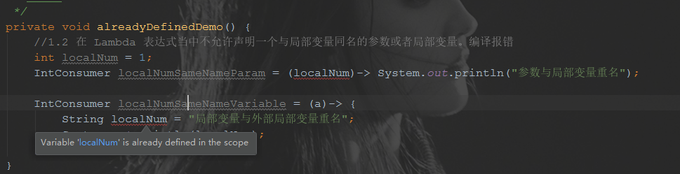

# lambda表达式

[toc]

## 概念

在Java中，Lambda 表达式 (lambda expression)是一个匿名函数。

Lambda表达式基于数学中的λ演算得名，直接对应于其中的Lambda抽象(lambda abstraction)，是一个匿名函数，即没有函数名的函数。Lambda表达式可以表示闭包，但又不同于函数式语言的闭包（例如 JavaScript 中的方法）。Lambda表达式让代码变得简洁并且允许你传递行为，在java8出现之前传递行为的方法只有通过匿名内部类。

闭包的简单定义：

> 用科学的说法来说，闭包就是一个函数的实例，且它可以无限 制地访问那个函数的非本地变量。例如，闭包可以作为参数传递给另一个函数。它也可以访问和修改其作用域之外的变量。

现在，Java 8的Lambda和匿名类可以做类似于闭包的事情： 它们可以作为参数传递给方法，并且可以访问其作用域之外的变量。但有一个限制：它们不 能修改定义Lambda的方法的局部变量的内容。`这些变量必须是隐式最终的`。可以认为**Lambda 是对值封闭，而不是对变量封闭。**这种限制存在的原因在于局部变量保存在栈上， 并且隐式表示它们仅限于其所在线程。如果允许捕获可改变的局部变量，就会引发造成线程 不安全的新的可能性，而这是我们不想看到的（实例变量可以，因为它们保存在堆中，而堆 是在线程之间共享的） 。

Lambda表达式本质上就是一个匿名(即未命名的方法)。**但是这个方法是不能独立执行的（lambda表达式和函数式接口是严格绑定的）**，而是用于实现由函数式接口定义的一个方法（即：**使用 Lambda 表达式实例化函数式接口**）。因此，Lambda表达式会导致运行中产生一个匿名类。


## 演进过程

lambda表达式从根本上来说是用来简化代码的，简化的是函数式接口的实现形式。

以下面的代码为例，看一下JAVA在代码简化的过程中的产物。

主体过程如下：

1. 普通类
2. 静态内部类
3. 局部内部类
4. 匿名内部类
5. lambda简化的匿名内部类

代码如下：

1.函数式接口

```java
/**
 * MyFunctionalInterface 类是 函数式接口
 *
 * @author dongyinggang
 * @date 2020-10-12 18:15
 **/
@FunctionalInterface
public interface MyFunctionalInterface {
    /**
     * lambda 方法是 唯一接口
     *
     * @author dongyinggang
     * @date 2020/9/4 18:00
     */
    void lambda();

}

```

2.普通类

```java
/**
 * OrdinaryClass 类是 1.普通类，最原始的类表现
 *
 * @author dongyinggang
 * @date 2020/10/12 18:14
 */
public class OrdinaryClass implements MyFunctionalInterface {

    @Override
    public void lambda() {
        System.out.println("这是一个普通类");
    }
}
```

3.演进主体代码

```java
/**
 * LambdaEvolution 类是 lambda表达式演进过程类
 *
 * @author dongyinggang
 * @date 2020-09-04 11:30
 **/
public class LambdaEvolution {

    /**
     * 2.静态内部类
     * 在主类内部定义的静态类
     */
    static class StaticInnerClass implements MyFunctionalInterface {

        @Override
        public void lambda() {
            System.out.println("这是一个静态内部类");
        }
    }

    public static void main(String[] args) {

        //1.普通类
        MyFunctionalInterface ordinaryClass = new OrdinaryClass();
        ordinaryClass.lambda();

        //2.静态内部类
        MyFunctionalInterface staticInnerClass = new StaticInnerClass();
        staticInnerClass.lambda();

        /**
         * 3.局部内部类
         * 在类的方法中定义的内部类，是没有static修饰的非静态类
         */
        class LocalInnerClass implements MyFunctionalInterface {

            @Override
            public void lambda() {
                System.out.println("这是一个局部内部类");
            }
        }

        MyFunctionalInterface localInnerClass = new LocalInnerClass();
        localInnerClass.lambda();

        /**
         * 4.匿名内部类 AnonymousInnerClass
         * 没有通过class关键字进行类的声明，直接通过重写FunctionalInterface接口的
         * lambda方法的方式创建了一个实现该接口的匿名类
         */
        MyFunctionalInterface anonymousInnerClass = new MyFunctionalInterface() {

            @Override
            public void lambda() {
                System.out.println("这是一个匿名内部类");
            }
        };
        anonymousInnerClass.lambda();

        /**
         * 5.lambda简化的匿名内部类
         * 通过lambda表达式简化了匿名内部类的创建方式
         */
        MyFunctionalInterface lambdaClass =
                () -> System.out.println("这是一个lambda简化的匿名内部类");
        lambdaClass.lambda();

    }
}
```

## 基本语法

lambda有三部分构成：

第一部分 为一个括号内用逗号分隔的**形式参数**，参数是函数式接口里面方法的参数；

第二部分 为一个箭头符号：**->**；

第三部分 为方法体，可以是表达式和代码块。

基本语法:

**(parameters) -> expression**

或

**(parameters) ->{ statements; }**

```java
// 1. 不需要参数,返回值为 5
() -> 5
 
// 2. 接收一个参数(数字类型),返回其2倍的值
x -> 2 * x
 
// 3. 接受2个参数(数字),并返回他们的差值
(x, y) -> x – y
 
// 4. 接收2个int型整数,返回他们的和
(int x, int y) -> x + y
 
// 5. 接受一个 string 对象,并在控制台打印,不返回任何值(看起来像是返回void)
(String s) -> System.out.print(s)
```

根据以上基本语法，衍生以下实例代码：

1.数字操作函数式接口

```java
/**
 * MathOperation 类是 数字操作函数式接口
 *
 * @author dongyinggang
 * @date 2020/10/12 15:27
 */
@FunctionalInterface
interface MathOperation {
    /**
     * operation 方法是 数字计算方法
     *
     * @param a 数字a
     * @param b 数字b
     * @return 计算结果值
     * @author dongyinggang
     * @date 2020/9/4 13:19
     */
    int operation(int a, int b);
}
```

2.lambda基础使用demo

```java
/**
 * LambdaDemo 类是 lambda基础使用
 *
 * @author dongyinggang
 * @date 2020-09-04 13:15
 **/
public class LambdaDemo {

    public static void main(String[] args) {

        int c = 5;
        //带参数类型声明的lambda表达式
        MathOperation add = (a, b) -> a + b;

        //不带参数类型声明的lambda表达式
        MathOperation sub = (a, b) -> a - b;

        //带大括号和return的lambda表达式
        MathOperation mul = (a, b) -> {
            int d = a * b;
            return d * c;
        };

        //没有大括号及返回语句
        MathOperation div = (a, b) -> a / b;

        System.out.println(add.operation(1, 2));
        System.out.println(sub.operation(2, 1));
        System.out.println(mul.operation(3, 2));
        System.out.println(div.operation(4, 2));
    }
}
```

## 与匿名类的区别

在我看来，lambda表达式可以理解为对只有一个函数的匿名内部类的再次简化，代码简化如下:

```java
/**
 * 4.匿名内部类 AnonymousInnerClass
 * 没有通过class关键字进行类的声明，直接通过重写FunctionalInterface接口的
 * lambda方法的方式创建了一个实现该接口的匿名类
 */
MyFunctionalInterface anonymousInnerClass = new MyFunctionalInterface() {

    @Override
    public void lambda() {
        System.out.println("这是一个匿名内部类");
    }
};
anonymousInnerClass.lambda();
/**
 * 5.lambda简化的匿名内部类
 * 通过lambda表达式简化了匿名内部类的创建方式
 */
MyFunctionalInterface lambdaClass =
  () -> System.out.println("这是一个lambda简化的匿名内部类");
lambdaClass.lambda();
```

但实际在运行过程中可以发现，它的实质还是一个被简化的匿名内部类，尽管写作格式被简化，但实际运行中与匿名内部类无异。

其中四个实例对象都是通过lambda表达式实现函数式接口 MathOperation 的 operation(int a, int b) 方法的方式来进行声明的，从红框中可以看出，这里其实是生成了四个匿名类。冒号后面实际就是内部类的地址。

但是我们是否可以有这样的表述“lambda表达式是否只是一个匿名内部类的语法？”，答案是No，原因有两种：

 **性能影响**: 假如lambda表达式是采用匿名内部类实现的，那么每一个lambda表达式都会在磁盘上生成一个class文件。当JVM启动时，这些class文件会被加载进来，因为所有的class文件都需要在启动时加载并且在使用前确认，从而会导致JVM的启动变慢。（以LambdaRunnable和LambdaDemo为例）

**向后的扩展性:** 如果Java8的设计者从一开始就采用匿名内部类的方式，那么这将限制lambda表达式未来的发展范围。

另外的区别还有：

1. 在匿名类中，this 指代的是匿名类本身；而在lambda表达式中，this指代的是lambda表达式所在的这个类。

2. lambda表达式的类型是由上下文决定的，而匿名类中必须在创建实例的时候明确指定。

3. Lambda 表达式的编译方法是：Java 编译器编译 Lambda 表达式并将他们转化为类里面的私有函数，它使用 invokedynamic 指令（ Java 7 ，即动态启用）动态绑定该方法。

Lambda表达式是采用动态启用（Java7）来延迟在运行时的加载策略。当javac编译代码时，它会捕获代码中的Lambda表达式并且生成一个动态启用的调用地址(称为Lambda工厂）。当动态启用被调用时，就会向Lambda表达式发生转换的地方返回一个函数式接口的实例。然后将Lambda表达式的内容转换到一个将会通过动态启用来调用的方法中。在这一步骤中，JVM实现者有自由选择策略的权利。


## lambda作用域

lambda表达式的作用域和其被嵌入的方法作用域一致，并不会另外引入作用域。也就是说，在lambda表达式内，可以调用其被嵌入的方法可以调用的一切变量，方法等。但同时lambda中入参或定义的变量也不能够和作用域内已存在的变量重名。

从调用目标来分的话，可以分为以下四大类：

1. 访问局部变量
2. 访问对象字段/静态变量
3. 接口默认方法
4. this对象

### 访问局部变量

在lambda中访问局部变量时，是可读不可写的，需要保证局部变量、对象是 显式或隐式不可变的具有final语义的 最终变量。

对于局部变量来说，若变量为类似int、string等类型时，不可变通常表现为其值不能够出现二次赋值的情况，例如下面代码中的变量 localNum，尽管没有final对它进行限定，但实际在任何地方进行对齐值的变动，如两处被注释的 localNum++；代码，都会导致编译报错，提示lambda表达式中使用的变量应当是final的。

**局部变量非具final语义的最终变量：**



整体代码如下：

```java
/**
     * localNumTest 方法是 1.lambda访问局部变量
     * 对于局部变量，lambda可读，不可写，即可以使用隐性的具有final语义的局部变量
     *
     * @author dongyinggang
     * @date 2020/10/13 19:41
     */
    private void localNumTest() {
        //IntConsumer -以int作为输入，执行某种动作，没有返回值

        System.out.println("1.访问局部变量：");
        //1.1 可以直接在lambda表达式中访问外层的局部变量
        //localNum可以显式的声明为final,也可以不声明,但要求其实际不可变
        int localNum = 1;
        IntConsumer localNumOperation = (a) -> {
            //编译出错
//            localNum++;
            System.out.println("局部变量值为：" + (localNum));
        };
        localNumOperation.accept(0);
        //localNum++;不合法,如果localNum值改变,编译报错,提示lambda表达式中使用的变量应当是final的
//        localNum++;
    }
```


若变量实际是具有多属性的类对象，或类似List的集合对象，不可变表现为执行的目标地址不能够改变，但实际类对象的属性值或集合对象的元素是可变的，例如下面代码中的 tempObj 对象 和 list 数组，当它们被二次赋值为null时，都会有编译错误出现，但如果是通过set方法改变 tempObj 对象的属性或通过 add 方法给 list 添加元素，则不会出现编译错误，但在并发情况下，由于局部变量是非线程共享的，因此其最终的值具有不可预测的问题，因此在可能面临并发的情况中不推荐在lambda中对元素值进行修改。

**list 和 tempObj 分别被重新赋值：**



整体代码如下：

```java
/**
     * localObjTest 方法是 访问局部对象
     *  在lambda表达式中访问局部对象时，局部对象不能够被重新赋值，即其指向地址不会修改，
     *  但对象属性，或者类似List中的元素等都是可以被修改的
     *  但是不推荐在lambda表达式中做这种操作，尤其是在
     * @author dongyinggang
     * @date 2020/10/15 16:27
     */
    private void localObjTest() {
        //测试类
        class TempObj{
            private String tempField;

            public void setTempField(String tempField) {
                this.tempField = tempField;
            }

            public String getTempField() {
                return tempField;
            }
        }
        // 测试对象作为局部变量的调用情况
        List<Integer> list = new ArrayList<>();
        list.add(0);
        List<Integer> countList = Arrays.asList(1,2,3,4,5,6,7,8,9,10);

        TempObj tempObj = new TempObj();
        tempObj.setTempField("原字段");
        for (Integer i:countList){
            new Thread(()->{
                // 当不对list赋值，而是增加元素时，不会编译报错,
                // 但在并发情况下，可能出现预期不到的内容,list内部元素位置不可控,虽然编译不报错，但不推荐
                list.add(i);
                //如果改变其指向,则会编译报错
//                list = null;
                //tempObj的 tempField 字段也是个不可预期的值，尽管编译不报错，但不推荐
                tempObj.setTempField("新字段"+i);
//                tempObj=null;
            }).start();
        }
        try {
            Thread.sleep(5000);
        } catch (InterruptedException e) {
            e.printStackTrace();
        }
        list.forEach(System.out::println);
        System.out.println(tempObj.getTempField());
    }
```


同时，lambda表达式当中不允许声明一个与局部变量同名的参数或者局部变量。会编译报错。提示作用域内已有该名称的变量定义。

**lambda表达式参数与局部变量重名：**



**lambda表达式中的局部变脸和外部变量重名：**



完整代码如下：

```java
/**
     * alreadyDefinedDemo 方法是 lambda尝试声明一个与局部变量同名的参数或者局部变量
     *  由于lambda表达式不会另外创建一个作用域，和其所在的方法体是同一个作用域
     *  因此不能够声明一个与局部变量同名的参数或者局部变量
     *  如果声明，会报 变量已经在作用域中进行了定义 的异常
     * @author dongyinggang
     * @date 2020/10/15 18:19
     */
    private void alreadyDefinedDemo() {
        //1.2 在 Lambda 表达式当中不允许声明一个与局部变量同名的参数或者局部变量。编译报错
        int localNum = 1;
        IntConsumer localNumSameNameParam = (localNum)-> System.out.println("参数与局部变量重名");

        IntConsumer localNumSameNameVariable = (a)-> {
            String localNum = "局部变量与外部局部变量重名";
            System.out.println(localNum);
        };
    }
```

### 访问对象字段和静态变量

当在lambda表达式中访问对象字段与静态变量时，是既可读又可写的。

整体代码如下：

```java
/**
 * objectAndStaticTest 方法是 2.访问对象字段与静态变量
 * 和局部变量不同的是，Lambda内部对于实例的字段（即：成员变量）以及静态变量是即可读又可写。
 *
 * @author dongyinggang
 * @date 2020/10/13 19:41
 */
private void objectAndStaticTest() {
    System.out.println("2.访问对象字段与静态变量：");
    //访问静态变量staticNum和对象字段objectNum
    IntConsumer staticNumOperation =
            (a) -> System.out.println("对象字段值为：" + objectNum + "静态变量值为：" + staticNum);
    staticNumOperation.accept(0);
    //可读可写
    staticNum++;
    objectNum++;
    staticNumOperation.accept(0);
}
```

### 访问接口的默认方法


4、方法和构造函数引用

5、Lamda 表达式作用域

6、内置函数式接口

7、Optionals

## 参考内容

- [1]  [Lambda表达式和函数式接口](https://www.cnblogs.com/gclokok/p/10941002.html)
- [2]  [lambda表达式的变量作用域](https://blog.csdn.net/weixin_38091140/article/details/84793802)
- [3]  [Java 8 新特性：Lambda 表达式](https://blog.csdn.net/sun_promise/article/details/51121205) ---非常详细的lambda详解
- [4]  [Java 8 - lambda 捕获机制 ： 使用局部变量](https://blog.csdn.net/qq_15071263/article/details/102390699)
- [5]  [学习Javascript闭包（Closure）](http://www.ruanyifeng.com/blog/2009/08/learning_javascript_closures.html)
- 