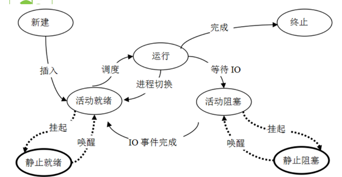
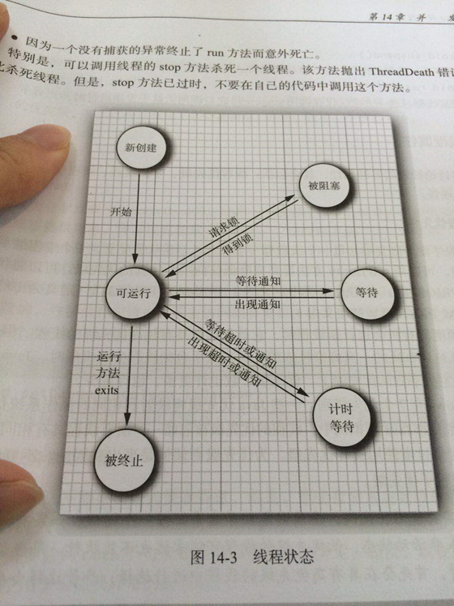

# 并发编程(一)：线程基础

> 任何一个 Java 开发工程师，都绕不过并发编程这个重要而复杂的话题。本文作为并发编程的开篇内容，就从线程基础来讲，包括线程的创建方式、使用方式。讲解并发编程的基础。

[toc]

## 一 线程是什么？

### 1.1 进程概念引入

想要了解线程，我们从更加具象的进程概念入手。

以大家最常见的 windows 操作系统为例，我们经常在电脑上同时做好几件事，比如在输入这行文字的时候，百度云在下载着部分 Java 的资料，网易云在播放着音乐， git 的 bash 界面正在拉取本项目的最新代码。

这些，都只不过是我知道的由自己操作发起的应用的进行状态，这些正在执行的应用，就被称作进程。

而在我操作之外，还有许多系统应用或者自启应用也在后台运行。打开任务管理器，我们可以看到，进程一栏的进程数相当多。


对于进程的定义，找到以下描述：

进程是**程序的一次执行**，进程是一个程序及其数据在处理机上顺序执行时所发生的**活动**，进程是具有独立功能的程序在一个数据集合上运行的过程，它是系统进行资源**分配和调度的一个独立单位**

**进程是系统进行资源分配和调度的独立单位。每一个进程都有它自己的内存空间和系统资源**

### 1.2 线程概念引入

进程以我们肉眼能够看到的情形在运行着，运行中的进程被分配了一部分资源用来完成自己的功能。那么线程又是用来做什么的呢？

进程的并发执行需要如下系统操作的支持：

- (1)**创建进程**，系统在创建一个进程时，必须为它分配其所必需的、除处理机以外的所有资源，如内存空间、I/O设备，以及建立相应的PCB；

- (2)**撤消进程**，系统在撤消进程时，又必须先对其所占有的资源执行回收操作，然后再撤消PCB；

- (3)**进程切换**，对进程进行上下文切换时，需要保留当前进程的CPU环境，设置新选中进程的CPU环境，因而须花费不少的处理机时间。



可以看到进程实现多处理机环境下的进程调度，分派，切换时，**都需要花费较大的时间和空间开销**

引入线程主要是**为了提高系统的执行效率，减少处理机的空转时间和调度切换的时间，以及便于系统管理。**使OS具有更好的并发性

•      简单来说：**进程实现多处理**非常耗费CPU的资源，而我们**引入线程是作为调度和分派的基本单位**（取代进程的部分基本功能**【调度】**）。

那么线程在哪呢？？举个例子：


也就是说：**在同一个进程内又可以执行多个任务，而这每一个任务我就可以看出是一个线程**。

•      所以说：**一个进程会有1个或多个线程的**！

### 1.3 进程与线程

于是我们可以总结出：

- 进程作为资源**分配**的基本单位

- 线程作为资源**调度**的基本单位，**是程序的执行单元，执行路径**(单线程：一条执行路径，多线程：多条执行路径)。是程序使用CPU的最基本单位。

线程有**3个基本状态**：

- 执行、就绪、阻塞

线程有**5种基本操作**：

- 派生、阻塞、激活、 调度、 结束



**线程的属性：**

- 1)轻型实体；

- 2)独立调度和分派的基本单位；

- 3)可并发执行；

- 4)共享进程资源。

线程有**两个基本类型**：

- 1) **用户级线程**：管理过程全部由用户程序完成，**操作系统内核心只对进程进行管理。**

- 2) **系统级线程**(核心级线程)：**由操作系统内核进行管理**。操作系统内核给应用程序提供相应的系统调用和应用程序接口API，以使用户程序可以创建、执行以及撤消线程。

### 1.4 并行与并发

**并行：**

- 并行性是指**同一时刻内**发生两个或多个事件。

- 并行是在**不同**实体上的多个事件

**并发：**

- 并发性是指**同一时间间隔内**发生两个或多个事件。

- 并发是在**同一实体**上的多个事件

由此可见：并行是针对进程的，**并发是针对线程的**。

## 二 线程的创建

常见的线程创建方式有三种：

- 继承 Thread，重写 run 方法

- 实现 Runnable 接口，重写 run 方法

- 实现 Callable 接口，重写 call 方法

### 2.1 继承 Thread 类，重写 run 方法

```java
/**
 * ExtendThread 类是 继承Thread类的线程类
 *
 * @author dongyinggang
 * @date 2020-07-08 14:21
 **/
public class ExtendThread extends  Thread{

    private String name;
    private boolean flag = true;

    public ExtendThread(String name){
        this.name = name;
    }

    @Override
    public void run(){
        while(flag){
            System.out.println(name + "is running");
            try {
                Thread.sleep(200);
            } catch (InterruptedException e) {
                e.printStackTrace();
            }
        }
    }

    public void exit(){
        this.flag = false;
    }
}
```

调用：

```java
/**
 * extendTest 方法是 通过继承Thread类实现线程（不常用）
 *
 * @author dongyinggang
 * @date 2020/11/30 8:20
 */
public static void extendTest() {
    ExtendThread extendThread = new ExtendThread("extend-t-1");
    ExtendThread extendThread2 = new ExtendThread("extend-t-2");
    extendThread.start();
    extendThread2.start();
    try {
        Thread.sleep(2000);
    } catch (InterruptedException e) {
        e.printStackTrace();
    }
    //停止线程运行
    extendThread.exit();
    extendThread2.exit();
}
```

### 2.2 实现 Runnable 接口，重写 run 方法

```java
package cn.dyg.threadbasic.create;

/**
 * ImplRunnable 类是 实现Runnable接口的线程类
 *
 * @author dongyinggang
 * @date 2020-07-08 14:30
 **/
public class ImplRunnable implements Runnable{

    private String name;

    private boolean flag = true;

    public ImplRunnable(String name){
        this.name = name;
    }

    @Override
    public void run() {
        while(flag){
            System.out.println(name + "is running");
            try {
                Thread.sleep(300);
            } catch (InterruptedException e) {
                e.printStackTrace();
            }
        }
    }

    public void exit(){
        this.flag = false;
    }
}
```

调用：

```java
/**
 * implTest 方法是 实现Runnable接口的线程类实例
 *
 * @author dongyinggang
 * @date 2020/11/30 8:20
 */
public static void implTest() {
    ImplRunnable implRunnable = new ImplRunnable("实现Runnable接口的线程类实例");
    new Thread(implRunnable).start();
    try {
        Thread.sleep(2000);
    } catch (InterruptedException e) {
        e.printStackTrace();
    }
    //停止线程
    implRunnable.exit();

}
```

### 2.3 实现 Callable 接口，重写 call 方法

除了上述两种常见的线程创建方式外，还有一种比较特殊的线程创建方式，即通过实现 Callable 接口，重写其 call 方法，然后通过 Future 的实现类对象，获取到异步计算的结果。

```java
package cn.dyg.threadbasic.create;

import java.util.concurrent.Callable;

/**
 * CallableThread 类是 通过实现callable接口创建线程
 *
 * @author dongyinggang
 * @date 2020-11-30 08:43
 **/
public class CallableThread implements Callable<Integer> {

    /**
     * call 方法是 重写接口的call方法
     * 和实现Runnable的区别：
     * 1.方法可以有返回值
     * 2.可以抛出异常
     * 3.启动实现 Callable 接口的线程,需要有 FutureTask 实现类的支持，用于接收运算结果。FutureTask 是 Future 接口的实现类
     *
     * @return return的类型是根据 实现的 Callable 接口的 <T> 来决定的，若不指定的话,则返回值为object
     * @author dongyinggang
     * @date 2020/11/30 8:44
     */
    @Override
    public Integer call() throws Exception {
        int sum = 0;
        for (int i = 0; i < 100000; i++) {
            sum +=i;
        }
        return sum;
    }
}
```

调用：

```java
/**
 * callableTest 方法是 通过实现 callable 接口创建线程,
 * 需要配合 futureTask 使用来获取返回值
 *
 * @author dongyinggang
 * @date 2020/11/30 8:58
 */
public static void callableTest() {
    CallableThread callableThread = new CallableThread();

    /*
     futureTask 实现了 RunnableFuture 接口,
     RunnableFuture则继承了 Runnable, Future 两个接口,
     因此实际上 new Thread(futureTask) 调用到的 Thread 类的构造方法还是 public Thread(Runnable target)
     */
    FutureTask<Integer> futureTask = new FutureTask<>(callableThread);

    new Thread(futureTask).start();

    try {
        //通过get方法接收线程返回值,get方法会阻塞线程,直到返回结果
        Integer sum = futureTask.get();
        System.out.println("实现callable接口的线程计算结果：" + sum);

    } catch (Exception e) {
        e.printStackTrace();
    }
}
```

Callable 和 Runnable 接口的区别主要如下：

1.  Callable规定的方法是call()，而Runnable规定的方法是run(). 
2.  Callable的任务执行后可返回值，而Runnable的任务是不能返回值的。 
3.  call()方法可抛出异常，而run()方法是不能抛出异常的。 
4.  运行Callable任务可拿到一个Future对象， Future表示异步计算的结果。它提供了检查计算是否完成的方法，以等待计算的完成，并检索计算的结果。通过Future对象可了解任务执行情况，可取消任务的执行，还可获取任务执行的结果。 

Callable是类似于Runnable的接口，实现Callable接口的类和实现Runnable的类都是可被其它线程执行的任务。

Callable有两种执行方式：

- 借助 FutureTask 执行，就是上面的调用示例代码
- 借助线程池来运行，在此不做展开，可以查看这篇博文的内容：[Callable接口详解](https://blog.csdn.net/m0_37204491/article/details/87930790)

## 参考内容

【1】[Java多线程之Callable接口的实现](https://www.cnblogs.com/baizhanshi/p/6425209.html)

【2】[Callable接口详解](https://blog.csdn.net/m0_37204491/article/details/87930790)

