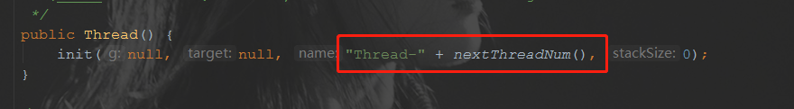
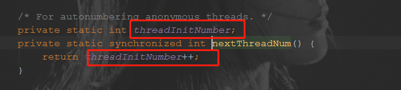
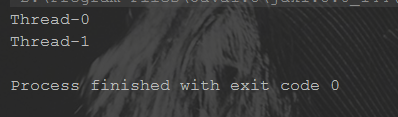
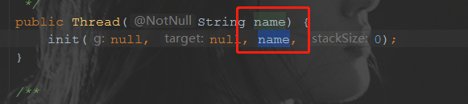
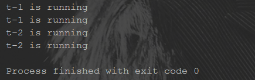
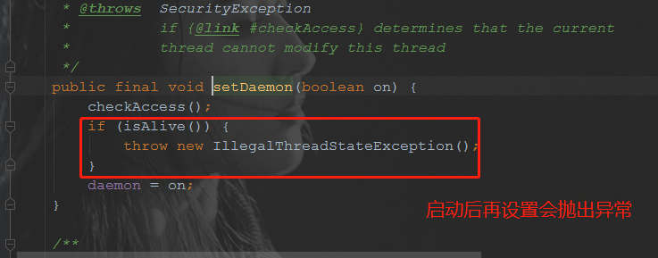
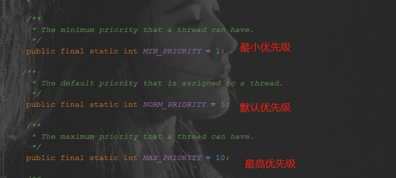
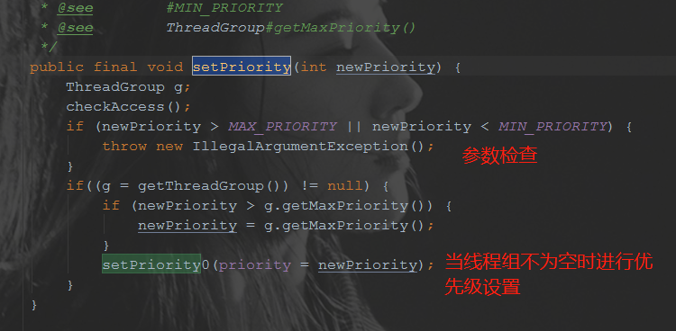
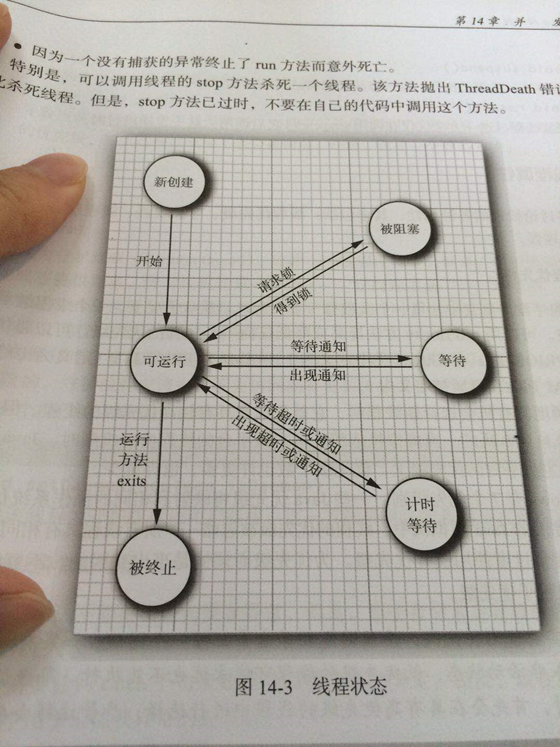

# 并发编程(二)：Thread类解析

> 既然要学习并发编程，那 Thread 类就跳不过去了，因为 Java 中的并发，归根结底都是新的 Thread 实例的 start() 方法的调用，因此，在这里对 Thread 类的常见方法进行梳理。

[toc]

## 一 Thread 的构造方法

### 1.1 常见构造

常见的构建方法通常是指定 Runnable 对象和名称，值得注意的是，多个构造方法实际调用的都是 Thread 类的 init 方法,该方法的参数含 Runnable 对象和线程名称。常见构造方法的调用代码如下：

```java
	/**
     * constructor 方法是 常见构造方法
     * 1.无参构造
     * 2.指定线程名称的线程
     * 3.指定 runnable 实现类的线程
     * 4.指定 runnable 和线程名称的线程
     * 调用方法实际是调用了 init 方法
     *
     * @author dongyinggang
     * @date 2020/11/30 15:17
     */
    public static void constructor(){
        //1.无参构造
        Thread thread = new Thread();
        System.out.println(thread.getName());
        //2.指定线程名称的线程
        thread = new Thread("t-1");

        Runnable runnable = new ImplRunnable("r-1");
        //3.指定 runnable 实现类的线程
        thread = new Thread(runnable);
        //4.指定 runnable 和线程名称的线程
        thread = new Thread(runnable,"t-2");

    }
```

### 1.2 线程名称的设置与获取

线程名称的获取通常通过 Thread.currentThread().getName() ,可以获取当前执行线程的名称。

如果没有做什么的设置，我们会发现线程的名字是这样子的：**主线程叫做main，其他线程是Thread-x**

看一下线程初始化的默认命名步骤。

以无参构造为例：



可以看到当无线程名称传入时，默认的名称以 "Thread-" + nextThreadNum() 构成，看一下 nextThreadNum() 方法的实现。



threadInitNumber 这个变量作为一个静态 int 变量，初始值为0，所以线程从Thread-0开始，随着匿名线程的增加，该值不断进行自增，这个变量实际就是匿名线程的创建次序，**直接指定名称的线程不会使该值进行自增**。

以这段代码为例：

```java
public static void constructor(){
    //1.无参构造
    Thread thread = new Thread();
    System.out.println(thread.getName());
    //2.指定线程名称的线程
    thread = new Thread("t-1");

    Runnable runnable = new ImplRunnable("r-1");
    //3.指定 runnable 实现类的线程
    thread = new Thread(runnable);
    System.out.println(thread.getName());
    //4.指定 runnable 和线程名称的线程
    thread = new Thread(runnable,"t-2");

}
```

运行后可以看到结果如下：



通过指定线程名称的方式创建线程时，并没有使 threadInitNumber 自增，源码中也可以看到支持这一点：



name是由入参决定的，与 threadInitNumber 无关。

当我们决定自己命名线程名称时，我们应当如何做呢，常见的命名方式有两种：

1. 通过构造方法设置线程名称

2. 通过setName方法设置线程名称

示例代码如下：

```java
		/**
     * threadName 方法是 设置线程名称的两种方式
     * 1.通过构造方法设置线程名称
     * 2.通过setName方法设置线程名称
     * 注：
     * 若没有指定线程名称,会使用"Thread-x"(x指线程初始数量,是 Thread 类的 threadInitNumber)
     *
     * @author dongyinggang
     * @date 2020/12/1 18:14
     */
    public static void threadName(){
        //1.通过构造方法设置线程名称
        Thread thread = new Thread(ThreadSourceTest::outputThreadName,"t-1");

        thread.start();
        try {
            Thread.sleep(1000);
        } catch (InterruptedException e) {
            e.printStackTrace();
        }

        //2.通过setName方法设置线程名称
        thread.setName("t-2");
        try {
            Thread.sleep(1000);
        } catch (InterruptedException e) {
            e.printStackTrace();
        }
    }

    /**
     * outputThreadName 方法是 输出线程名称的方法
     *
     * @author dongyinggang
     * @date 2020/12/1 19:20
     */
    private static void outputThreadName(){
        int i = 0;
        int times = 4;
        while(i<times){
            System.out.println(Thread.currentThread().getName()+" is running");
            try {
                i++;
                Thread.sleep(500);
            } catch (InterruptedException e) {
                e.printStackTrace();
            }
        }
    }
```

通过构造方法将线程名称设置为“t-1”，运行 1s 后将线程名称通过 setName 方法设置新的线程名称“t-2”，再运行 1s，可以得到输出结果如下：

 

符合预期，出现了两种方式分别设置的线程名称。

### 1.3 守护线程

守护线程是**为其他线程服务的**

- **垃圾回收线程就是守护线程**~

守护线程有一个**特点**：

- 当别的用户线程执行完了，虚拟机就会退出，守护线程也就会被停止掉了。

- 也就是说：守护线程作为一个**服务线程，没有服务对象就没有必要继续运行**了

**使用线程的时候要注意的地方**

1. **在线程启动前**设置为守护线程，方法是setDaemon(boolean on)

原因：



2. 使用守护线程**不要访问共享资源**(数据库、文件等)，因为它可能会在任何时候就挂掉了。

3. 守护线程中产生的新线程也是守护线程

守护线程测试代码：

1.创建一个线程类作为守护线程实例

```java
package cn.dyg.threadbasic.source;

/**
 * DaemonThread 类是 守护线程类
 *
 * @author dongyinggang
 * @date 2020-07-13 11:14
 **/
public class DaemonThread implements Runnable{

    @Override
    public void run() {
        //守护线程创建的子线程进行自己线程名称的输出,该子线程未显式声明为守护线程，但实际也是一个守护线程
        Thread thread = new Thread(
                ()-> System.out.println(Thread.currentThread().getName()+"是否守护线程："+
                        Thread.currentThread().isDaemon()),
                "守护线程创建的子线程");
        thread.start();
        //守护线程是一个死循环
        while(true){
            System.out.println(Thread.currentThread().getName()+"这是一个守护线程");
            try {
                Thread.sleep(1000);
            } catch (InterruptedException e) {
                e.printStackTrace();
            }
        }
    }
}
```

2.测试代码

```java
/**
 * daemonTest 方法是 守护线程测试
 *
 * @author dongyinggang
 * @date 2020/12/1 20:18
 */
public static void daemonTest() {
    //创建守护线程实例
    DaemonThread daemonThread = new DaemonThread();
    Thread daemon = new Thread(daemonThread, "守护线程---->");

    //声明为守护线程并启动
    daemon.setDaemon(true);
    daemon.start();
    try {
        //尽管守护线程中是个死循环,但随着主线程结束而终止
        Thread.sleep(2000);
    } catch (InterruptedException e) {
        e.printStackTrace();
    }
}
```

测试结果如下：


可以看到以下两点是符合预期的：

1. 尽管守护线程是个死循环，但在主线程结束后，守护线程也停止了，没有继续输出。
2. 守护线程创建的子线程进行自己线程名称的输出,该子线程未显式声明为守护线程，但实际也是一个守护线程

### 1.3 线程优先级

线程优先级高仅仅表示线程**获取的****CPU****时间片的几率高**，但这不是一个**确定的因素**！

线程的优先级是**高度依赖于操作系统的**，Windows和Linux就有所区别(Linux下优先级可能就被忽略了)~

可以看到的是，Java提供的优先级默认是5，最低是1，最高是10：



如果想要改变线程的优先级，可以通过 setPriority(int newPriority) 的方式进行设置，该方法具体实现如下：



**只有线程组不为空的线程才能够设置优先级，且优先级不能比线程组的优先级高。**

若没有在构造方法中指定线程组，在线程初始化时由 SecurityManager（是安全管理器，未显式指定，通常为null，详情见[java线程基础知识----SecurityManager类详解](https://www.cnblogs.com/liboBlog/p/6431722.html)） 或父线程的线程组来进行指定。

其中调用的 setPriority0(int newPriority) 是一个本地（native）方法。

线程优先级示例代码：

```java
/**
 * priorityTest 方法是 线程优先级示例代码
 * 
 * @author dongyinggang
 * @date 2020/12/2 9:00
 */
public static void priorityTest(){
    Thread thread = new Thread(new ImplRunnable("r-1"));
    System.out.println("安全管理器："+System.getSecurityManager());
    System.out.println(thread.getThreadGroup()+"线程组最大的优先级："+thread.getThreadGroup().getMaxPriority());
    System.out.println("原线程优先级："+thread.getPriority());
    thread.setPriority(6);
    System.out.println("修改后的线程优先级："+thread.getPriority());
}
```

运行结果：


### 1.4 线程生命周期

线程的基本状态有3个：执行、就绪、阻塞。



接下来就看一下线程类中和线程生命周期相关的方法。

#### 1.4.1 sleep方法

调用 sleep 方法会让线程让出自己获取的cpu资源，进入一个计时等待的状态，**等到计时完毕，会进入就绪状态**。等待重新竞争到资源后进入运行状态。

#### 1.4.2 yield方法

调用 yield 方法会让出当前资源，让调用 yield 的线程进入就绪状态，和其他线程一起重新竞争资源，因此，yield 方法不能确保自己真正让出。

#### 1.4.3 join 方法

调用 join 方法，会等待该线程执行完毕后，才会执行别的线程，会让其他线程处于等待状态。

#### 1.4.4 interrupt方法

Thread类中有个被设置为过时的stop()方法，该方法是之前版本用来中断线程的方法。现在已经没有强制线程终止的方法了。

由于stop方法可以让一个线程A终止掉另一个线程B

1. 被终止的线程B会立即释放锁，这可能会让对象处于不一致的状态
2. 线程A也不知道线程B什么时候能够被终止调，万一B还处于运行计算阶段。
3. 

## 参考内容

【1】[java线程基础知识----SecurityManager类详解](https://www.cnblogs.com/liboBlog/p/6431722.html)

【2】[Java多线程（九）—— interrupt()和线程终止方式](https://www.cnblogs.com/xiaoxi/p/7004539.html)

