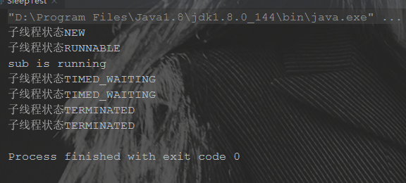
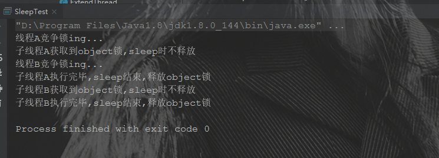
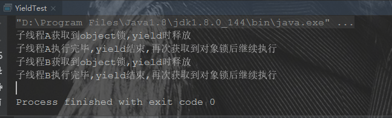
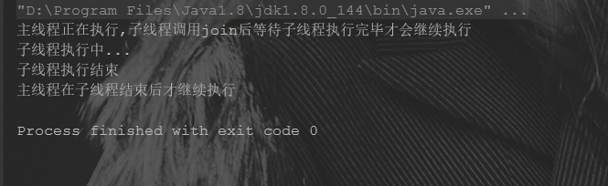
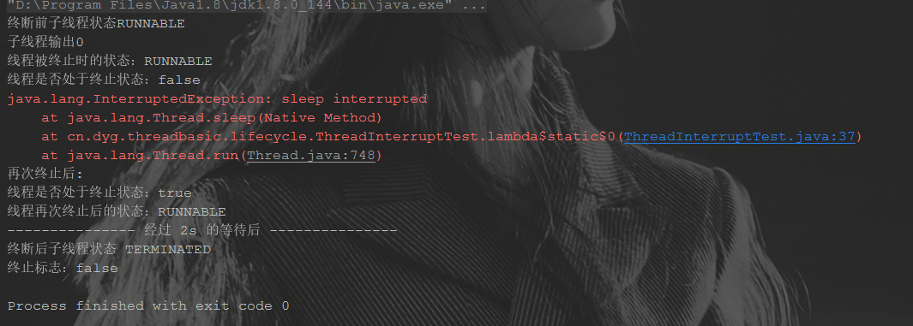
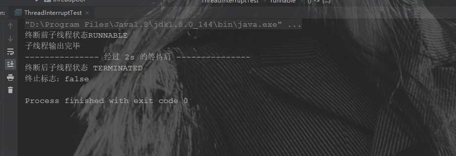

# 并发编程(二)：Thread类解析

> 既然要学习并发编程，那 Thread 类就跳不过去了，因为 Java 中的并发，归根结底都是新的 Thread 实例的 start() 方法的调用，因此，在这里对 Thread 类的常见方法进行梳理。

[toc]

## 一 Thread 线程类 API

### 1.1 常见构造

常见的构建方法通常是指定 Runnable 对象和名称，值得注意的是，多个构造方法实际调用的都是 Thread 类的 init 方法,该方法的参数含 Runnable 对象和线程名称。常见构造方法的调用代码如下：

```java
	/**
     * constructor 方法是 常见构造方法
     * 1.无参构造
     * 2.指定线程名称的线程
     * 3.指定 runnable 实现类的线程
     * 4.指定 runnable 和线程名称的线程
     * 调用方法实际是调用了 init 方法
     *
     * @author dongyinggang
     * @date 2020/11/30 15:17
     */
    public static void constructor(){
        //1.无参构造
        Thread thread = new Thread();
        System.out.println(thread.getName());
        //2.指定线程名称的线程
        thread = new Thread("t-1");

        Runnable runnable = new ImplRunnable("r-1");
        //3.指定 runnable 实现类的线程
        thread = new Thread(runnable);
        //4.指定 runnable 和线程名称的线程
        thread = new Thread(runnable,"t-2");

    }
```

### 1.2 线程名称的设置与获取

线程名称的获取通常通过 Thread.currentThread().getName() ,可以获取当前执行线程的名称。

如果没有做什么的设置，我们会发现线程的名字是这样子的：**主线程叫做main，其他线程是Thread-x**

看一下线程初始化的默认命名步骤。

以无参构造为例：


可以看到当无线程名称传入时，默认的名称以 "Thread-" + nextThreadNum() 构成，看一下 nextThreadNum() 方法的实现。


threadInitNumber 这个变量作为一个静态 int 变量，初始值为0，所以线程从Thread-0开始，随着匿名线程的增加，该值不断进行自增，这个变量实际就是匿名线程的创建次序，**直接指定名称的线程不会使该值进行自增**。

以这段代码为例：

```java
public static void constructor(){
    //1.无参构造
    Thread thread = new Thread();
    System.out.println(thread.getName());
    //2.指定线程名称的线程
    thread = new Thread("t-1");

    Runnable runnable = new ImplRunnable("r-1");
    //3.指定 runnable 实现类的线程
    thread = new Thread(runnable);
    System.out.println(thread.getName());
    //4.指定 runnable 和线程名称的线程
    thread = new Thread(runnable,"t-2");

}
```

运行后可以看到结果如下：


通过指定线程名称的方式创建线程时，并没有使 threadInitNumber 自增，源码中也可以看到支持这一点：


name是由入参决定的，与 threadInitNumber 无关。

当我们决定自己命名线程名称时，我们应当如何做呢，常见的命名方式有两种：

1. 通过构造方法设置线程名称

2. 通过setName方法设置线程名称

示例代码如下：

```java
		/**
     * threadName 方法是 设置线程名称的两种方式
     * 1.通过构造方法设置线程名称
     * 2.通过setName方法设置线程名称
     * 注：
     * 若没有指定线程名称,会使用"Thread-x"(x指线程初始数量,是 Thread 类的 threadInitNumber)
     *
     * @author dongyinggang
     * @date 2020/12/1 18:14
     */
    public static void threadName(){
        //1.通过构造方法设置线程名称
        Thread thread = new Thread(ThreadSourceTest::outputThreadName,"t-1");

        thread.start();
        try {
            Thread.sleep(1000);
        } catch (InterruptedException e) {
            e.printStackTrace();
        }

        //2.通过setName方法设置线程名称
        thread.setName("t-2");
        try {
            Thread.sleep(1000);
        } catch (InterruptedException e) {
            e.printStackTrace();
        }
    }

    /**
     * outputThreadName 方法是 输出线程名称的方法
     *
     * @author dongyinggang
     * @date 2020/12/1 19:20
     */
    private static void outputThreadName(){
        int i = 0;
        int times = 4;
        while(i<times){
            System.out.println(Thread.currentThread().getName()+" is running");
            try {
                i++;
                Thread.sleep(500);
            } catch (InterruptedException e) {
                e.printStackTrace();
            }
        }
    }
```

通过构造方法将线程名称设置为“t-1”，运行 1s 后将线程名称通过 setName 方法设置新的线程名称“t-2”，再运行 1s，可以得到输出结果如下：

 

符合预期，出现了两种方式分别设置的线程名称。

### 1.3 守护线程

守护线程是**为其他线程服务的**

- **垃圾回收线程就是守护线程**~

守护线程有一个**特点**：

- 当别的用户线程执行完了，虚拟机就会退出，守护线程也就会被停止掉了。

- 也就是说：守护线程作为一个**服务线程，没有服务对象就没有必要继续运行**了

**使用线程的时候要注意的地方**

1. **在线程启动前**设置为守护线程，方法是setDaemon(boolean on)

原因：


2. 使用守护线程**不要访问共享资源**(数据库、文件等)，因为它可能会在任何时候就挂掉了。

3. 守护线程中产生的新线程也是守护线程

守护线程测试代码：

1.创建一个线程类作为守护线程实例

```java
package cn.dyg.threadbasic.source;

/**
 * DaemonThread 类是 守护线程类
 *
 * @author dongyinggang
 * @date 2020-07-13 11:14
 **/
public class DaemonThread implements Runnable{

    @Override
    public void run() {
        //守护线程创建的子线程进行自己线程名称的输出,该子线程未显式声明为守护线程，但实际也是一个守护线程
        Thread thread = new Thread(
                ()-> System.out.println(Thread.currentThread().getName()+"是否守护线程："+
                        Thread.currentThread().isDaemon()),
                "守护线程创建的子线程");
        thread.start();
        //守护线程是一个死循环
        while(true){
            System.out.println(Thread.currentThread().getName()+"这是一个守护线程");
            try {
                Thread.sleep(1000);
            } catch (InterruptedException e) {
                e.printStackTrace();
            }
        }
    }
}
```

2.测试代码

```java
/**
 * daemonTest 方法是 守护线程测试
 *
 * @author dongyinggang
 * @date 2020/12/1 20:18
 */
public static void daemonTest() {
    //创建守护线程实例
    DaemonThread daemonThread = new DaemonThread();
    Thread daemon = new Thread(daemonThread, "守护线程---->");

    //声明为守护线程并启动
    daemon.setDaemon(true);
    daemon.start();
    try {
        //尽管守护线程中是个死循环,但随着主线程结束而终止
        Thread.sleep(2000);
    } catch (InterruptedException e) {
        e.printStackTrace();
    }
}
```

测试结果如下：


可以看到以下两点是符合预期的：

1. 尽管守护线程是个死循环，但在主线程结束后，守护线程也停止了，没有继续输出。
2. 守护线程创建的子线程进行自己线程名称的输出,该子线程未显式声明为守护线程，但实际也是一个守护线程

### 1.3 线程优先级

线程优先级高仅仅表示线程**获取的CPU时间片的几率高**，但这不是一个**确定的因素**！

线程的优先级是**高度依赖于操作系统的**，Windows和Linux就有所区别(Linux下优先级可能就被忽略了)~

可以看到的是，Java提供的优先级默认是5，最低是1，最高是10：


如果想要改变线程的优先级，可以通过 setPriority(int newPriority) 的方式进行设置，该方法具体实现如下：


**只有线程组不为空的线程才能够设置优先级，且优先级不能比线程组的优先级高。**

若没有在构造方法中指定线程组，在线程初始化时由 SecurityManager（是安全管理器，未显式指定，通常为null，详情见[java线程基础知识----SecurityManager类详解](https://www.cnblogs.com/liboBlog/p/6431722.html)） 或父线程的线程组来进行指定。

其中调用的 setPriority0(int newPriority) 是一个本地（native）方法。

线程优先级示例代码：

```java
/**
 * priorityTest 方法是 线程优先级示例代码
 * 
 * @author dongyinggang
 * @date 2020/12/2 9:00
 */
public static void priorityTest(){
    Thread thread = new Thread(new ImplRunnable("r-1"));
    System.out.println("安全管理器："+System.getSecurityManager());
    System.out.println(thread.getThreadGroup()+"线程组最大的优先级："+thread.getThreadGroup().getMaxPriority());
    System.out.println("原线程优先级："+thread.getPriority());
    thread.setPriority(6);
    System.out.println("修改后的线程优先级："+thread.getPriority());
}
```

运行结果：


### 1.4 线程生命周期

线程的基本状态有6个：新建（NEW）、就绪(RUNNABLE)、阻塞(BLOCKED)、等待(WAITING)、计时等待(TIMED_WAITING)、终止(TERMINATED)。线程状态定义存在于 Thread.State 这个枚举中。

#### 1.4.1 线程状态

1. NEW就是在线程还没有启动的时候的状态
2. RUNNABLE 就是线程在执行start()方法后就进入的状态，下面的几种状态都是从RUNNABLE 变换过去的，也就是new第一，RUNNABLE 一定是第二个状态，其次才是下面的几种状态
3. WAITING 就是当此线程执行了wait()方法的时候，线程进入的状态，死死的等待，直到其他线程执行了notify()或者notifyAll()方法才继续执行。
   注意：当线程执行wait()后，会释放锁，这跟sleep()不同，sleep()是不释放锁的。
4. TIMED_WAITING 就是当线程执行了sleep()方法或者TimeUtil的sleep()方法，线程进入的状态
5. BLOCKED就是当两个线程同时需要获取同一把锁，一个线程拿到了锁，那么另一个线程就进入了BLOCKED状态，等待拿到锁的线程执行完毕，才继续执行。
6. TERMINATED就是线程结束后的状态


接下来就看一下线程类中和线程生命周期相关的方法。

#### 1.4.2 sleep方法

调用 sleep 方法会让线程让出自己获取的cpu资源，进入一个计时等待的状态，**等到计时完毕，会进入就绪状态**。等待重新竞争到资源后进入运行状态。

测试代码：

```java
/**
 * SleepTest 类是 sleep方法测试
 *
 * @author dongyinggang
 * @date 2021-02-20 08:57
 **/
public class SleepTest {

    public static void main(String[] args) throws InterruptedException {
        Thread t = new Thread(() -> {
            System.out.println("sub is running");
            try {
                Thread.sleep(200);
            } catch (InterruptedException e) {
                e.printStackTrace();
            }
        });
        System.out.println("子线程状态" + t.getState());
        t.start();
        int i = 0;
        int time = 5;
        while (i < time) {
            i++;
            System.out.println("子线程状态" + t.getState());
            Thread.sleep(100);
        }
    }
}
```

测试结果：



可以看到子线程的状态变化如上图，分析如下：

1. 子线程创建但未调用 start() 方法时，处于 **NEW** 状态
2. 调用 start() 方法，子线程获取到运行所需的资源，子线程进入 **RUNNABLE** 状态，执行了 run() 方法
3. 子线程在 run() 方法中调用了 sleep() 进入 **TIMED_WAITING** 状态
4. sleep() 的时间结束后，子线程执行完毕，进入了 **TERMINATED** 状态，子线程终止。
5. 主线程执行完毕，主线程终止，进程结束。

需要注意的是，sleep() 方法不会释放锁，进入睡眠状态的线程依旧持有获取到的锁。

测试代码：

```java
		/**
     * testLock 方法是 测试sleep方法不释放锁
     *
     * @author dongyinggang
     * @date 2021/2/20 10:24
     */
    private static void testLock(){

        Object object = new Object();

        new Thread(()->{
            System.out.println("线程A竞争锁ing...");
            synchronized (object){
                System.out.println("子线程A获取到object锁,sleep时不释放");
                try {
                    Thread.sleep(1000);
                } catch (InterruptedException e) {
                    e.printStackTrace();
                }
                System.out.println("子线程A执行完毕,sleep结束,释放object锁");
            }
        }).start();

        new Thread(()->{
            System.out.println("线程B竞争锁ing...");
            synchronized (object){
                System.out.println("子线程B获取到object锁,sleep时不释放");
                try {
                    Thread.sleep(1000);
                } catch (InterruptedException e) {
                    e.printStackTrace();
                }
                System.out.println("子线程B执行完毕,sleep结束,释放object锁");
            }
        }).start();
    }
```

运行结果如下：



两个子线程均需要获取到 object 这个对象锁之后才能够执行，它们同时调用 start() 方法，先获取到对象锁的子线程会先执行，执行过程如下：

**假设子线程A先获取到了object锁**

1. 线程A竞争得到了 object 对象锁，输出"子线程A获取到object锁,sleep时不释放"。
2. 线程A调用 Thread.sleep(1000) 睡眠 1s，此时线程进入 TIME_WAITING 状态，但依旧持有 object 锁。
3. 线程B尝试获取锁，但无法成功，因此始终不能执行加锁代码块。
4. 线程A的计时等待状态结束，进入就绪状态，依然持有锁，获取到时间片后，执行同步代码块，执行结束后释放锁
5. 线程B获取到 object 对象锁，开始执行同步代码块，执行结束后进程结束。

#### 1.4.3 yield方法

调用 yield 方法会让出当前资源，让调用 yield 的线程进入就绪状态，和其他线程一起重新竞争资源，因此，yield 方法不能确保自己真正让出。

测试代码：

```java
/**
 * YieldTest 类是 yield方法测试
 *
 * @author dongyinggang
 * @date 2021-02-20 11:03
 **/
public class YieldTest {

    public static void main(String[] args) {
        Object object = new Object();

        new Thread(() -> {
            synchronized (object) {
                System.out.println("子线程A获取到object锁,yield时释放");
              	
                Thread.yield();
                System.out.println("子线程A执行完毕,yield结束,再次获取到对象锁后继续执行");
            }
        }).start();

        new Thread(() -> {
            synchronized (object) {
                System.out.println("子线程B获取到object锁,yield时释放");
                Thread.yield();
                System.out.println("子线程B执行完毕,yield结束,再次获取到对象锁后继续执行");
            }
        }).start();
    }
}
```

运行结果如下：



尽管子线程A调用了yield方法，进行了锁的释放，但在之后的竞争中，依然是线程A竞争到了对象锁 object，yield对于输出结果的影响基本为0。

虽然礼让了，但又通过竞争获取到了对应资源。

#### 1.4.4 join 方法

调用 join 方法，挂起当前线程，执行完目标线程后（join方法的调用者线程），才继续执行当前线程。

测试代码：

```java
/**
 * JoinTest 类是 join 方法测试
 * 挂起当前线程，等待目标线程结束
 *
 * @author dongyinggang
 * @date 2021-02-20 11:17
 **/
public class JoinTest {
    public static void main(String[] args) throws InterruptedException {
        Thread t = new Thread(() -> {
            System.out.println("子线程执行中...");
            try {
                Thread.sleep(2000);
            } catch (InterruptedException e) {
                e.printStackTrace();
            }
            System.out.println("子线程执行结束");
        });
        System.out.println("主线程正在执行,子线程调用join后等待子线程执行完毕才会继续执行");
        t.start();
        // 当执行t.join()时,主线程由于 join() 中调用了 wait() 方法而被阻塞
        // 因此，会等待子线程执行完毕，isAlive()为false时,才跳出while循环,才能够继续进行主线程
        t.join();
        System.out.println("主线程在子线程结束后才继续执行");
    }
}

```

运行结果如下:



子线程调用 join() 方法后，主线程处于 **Waiting** 状态，等待子线程执行结束后才继续执行。

**join()方法原理**

源码：

```java
		//join入口
		public final void join() throws InterruptedException {
        join(0);
    }
    /**
   	 * 等待线程死亡的时间最多为{millis}毫秒，如果{millis}设置为0时，将意味着一直等待下去。
     * 此实现使用{this.isAlive()}为条件，循环调用{Object.wait()}方法
     * 这里方法加了synchronized，因此会锁调用join方法的线程对象
     */
    public final synchronized void join(long millis)
    throws InterruptedException {
        long base = System.currentTimeMillis();
        long now = 0;
				
        if (millis < 0) {
            throw new IllegalArgumentException("timeout value is negative");
        }
				//直接调用join()时，就是走这里的逻辑
        if (millis == 0) {
            //只要线程处于存活状态，就始终调用 wait(0)
            while (isAlive()) {
                //调用wait方法，进入无限等待
                wait(0);
            }
        } else {
            while (isAlive()) {
                long delay = millis - now;
                if (delay <= 0) {
                    break;
                }
                wait(delay);
                now = System.currentTimeMillis() - base;
            }
        }
    }
```

join() 方法另其他线程进入无线等待状态的逻辑：

1. 子线程 start() 之后，调用 join() 方法
2. 由于参数是空，实际调用了 join(0) ，通过while循环不断的调用 Object 类的 wait(0) 方法，**调用wait的代码，和调用wait的对象无关，只和调用wait的线程有关。**因此，虽然是子线程对象来实施了wait方法的调用，但实际主线程进入了由 while 和 wait(0) 引起的无线等待状态。直到 while 的循环条件被打破。
3. **主线程是如何唤醒的呢？**当子线程执行完毕时，jvm在关闭线程之前会检测阻塞在子线程对象上的线程，这里就是主线程，然后执行notifyAll(),此时，主线程被唤醒，继续执行剩余代码。

#### 1.4.5 wait() notify() notifyAll()

尽管这三个方法都是 Object 的方法而非 Thread 的方法，但要涉及到线程之间的调度，就不可能绕开这三个方法。

调用 wait() 使得线程等待某个条件满足，线程在等待时会被挂起，当其他线程的运行使得这个条件满足时，其它线程会调用 notify() 或者 notifyAll() 来唤醒挂起的线程。


#### 1.4.5 interrupt方法

Thread类中有个被设置为过时的stop()方法，该方法是之前版本用来中断线程的方法。现在已经没有强制线程终止的方法了。

由于stop方法可以让一个线程A终止掉另一个线程B

1. 被终止的线程B会立即释放锁，这可能会让对象处于不一致的状态
2. 线程A也不知道线程B什么时候能够被终止，万一B还处于运行计算阶段，那么就会导致未完成对应业务即被终止。

总之，stop方法的太不安全，因此被设置为过时。

现在，我们通常使用 interrupt 来进行线程终止。

1. interrupt 方法终止的是本线程。

2. interrupt 方法不是立刻终止线程的，而是设置了一个终止标记。
3. 接收到终止标记后，线程如何处理是由自己决定的（实际就是代码编写者决定后续业务逻辑）。

测试类如下：

```java
/**
 * ThreadInterruptTest 类是 interrupt方法测试类
 *
 * @author dongyinggang
 * @date 2020-08-25 13:12
 **/
public class ThreadInterruptTest {
    public static void main(String[] args) throws InterruptedException {
        //1.创建并启动线程
        Thread thread = new Thread(runnable, "sub-thread");
        thread.start();
        System.out.println("终断前子线程状态" + thread.getState());
        //2.调用 interrupt 方法进行线程的中止，会设置一个终止标志，但实际并不强制终止，由子线程自己考虑终止时间
        thread.interrupt();
        //3.主线程休眠2s后再看子线程状态
        Thread.sleep(2000);
        //4.成功终止后,线程处于 TERMINATED 状态,终止标志为 false
        System.out.println("--------------- 经过 2s 的等待后 ---------------");
        System.out.println("终断后子线程状态 " + thread.getState() + "\n终止标志：" + thread.isInterrupted());

    }

    /**
     * 通过lambda表达式声明一个Runnable对象
     */
    static Runnable runnable = () -> {
        int i = 0;
        //子线程每隔500ms就输出一次i值并+1
        try {
            int times = 10;
            //2a.如果主线程终止操作成功,则会结束循环
            while (i < times && !Thread.currentThread().isInterrupted()) {
                System.out.println("子线程输出" + i++);
                //2b.如果处于阻塞状态(可由wait、sleep、join三个方法引起),会抛出InterruptedException异常,被捕获
                Thread.sleep(500);
            }
            System.out.println("子线程输出完毕");
        } catch (InterruptedException e) {
            //当子线程抛出异常，线程依旧存活,且终止状态被置为false
            System.out.println("线程被终止时的状态：" + Thread.currentThread().getState());
            System.out.println("线程是否处于终止状态：" + Thread.currentThread().isInterrupted());
            e.printStackTrace();
            //捕获到异常后，需要重新进行终止,才会将终止状态变更为true
            Thread.currentThread().interrupt();
            System.out.println("再次终止后:");
            System.out.println("线程是否处于终止状态：" + Thread.currentThread().isInterrupted());
            System.out.println("线程再次终止后的状态：" + Thread.currentThread().getState());
        }
    };
}
```

值得注意的是，因为 interrupt 方法作用于由wait、sleep、join方法引起阻塞状态的线程时，会抛出 InterruptedException 异常，因此，当出现异常时需要进行什么样的操作，也是必须考虑的，否则就是不停的catch该异常但始终不能够完成终止线程的目标。

测试代码中的运行结果如下，依此来看一下运行逻辑：



1. 在终止前，子线程处于 RUNNABLE 即运行状态。
2. 调用 interrupt 方法，子线程正处于由 Thread.sleep(500); 引起的阻塞状态，因此抛出 InterruptedException异常
3. 通过 try-catch 代码块不活了异常后，先打印了线程状态，可以看到处于 RUNNABLE ，终止标志被设置为 false。
4. 再次调用 interrupt 方法，此时可以正常的设置终止标志。
5. 主线程休眠2s后，打印子线程状态，处于 TERMINATED 终止状态，终止标志被置为 false。

除了上述抛出异常的逻辑外，这段代码还有一种输出可能，如下：



这种输出是调用 interrupt 方法时，线程正处于运行状态的情况。过程如下：

1. 在终止前，子线程处于 RUNNABLE 即运行状态。

2. 调用 interrupt 方法，子线程处于运行状态，while中的执行条件不满足，直接输出"子线程输出完毕"，子线程执行完毕，实际就是完成了终止目的
3. 主线程休眠2s后，子线程状态变更为 TERMINATED 终止状态，终止标志被置为 false。

## 参考内容

【1】[java线程基础知识----SecurityManager类详解](https://www.cnblogs.com/liboBlog/p/6431722.html)

【2】[Java多线程（九）—— interrupt()和线程终止方式](https://www.cnblogs.com/xiaoxi/p/7004539.html)

【3】[Java线程的6个状态](https://blog.csdn.net/qq_42856647/article/details/109790071)

【4】[JAVA中JOIN和WAIT的关系](https://blog.csdn.net/starryninglong/article/details/81144894)