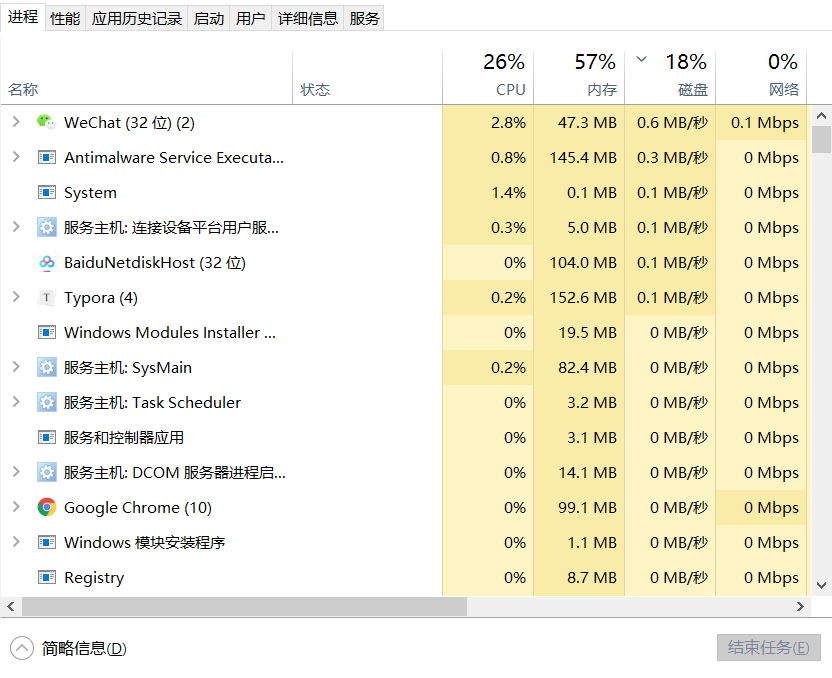

# 并发编程（一）：线程基础

> 任何一个 Java 开发工程师，都绕不过并发编程这个重要而复杂的话题。本文作为并发编程的开篇内容，就从线程基础来讲，包括线程的创建方式、使用方式。讲解并发编程的基础。

## 一 线程是什么？

### 1.1 进程概念引入

想要了解线程，我们从更加具象的进程概念入手。

以大家最常见的 windows 操作系统为例，我们经常在电脑上同时做好几件事，比如在输入这行文字的时候，百度云在下载着部分 Java 的资料，网易云在播放着音乐， git 的 bash 界面正在拉取本项目的最新代码。

这些，都只不过是我知道的由自己操作发起的应用的进行状态，这些正在执行的应用，就被称作进程。

而在我操作之外，还有许多系统应用或者自启应用也在后台运行。打开任务管理器，我们可以看到，进程一栏的进程数相当多。

对于进程的定义，找到以下描述：

进程是**程序的一次执行**，进程是一个程序及其数据在处理机上顺序执行时所发生的**活动**，进程是具有独立功能的程序在一个数据集合上运行的过程，它是系统进行资源**分配和调度的一个独立单位**

**进程是系统进行资源分配和调度的独立单位。每一个进程都有它自己的内存空间和系统资源**

### 1.2 线程概念

进程以我们肉眼能够看到的情形在运行着，运行中的进程被分配了一部分资源用来完成自己的功能。那么线程又是用来做什么的呢？

进程的并发