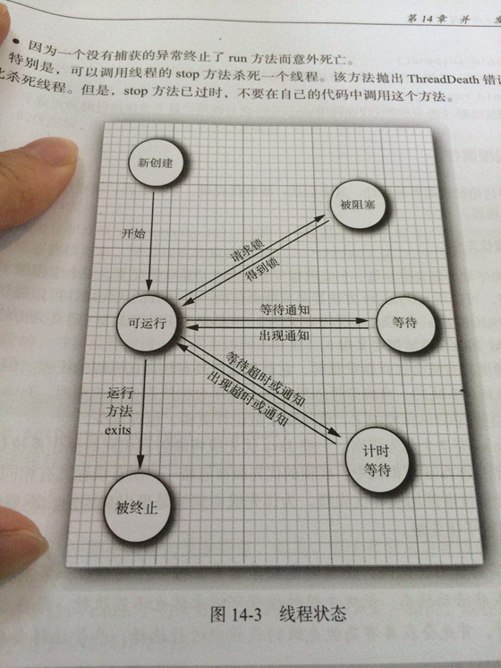

# 并发编程（一）：线程基础

> 任何一个 Java 开发工程师，都绕不过并发编程这个重要而复杂的话题。本文作为并发编程的开篇内容，就从线程基础来讲，包括线程的创建方式、使用方式。讲解并发编程的基础。

## 一 线程是什么？

### 1.1 进程概念引入

想要了解线程，我们从更加具象的进程概念入手。

以大家最常见的 windows 操作系统为例，我们经常在电脑上同时做好几件事，比如在输入这行文字的时候，百度云在下载着部分 Java 的资料，网易云在播放着音乐， git 的 bash 界面正在拉取本项目的最新代码。

这些，都只不过是我知道的由自己操作发起的应用的进行状态，这些正在执行的应用，就被称作进程。

而在我操作之外，还有许多系统应用或者自启应用也在后台运行。打开任务管理器，我们可以看到，进程一栏的进程数相当多。

对于进程的定义，找到以下描述：

进程是**程序的一次执行**，进程是一个程序及其数据在处理机上顺序执行时所发生的**活动**，进程是具有独立功能的程序在一个数据集合上运行的过程，它是系统进行资源**分配和调度的一个独立单位**

**进程是系统进行资源分配和调度的独立单位。每一个进程都有它自己的内存空间和系统资源**

### 1.2 线程概念

进程以我们肉眼能够看到的情形在运行着，运行中的进程被分配了一部分资源用来完成自己的功能。那么线程又是用来做什么的呢？

进程的并发执行需要如下系统操作的支持：

- (1)**创建进程**，系统在创建一个进程时，必须为它分配其所必需的、除处理机以外的所有资源，如内存空间、I/O设备，以及建立相应的PCB；

- (2)**撤消进程**，系统在撤消进程时，又必须先对其所占有的资源执行回收操作，然后再撤消PCB；

- (3)**进程切换**，对进程进行上下文切换时，需要保留当前进程的CPU环境，设置新选中进程的CPU环境，因而须花费不少的处理机时间。

可以看到进程实现多处理机环境下的进程调度，分派，切换时，**都需要花费较大的时间和空间开销**

引入线程主要是**为了提高系统的执行效率，减少处理机的空转时间和调度切换的时间，以及便于系统管理。**使OS具有更好的并发性

•      简单来说：**进程实现多处理**非常耗费CPU的资源，而我们**引入线程是作为调度和分派的基本单位**（取代进程的部分基本功能**【调度】**）。

那么线程在哪呢？？举个例子：

也就是说：**在同一个进程内又可以执行多个任务，而这每一个任务我就可以看出是一个线程**。

•      所以说：**一个进程会有1个或多个线程的**！

### 1.3 进程与线程

于是我们可以总结出：

- 进程作为资源**分配**的基本单位

- 线程作为资源**调度**的基本单位，**是程序的执行单元，执行路径**(单线程：一条执行路径，多线程：多条执行路径)。是程序使用CPU的最基本单位。

线程有**3个基本状态**：

- 执行、就绪、阻塞

线程有**5种基本操作**：

- 派生、阻塞、激活、 调度、 结束

**线程的属性：**

- 1)轻型实体；

- 2)独立调度和分派的基本单位；

- 3)可并发执行；

- 4)共享进程资源。

线程有**两个基本类型**：

- 1) **用户级线程**：管理过程全部由用户程序完成，**操作系统内核心只对进程进行管理。**

- 2) **系统级线程**(核心级线程)：**由操作系统内核进行管理**。操作系统内核给应用程序提供相应的系统调用和应用程序接口API，以使用户程序可以创建、执行以及撤消线程。