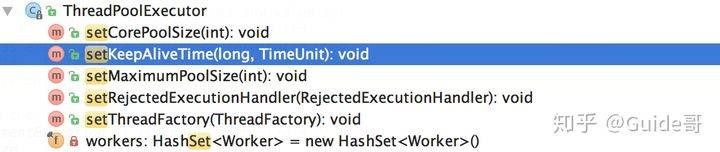
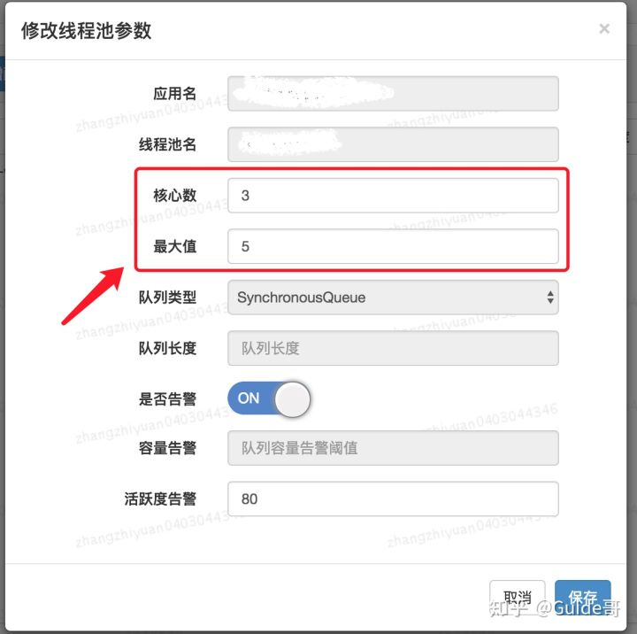

# 线程池的应用

> 池化技术相比大家已经屡见不鲜了，线程池、数据库连接池、Http 连接池等等都是对这个思想的应用。池化技术的思想主要是为了减少每次获取资源的消耗，提高对资源的利用率。

## 为什么要使用线程池

**线程池**提供了一种限制和管理资源（包括执行一个任务）。 每个**线程池**还维护一些基本统计信息，例如已完成任务的数量。

这里借用《Java 并发编程的艺术》提到的来说一下**使用线程池的好处**：

- **降低资源消耗**。通过重复利用已创建的线程降低线程创建和销毁造成的消耗。
- **提高响应速度**。当任务到达时，任务可以不需要的等到线程创建就能立即执行。
- **提高线程的可管理性**。线程是稀缺资源，如果无限制的创建，不仅会消耗系统资源，还会降低系统的稳定性，使用线程池可以进行统一的分配，调优和监控。

**线程池一般用于执行多个不相关联的耗时任务，没有多线程的情况下，任务顺序执行，使用了线程池的话可让多个不相关联的任务同时执行。**

## 线程池的创建

### 四类常用线程池

1. Executors.newCacheThreadPool()：可缓存线程池，先查看池中有没有以前建立的线程，如果有，就直接使用。如果没有，就建一个新的线程加入池中，缓存型池子通常用于执行一些生存期很短的异步型任务
2. Executors.newFixedThreadPool(int n)：创建一个可重用固定个数的线程池，以共享的无界队列方式来运行这些线程。
3. Executors.newScheduledThreadPool(int n)：创建一个定长线程池，支持定时及周期性任务执行
4. Executors.newSingleThreadExecutor()：创建一个单线程化的线程池，它只会用唯一的工作线程来执行任务，保证所有任务按照指定顺序(FIFO, LIFO, 优先级)执行

### 自定义线程池

但我们通常不会直接使用这几类默认线程池，而是根据项目实际需要来做。

一般是通过 `ThreadPoolExecutor` 的构造函数来创建线程池，然后提交任务给线程池执行就可以了。

`ThreadPoolExecutor`构造函数如下：

```java
/**
     * 用给定的初始参数创建一个新的ThreadPoolExecutor。
     */
    public ThreadPoolExecutor(int corePoolSize,//线程池的核心线程数量
                              int maximumPoolSize,//线程池的最大线程数
                              long keepAliveTime,//当线程数大于核心线程数时，多余的空闲线程存活的最长时间
                              TimeUnit unit,//时间单位
                              BlockingQueue<Runnable> workQueue,//任务队列，用来储存等待执行任务的队列
                              ThreadFactory threadFactory,//线程工厂，用来创建线程，一般默认即可
                              RejectedExecutionHandler handler//拒绝策略，当提交的任务过多而不能及时处理时，我们可以定制策略来处理任务
                               ) {
        if (corePoolSize < 0 ||
            maximumPoolSize <= 0 ||
            maximumPoolSize < corePoolSize ||
            keepAliveTime < 0)
            throw new IllegalArgumentException();
        if (workQueue == null || threadFactory == null || handler == null)
            throw new NullPointerException();
        this.corePoolSize = corePoolSize;
        this.maximumPoolSize = maximumPoolSize;
        this.workQueue = workQueue;
        this.keepAliveTime = unit.toNanos(keepAliveTime);
        this.threadFactory = threadFactory;
        this.handler = handler;
    }
```

#### 如何配置参数呢？

说到如何给线程池配置参数，美团的骚操作至今让我难忘（后面会提到）！

我们先来看一下各种书籍和博客上一般推荐的配置线程池参数的方式，可以作为参考！

##### **常规操作**

很多人甚至可能都会觉得把线程池配置过大一点比较好！我觉得这明显是有问题的。就拿我们生活中非常常见的一例子来说：**并不是人多就能把事情做好，增加了沟通交流成本。你本来一件事情只需要 3 个人做，你硬是拉来了 6 个人，会提升做事效率嘛？我想并不会。** 线程数量过多的影响也是和我们分配多少人做事情一样，对于多线程这个场景来说主要是增加了**上下文切换**成本。不清楚什么是上下文切换的话，可以看我下面的介绍。

> “ 上下文切换：
> 多线程编程中一般线程的个数都大于 CPU 核心的个数，而一个 CPU 核心在任意时刻只能被一个线程使用，为了让这些线程都能得到有效执行，CPU 采取的策略是为每个线程分配时间片并轮转的形式。当一个线程的时间片用完的时候就会重新处于就绪状态让给其他线程使用，这个过程就属于一次上下文切换。概括来说就是：当前任务在执行完 CPU 时间片切换到另一个任务之前会先保存自己的状态，以便下次再切换回这个任务时，可以再加载这个任务的状态。**任务从保存到再加载的过程就是一次上下文切换**。
> 上下文切换通常是计算密集型的。也就是说，它需要相当可观的处理器时间，在每秒几十上百次的切换中，每次切换都需要纳秒量级的时间。所以，上下文切换对系统来说意味着消耗大量的 CPU 时间，事实上，可能是操作系统中时间消耗最大的操作。
> Linux 相比与其他操作系统（包括其他类 Unix 系统）有很多的优点，其中有一项就是，其上下文切换和模式切换的时间消耗非常少。

**类比于实现世界中的人类通过合作做某件事情，我们可以肯定的一点是线程池大小设置过大或者过小都会有问题，合适的才是最好。**

**如果我们设置的线程池数量太小的话，如果同一时间有大量任务/请求需要处理，可能会导致大量的请求/任务在任务队列中排队等待执行，甚至会出现任务队列满了之后任务/请求无法处理的情况，或者大量任务堆积在任务队列导致 OOM。这样很明显是有问题的！ CPU 根本没有得到充分利用。**

**但是，如果我们设置线程数量太大，大量线程可能会同时在争取 CPU 资源，这样会导致大量的上下文切换，从而增加线程的执行时间，影响了整体执行效率。**

有一个简单并且适用面比较广的公式：

- **CPU 密集型任务(N+1)：** 这种任务消耗的主要是 CPU 资源，可以将线程数设置为 N（CPU 核心数）+1，比 CPU 核心数多出来的一个线程是为了防止线程偶发的缺页中断，或者其它原因导致的任务暂停而带来的影响。一旦任务暂停，CPU 就会处于空闲状态，而在这种情况下多出来的一个线程就可以充分利用 CPU 的空闲时间。
- **I/O 密集型任务(2N)：** 这种任务应用起来，系统会用大部分的时间来处理 I/O 交互，而线程在处理 I/O 的时间段内不会占用 CPU 来处理，这时就可以将 CPU 交出给其它线程使用。因此在 I/O 密集型任务的应用中，我们可以多配置一些线程，具体的计算方法是 2N。

**如何判断是 CPU 密集任务还是 IO 密集任务？**

CPU 密集型简单理解就是利用 CPU 计算能力的任务比如你在内存中对大量数据进行排序。单凡涉及到网络读取，文件读取这类都是 IO 密集型，这类任务的特点是 CPU 计算耗费时间相比于等待 IO 操作完成的时间来说很少，大部分时间都花在了等待 IO 操作完成上。

##### **美团的骚操作**

美团技术团队在**[《Java 线程池实现原理及其在美团业务中的实践》](https://link.zhihu.com/?target=https%3A//tech.meituan.com/2020/04/02/java-pooling-pratice-in-meituan.html)**这篇文章中介绍到对线程池参数实现可自定义配置的思路和方法。

美团技术团队的思路是主要对线程池的核心参数实现自定义可配置。这三个核心参数是：

- **`corePoolSize` :** 核心线程数线程数定义了最小可以同时运行的线程数量。
- **`maximumPoolSize` :** 当队列中存放的任务达到队列容量的时候，当前可以同时运行的线程数量变为最大线程数。
- **`workQueue`:** 当新任务来的时候会先判断当前运行的线程数量是否达到核心线程数，如果达到的话，信任就会被存放在队列中。

**为什么是这三个参数？**

我在这篇**[《新手也能看懂的线程池学习总结》](https://link.zhihu.com/?target=https%3A//mp.weixin.qq.com/s%3F__biz%3DMzg2OTA0Njk0OA%3D%3D%26mid%3D2247485808%26idx%3D1%26sn%3D1013253533d73450cef673aee13267ab%26chksm%3Dcea246bbf9d5cfad1c21316340a0ef1609a7457fea4113a1f8d69e8c91e7d9cd6285f5ee1490%26token%3D510053261%26lang%3Dzh_CN%26scene%3D21%23wechat_redirect)** 中就说过这三个参数是 `ThreadPoolExecutor` 最重要的参数，它们基本决定了线程池对于任务的处理策略。

**如何支持参数动态配置？** 且看 `ThreadPoolExecutor` 提供的下面这些方法。



格外需要注意的是`corePoolSize`， 程序运行期间的时候，我们调用 `setCorePoolSize（）`这个方法的话，线程池会首先判断当前工作线程数是否大于`corePoolSize`，如果大于的话就会回收工作线程。

另外，你也看到了上面并没有动态指定队列长度的方法，美团的方式是自定义了一个叫做 `ResizableCapacityLinkedBlockIngQueue` 的队列（主要就是把`LinkedBlockingQueue`的 capacity 字段的 final 关键字修饰给去掉了，让它变为可变的）。

最终实现的可动态修改线程池参数效果如下。



### 项目中自定义线程池


## 线程池的使用


## 参考内容

【1】[线程池运用不当的一次线上事故](https://club.perfma.com/article/646639)

【2】[线程池最佳实践！安排！](https://zhuanlan.zhihu.com/p/147627756)

【3】[Java线程池实现原理及其在美团业务中的实践](https://tech.meituan.com/2020/04/02/java-pooling-pratice-in-meituan.html)

【4】[如何设置线程池参数？美团给出了一个让面试官虎躯一震的回答。](https://mp.weixin.qq.com/s/9HLuPcoWmTqAeFKa1kj-_A)

【5】[新手也能看懂的线程池学习总结](https://mp.weixin.qq.com/s?__biz=Mzg2OTA0Njk0OA==&mid=2247485808&idx=1&sn=1013253533d73450cef673aee13267ab&chksm=cea246bbf9d5cfad1c21316340a0ef1609a7457fea4113a1f8d69e8c91e7d9cd6285f5ee1490&token=510053261&lang=zh_CN&scene=21#wechat_redirect)

