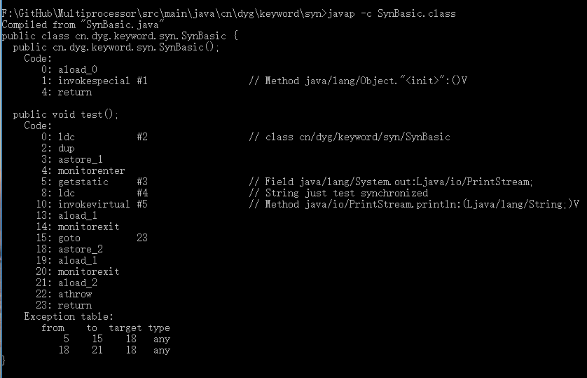
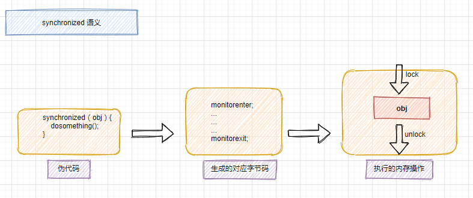
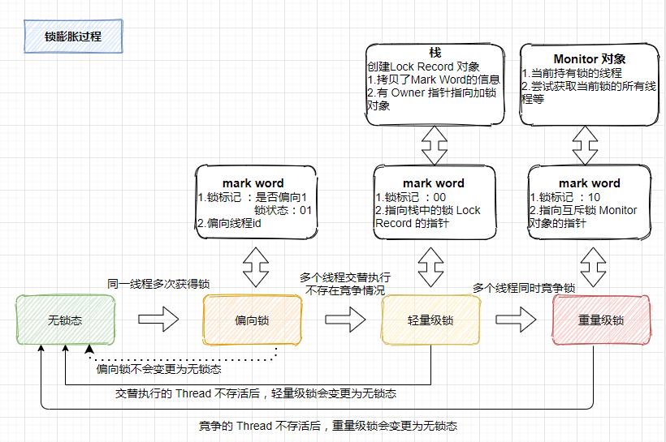
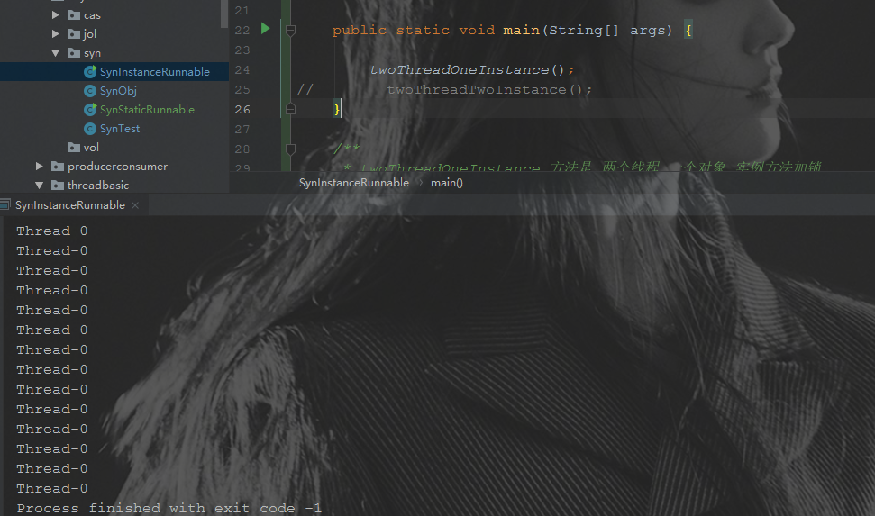

# 锁(一)：synchronized

## 1 synchronized是什么？

synchronized是Java的一个**实现线程同步的关键字**，它能够将**代码块(方法)锁起来**。

**随着学习的进行我们知道在JDK1.5之前synchronized是一个重量级锁，相对于j.u.c.Lock，它会显得那么笨重，以至于我们认为它不是那么的高效而慢慢摒弃它**。

不过，**随着Javs SE 1.6对synchronized进行的各种优化后，synchronized并不会显得那么重了**。

-  它使用起来是非常简单的，只要在代码块(方法)添加关键字synchronized，即可以**实现同步**的功能~

  ```java
  public synchronized void test(){
        //doSomething
  }
  ```

synchronized是一种**互斥锁**

- **一次只能允许一个线程进入被锁住的代码块**

synchronized是一种**内置锁/监视器锁**

- Java中**每个对象**都有一个**内置锁(监视器,也可以理解成锁标记)**，而synchronized就是使用**对象的内置锁(监视器)**来将代码块(方法)锁定的！ (锁的是对象，但我们同步的是方法/代码块)

## 2 synchronized的特性

#### 2.1 原子性

**所谓原子性就是指一个操作或者多个操作，要么全部执行并且执行的过程不会被任何因素打断，要么就都不执行。**

在Java中，对基本数据类型的变量的读取和赋值操作是原子性操作，即这些操作是不可被中断的，要么执行，要么不执行。但是像i++、i+=1等操作字符就不是原子性的，它们是分成**读取、计算、赋值**几步操作，原值在这些步骤还没完成时就可能已经被赋值了，那么最后赋值写入的数据就是脏数据，无法保证原子性。

被synchronized修饰的类或 对象的所有操作都是原子的，因为在执行操作之前必须先获得类或对象的锁，直到执行完才能释放，这中间的过程无法被中断（除了已经废弃的stop()方法），即保证了原子性。

**注意！面试时经常会问比较synchronized和volatile，它们俩特性上最大的区别就在于原子性，volatile不具备原子性。**

#### 2.2 可见性

**可见性是指多个线程访问一个资源时，该资源的状态、值信息等对于其他线程都是可见的。**

synchronized和volatile都具有可见性，其中synchronized对一个类或对象加锁时，一个线程如果要访问该类或对象必须先获得它的锁，而这个锁的状态对于其他任何线程都是可见的，并且在释放锁之前会将对变量的修改刷新到主存当中，保证资源变量的可见性，**如果某个线程占用了该锁，其他线程就必须在锁池中等待锁的释放**。

而volatile的实现类似，被volatile修饰的变量，**每当值需要修改时都会立即更新主存**，主存是共享的，所有线程可见，所以确保了其他线程读取到的变量永远是最新值，保证可见性。

#### 2.3 有序性

**有序性值程序执行的顺序按照代码先后执行。**

synchronized和volatile都具有有序性，Java允许编译器和处理器对指令进行重排，**但是指令重排并不会影响单线程的顺序，它影响的是多线程并发执行的顺序性**。synchronized保证了每个时刻都只有一个线程访问同步代码块，也就确定了线程执行同步代码块是分先后顺序的，保证了有序性。

#### 2.4 可重入性

**synchronized和ReentrantLock都是可重入锁**。当一个线程试图操作一个由其他线程持有的对象锁的临界资源时，将会处于阻塞状态，**但当一个线程再次请求自己持有对象锁的临界资源时，这种情况属于重入锁**。通俗一点讲就是说一个线程拥有了锁仍然还可以重复申请锁。

## 3 synchronized的原理

### 3.1 JVM中锁的实现细节

数据同步需要依赖锁，那锁的同步又依赖谁？**synchronized给出的答案是在软件层面依赖JVM，而j.u.c.Lock给出的答案是在硬件层面依赖特殊的CPU指令**。

在理解锁实现原理之前先了解一下Java的对象头和Monitor。

#### 3.1.1 对象头

在JVM中，对象是分成三部分存在的：对象头、实例数据、对齐填充。


实例数据和对齐填充与synchronized无关。

**实例数据**存放类的属性数据信息，包括父类的属性信息，如果是数组的实例部分还包括数组的长度，这部分内存按4字节对齐；

**对齐填充**不是必须部分，由于虚拟机要求对象起始地址必须是8字节的整数倍，对齐填充仅仅是为了使字节对齐。

其中对象头是要关注的内容，它是 synchronized 实现锁的基础，因为synchronized申请锁、上锁、释放锁都与对象头有关。对象头主要结构是由 `Mark Word` 和 `Class Metadata Address`组成，**其中**`Mark Word` 存储对象的hashCode、锁信息或分代年龄或GC标志等信息，`Class Metadata Address`**是类型指针指向对象的类元数据，JVM通过该指针确定该对象是哪个类的实例**。

锁也分不同状态，JDK6之前只有两个状态：无锁、有锁（重量级锁），而在JDK6之后对synchronized进行了优化，新增了两种状态，总共就是四个状态：**无锁状态、偏向锁、轻量级锁、重量级锁**，其中无锁就是一种状态了。锁的类型和状态在对象头`Mark Word`中都有记录，在申请锁、锁升级等过程中JVM都需要读取对象的`Mark Word`数据。

在64位JVM中对象头是这么存的：


详情可见参考内容：[从对象头来了解synchronize关键字里的偏向锁，轻量级锁，重量级锁](https://blog.csdn.net/fangjialue/article/details/98622166)

其中打印了对象的 hashcode 等，将对象头信息和计算出的 hashcode 值进行了对应。

有如下类：

```java
/**
 * SynBasic 类是 synchronized 基础类
 *
 * @author dongyinggang
 * @date 2021-03-03 11:04
 **/
public class SynBasic {

    /**
     * test 方法是 测试 synchronized 语义
     *
     * @author dongyinggang
     * @date 2021/3/3 11:06
     */
    private static void test() {
        synchronized ("synObj") {
            System.out.println("just test synchronized");
        }
    }
}
```

对这个类进行编译后查看字节码文件，步骤如下：

1. 在类的 java 文件所在目录下打开 cmd

2. 通过 javac 命令完成编译，生成对应的class文件，命令为：**javac -encoding UTF-8 SynBasic.java**
3. 通过 javap -c 命令查看生成的 class 文件对应的字节码，命令为：**javap -c SynBasic.class**

**ps：需要注意的是，private 类型的方法不能够被 javap -c 展示出来**

字节码内容如下：



可以看到第 4 、14 和 20 步分别进行了 monitorenter 和 monitorexit ，其中 14 和 20 步均为 monitorexit 的原因是，如果成功，在 14 步进行锁的释放后直接进行 15 步的 goto 跳转，会直接跳到 23 的return语句，结束掉整个方法，19 到 22 步则为编译器自动产生的异常处理器，会执行 monitorexit 和之前的 monitorenter 配对，保证能够正常的释放锁资源。

```java
  public void test();
    Code:
       0: ldc           #2                  // class cn/dyg/keyword/syn/SynBasic
       2: dup
       3: astore_1
       4: monitorenter											//申请获得对象的内置锁
       5: getstatic     #3                  
       8: ldc           #4                  // String just test synchronized
      10: invokevirtual #5                  
      13: aload_1
      14: monitorexit												//释放对象内置锁
      15: goto          23
      18: astore_2
      19: aload_1
      20: monitorexit												//释放对象内置锁
      21: aload_2
      22: athrow
      23: return
```

执行 monitorenter 和 monitorexit 操作，实际就是在对内存中的目标对象做 lock 和 unlock 操作，一旦执行了 lock 操作，其他线程就不再能获取到该对象的锁了。



#### 3.1.2 monitor

在 Java 的设计中，每一个对象在生成时，就带了一把看不见的锁，通常称之为“内部锁”，或者“Monitor 锁（监视器锁）”，或者“Intrinsic lock（内部锁）”。

JVM规范规定JVM基于进入和退出Monitor对象来实现方法同步和代码块同步，但两者的实现细节不一样。代码块同步是使用monitorenter和monitorexit指令实现，而方法同步是使用另外一种方式实现的，细节在JVM规范里并没有详细说明，但是方法的同步同样可以使用这两个指令来实现。

monitorenter指令是在编译后插入到同步代码块的开始位置，而monitorexit是插入到方法结束处和异常处， JVM要保证每个monitorenter必须有对应的monitorexit与之配对。任何对象都有一个 monitor 与之关联，当且一个monitor 被持有后，它将处于锁定状态。线程执行到 monitorenter 指令时，将会尝试获取对象所对应的 monitor 的所有权，即尝试获得对象的锁。

每一个锁都对应一个monitor对象，在HotSpot虚拟机中它是由ObjectMonitor实现的（C++实现）。每个对象都存在着一个monitor与之关联，对象与其monitor之间的关系有存在多种实现方式，如monitor可以与对象一起创建销毁或当线程试图获取对象锁时自动生成，但当一个monitor被某个线程持有后，它便处于锁定状态。


objectMonitor的构成如下：

```javascript
ObjectMonitor() {
    _header       = NULL;
    _count        = 0;  //锁计数器
    _waiters      = 0,  //等待线程数
    _recursions   = 0;  //线程的重入次数
    _object       = NULL; //监视器锁寄生的对象。锁不是平白出现的，而是寄托存储于对象中。
    _owner        = NULL; //锁的拥有者线程
    _WaitSet      = NULL; //处于wait状态的线程，会被加入到_WaitSet
    _WaitSetLock  = 0 ;
    _Responsible  = NULL ;
    _succ         = NULL ;
    _cxq          = NULL ; //多线程竞争锁进入时的单向链表
    FreeNext      = NULL ;
    _EntryList    = NULL ; //处于等待锁block状态的线程，会被加入到该列表
    _SpinFreq     = 0 ;
    _SpinClock    = 0 ;
    OwnerIsThread = 0 ;    // 监视器前一个拥有者线程的ID
  }
```

```java
ObjectMonitor 中有两个队列，_WaitSet 和 _EntryList，用来保存 ObjectWaiter 对象列表( 每个等待锁的线程都会被封装成 ObjectWaiter 对象)，_owner 指向持有 ObjectMonitor 对象的线程。

当多个线程同时访问一段同步代码时，首先会进入 _EntryList 集合，当线程获取到对象的 monitor 后进入 _owner 区域并把 monitor 中的 _owner 变量设置为当前线程同时 monitor 中的计数器 count 加1。

若线程调用 wait() 方法，将释放当前持有的 monitor，_owner 变量恢复为 null，_count 自减1，同时该线程进入 _WaitSet 集合中等待被唤醒。

若当前线程执行完毕也将释放 monitor (锁)并复位变量的值，以便其他线程进入获取 monitor(锁)。
```

竞争逻辑图大致如下：


### 3.2 JVM 对 synchronized 的优化

#### 3.2.1 锁膨胀

上面讲到锁有四种状态，并且会因实际情况进行膨胀升级，其膨胀方向是：**无锁——>偏向锁——>轻量级锁——>重量级锁**，并且膨胀方向不可逆。

**偏向锁**

一句话总结它的作用：**减少统一线程获取锁的代价**。在大多数情况下，锁不存在多线程竞争，总是由同一线程多次获得，那么此时就是偏向锁。

**在绝大多数的情况下，偏向锁是有效的，这是基于HotSpot作者发现的“大多数锁只会由同一线程并发申请”的经验规律**。但在 JDK 15 中，默认禁用了偏向锁，维护这套膨胀体系的成本让它逐渐走向弃用的结果。

核心思想：

如果一个线程获得了锁，那么锁就进入偏向模式，此时`Mark Word`的结构也就变为偏向锁结构，**当该线程再次请求锁时，无需再做任何同步操作，即获取锁的过程只需要检查**`Mark Word`**的锁标记位为偏向锁以及当前线程ID等于**`Mark Word`**的ThreadID即可**，这样就省去了大量有关锁申请的操作。

如果不相等，则会用 CAS 来尝试修改当前的线程 ID，如果 CAS 修改成功，那还能获取到锁，执行同步代码。

如果 CAS 失败了，说明存在竞争环境，此时会对偏向锁撤销，升级为轻量级锁。


**轻量级锁**

轻量级锁是由偏向锁升级而来，当存在第二个线程申请同一个锁对象时，偏向锁就会立即升级为轻量级锁。注意这里的第二个线程只是申请锁，不存在两个线程同时竞争锁，可以是一前一后地交替执行同步块。

在轻量级锁状态下，当前线程会在栈帧下创建 Lock Record，Lock Record 会把 Mark Word 的信息拷贝进去，且有个 Owner 指针指向加锁的对象。

线程执行到同步代码时，则用 CAS 视图将 Mark Word 的指向到线程栈帧的 Lock Record，假设 CAS 修改成功，则获取得到轻量级锁。

假设修改失败，则自旋（重试），自旋一定次数后，则升级为重量级锁。


**重量级锁**

重量级锁是由轻量级锁升级而来，当**同一时间**有多个线程竞争锁时，锁就会被升级成重量级锁，此时其申请锁带来的开销也就变大。

重量级锁一般使用场景会在追求吞吐量，同步块或者同步方法执行时间较长的场景。

**ps:只有在重量级锁的情况下，才会使用 Monitor 进行锁的实现。**

**膨胀过程**

膨胀过程示意图如下：



#### 3.2.2 锁消除

消除锁是虚拟机另外一种锁的优化，这种优化更彻底，在JIT编译时，对运行上下文进行扫描，去除不可能存在竞争的锁。比如下面代码，因为 object 没有逃逸出 synRemoveTest() 方法，任何调用该方法的地方都会生成一个新的 object 对象，因此不存在锁得竞争关系。JVM 就会将这里的加锁操作给优化掉。

JDK 8 默认开启了锁消除功能，如果想要取消的话，需要给 JVM 启动参数添加 -XX:-EliminateLocks

```java
/**
 * SynRemove 类是 锁消除,JDK 对 synchronized 的优化措施
 *
 * @author dongyinggang
 * @date 2021-03-04 15:17
 **/
@BenchmarkMode(Mode.AverageTime)
@OutputTimeUnit(TimeUnit.NANOSECONDS)
@Warmup(iterations = 5, time = 1, timeUnit = TimeUnit.SECONDS)
@Measurement(iterations = 10, time = 1, timeUnit = TimeUnit.SECONDS)
@Fork(1)
@Threads(2)
@State(Scope.Benchmark)
public class SynRemove {

    int x;

    public static void main(String[] args) throws RunnerException {
        Options options = new OptionsBuilder()
                .include(SynRemove.class.getSimpleName())
                .build();
        new Runner(options).run();
    }

    @Benchmark
    public void baseline() {
        x++;
    }

    /**
     * 虽然使用了 synchronized
     * 但由于 obj 是局部变量，每次调用都会是新的对象，
     * 因此实际会被优化，执行锁消除，和没有 synchronized 的代码效率一样高
     * 如果锁消除被关闭：则会慢很多,JVM参数增加 -XX:-EliminateLocks
     * 本测试结果是 10 倍数量级以上的差距
     */
    @Benchmark
    public void locked() {
        synchronized (new Object()) {
            x++;
        }
    }
}

```

测试结果如下：

- 默认开启锁消除的结果：

```java

Benchmark           Mode  Cnt  Score   Error  Units
SynRemove.baseline  avgt   10  3.683 ± 0.401  ns/op
SynRemove.locked    avgt   10  3.750 ± 0.219  ns/op
```

- 手动关闭锁消除的结果：

```
Benchmark           Mode  Cnt   Score   Error  Units
SynRemove.baseline  avgt   10   3.278 ± 0.177  ns/op
SynRemove.locked    avgt   10  54.827 ± 2.687  ns/op
```

测试得到的 locked 方法的差距是 10 倍数量级的，能够直观感受到 JVM 的锁消除的优化成果。

#### 3.2.3 锁粗化

锁粗化是虚拟机对另一种极端情况的优化处理，通过扩大锁的范围，避免反复加锁和释放锁。

JDK 8 中默认开启锁粗化配置，没有找到通过 JVM 参数进行禁用的方式。所以只能简单的测试一下多次获取锁和获取一次锁的效率区别。

测试代码：

```java
/**
 * LockCoarsening 类是 锁粗化技术
 *
 * @author dongyinggang
 * @date 2021-03-06 16:44
 **/
@BenchmarkMode(Mode.AverageTime)
@OutputTimeUnit(TimeUnit.NANOSECONDS)
@Warmup(iterations = 5, time = 1, timeUnit = TimeUnit.SECONDS)
@Measurement(iterations = 10, time = 1, timeUnit = TimeUnit.SECONDS)
@Fork(1)
@Threads(2)
@State(Scope.Benchmark)
public class LockCoarsening {

    public static void main(String[] args) throws RunnerException {
        Options options = new OptionsBuilder()
                .include(LockCoarsening.class.getSimpleName())
                .build();
        new Runner(options).run();
    }

    @Benchmark
    public static void coarsening() {
        Object object = new Object();
        int count = 0;
        for (int i = 0; i < 10000; i++) {
            synchronized (object) {
                count++;
            }
        }
    }

    @Benchmark
    public static void base() {
        Object object = new Object();
        int count = 0;
        synchronized (object) {
            for (int i = 0; i < 10000; i++) {
                count++;
            }
        }
    }
}

```

可以看到`base()`方法和`coarsening()`方法的耗时基本一致，并没有像预期中两种写法产生巨大的性能差异。（无论是否通过`-XX:-EliminateLocks`关闭锁消除防止锁被优化，对结果无明显区分）。

```cmd
Benchmark                  Mode  Cnt  Score   Error  Units
LockCoarsening.base        avgt   10  0.539 ± 0.052  ns/op
LockCoarsening.coarsening  avgt   10  0.565 ± 0.117  ns/op
```

## 4 synchronized的使用

synchronized一般可以用来修饰三种东西：

1.实例（普通）方法

2.静态方法

3.代码块（锁不一样的对象，或者类）

被加锁的方法和代码块均放在一个类中，用来支持演示各种锁的情形，其实例代码如下：

```java
package cn.dyg.keyword.syn;

/**
 * SynObj 类是 synchronized加锁对象
 * synchronized 是 Java 的一个关键字，它能够将代码块(方法)锁起来
 *
 * @author dongyinggang
 * @date 2020-12-09 13:12
 **/
public class SynObj {

    private final Object lock1 = new Object();
    private final Object lock2 = new Object();

    /**
     * staticMethod 给静态方法付加锁,锁的是SynObj类
     *
     * @author dongyinggang
     * @date 2020/12/9 13:11
     */
    public synchronized static void staticMethod(){
        while (true){
            System.out.println(Thread.currentThread().getName());
        }
    }

    /**
     * instanceMethod 方法是 给实例方法加synchronized锁
     * 给普通方法加锁，锁的是对象实例，多个实例时会出现并发问题
     *
     * @author dongyinggang
     * @date 2020/11/27 16:28
     */
    public synchronized void instanceMethod(){
        while (true){
            System.out.println(Thread.currentThread().getName());
        }
    }

    /**
     * synchronizedBlock 方法是 给代码块加synchronized锁
     * 如果是加this的话，实际与给实例方法加synchronized一样，都是锁了本类的实例
     *
     * @author dongyinggang
     * @date 2020/11/27 16:39
     */
    public synchronized void synchronizedBlock(){
        // 修饰代码块
        synchronized (this){
            while (true){
                System.out.println(Thread.currentThread().getName());
            }
        }
    }

    public synchronized void synchronizedBlockThis(){
        // 修饰代码块
        synchronized (this){
            while (true){
                System.out.println(Thread.currentThread().getName());
            }
        }
    }

    /**
     * synchronizedBlockObj1 和 synchronizedBlockObj1 方法是 两个方法分别锁不同的对象
     * 这样对两个对象分别加锁，实际上是互不影响的，可以分别执行，不会阻塞另一个线程
     *
     * @author dongyinggang
     * @date 2020/12/9 19:41
     */
    public void synchronizedBlockObj1(){
        // 修饰代码块
        synchronized (lock1){
            while (true){
                System.out.println(Thread.currentThread().getName());
            }
        }
    }

    public void synchronizedBlockObj2(){
        // 修饰代码块
        synchronized (lock2){
            while (true){
                System.out.println(Thread.currentThread().getName());
            }
        }
    }
}

```

### 4.1 同步实例方法

修饰实例方法时，锁的是对象实例，锁一个对象实例的时候可以达到锁的目的，但多个实例时会出现并发问题。看一下示例代码：

```java
/**
 * SynInstanceRunnable 类是 锁实例方法
 *
 * @author dongyinggang
 * @date 2020-12-09 18:17
 **/
public class SynInstanceRunnable implements Runnable {

    private SynObj synObj;

    public SynInstanceRunnable(SynObj synObj){
        this.synObj = synObj;
    }

    @Override
    public void run() {
        synObj.instanceMethod();
    }

    public static void main(String[] args) {

//        twoThreadOneInstance();
        twoThreadTwoInstance();
    }

    /**
     * twoThreadOneInstance 方法是 两个线程,一个对象,实例方法加锁
     * 可以看到此时的输出全是一个线程名称，没有输出第二个线程的名字。
     * 对普通方法加synchronized关键字，锁的是对象，如果两个线程都使用同一个对象来生成线程，
     * 那么就出现了第二个启动的线程始终在等待第一个线程结束的情况。
     * Spring中默认是单例模式的，因此方法的锁能够起到相应的作用
     *
     * @author dongyinggang
     * @date 2020/12/9 18:40
     */
    private static void twoThreadOneInstance()  {
        SynObj synObj = new SynObj();

        //两个线程同一个对象
        Thread thread1 = new Thread(new SynInstanceRunnable(synObj));
        Thread thread2 = new Thread(new SynInstanceRunnable(synObj));
        thread1.start();
        thread2.start();
    }

    /**
     * twoThreadTwoInstance 方法是 两个线程，两个对象，实例方法加锁
     * 两个线程交替输出，没有达到锁住方法的目的
     *
     * @author dongyinggang
     * @date 2020/12/9 18:50
     */
    private static void twoThreadTwoInstance() {
        SynObj synObj1 = new SynObj();
        SynObj synObj2 = new SynObj();

        //两个线程两个对象
        Thread thread1 = new Thread(new SynInstanceRunnable(synObj1));
        Thread thread2 = new Thread(new SynInstanceRunnable(synObj2));
        thread1.start();
        thread2.start();
    }
}
```

如果是锁的同一个对象，那执行顺序实际是串行的，以twoThreadOneInstance()的例子为例，由于调用的加锁方法实际是一个死循环，输出始终是第一个线程的名称，第二个线程名称并不会被输出。Spring管理的对象是单例模式的，因此方法的锁能够起到相应的作用。



如果是两个线程，对应两个对象，就会出现锁不能达到预期目的的情况，示例代码为上面的twoThreadTwoInstance()方法,调用后的输出是两个线程名称交替的。


### 4.2 同步静态方法

当使用synchronized修饰静态方法时，锁的是类，而非对象， 此时任何尽管我们写了让两个线程分别去获取一个对象实例进行方法调用，也始终是只有第一个线程在执行，第二个线程始终无法获取到锁来进行输出。

示例代码如下：

```java
package cn.dyg.keyword.syn;

/**
 * SynStaticRunnable 类是 锁静态方法
 *
 * @author dongyinggang
 * @date 2020-12-09 19:35
 **/
public class SynStaticRunnable implements Runnable {

    private SynObj synObj;

    public SynStaticRunnable(SynObj synObj){
        this.synObj = synObj;
    }

    @Override
    public void run() {
        //调用加锁的静态方法
        SynObj.staticMethod();
    }

    public static void main(String[] args) {
        twoThreadTwoInstance();
        //其他方法依然可以正常调用。
        doSomething();
    }

    /**
     * twoThreadTwoInstance 方法是 两个线程，两个对象，静态方法加锁
     * 虽然是两个对象，但是实际锁静态方法时锁的是类，因此先执行的线程会阻塞其他线程
     *
     * @author dongyinggang
     * @date 2020/12/9 18:50
     */
    private static void twoThreadTwoInstance() {
        SynObj synObj1 = new SynObj();
        SynObj synObj2 = new SynObj();

        //两个线程两个对象
        Thread thread1 = new Thread(new SynStaticRunnable(synObj1));
        Thread thread2 = new Thread(new SynStaticRunnable(synObj2));
        thread1.start();
        thread2.start();
    }

    private static void doSomething(){
        while(true){
            System.out.println("其他方法可以被调用");
        }
    }
}
```

但注意的是，尽管我们说这种情况下锁的是类，但要明确，该类的其他方法是可以被正常调用的。


如果使用实例来调用静态方法,编译器会提示但运行不会报错。输出和上面的一致。我们每次都是起了两个线程，在我们没有指定名称的情况下，两个线程名称分别为Thread-0和Thread-1，每次输出的名称只有一个，但并不是固定的，哪个资源先获取到了锁，就会死死抱住不放开。

### 4.3 同步一个代码块

锁代码块的情况相对要复杂一点点，这里主要看四种情况：

1. 两个线程，一个对象，代码块加锁，锁 this 对象
2. 两个线程，两个对象，代码块加锁，锁 this 对象
3. 两个线程，一个对象，两个方法分别锁 this 对象

4. 两个线程，一个对象的两个实例方法，锁了不同的Object

首先，这次实现Runnable接口的对象如下：

```java
public class SynBlockRunnable implements Runnable {

    private SynObj synObj;

    public SynBlockRunnable(SynObj synObj){
        this.synObj = synObj;
    }

    @Override
    public void run() {
        synObj.synchronizedBlock();
    }
}
```

#### 4.3.1 两个线程，一个对象，代码块加锁，锁 this 对象

这种情况下，和 4.1 中修饰实例方法是一样的，两个线程实际是在争夺对象 synObj 的资源，哪个线程竞争到了,就可以进入死循环,不断输出自己的线程名，另一个线程由于始终不能够获取到锁，因此一直被阻塞，无法输出任何内容。

```java
/**
 * twoThreadOneInstance 方法是 两个线程,一个对象,代码块加锁,锁 this 对象
 * 这种方式和锁实例方法是一样的,两个线程实际是在争夺对象 synObj 的资源,
 * 哪个线程竞争到了,就可以进入死循环,不断输出自己的线程名
 *
 * @author dongyinggang
 * @date 2020/12/9 20:23
 */
private static void twoThreadOneInstance() {
    SynObj synObj = new SynObj();

    //两个线程
    Thread thread1 = new Thread(new SynBlockRunnable(synObj));
    Thread thread2 = new Thread(new SynBlockRunnable(synObj));
    thread1.start();
    thread2.start();
}
```

#### 4.3.2 两个线程，两个对象，代码块加锁，锁 this 对象

这种方式和锁实例方法是一样的,锁 this 锁得是一个实例,因此,当我们两个线程传入的是不同对象的情况下,两个线程实际是都获得了自己对象的资源，都能够进行自己名字的输出。对应的控制台输出就是交替的。

```java
	 /**
     * twoThreadTwoInstance 方法是 两个线程，两个对象，代码块加锁,锁 this 对象
     * 这种方式和锁实例方法是一样的,锁 this 锁得是一个实例,
     * 因此,当我们两个线程传入的是不同对象的情况下,
     * 两个线程实际是都获得了自己对象的资源，都能够进行自己名字的输出
     *
     * @author dongyinggang
     * @date 2020/12/9 18:50
     */
    private static void twoThreadTwoInstance() {
        SynObj synObj1 = new SynObj();
        SynObj synObj2 = new SynObj();

        //两个线程两个对象
        Thread thread1 = new Thread(new SynBlockRunnable(synObj1));
        Thread thread2 = new Thread(new SynBlockRunnable(synObj2));
        thread1.start();
        thread2.start();
    }
```

#### 4.3.3 两个线程，一个对象，两个方法分别锁了this

尽管两个线程分别调用了一个对象的不同方法，但由于锁的资源是一样的，因此只要有一方获得了资源，那么另一方就失去了执行对应方法的先决条件，就会陷入阻塞，不能够执行。

```java
/**
 * twoThreadSynThis 方法是 两个线程，一个对象，两个方法分别锁了this
 * 两个线程看似调用了 SynObj 的两个不同实例方法,实例方法中都存在锁,并且都锁了this
 * 两个线程实际都在竞争实例的资源,谁竞争到了,就一直执行,另一个虽然是调用了不同方法,
 * 但由于始终获取不到锁,所以就无法执行
 * 如果这里是两个对象了，虽然都锁了this，但实际此this非彼this，两者会互不影响
 *
 * @author dongyinggang
 * @date 2020/12/9 20:29
 */
private static void twoThreadSynThis() {
    SynObj synObj = new SynObj();

    //两个线程个对象
    Thread thread1 = new Thread(new SynBlockRunnable(synObj));
    Thread thread2 = new Thread(()->synObj.synchronizedBlockThis());
    thread1.start();
    thread2.start();
}
```

#### 4.3.4 两个线程,一个对象的两个实例方法,锁了不同的Object

两个线程，分别调用一个对象的不同方法，两个方法分别锁了对象 lock1 和 lock2，两人执行的先决条件不同且可以同时满足，因此互不影响，交替执行。

```java
/**
 * twoThreadSynTwoObj 方法是 两个线程,一个对象的两个实例方法,锁了不同的Object
 * 此时,由于两个方法分别锁了lock1 和 lock2 ,是互不干扰的,因此可以同时被调用
 *
 * @author dongyinggang
 * @date 2020/12/9 20:36
 */
private static void twoThreadSynTwoObj(){
    SynObj synObj = new SynObj();
    Thread thread1 = new Thread(()->synObj.synchronizedBlockObj1());
    Thread thread2 = new Thread(()->synObj.synchronizedBlockObj2());
    thread1.start();
    thread2.start();
}
```

### 4.4 同步一个类

当 synchronized 锁代码块的时候，除了直接锁对象的形式外，还可以锁类时，形如 synchronized(Object.class), 这样的锁和修饰静态方法比较像，作用于整个类。

也就是说两个线程调用同一个类的不同对象上的这种同步语句，也会进行同步。因为只能有一个线程持有这个类的资源。

示例代码如下：

```java
/**
 * SynClass 类是 锁一个类
 *
 * @author dongyinggang
 * @date 2021-02-22 09:01
 **/
public class SynClass {

    /**
     * synClass 方法是 使用synchronized同步一个类
     * 作用于整个类，也就是说两个线程调用同一个类的不同对象上的这种同步语句，也会进行同步。
     * 某个线程竞争到类锁后，其他线程就不能执行了，必须等待目标线程释放
     *
     * @author dongyinggang
     * @date 2021/2/22 9:54
     */
    private void synClass() {
        synchronized (SynClass.class) {
            for (int i = 0; i < 5; i++) {
                System.out.println(Thread.currentThread().getName() + " synClass 运行中");
                try {
                    Thread.sleep(1000);
                } catch (InterruptedException e) {
                    e.printStackTrace();
                }
            }
            System.out.println(Thread.currentThread().getName() + "当前线程执行完毕");
        }
    }

    public static void main(String[] args) {
        SynClass synClass1 = new SynClass();
        SynClass synClass2 = new SynClass();
        //创建一个线程池
        ExecutorService executorService = ThreadUtil.buildThreadExecutor(2);
        //始终是一个线程在执行,sleep时不释放锁,所以始终是一个线程在执行
        executorService.execute(synClass1::synClass);
        executorService.execute(synClass2::synClass);
        //执行完毕后,终止线程池,如果不执行,则进程不会结束
        executorService.shutdown();
        System.out.println("主线程执行完毕");
    }

}
```

执行结果如下：


1. 声明两个SynClass对象，分别是 synClass1 和 synClass2 。

2. 通过线程池创建两个线程，分别是 test-t1 和 test-t2 ，分别调用第1步中声名的 synClass1 和 synClass2 的 synClass() 方法
3. 由于通过 synchronized 对 SynClass.class 进行加锁，锁了类，因此只有当首先获取到 SynClass 类资源的线程执行完毕后，另一个线程才能够获取到  SynClass 类资源进行执行。
4. 执行完毕后，关闭线程池，进程结束。

## 参考内容

【1】[synchronized到底锁住的是谁？](https://www.cnblogs.com/yulinfeng/p/11020576.html)

【2】三歪整理的多线程知识

【3】[Java 并发](https://github.com/CyC2018/CS-Notes/blob/master/notes/Java%20%E5%B9%B6%E5%8F%91.md#synchronized)

【4】[深入理解synchronized底层原理，一篇文章就够了！](https://cloud.tencent.com/developer/article/1465413)

【5】[深入分析Synchronized原理](https://www.cnblogs.com/1013wang/p/11806019.html)

【6】[通过一个故事理解可重入锁的机制](https://www.cnblogs.com/gxyandwmm/p/9387833.html)

【7】[关于Monitor对象在sychronized实现中的应用](https://blog.csdn.net/super_x_man/article/details/81741073)

【8】[JDK15 默认关闭偏向锁优化原因](https://blog.csdn.net/xiaoy990/article/details/112893646)

【9】[从对象头来了解synchronize关键字里的偏向锁，轻量级锁，重量级锁](https://blog.csdn.net/fangjialue/article/details/98622166)

【10】[Java锁的膨胀过程以及一致性哈希对锁膨胀的影响](https://blog.csdn.net/qq_32099833/article/details/104506461)