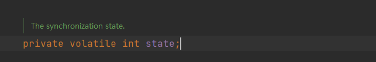
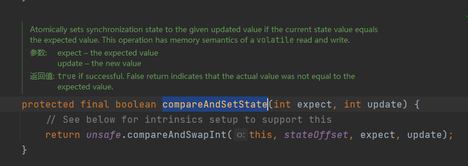

# 锁（二）：Lock

## 1 Lock 锁是什么

Lock显式锁是JDK1.5之后才有的，之前我们都是使用Synchronized锁来使线程安全的。

Lock显式锁是一个接口，比较常见的实现类 ReentrantLock 和 ReentrantReadWriteLock，在 Lock锁刚出来时，在性能方面比 Synchronized 锁要好很多，但在 JDK 1.6 中，对 `Synchronized `锁进行了大量的优化，包括自旋锁、锁消除、锁粗化、轻量级锁、偏向锁等。

**因此，性能差距已经不是很大了，又因为 lock 锁需要显式的进行锁和释放，所以绝大部分时候我们都会选择 Synchronized 锁而非 Lock 锁。**

那为什么还需要Lock呢？

lock可以中断

## 2 核心类：AQS

**juc 包 (java.util.concurrnt)** 中有一个抽象类 **AbstractQueuedSynchronizer简称为AQS**，这个类就是 lock 锁实现的基础。

- AQS其实就是一个可以给我们实现锁的**框架**
- 内部实现的关键是：先进先出的队列、state状态
- 定义了内部类ConditionObject
-  拥有两种线程模式
  - 独占模式
  - 共享模式

- 在LOCK包中的相关锁(常用的有ReentrantLock、 ReadWriteLock)都是**基于AQS来构建**

一般我们**叫AQS为同步器**

### 2.1 AQS的同步状态

通过volatile修饰，保证了可见性。

修改state状态值时使用CAS算法来实现：

原子性方式修改state值，CAS算法实现。

### 2.2 先进先出队列

CLH队列（Craig，Landin，and Hagersten），是一个双向队列。

## 参考内容

【1】[通过一个故事理解可重入锁的机制](https://www.cnblogs.com/gxyandwmm/p/9387833.html)

【2】[可重入锁详解（什么是可重入）](https://blog.csdn.net/w8y56f/article/details/89554060)

【3】[浅谈偏向锁、轻量级锁、重量级锁](https://www.jianshu.com/p/36eedeb3f912)

【4】[Java轻量级锁原理详解(Lightweight Locking)](https://blog.csdn.net/qq_35124535/article/details/70312553)