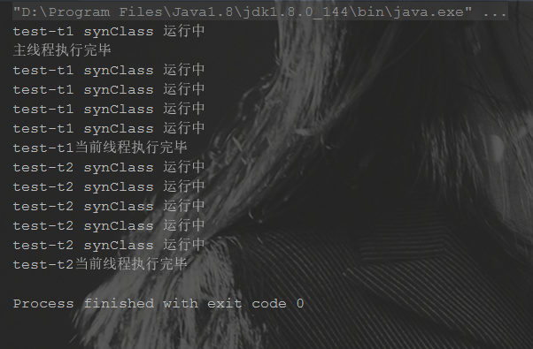

# 锁(一)：synchronized锁

[toc]

## 1 synchronized锁是什么？

synchronized是Java的一个**关键字**，它能够将**代码块(方法)锁起来**

-  它使用起来是非常简单的，只要在代码块(方法)添加关键字synchronized，即可以**实现同步**的功能~

  ```java
public synchronized void test(){
        //doSomething
}
  ```

synchronized是一种**互斥锁**

- **一次只能允许一个线程进入被锁住的代码块**

synchronized是一种**内置锁/监视器锁**

- Java中**每个对象**都有一个**内置锁(监视器,也可以理解成锁标记)**，而synchronized就是使用**对象的内置锁(监视器)**来将代码块(方法)锁定的！ (锁的是对象，但我们同步的是方法/代码块)

## 2 synchronized用处是什么？

•       synchronized保证了线程的**原子性**。(被保护的代码块是一次被执行的，没有任何线程会同时访问)

•       synchronized还保证了**可见性**。(当执行完synchronized之后，修改后的变量对其他的线程是可见的)

Java中的synchronized，通过使用内置锁，来实现对变量的同步操作，进而实现了**对变量操作的原子性和其他线程对变量的可见性**，从而确保了并发情况下的线程安全。

## 3 synchronized的原理


## 4 synchronized的使用

synchronized一般可以用来修饰三种东西：

1.实例（普通）方法

2.静态方法

3.代码块（锁不一样的对象，或者类）

被加锁的方法和代码块均放在一个类中，用来支持演示各种锁的情形，其实例代码如下：

```java
package cn.dyg.keyword.syn;

/**
 * SynObj 类是 synchronized加锁对象
 * synchronized 是 Java 的一个关键字，它能够将代码块(方法)锁起来
 *
 * @author dongyinggang
 * @date 2020-12-09 13:12
 **/
public class SynObj {

    private final Object lock1 = new Object();
    private final Object lock2 = new Object();

    /**
     * staticMethod 给静态方法付加锁,锁的是SynObj类
     *
     * @author dongyinggang
     * @date 2020/12/9 13:11
     */
    public synchronized static void staticMethod(){
        while (true){
            System.out.println(Thread.currentThread().getName());
        }
    }

    /**
     * instanceMethod 方法是 给实例方法加synchronized锁
     * 给普通方法加锁，锁的是对象实例，多个实例时会出现并发问题
     *
     * @author dongyinggang
     * @date 2020/11/27 16:28
     */
    public synchronized void instanceMethod(){
        while (true){
            System.out.println(Thread.currentThread().getName());
        }
    }

    /**
     * synchronizedBlock 方法是 给代码块加synchronized锁
     * 如果是加this的话，实际与给实例方法加synchronized一样，都是锁了本类的实例
     *
     * @author dongyinggang
     * @date 2020/11/27 16:39
     */
    public synchronized void synchronizedBlock(){
        // 修饰代码块
        synchronized (this){
            while (true){
                System.out.println(Thread.currentThread().getName());
            }
        }
    }

    public synchronized void synchronizedBlockThis(){
        // 修饰代码块
        synchronized (this){
            while (true){
                System.out.println(Thread.currentThread().getName());
            }
        }
    }

    /**
     * synchronizedBlockObj1 和 synchronizedBlockObj1 方法是 两个方法分别锁不同的对象
     * 这样对两个对象分别加锁，实际上是互不影响的，可以分别执行，不会阻塞另一个线程
     *
     * @author dongyinggang
     * @date 2020/12/9 19:41
     */
    public void synchronizedBlockObj1(){
        // 修饰代码块
        synchronized (lock1){
            while (true){
                System.out.println(Thread.currentThread().getName());
            }
        }
    }

    public void synchronizedBlockObj2(){
        // 修饰代码块
        synchronized (lock2){
            while (true){
                System.out.println(Thread.currentThread().getName());
            }
        }
    }
}

```

### 4.1 同步实例方法

修饰实例方法时，锁的是对象实例，锁一个对象实例的时候可以达到锁的目的，但多个实例时会出现并发问题。看一下示例代码：

```java
/**
 * SynInstanceRunnable 类是 锁实例方法
 *
 * @author dongyinggang
 * @date 2020-12-09 18:17
 **/
public class SynInstanceRunnable implements Runnable {

    private SynObj synObj;

    public SynInstanceRunnable(SynObj synObj){
        this.synObj = synObj;
    }

    @Override
    public void run() {
        synObj.instanceMethod();
    }

    public static void main(String[] args) {

//        twoThreadOneInstance();
        twoThreadTwoInstance();
    }

    /**
     * twoThreadOneInstance 方法是 两个线程,一个对象,实例方法加锁
     * 可以看到此时的输出全是一个线程名称，没有输出第二个线程的名字。
     * 对普通方法加synchronized关键字，锁的是对象，如果两个线程都使用同一个对象来生成线程，
     * 那么就出现了第二个启动的线程始终在等待第一个线程结束的情况。
     * Spring中默认是单例模式的，因此方法的锁能够起到相应的作用
     *
     * @author dongyinggang
     * @date 2020/12/9 18:40
     */
    private static void twoThreadOneInstance()  {
        SynObj synObj = new SynObj();

        //两个线程同一个对象
        Thread thread1 = new Thread(new SynInstanceRunnable(synObj));
        Thread thread2 = new Thread(new SynInstanceRunnable(synObj));
        thread1.start();
        thread2.start();
    }

    /**
     * twoThreadTwoInstance 方法是 两个线程，两个对象，实例方法加锁
     * 两个线程交替输出，没有达到锁住方法的目的
     *
     * @author dongyinggang
     * @date 2020/12/9 18:50
     */
    private static void twoThreadTwoInstance() {
        SynObj synObj1 = new SynObj();
        SynObj synObj2 = new SynObj();

        //两个线程两个对象
        Thread thread1 = new Thread(new SynInstanceRunnable(synObj1));
        Thread thread2 = new Thread(new SynInstanceRunnable(synObj2));
        thread1.start();
        thread2.start();
    }
}
```

如果是锁的同一个对象，那执行顺序实际是串行的，以twoThreadOneInstance()的例子为例，由于调用的加锁方法实际是一个死循环，输出始终是第一个线程的名称，第二个线程名称并不会被输出。Spring管理的对象是单例模式的，因此方法的锁能够起到相应的作用。


如果是两个线程，对应两个对象，就会出现锁不能达到预期目的的情况，示例代码为上面的twoThreadTwoInstance()方法,调用后的输出是两个线程名称交替的。


### 4.2 同步静态方法

当使用synchronized修饰静态方法时，锁的是类，而非对象， 此时任何尽管我们写了让两个线程分别去获取一个对象实例进行方法调用，也始终是只有第一个线程在执行，第二个线程始终无法获取到锁来进行输出。

示例代码如下：

```java
package cn.dyg.keyword.syn;

/**
 * SynStaticRunnable 类是 锁静态方法
 *
 * @author dongyinggang
 * @date 2020-12-09 19:35
 **/
public class SynStaticRunnable implements Runnable {

    private SynObj synObj;

    public SynStaticRunnable(SynObj synObj){
        this.synObj = synObj;
    }

    @Override
    public void run() {
        //调用加锁的静态方法
        SynObj.staticMethod();
    }

    public static void main(String[] args) {
        twoThreadTwoInstance();
        //其他方法依然可以正常调用。
        doSomething();
    }

    /**
     * twoThreadTwoInstance 方法是 两个线程，两个对象，静态方法加锁
     * 虽然是两个对象，但是实际锁静态方法时锁的是类，因此先执行的线程会阻塞其他线程
     *
     * @author dongyinggang
     * @date 2020/12/9 18:50
     */
    private static void twoThreadTwoInstance() {
        SynObj synObj1 = new SynObj();
        SynObj synObj2 = new SynObj();

        //两个线程两个对象
        Thread thread1 = new Thread(new SynStaticRunnable(synObj1));
        Thread thread2 = new Thread(new SynStaticRunnable(synObj2));
        thread1.start();
        thread2.start();
    }

    private static void doSomething(){
        while(true){
            System.out.println("其他方法可以被调用");
        }
    }
}
```

但注意的是，尽管我们说这种情况下锁的是类，但要明确，该类的其他方法是可以被正常调用的。


如果使用实例来调用静态方法,编译器会提示但运行不会报错。输出和上面的一致。我们每次都是起了两个线程，在我们没有指定名称的情况下，两个线程名称分别为Thread-0和Thread-1，每次输出的名称只有一个，但并不是固定的，哪个资源先获取到了锁，就会死死抱住不放开。

### 4.3 同步一个代码块

锁代码块的情况相对要复杂一点点，这里主要看四种情况：

1. 两个线程，一个对象，代码块加锁，锁 this 对象
2. 两个线程，两个对象，代码块加锁，锁 this 对象
3. 两个线程，一个对象，两个方法分别锁 this 对象

4. 两个线程，一个对象的两个实例方法，锁了不同的Object

首先，这次实现Runnable接口的对象如下：

```java
public class SynBlockRunnable implements Runnable {

    private SynObj synObj;

    public SynBlockRunnable(SynObj synObj){
        this.synObj = synObj;
    }

    @Override
    public void run() {
        synObj.synchronizedBlock();
    }
}
```

#### 4.3.1 两个线程，一个对象，代码块加锁，锁 this 对象

这种情况下，和 4.1 中修饰实例方法是一样的，两个线程实际是在争夺对象 synObj 的资源，哪个线程竞争到了,就可以进入死循环,不断输出自己的线程名，另一个线程由于始终不能够获取到锁，因此一直被阻塞，无法输出任何内容。

```java
/**
 * twoThreadOneInstance 方法是 两个线程,一个对象,代码块加锁,锁 this 对象
 * 这种方式和锁实例方法是一样的,两个线程实际是在争夺对象 synObj 的资源,
 * 哪个线程竞争到了,就可以进入死循环,不断输出自己的线程名
 *
 * @author dongyinggang
 * @date 2020/12/9 20:23
 */
private static void twoThreadOneInstance() {
    SynObj synObj = new SynObj();

    //两个线程
    Thread thread1 = new Thread(new SynBlockRunnable(synObj));
    Thread thread2 = new Thread(new SynBlockRunnable(synObj));
    thread1.start();
    thread2.start();
}
```

#### 4.3.2 两个线程，两个对象，代码块加锁，锁 this 对象

这种方式和锁实例方法是一样的,锁 this 锁得是一个实例,因此,当我们两个线程传入的是不同对象的情况下,两个线程实际是都获得了自己对象的资源，都能够进行自己名字的输出。对应的控制台输出就是交替的。

```java
	 /**
     * twoThreadTwoInstance 方法是 两个线程，两个对象，代码块加锁,锁 this 对象
     * 这种方式和锁实例方法是一样的,锁 this 锁得是一个实例,
     * 因此,当我们两个线程传入的是不同对象的情况下,
     * 两个线程实际是都获得了自己对象的资源，都能够进行自己名字的输出
     *
     * @author dongyinggang
     * @date 2020/12/9 18:50
     */
    private static void twoThreadTwoInstance() {
        SynObj synObj1 = new SynObj();
        SynObj synObj2 = new SynObj();

        //两个线程两个对象
        Thread thread1 = new Thread(new SynBlockRunnable(synObj1));
        Thread thread2 = new Thread(new SynBlockRunnable(synObj2));
        thread1.start();
        thread2.start();
    }
```

#### 4.3.3 两个线程，一个对象，两个方法分别锁了this

尽管两个线程分别调用了一个对象的不同方法，但由于锁的资源是一样的，因此只要有一方获得了资源，那么另一方就失去了执行对应方法的先决条件，就会陷入阻塞，不能够执行。

```java
/**
 * twoThreadSynThis 方法是 两个线程，一个对象，两个方法分别锁了this
 * 两个线程看似调用了 SynObj 的两个不同实例方法,实例方法中都存在锁,并且都锁了this
 * 两个线程实际都在竞争实例的资源,谁竞争到了,就一直执行,另一个虽然是调用了不同方法,
 * 但由于始终获取不到锁,所以就无法执行
 * 如果这里是两个对象了，虽然都锁了this，但实际此this非彼this，两者会互不影响
 *
 * @author dongyinggang
 * @date 2020/12/9 20:29
 */
private static void twoThreadSynThis() {
    SynObj synObj = new SynObj();

    //两个线程个对象
    Thread thread1 = new Thread(new SynBlockRunnable(synObj));
    Thread thread2 = new Thread(()->synObj.synchronizedBlockThis());
    thread1.start();
    thread2.start();
}
```

#### 4.3.4 两个线程,一个对象的两个实例方法,锁了不同的Object

两个线程，分别调用一个对象的不同方法，两个方法分别锁了对象 lock1 和 lock2，两人执行的先决条件不同且可以同时满足，因此互不影响，交替执行。

```java
/**
 * twoThreadSynTwoObj 方法是 两个线程,一个对象的两个实例方法,锁了不同的Object
 * 此时,由于两个方法分别锁了lock1 和 lock2 ,是互不干扰的,因此可以同时被调用
 *
 * @author dongyinggang
 * @date 2020/12/9 20:36
 */
private static void twoThreadSynTwoObj(){
    SynObj synObj = new SynObj();
    Thread thread1 = new Thread(()->synObj.synchronizedBlockObj1());
    Thread thread2 = new Thread(()->synObj.synchronizedBlockObj2());
    thread1.start();
    thread2.start();
}
```

### 4.4 同步一个类

当 synchronized 锁代码块的时候，除了直接锁对象的形式外，还可以锁类时，形如 synchronized(Object.class), 这样的锁和修饰静态方法比较像，作用于整个类。

也就是说两个线程调用同一个类的不同对象上的这种同步语句，也会进行同步。因为只能有一个线程持有这个类的资源。

示例代码如下：

```java
/**
 * SynClass 类是 锁一个类
 *
 * @author dongyinggang
 * @date 2021-02-22 09:01
 **/
public class SynClass {

    /**
     * synClass 方法是 使用synchronized同步一个类
     * 作用于整个类，也就是说两个线程调用同一个类的不同对象上的这种同步语句，也会进行同步。
     * 某个线程竞争到类锁后，其他线程就不能执行了，必须等待目标线程释放
     *
     * @author dongyinggang
     * @date 2021/2/22 9:54
     */
    private void synClass() {
        synchronized (SynClass.class) {
            for (int i = 0; i < 5; i++) {
                System.out.println(Thread.currentThread().getName() + " synClass 运行中");
                try {
                    Thread.sleep(1000);
                } catch (InterruptedException e) {
                    e.printStackTrace();
                }
            }
            System.out.println(Thread.currentThread().getName() + "当前线程执行完毕");
        }
    }

    public static void main(String[] args) {
        SynClass synClass1 = new SynClass();
        SynClass synClass2 = new SynClass();
        //创建一个线程池
        ExecutorService executorService = ThreadUtil.buildThreadExecutor(2);
        //始终是一个线程在执行,sleep时不释放锁,所以始终是一个线程在执行
        executorService.execute(synClass1::synClass);
        executorService.execute(synClass2::synClass);
        //执行完毕后,终止线程池,如果不执行,则进程不会结束
        executorService.shutdown();
        System.out.println("主线程执行完毕");
    }

}
```

执行结果如下：



1. 声明两个SynClass对象，分别是 synClass1 和 synClass2 。

2. 通过线程池创建两个线程，分别是 test-t1 和 test-t2 ，分别调用第1步中声名的 synClass1 和 synClass2 的 synClass() 方法
3. 由于通过 synchronized 对 SynClass.class 进行加锁，锁了类，因此只有当首先获取到 SynClass 类资源的线程执行完毕后，另一个线程才能够获取到  SynClass 类资源进行执行。
4. 执行完毕后，关闭线程池，进程结束。

## 参考内容

【1】[synchronized到底锁住的是谁？](https://www.cnblogs.com/yulinfeng/p/11020576.html)

【2】三歪整理的多线程知识

【3】[Java 并发](https://github.com/CyC2018/CS-Notes/blob/master/notes/Java%20%E5%B9%B6%E5%8F%91.md#synchronized)

