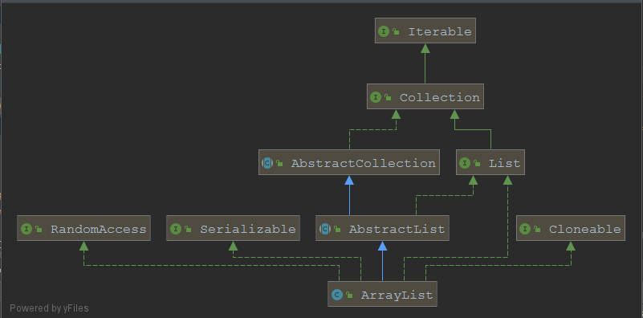
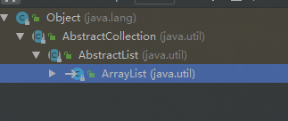

# 【java集合总结】——ArryList的核心源码解析

## 前言

> ArryList是开发过程中的常用类，鉴于加深对其理解的自身需求，进行其源码的分析，因日常使用JDK8作为项目开发工具，因此也以JDK8为例进行源码的解读。
>
> 
>
> 个人理解浅薄，欢迎交流指正。

## 一、ArrayList概述

1. ArrayList是可以**动态增长和缩减的索引序列，它是基于数组实现的List类**。

2. 该类封装了一个动态再分配的Object[]数组，每一个类对象都有一个capacity属性，表示它们所封装的Object[]数组的长度，当向ArrayList中添加元素时，该属性值会**自动增加**。

3. 如果想ArrayList中添加大量元素，可使用ensureCapacity方法一次性增加capacity，可以减少增加重分配的次数提高性能。

4. ArrayList的用法和Vector向类似，但是Vector是一个较老的集合，具有很多缺点，不建议使用。另外，ArrayList和Vector的区别是：**ArrayList是线程不安全的**，当多条线程访问同一个ArrayList集合时，程序需要手动保证该集合的同步性，而Vector则是线程安全的。

5. 继承关系图

   

   


## 二、源码解析

### 2.1 继承结构和层次关系



```java
public class ArrayList<E> extends AbstractList<E>
        implements List<E>, RandomAccess, Cloneable, java.io.Serializable
```

分析：

1. 结合类图和继承结构可以看到，ArrayList和其父类AbstractList同时继承了List接口，原因是父类AbstractList中实现了一些通用的方法，ArrayList继承之后只需要重写自己和父类有区别的实现，而不必实现List接口的所有接口。

2. RandomAccess接口是一个标记接口，实现它的作用就是为了能够更好地判断集合是否ArrayList或者LinkedList，从而能够更好选择更优的遍历方式，提高性能，详情见

   [randomaccess接口]: https://blog.csdn.net/weixin_39148512/article/details/79234817

3. Cloneable接口是一个标记接口，只有实现这个接口后，然后在类中重写Object中的clone方法，然后通过类调用clone方法才能克隆成功，如果不实现这个接口，则会抛出CloneNotSupportedException(克隆不被支持)异常。
4. Serializable接口是一个标记接口，实现这个接口后，能够被序列化。

### 2.2 类中属性

```java
		//序列化id
		private static final long serialVersionUID = 8683452581122892189L;
    //缺省容量
    private static final int DEFAULT_CAPACITY = 10;
		//空对象数组，当用户指定该 ArrayList 容量为 0 时，返回该空数组
    private static final Object[] EMPTY_ELEMENTDATA = {};
    
		/**
     * 一个空数组实例——缺省空对象数组
     * - 当用户没有指定 ArrayList 的容量时(即调用无参构造函数)，返回的是该数组==>刚创建一个 ArrayList 时，其内数据量为 0。
     * - 当用户第一次添加元素时，该数组将会扩容，变成默认容量为 10(DEFAULT_CAPACITY) 的一个数组===>通过  ensureCapacityInternal() 实现
     * 它与 EMPTY_ELEMENTDATA 的区别就是：该数组是默认返回的，而后者是在用户指定容量为 0 时返回
     */
    private static final Object[] DEFAULTCAPACITY_EMPTY_ELEMENTDATA = {};
    //元素数组，添加第一个元素时就将其长度扩展为DEFAULT_CAPACITY-10
    transient Object[] elementData; // non-private to simplify nested class access
		//list中的元素个数
    private int size;
```

### 2.3 构造方法

#### 2.3.1 无参构造

```java
	
    /**
     * 无参构造函数
     * 构造一个初始容量为10的空列表。
     * 当元素第一次被加入时，扩容至默认容量 10
     */
    public ArrayList() {
        this.elementData = DEFAULTCAPACITY_EMPTY_ELEMENTDATA;
    }
```

#### 2.3.2 有参构造1——参数为列表初始容量

逻辑比较简单，根据指定的数组容量，分别创建空的列表或是抛出异常。

```java
		/**
     * 根据指定的容量初始化一个空列表
     *
     * @param  initialCapacity  列表的初始化容量
     * @throws IllegalArgumentException 如果指定初始化为负数时抛出IllegalArgumentException异常
     */		
		public ArrayList(int initialCapacity) {
        if (initialCapacity > 0) {
            this.elementData = new Object[initialCapacity];
        } else if (initialCapacity == 0) {
            this.elementData = EMPTY_ELEMENTDATA;
        } else {
            throw new IllegalArgumentException("Illegal Capacity: "+
                                               initialCapacity);
        }
    }
```

#### 2.3.3 有参构造2——参数为Collection对象

```java
 		/**
     * 构建一个包含collection的元素的list，按照集合的迭代器顺序进行构建
     *
     * @param c 将其元素放入此列表的集合
     * @throws NullPointerException 当制定集合为空时抛出空指针异常
     */
    public ArrayList(Collection<? extends E> c) {
      	//如果是集合是null，c.toArray()抛空指针异常
        elementData = c.toArray();
      	//size被赋值为数组长度，不等于0时进入if逻辑
        if ((size = elementData.length) != 0) {
            // c.toArray might (incorrectly) not return Object[] (see 6260652)
          	//官方bug，通过asList得到的list的toArray方法返回其具体类型，而不是期望的obejct[]，已于 2015-07-09 在JDK9中修复，详情：https://www.jianshu.com/p/037e922ab08c
            if (elementData.getClass() != Object[].class)
              	// 若 c.toArray() 返回的数组类型不是 Object[]，则利用 Arrays.copyOf(); 来构造一个大小为 size 的 Object[] 数组
                elementData = Arrays.copyOf(elementData, size, Object[].class);
        } else {
            // 如果是空，则替换为空数组
            this.elementData = EMPTY_ELEMENTDATA;
        }
    }
```

### 2.4 方法代码

方法代码按源码顺序进行解析

#### 2.4.1 trimToSize（）方法

trimToSize方法通常用于调整ArrayList中的elementData数组大小

```java
		/**
     * 将此ArrayList实例的容量调整为列表的当前大小。
     * 应用程序可以使用此操作来最小化ArrayList实例的存储。
     * 需要明确的是：
     * ArrayList所说没有用的值并不是null，而是ArrayList每次增长会预申请多一点空间，1.5倍+1，而不是两倍
     * 这样就会出现当size() = 1000的时候，ArrayList已经申请了1200空间的情况
     * trimToSize 的作用只是去掉预留元素位置，就是删除多余的200，改为只申请1000,内存紧张的时候会用到.
     */
    public void trimToSize() {
        //modCount为AbstractList的属性protected transient int modCount = 0;定义了数组的修改次数
        modCount++;
        //当数组中元素数量>list的size值时,进入if逻辑
        if (size < elementData.length) {
            //判断size是否是0，如果是0则将EMPTY_ELEMENTDATA赋值给elementData,
            // 否则将elementData指向一个Arrays.copyOf生成的新的数组对象
            elementData = (size == 0)
                    ? EMPTY_ELEMENTDATA
                    : Arrays.copyOf(elementData, size);
        }
    }
```

#### 2.4.2 ensureCapacity(int minCapacity)及其关联方法

ensureCapacity及其关联方法是用来指定最小容量的，其中ensureCapacity是用来给调用者进行指定最小容量的，ensureCapacityInternal则是用来在内部调用进行扩容，默认的扩容算法是原数组长度*1.5，会和传入的指定最小容量作比较，取其中的较小值，保证占用最小的空间。

```java
		/**
     * 指定最小容量的方法
     * 如有必要，增加此ArrayList实例的容量，以确保它至少可以容纳最小（可以理解为最优）容量参数指定的元素数。
     * 不一定成功，在调用链中，判断了可能造成溢出的情况，指定最小容量 < 当前数组元素数 时不会生效
     *
     * @param   minCapacity   指定最小容量
     */
    public void ensureCapacity(int minCapacity) {
        //最小扩展,如果elementData是通过无参构造生成的，则设置为0，否则设置为10
        //上面无参构造函数创建后，当元素第一次被加入时，扩容至默认容量 10,就是靠这句代码
        int minExpand = (elementData != DEFAULTCAPACITY_EMPTY_ELEMENTDATA)
                ? 0
                : DEFAULT_CAPACITY;
        //如果入参minCapacity>上面的默认最小扩展数,则以入参为准
        if (minCapacity > minExpand) {
            ensureExplicitCapacity(minCapacity);
        }
    }

    /**
     * 私有方法：明确 ArrayList 的容量，提供给本类使用的方法
     * - 用于内部优化，保证空间资源不被浪费：尤其在 add() 方法添加时起效
     * @param minCapacity    指定的最小容量
     */
    private void ensureCapacityInternal(int minCapacity) {
        // 若 elementData == {}，则取 minCapacity 为 默认容量和参数 minCapacity 之间的最大值
        // 注：ensureCapacity() 是提供给用户使用的方法，在 ArrayList 的实现中并没有使用
        if (elementData == DEFAULTCAPACITY_EMPTY_ELEMENTDATA) {
            minCapacity = Math.max(DEFAULT_CAPACITY, minCapacity);
        }

        ensureExplicitCapacity(minCapacity);
    }

    /**
     * 私有方法：明确 ArrayList 的容量
     * - 用于内部优化，保证空间资源不被浪费：尤其在 add() 方法添加时起效
     * @param minCapacity    指定的最小容量
     */
    private void ensureExplicitCapacity(int minCapacity) {
        // 将“修改统计数”+1，该变量主要是用来实现fail-fast机制的
        modCount++;
        // 防止溢出代码：确保指定的最小容量 > 数组缓冲区当前的长度，如果不满足，最小容量设置失效
        if (minCapacity - elementData.length > 0)
            grow(minCapacity);
    }

    /**
     * 数组缓冲区最大存储容量
     * - 一些 VM 会在一个数组中存储某些数据--->为什么要减去 8 的原因
     * - 尝试分配这个最大存储容量，可能会导致 OutOfMemoryError(当该值 > VM 的限制时)
     */
    private static final int MAX_ARRAY_SIZE = Integer.MAX_VALUE - 8;

    /**
     * 私有方法：扩容，以确保 ArrayList 至少能存储 minCapacity 个元素
     * - 扩容计算：newCapacity = oldCapacity + (oldCapacity >> 1);  扩充当前容量的1.5倍
     * @param minCapacity    指定的最小容量
     */
    private void grow(int minCapacity) {
        // 旧的容量 = 数组长度
        int oldCapacity = elementData.length;
        // 默认扩容算法：新的容量 = 旧的容量+旧的容量有符号右移1位（即除以2），即newCapacity = 1.5 * oldCapacity
        int newCapacity = oldCapacity + (oldCapacity >> 1);
        //如果新容量>最小容量,把最小容量赋给新容量
        if (newCapacity - minCapacity < 0)
            newCapacity = minCapacity;
        //如果新容量大于最大array容量，调用hugeCapacity确认新容量
        if (newCapacity - MAX_ARRAY_SIZE > 0)
            newCapacity = hugeCapacity(minCapacity);
        // 通过Arrays.copyOf方法构建一个新的大小为newCapacity的数组
        // （原注释）最小容量minCapacity通常接近数组的大小，因此这是一个胜利：
        elementData = Arrays.copyOf(elementData, newCapacity);
    }

    /**
     * 私有方法：大容量分配，最大分配 Integer.MAX_VALUE
     * @param minCapacity 最小容量
     */
    private static int hugeCapacity(int minCapacity) {
        //如果发现minCapacity<0 说明出现了溢出，抛出OOM异常
        if (minCapacity < 0)
            throw new OutOfMemoryError();
        //如果真大于MAX_ARRAY_SIZE则设置为integer的最大值，否则继续使用MAX_ARRAY_SIZE
        return (minCapacity > MAX_ARRAY_SIZE) ?
                Integer.MAX_VALUE :
                MAX_ARRAY_SIZE;
    }
```

#### 2.4.3 常用方法

```java
		/**
     * 返回list的元素数量
     *
     * @return list的元素数量
     */
    public int size() {
        return size;
    }

    /**
     * 判空
     *
     * @return list中是否有元素
     */
    public boolean isEmpty() {
        return size == 0;
    }

		/**
     * 判断list中是否存在对象o
     * 根据indexOf的返回值是否>=0判断
     *
     * @param o 待确认是否存在的对象o
     * @return 是否存在的验证结果
     */
    public boolean contains(Object o) {
        return indexOf(o) >= 0;
    }

    /**
     * 返回第一个对象o所在的下标
     * - 如果o为null，则返回list中第一个null对象的下标
     * - 不为null时，返回list中第一个o对象的下标
     * - 如果list中不存在该对象，则返回-1
     */
    public int indexOf(Object o) {
        if (o == null) {
            for (int i = 0; i < size; i++)
                if (elementData[i]==null)
                    return i;
        } else {
            for (int i = 0; i < size; i++)
                if (o.equals(elementData[i]))
                    return i;
        }
        return -1;
    }

    /**
     * 返回对象o在list中最后一次出现的下标
     * 通过倒叙for循环，进行目标对象o的查找
     * 若不存在，则返回-1
     */
    public int lastIndexOf(Object o) {
        if (o == null) {
            for (int i = size-1; i >= 0; i--)
                if (elementData[i]==null)
                    return i;
        } else {
            for (int i = size-1; i >= 0; i--)
                if (o.equals(elementData[i]))
                    return i;
        }
        return -1;
    }

    /**
     * 返回此ArrayList实例的深拷贝副本。 （元素本身将会被复制到新的地址中,当对新的拷贝副本进行操作时，不会影响到原List实例的元素值）
     *
     * @return ArrayList实例的深拷贝副本
     */
    public Object clone() {
        try {
            //调用Object的clone方法，进行
            ArrayList<?> v = (ArrayList<?>) super.clone();
            v.elementData = Arrays.copyOf(elementData, size);
            v.modCount = 0;
            return v;
        } catch (CloneNotSupportedException e) {
            // this shouldn't happen, since we are Cloneable
            throw new InternalError(e);
        }
    }

		/**
     * toArray 方法是 返回ArrayList中的Object数组，即elementData
     *
     * 返回的对象是通过Arrays.copyOf（源数组,数组长度）的方法进行深拷贝获取的，
     * 最终调用的是native方法 System.arraycopy(Object src,  int  srcPos,
     *                                         Object dest, int destPos,
     *                                         int length);
     * 因此，对返回的数组进行操作并不会印象ArrayList的elementData数组
     * 通过该方法返回的数组中元素的顺序和elementData中一致
     * @author dongyinggang
     * @date 2020/9/27 14:17
     */
    @Override
    public Object[] toArray() {
        return Arrays.copyOf(elementData, size);
    }

		
```

## foreach(Consumer<? super E> action)方法源码

```java
		@Override
    public void forEach(Consumer<? super E> action) {
      	//判空
        Objects.requireNonNull(action);
      	//expectedModCount被赋值为modCount，是一个final变量，不允许进行修改
        final int expectedModCount = modCount;
      	//将list的对象赋值给elementData
        @SuppressWarnings("unchecked")
        final E[] elementData = (E[]) this.elementData;
        //记录list的长度
        final int size = this.size;
        //当遍历未完成并且 modCount == expectedModCount 时，继续执行forEach中实现的Consumer接口的accept方法，对第i个元素进行处理，如果进行删除、新增等导致modCount修改，则不再进入遍历的方法体中
        for (int i=0; modCount == expectedModCount && i < size; i++) {
            action.accept(elementData[i]);
        }
      	//判断是否进行了修改，如果修改，则抛出并发修改的异常 ConcurrentModificationException，这就是通过list.foreach遍历时移除元素后抛出并发修改异常的原因
        if (modCount != expectedModCount) {
            throw new ConcurrentModificationException();
        }
    }

		//object对象的判断是否为null方法
		public static <T> T requireNonNull(T obj) {
        if (obj == null)
            throw new NullPointerException();
        return obj;
    }
```

## remove(object o)方法源码

```java
    public boolean remove(Object o) {
      //o是要被删除的对象
      if (o == null) {
        //遍历list
        for (int index = 0; index < size; index++)
          //当被删除对象是null时，第一个null删除掉，如果没有null，则会删除失败
          if (elementData[index] == null) {
            fastRemove(index);
            return true;
          }
      } else {
        //如果被删除对象不是null
        for (int index = 0; index < size; index++)
          if (o.equals(elementData[index])) {
            fastRemove(index);
            return true;
          }
      }
      return false;
    }


    private void fastRemove(int index) {
        //modCount + 1是为了记录list的修改次数
        modCount++;
        //numMoved 是需要被移动的元素的总数，例如长度为5删除了下标为1的元素，则后面的元素都需要前移一位，总数是就变成5-1-1=3，即下标为2,3,4的三个元素需要前移至1,2,3
        int numMoved = size - index - 1;
        if (numMoved > 0)
          //将elementData的第index+1位之后的numMoved元素移至index开始，arraycopy详解：https://www.cnblogs.com/shoshana-kong/p/9260204.html
          System.arraycopy(elementData, index+1, elementData, index,
                           numMoved);
        //把最后一位变为null,方便GC时进行回收
        elementData[--size] = null; // clear to let GC do its work
    }
```

## Itr（ArrayList中的私有迭代器实现类）源码

```java
		/**
     * Returns an iterator over the elements in this list in proper sequence.
     *
     * <p>The returned iterator is <a href="#fail-fast"><i>fail-fast</i></a>.
     *
     * @return an iterator over the elements in this list in proper sequence
     */
		//list.Iterator()获取到的实例实际就是这里通过new Itr()获得的
    public Iterator<E> iterator() {
        return new Itr();
    }

    /**
     * An optimized version of AbstractList.Itr
     */
		//一个实现了Iterator接口的内部类
    private class Itr implements Iterator<E> {
      	//cursor定义了一个游标,通常用来指示下一个元素的下标
        int cursor;       // index of next element to return
        //lastRet定义了最后一个已经返回的元素的下标，在调用next()之前是当前元素的下标,调用后+1
        int lastRet = -1; // index of last element returned; -1 if no such
        //expectedModCount 期望的modCount初始化为modCount值，其中expectedModCount期望修改次数初始值和当前修改次数modCount一致，用来判断接下来遍历过程中的对list修改（Itr中remove方法中进行了expectedModCount的更新，因此可以正常删除元素，而list的remove则不可以）
        int expectedModCount = modCount;

      	//hasNext方法用来判断下一个游标是否等于size，如果等于，说明已经到了最后一个元素
        public boolean hasNext() {
            return cursor != size;
        }
				
        //next方法获取下一个元素
        @SuppressWarnings("unchecked")
        public E next() {
            //判断expectedModCount和modCount是否相等，不相等则抛出并发修改异常
            checkForComodification();
          	//i赋值为下一个元素的下标
            int i = cursor;
          	//如果下一个元素的下标大于等于size,则说明下一个元素不存在
            if (i >= size)
                throw new NoSuchElementException();
            //获取当前实例的元素数组
            Object[] elementData = ArrayList.this.elementData;
          	//如果下一个元素的下标大于等于元素数组的length，则说明元素数组被写入了新元素，因此抛出并发修改异常
            if (i >= elementData.length)
                throw new ConcurrentModificationException();
            //将原本指向下一个元素的游标+1,指向下下一个元素下标
          	cursor = i + 1;
          	//返回下一个元素对象，并且把lastRet置为下一个元素的下标，将下一个元素进行返回
            return (E) elementData[lastRet = i];
        }

        //重写的Iterator的remove方法
        public void remove() {
          	//如果当前元素下标<0,则说明未调用next()方法获取到元素，lastRet为初始值-1
            if (lastRet < 0)
                throw new IllegalStateException();
            //判断expectedModCount和modCount是否相等，不等则需要抛出异常
            checkForComodification();
						
            try {
                //调用了arraylist的remove（int index）方法，移除了当前元素，同时modCount++，后续元素进行前移
                ArrayList.this.remove(lastRet);
                //将cursor-1，变成当前被删除元素的下标，继续从此下标继续操作
                cursor = lastRet;
                //将lastRet置为-1，调用next()方法后才会重新赋值
                lastRet = -1;
                //将expectedModCount 赋值为 modCount（这是通过Iterator进行遍历时删除元素不报错的关键）
                expectedModCount = modCount;
            } catch (IndexOutOfBoundsException ex) {
                //尝试捕获IndexOutOfBoundsException异常，
                throw new ConcurrentModificationException();
            }
        }

        //遍历元素
        @Override
        @SuppressWarnings("unchecked")
        public void forEachRemaining(Consumer<? super E> consumer) {
            //判断Consumer接口实现类实例不是null
            Objects.requireNonNull(consumer);
            //size = list的长度，定义为final不允许修改
            final int size = ArrayList.this.size;
            //i = 元素下标，遍历则通常从0开始，通过遍历嵌套可以发现cursor作为一个全局变量是可能被其他方法影响的，因此这里做了cursor和size的比较
            int i = cursor;
          	//如果i >=size则说明游标cursor已经走到了最后一个元素及之后
            if (i >= size) {
                return;
            }
            final Object[] elementData = ArrayList.this.elementData;
          	//如果i大于元素数组的长度，则说明过程中出现了元素的移除，抛出并发修改的异常
            if (i >= elementData.length) {
                throw new ConcurrentModificationException();
            }
            //当i未遍历完全不元素且未发生并发修改时，调用重写的consumer的accpet方法进行相关操作，如果其中使用了remove等方法做了修改，则modCount != expectedModCount
            while (i != size && modCount == expectedModCount) {
                consumer.accept((E) elementData[i++]);
            }
            // update once at end of iteration to reduce heap write traffic
            //在迭代结束时更新一次以减少堆写入流量,cursor为list的长度，lastRet为最后一个元素的下标
            cursor = i;
            lastRet = i - 1;
          	//判断是否进行了修改，如果有修改，则抛出并发修改异常
            checkForComodification();
        }
	
      	//判断是否存在并发修改异常
        final void checkForComodification() {
          	//如果modCount != expectedModCount 则说明存在并发修改异常
            if (modCount != expectedModCount)
                throw new ConcurrentModificationException();
        }
    }

```

## remove(int index)方法源码

```java
		//ArrayList的根据下标移除元素的方法，在Itr的remove方法中有调用此方法
		public E remove(int index) {
      	//下标check
        rangeCheck(index);
				//list修改次数+1
        modCount++;
      	//获取该下标的对象
        E oldValue = elementData(index);
				//需要移动的元素的大小
        int numMoved = size - index - 1;
      	//通过arraycopy进行移动
        if (numMoved > 0)
            System.arraycopy(elementData, index+1, elementData, index,
                             numMoved);
        //清空最后一个位置用于GC
        elementData[--size] = null; // clear to let GC do its work
				//把被删除元素返回
        return oldValue;
    }

		//根据下标判断是否超过了ArraList的size,如果超过，则抛出下标越界异常
		private void rangeCheck(int index) {
        if (index >= size)
            throw new IndexOutOfBoundsException(outOfBoundsMsg(index));
    }

	  //组装下标越界异常信息
		private String outOfBoundsMsg(int index) {
        return "Index: "+index+", Size: "+size;
    }
```


## 总结


## 参考资料

1. [【java集合总结】-- ArrayList源码解析](https://www.cnblogs.com/jsyllhb/p/10813512.html)
2. [ArrayList源码分析超详细](https://www.cnblogs.com/gxl1995/p/7534171344218b3784f1beb90d621337.html)
3. [ArrayList集合实现RandomAccess接口有何作用？为何LinkedList集合却没实现这接口？](https://blog.csdn.net/weixin_39148512/article/details/79234817)
4. [List的复制 （浅拷贝与深拷贝）](https://www.cnblogs.com/luxd/p/11933686.html)
5. [关于Cloneable接口和clone方法](https://www.cnblogs.com/yangfei629/p/11392034.html)
7. [Java删除List元素的方法](https://www.cnblogs.com/flotang/p/9216098.html)

7. [Serializable 接口（序列化）](https://www.cnblogs.com/fzxey/p/10834655.html)