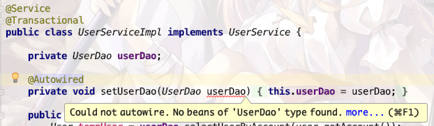

# @Mapper与@Repository

## 1 - @Mapper

**@Mapper 是 Mybatis 的注解，和 Spring 没有关系，@Repository 是 Spring 的注解，用于声明一个 Bean。**（重要）

使用 Mybatis 有 XML 文件或者注解的两种使用方式，如果是使用 XML 文件的方式，我们需要在配置文件中指定 XML 的位置，这里只研究注解开发的方式。

在 Spring 程序中，Mybatis 需要找到对应的 mapper，在编译的时候动态生成代理类，实现数据库查询功能，所以我们需要在接口上添加 @Mapper 注解。

```java
@Mapper
public interface UserDao {
	...
}
1234
```

但是，仅仅使用@Mapper注解，我们会发现，在其他变量中依赖注入，IDEA 会提示错误，但是不影响运行（亲测～）。因为我们没有显式标注这是一个 Bean，IDEA 认为运行的时候会找不到实例注入，所以提示我们错误。如下图，会有红色波浪线。


尽管这个错误提示并不影响运行，但是看起来很不舒服，所以我们可以在对应的接口上添加 bean 的声明，如下：

```java
@Repository // 也可以使用@Component，效果都是一样的，只是为了声明为bean
@Mapper
public interface UserDao {
	
	@Insert("insert into user(account, password, user_name) " +
            "values(#{user.account}, #{user.password}, #{user.name})")
    int insertUser(@Param("user") User user) throws RuntimeException;
}
12345678
```

## 2 - @Repository

正如上面说的，@Repository 用于声明 dao 层的 bean，如果我们要真正地使用 @Repository 来进行开发，那是基于代码的开发，简单来说就是手写 JDBC。

和 @Service、@Controller 一样，我们将 @Repository 添加到对应的实现类上，如下：

```java
@Repository
public class UserDaoImpl implements UserDao{
	
	@Override
	public int insertUser(){
		JdbcTemplate template = new JdbcTemplate();
		...
	}
}
123456789
```

## 3 - 其他扫描手段

基于注解的开发也有其他手段帮助 Mybatis 找到 mapper，那就是 @MapperScan 注解，可以在启动类上添加该注解，自动扫描包路径下的所有接口。

```java
@SpringBootApplication
@MapperScan("com.scut.thunderlearn.dao")
public class UserEurekaClientApplication {

    public static void main(String[] args) {
        SpringApplication.run(UserEurekaClientApplication.class, args);
    }
}
12345678
```

使用这种方法，接口上不用添加任何注解。

## 4 - 总结

1. @Mapper 一定要有，否则 Mybatis 找不到 mapper。
2. @Repository 可有可无，可以消去依赖注入的报错信息。
3. @MapperScan 可以替代 @Mapper。