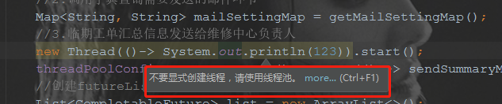
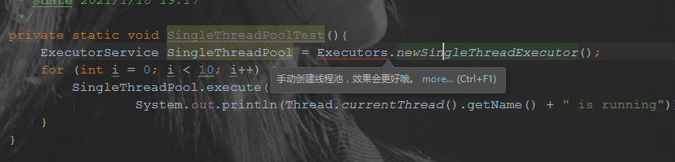

# Springboot自定义公共线程池

> 尽管在项目中显式的使用多线程变成的机会不多，但总有一些场景是这样的：串行的时间消耗也能接受，并行的话可能会有一点点提升。当随手写下 new Thread 时，发现阿里规约插件又将这行标黄了，告诉你不要显式的声明线程，请使用线程池创建线程。想想在这里还需要创建个线程池才能拿到线程，忍不住就把写好的并行逻辑改成了串行。

## 怎么轻松的获取到线程呢？

获取线程的成本可以很低，低到只需要一句 ``new Thread(()-> System.out.println(123)).start();`` 就可以另起一个线程输出123，将这里的lambda表达式换成一个方法，那这个线程就可以为所欲为了，它可以用来进行一次数据库查询，可以用来做一次邮件发送，可以用来做一次统计数据汇总...

从代码的书写方面看，这个线程获取的成本很低，但从系统的开销看，这个线程的创建和销毁都是一笔巨大的开销。（希望能够找到方法进行一次测试，看看这种开销具体能有多大）

况且，如果你安装了阿里代码规约检测的话，会非常明显的看到如下的提示。



## 推荐的线程池好用么？

既然这条路被堵死了，那么推荐的“使用线程池”的使用成本到底有多高呢？

如果熟悉线程池相关的基础知识的话，你会知道 Java 是有提供默认线程池的，它们均通过 ThreadPoolExecutor 来构建。

在Executors工厂类中，Java默认提供了四种类型的线程池。

FixedThreadPool 是线程数量固定（由入参决定）的线程池。

CachedThreadPool 是一个核心线程数为0，最大线程数量可以“无限”扩大（不能超过整型最大值）的线程池。

SingleThreadExecutor 只有一个线程，所以能够保证所有任务是FIFO地执行。

ScheduledThreadPool 主要处理定时任务或延时任务。

想要获取它们，也比较容易，只需要通过Executors的方法即可一行获取，但由于限制性较大，且属于生产事故常发地，因此不被推荐。



四类默认线程池的详情就不展开了，在生产级场景中，我们不太使用这些默认提供的线程池，因此也不需要太过关注。

## 自定义线程池容易么？

相对上面 jdk 自带的线程池来说，自定义线程池创建和集成会显得复杂一些，但实际使用的时候并不复杂。

我们希望项目能够共用一个公共线程池，用来异步的处理一些相对比较简单的任务，比如另起线程去发送邮件，或者通过多个线程查询数据库提高查询速度，这些都是在生产场景下能够用到的。

给 Springboot 集成一个线程池，将池子交给Springboot 进行管理，我们只需要在使用时获取到线程池对象，然后通过 execute() 方法将任务扔到线程池中去，就不需要关注后续的其他操作了，异步执行任务的目标就达成了。

先抛开集成不说，怎么才能自定义一个线程池呢？

我们可以看到，jdk自带的四个线程池都是通过 Executors 的方法进行创建的，实际是 Executors 的方法也还是调用了 ThreadPoolExecutor  的构造方法，通过传入不同参数来进行线程池的创建。

但在阿里巴巴开发手册中提到不要使用 Executors 进行线程池的创建。最重要的是这四类默认的线程池是不一定能够适配实际业务的，通过 ThreadPoolExecutor 自定义的线程池可以更贴合自己的业务需求，而不是业务被动的接受线程池的实现。

如果我们要自定义创建一个线程池，直接通过 ThreadPoolExecutor 的构造方法就可以。

```java
public static ExecutorService customThreadPool(){
        //核心线程数
        int corePoolSize = 10;
        //最大线程数
        int maximumPoolSize = 10;
        //非核心线程的最长存活时间（非核心线程多长时间后未执行任务就进行销毁）
        long keepAliveTime = 0;
        BlockingQueue<Runnable> workQueue = new LinkedBlockingQueue<>();
        String poolNamePrefix = "自定义线程池";
        String threadNamePrefix = "线程名称前缀";
        ThreadFactory threadFactory = new MyFactory(poolNamePrefix,threadNamePrefix);
        ExecutorService customThreadPool = new ThreadPoolExecutor(corePoolSize,maximumPoolSize,
                keepAliveTime,TimeUnit.SECONDS,workQueue,threadFactory);

        return customThreadPool;
}
```

ps：上面的代码中使用了自定义线程工程来控制生成的线程的名称，如果不指定自定义线程工厂的话，会使用 Executors 中的默认线程工厂 DefaultThreadFactory ，生成的线程名称是 pool-1-thread-1 （线程池 number +线程 number）。

线程池成功创建了，那么如何将其集成到 springboot 项目中，允许我们在使用时可以方便获取呢？

## 公共线程池的集成

在 springboot 中进行公共线程池的配置，只需要通过 @Configuration 和 @Bean 两个注解的结合，就可以将一个线程池交给 spring 进行管理，在使用的时候获取到就可以了。

**创建并集成线程池的方式：**

```java
/**
 * ThreadPoolConfig 类是 线程池配置
 *
 * @author dongyinggang
 * @date 2021-01-22 19:10
 **/
@Configuration
public class ThreadPoolConfig {

    /**
     * 核心线程数
     */
    private static final int CORE_POOL_SIZE = 10;
    /**
     * 最大线程数
     */
    private static final int MAXIMUM_POOL_SIZE = 10;
    /**
     * 工作队列长度
     */
    private static final int CAPACITY = 100;

    /**
     * 线程名称前缀
     */
    private static final String PREFIX = "common";

    /**
     * commonThreadPool 方法是 创建公共线程池,用于所有业务
     *
     * @return 公共线程池
     * @author dongyinggang
     * @date 2021/1/12 10:58
     */
    @Bean
    public ExecutorService commonThreadPool() {
        return ThreadPoolUtil.buildThreadPool(PREFIX, CORE_POOL_SIZE, MAXIMUM_POOL_SIZE, CAPACITY);
    }
}
```

上述代码中 ThreadPoolUtil 类的 buildThreadPool 方法是自己封装的创建线程池的方法，可以直接通过ThreadPoolExecutor 进行创建。

**使用线程池的方式**

```java
/**
 * testThreadPool 方法是 测试集成的公共线程池
 *
 * @return 结果
 * @author dongyinggang
 * @date 2021/1/23 10:50
 */
@Override
public String testThreadPool() {
    int threadNum = 10;
    //启多个线程运行,每个线程睡眠2000ms
    for (int i = 0; i < threadNum; i++) {
        //直接通过threadPoolConfig.commonThreadPool()就可以获取到公共线程池
        threadPoolConfig.commonThreadPool().execute(() -> {
            System.out.println(Thread.currentThread().getName() + "正在运行");
            try {
                Thread.sleep(2000);
            } catch (InterruptedException e) {
                e.printStackTrace();
            }
        });
    }
    return "成功启动" + threadNum + "个线程";
}
```

线程池对象 commonThreadPool 注册到了 Spring 容器中，通过 threadPoolConfig.commonThreadPool() 就可以获取到公共线程池了。

## 参考内容

【1】[springboot的线程池的创建的两种方法](https://blog.csdn.net/qq_34204599/article/details/106013204)

【2】[Java默认提供的线程池](https://www.cnblogs.com/amunote/p/10322294.html)