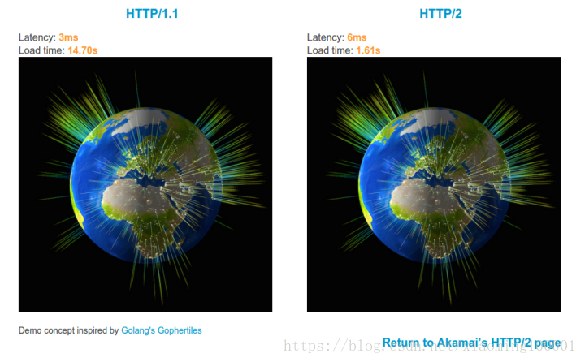
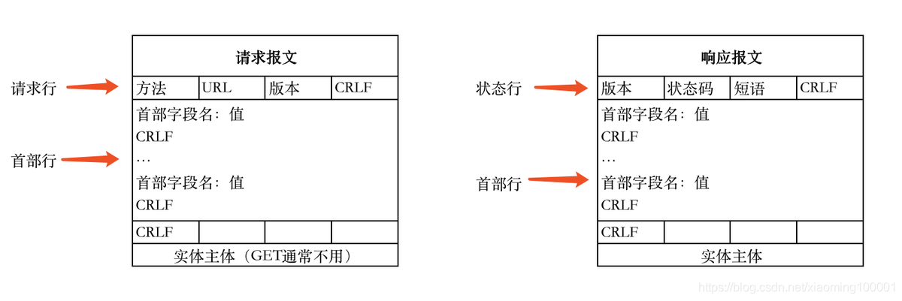

# HTTP与HTTPS

> 2017年1月发布的Chrome 56浏览器开始把收集密码或信用卡数据的HTTP页面标记为“不安全”，若用户使用2017年10月推出的Chrome 62，带有输入数据的HTTP页面和所有以无痕模式浏览的HTTP页面都会被标记为“不安全”，此外，苹果公司强制所有iOS App在2017年1月1日前使用HTTPS加密。

一、HTTP和HTTPS发展历史

##### 什么是HTTP?

> 超文本传输协议，是一个基于请求与响应，无状态的，应用层的协议，常基于TCP/IP协议传输数据，互联网上应用最为广泛的一种网络协议,所有的WWW文件都必须遵守这个标准。设计HTTP的初衷是为了提供一种发布和接收HTML页面的方法。

发展历史：

| 版本     | 产生时间 | 内容                                                         | 发展现状           |
| -------- | -------- | ------------------------------------------------------------ | ------------------ |
| HTTP/0.9 | 1991年   | 不涉及数据包传输，规定客户端和服务器之间通信格式，只能GET请求 | 没有作为正式的标准 |
| HTTP/1.0 | 1996年   | 传输内容格式不限制，增加PUT、PATCH、HEAD、 OPTIONS、DELETE命令 | 正式作为标准       |
| HTTP/1.1 | 1997年   | 持久连接(长连接)、节约带宽、HOST域、管道机制、分块传输编码   | 2015年前使用最广泛 |
| HTTP/2   | 2015年   | 多路复用、服务器推送、头信息压缩、二进制协议等               | 逐渐覆盖市场       |

这个Akamai公司建立的一个官方的演示，使用HTTP/1.1和HTTP/2同时请求379张图片，观察请求的时间，明显看出HTTP/2性能占优势。

多路复用：通过单一的HTTP/2连接请求发起多重的请求-响应消息，多个请求stream共享一个TCP连接，实现多留并行而不是依赖建立多个TCP连接。

##### 什么是HTTPS？

> 《图解HTTP》这本书中曾提过HTTPS是身披SSL外壳的HTTP。HTTPS是一种通过计算机网络进行安全通信的传输协议，经由HTTP进行通信，利用SSL/TLS建立全信道，加密数据包。HTTPS使用的主要目的是提供对网站服务器的身份认证，同时保护交换数据的隐私与完整性。
>
> PS:TLS是传输层加密协议，前身是SSL协议，由网景公司1995年发布，有时候两者不区分。

## 二、HTTP VS HTTPS

**HTTP特点：**

1. 无状态：协议对客户端没有状态存储，对事物处理没有“记忆”能力，比如访问一个网站需要反复进行登录操作
2. 无连接：HTTP/1.1之前，由于无状态特点，每次请求需要通过TCP三次握手四次挥手，和服务器重新建立连接。比如某个客户机在短时间多次请求同一个资源，服务器并不能区别是否已经响应过用户的请求，所以每次需要重新响应请求，需要耗费不必要的时间和流量。
3. 基于请求和响应：基本的特性，由客户端发起请求，服务端响应
4. 简单快速、灵活
5. 通信使用明文、请求和响应不会对通信方进行确认、无法保护数据的完整性

**HTTP协议传输数据以明文形式显示**

**针对无状态的一些解决策略：**

场景：逛电商商场用户需要使用的时间比较长，需要对用户一段时间的HTTP通信状态进行保存，比如执行一次登陆操作，在30分钟内所有的请求都不需要再次登陆。

1. 通过Cookie/Session技术
2. HTTP/1.1持久连接（HTTP keep-alive）方法，只要任意一端没有明确提出断开连接，则保持TCP连接状态，在请求首部字段中的Connection: keep-alive即为表明使用了持久连接

**HTTPS特点：**

基于HTTP协议，通过SSL或TLS提供加密处理数据、验证对方身份以及数据完整性保护

## 参考内容

【1】[HTTP和HTTPS协议，看一篇就够了](https://blog.csdn.net/xiaoming100001/article/details/81109617)