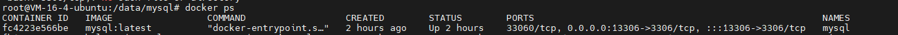
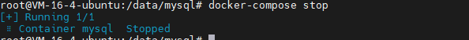
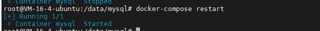
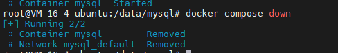

# 部署mysql

## 创建mysql目录

在个人服务器的指定目录下，指定想要放置mysql的相关目录。

通常情况下，我会将要在docker中部署的服务的相关挂载目录设定在 /data 目录下。

在 /data 下创建 mysql 目录。

```shell
root@VM-16-4-ubuntu:/data# mkdir mysql
```

## 编写docker-compose文件

进入 mysql 文件夹，创建 docker-compose.yml 文件，在其中编写 mysql 的相关部署信息。

示例如下

```yml
version: '3'
services:
  db:
    image: 'docker.io/mysql:latest' #使用的镜像
    restart: always 
    container_name: mysql  #容器名
    ports:
      - '13306:3306' #端口映射 宿主端口号：容器端口好
    environment:
      MYSQL_ROOT_PASSWORD: 'password'   #设置root用户的密码
    volumes: # 设置挂载目录
      - ./data:/var/lib/mysql 
      - ./my.cnf:/etc/my.cnf
      - ./init:/docker-entrypoint-initdb.d/

```


相关说明：

**说明：**

**services.db.image:** 指定mysql镜像的版本，可以使用 latest 获取最新进行，也可以指定镜像号，例如：`daocloud.io/library/mysql:5.7.7`

**services.db.environment:** 环境变量

MYSQL_ROOT_PASSWORD：必须，指定root用户的密码

MYSQL_USER、MYSQL_PASS 新建用户并指定密码，可选。

```yaml
environment: 
    MYSQL_ROOT_PASSWORD: 'password'
    MYSQL_USER: 'user'
    MYSQL_PASS: 'userpass'
```

**services.db.volumes:** 数据卷挂载，将本地主机的目录，映射成容器里对应的目录

./data:/var/lib/mysql ：mysql的数据存储到当前目录的 data目录下

./my.cnf:/etc/my.cnf ：指定加载mysql的配置文件为当前目录的 my.cnf 文件

./init:/docker-entrypoint-initdb.d/ ：容器初始化时，执行 init目录下的mysql脚本

**services.db.ports:** 指定端口映射，这里本地主机的 13306 映射到容器的3306端口，则外部连接数据库的url为 jdbc:mysql://localhsot:13306 /xxxxx


## 编写 my.cnf 文件

按需编写mysql的配置文件，my.cnf。示例如下：

```properties
[mysqld]
user=mysql
default-storage-engine=INNODB
```

## 创建初始脚本

按需在 init 目录下创建初始脚本。

```sql
-- GRANT ALL privileges on *.* TO 'root'@'%';
ALTER USER 'root'@'%' IDENTIFIED WITH mysql_native-pasword BY 'password';
```

## 启动服务

在 /data/mysql 目录下，执行启动服务命令。

```shell
root@VM-16-4-ubuntu:/data/mysql# docker-compose up -d
```

执行完成后，可以查看docker中是否已经有对应服务。



可以看到，输入 docker ps 命令，已经可以看到 mysql 服务正在运行中。

## 停止服务

如果要停止服务，可以在 /data/mysql 目录下使用 命令。

```shell
# docker-compose stop
```



## 重启服务

```shell
# docker-compose restart
```



## 关闭服务

如果希望将容器直接彻底删除，可以使用down命令，和创建的up命令相对应。

```shell
#docker-compose down
```



由于已经做了


