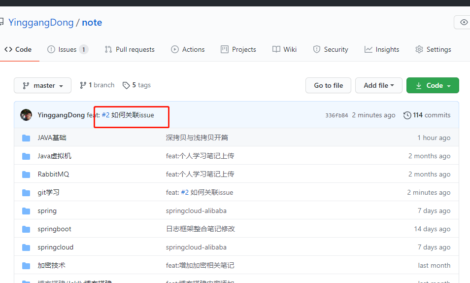
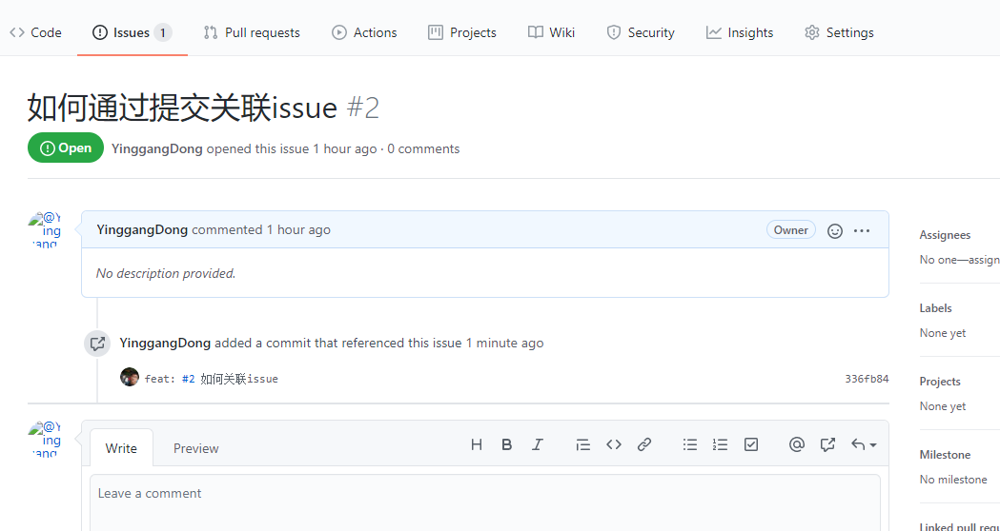
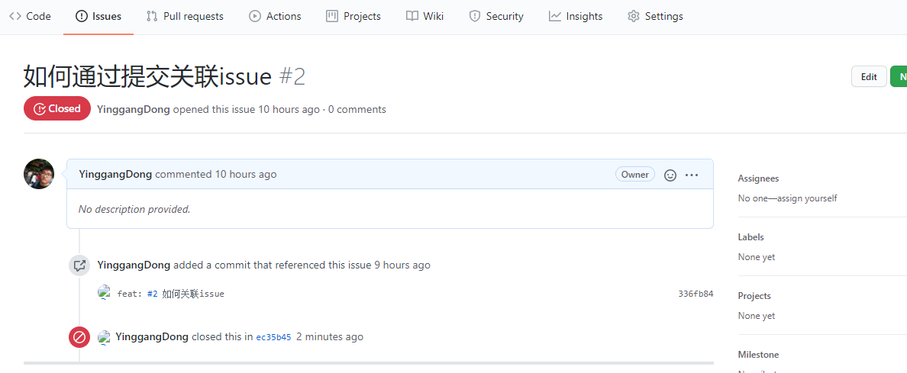

# github学堂(一)：issue

## 应用场景

github 上的 issue，通常有两种应用场景：

1. 对于项目的owner来说，issue 像是一个 TODO list，你可以在项目的任何时间节点，给自己创建一个 TODO 清单，每当完成一个功能，便通过 commit 的注释来关闭对应的功能点。
2. 对于路人来说，issue 像一个留言板，当你使用别人的开源代码发现了 bug 或是待优化点时，你可以通过建立一个 issue 反馈给仓库 owner ，仓库 owner 可以根据你的 issue 进行代码修复或者优化。

## 常见属性

issue 的常见属性有三个：

- Assignee，责任人。指定这个issue由谁负责来解决。

- Labels，标签。包括bug、invalid等，可以自定义。表示issue的类型，解决的方式。 
-  Milestone，里程碑。通常用来做版本管理，v0.1、v1.0之类的，也可以是任意自定义字符串。一个里程碑对应的所有 issue 都被关闭后，这个里程碑会被自动认为已经达成。

## 如何通过 commit 进行关联或关闭？

在 commit 指令的注释中添加 #issueid 就可以实现关联issue的功能。

```java
dongyinggang@YF-dongyinggang MINGW64 ~/Desktop/学习笔记/git学习 (master)
$ git commit . -m "feat: #2 如何关联issue"
[master 336fb84] feat: #2 如何关联issue
 1 file changed, 6 insertions(+)
```

这里的 "#2"即 #issueid 的值，可以看到 github 的提交显示如下：



issue页面的显示如下：



该提交成功绑定至 issue。

如果需要使用当前提交进行某个 issue 的关闭，则可以通过在 commit 的注释中增加以下几种 github 能够识别的关闭指令：

- `fixes #xxx`
- `fixed #xxx`
- `fix #xxx`
- `closes #xxx`
- `close #xxx`
- `closed #xxx`

```sh
dongyinggang@YF-dongyinggang MINGW64 ~/Desktop/学习笔记/git学习 (master)
$ git commit . -m "feat: close #2 如何关闭issue“
> "
[master ec35b45] feat: close #2 如何关闭issue“
 1 file changed, 28 insertions(+), 2 deletions(-)


```



可以看到该 issue 已经被 close 了，上面的关闭指令尝试了 fix 和 close都是可以完成关闭 issue 操作的，考虑到从表面含义看， close 在这里更合适，打算以后关闭时均使用 close 来进行。