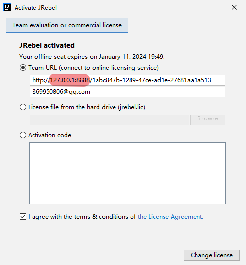
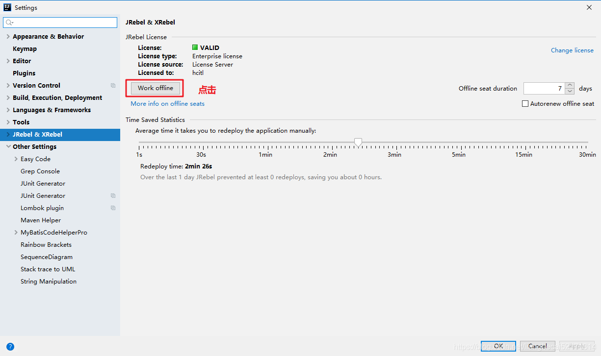
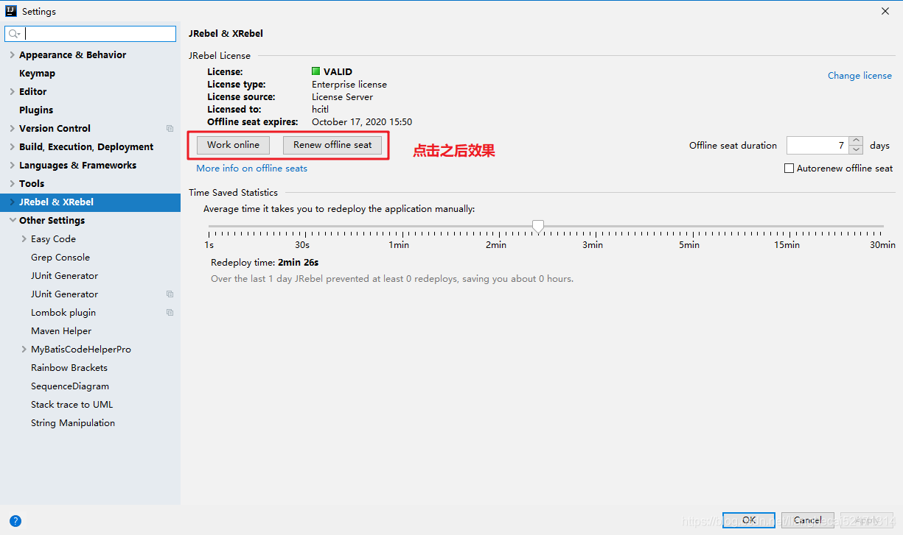
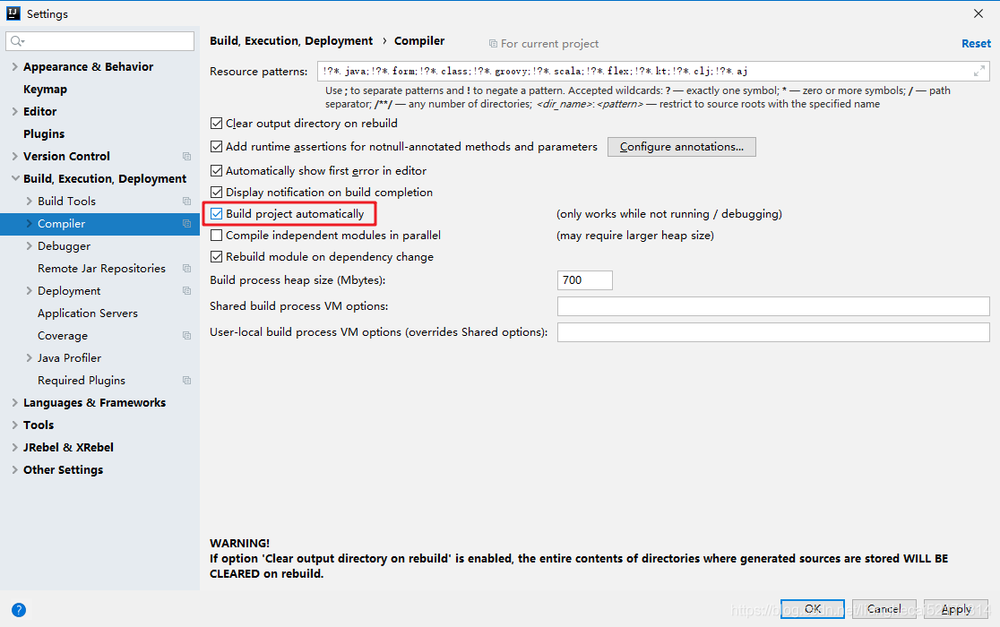

# JRebel2023.3 插件使用详解

简介
JRebel是一套JavaEE开发工具。
Jrebel 可快速实现热部署，节省了大量重启时间，提高了个人开发效率。
JRebel是一款JAVA虚拟机插件，它使得JAVA程序员能在不进行重部署的情况下，即时看到代码的改变对一个应用程序带来的影响。JRebel使你能即时分别看到代码、类和资源的变化，你可以一个个地上传而不是一次性全部部署。当程序员在开发环境中对任何一个类或者资源作出修改的时候，这个变化会直接反应在部署好的应用程序上，从而跳过了构建和部署的过程，可以省去大量的部署用的时间。

JRebel是一款JVM插件，它使得Java代码修改后不用重启系统，立即生效。
IDEA上原生是不支持热部署的，一般更新了 Java 文件后要手动重启 Tomcat 服务器，才能生效，浪费时间浪费生命。
目前对于idea热部署最好的解决方案就是安装JRebel插件。

## 激活方式

### 第一步：下载服务并启动

首先下载服务，网址https://github.com/ilanyu/ReverseProxy/releases/tag/v1.4

根据系统选择对应的包，若为windows，可以直接选择'.exe'文件。

下载后直接双击运行。

### 第三步：在线GUID地址：在线生成GUID

网址：[在线GUID地址](https://www.guidgen.com/)

### 第三步：激活

打开jrebel 如下所示面板，选择Connect to online licensing service

安装成功之后就可以通过JRebel启动项目。这样修改完Java代码后，就可以通过快捷键 **Ctrl+shift+F9** 而不再需要重启站点这样繁琐浪费时间的操作了。

## 相关设置

### 设置成离线工作模式

设置后效果：

### 设置自动编译

### 

要想实现热部署，首先需要对Intellij按如下进行设置：

1. 由于JRebel是实时监控class文件的变化来实现热部署的，所以在idea环境下需要打开自动变异功能才能实现随时修改，随时生效。

   

## 参考内容

https://blog.csdn.net/lianghecai52171314/article/details/105637251