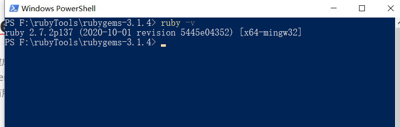
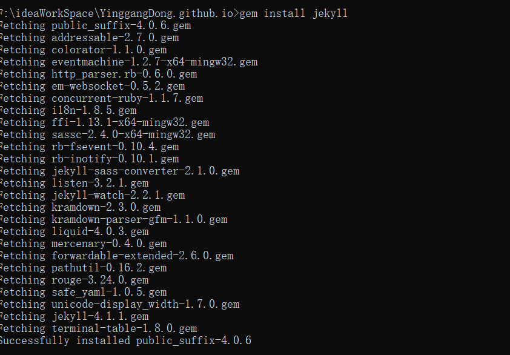
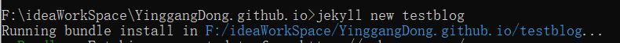
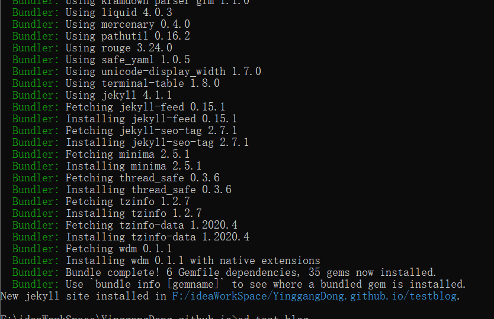
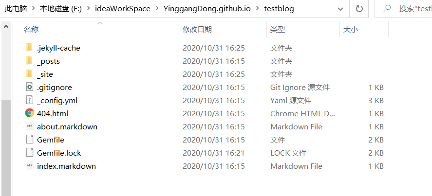
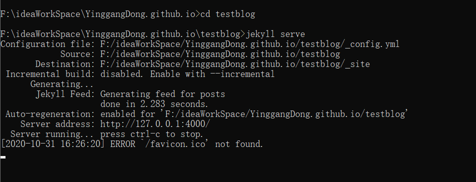
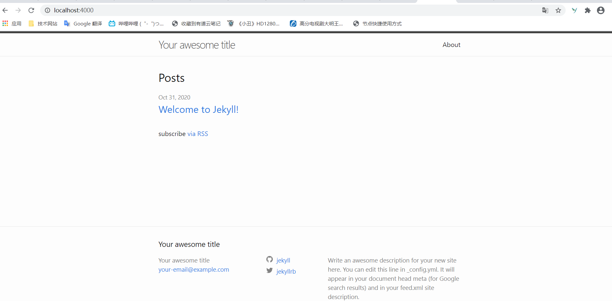

# GitHub+Jekyll 搭建个人博客

> 个人静态博客的搭建成本小，只需要通过 github 进行托管就可以实现访问，不需要后台服务、数据库、服务器的相关支持，因此在查看了常见的博客demo后，选择了 jekyll 进行个人博客的搭建。因为过程中进行了多方的资料查找，也踩过了很多坑，特此记录，在以后用到时可以有所借鉴。

## Jekyll 的安装

### ruby的安装

首先要进行ruby的安装：[ruby官网](https://rubyinstaller.org/),需要注意的是，在windows下进行安装的话，需要安装 RubyInstallers ，而不能使用其压缩包等。

我在安装过程中首先安装的是不含ruby开发环境的版本，不知道可用否，后来改下了其含开发工具的版本，主要是下载太慢了，需要科学上网。

安装过程的基本是一路确定下来的，不知道有没有问题，因为不准备进行ruby相关内容的开发，因此不做研究。

安装过程是会自动配置 PATH 的，不需要安装完成后手动配置，安装完成后，直接通过 ruby -v 指令就可以查看安装结果，显示如下，就说明成功完成了安装。



### ruby Gem （无需安装）

RubyGems 是 Ruby 的一个包管理器，它提供一个分发 Ruby 程序和库的标准格式，还提供一个管理程序包安装的工具。

RubyGems 旨在方便地管理 gem 安装的工具，以及用于分发 gem 的服务器。这类似于 Ubuntu 下的apt-get, Centos 的 yum，Python 的 pip。

RubyGems大约创建于2003年11月，从Ruby 1.9版起成为Ruby标准库的一部分。

如果你的 Ruby 低于 1.9 版本，也可以通过手动安装并执行命令:

- 首先下载安装包：[RubyGems官方下载](https://rubygems.org/pages/download)。
- 解压并进入目录，执行命令：**ruby setup.rb**

#### 修改国内源

由于国内网络原因（你懂的），导致 rubygems.org 存放在 Amazon S3 上面的资源文件间歇性连接失败。

所以你会与遇到 gem install rack 或 bundle install 的时候半天没有响应，具体可以用 gem install rails -V 来查看执行过程。

因此我们可以将它修改为国内的下载源: **https://gems.ruby-china.com**

首先，查看当前源：

```
$ gem sources -l
*** CURRENT SOURCES ***

https://rubygems.org/
```

接着，移除 https://rubygems.org/，并添加国内下载源 https://gems.ruby-china.com/。

```
$ gem sources --remove https://rubygems.org/
$ gem sources -a https://gems.ruby-china.com/
$ gem sources -l
*** CURRENT SOURCES ***

https://gems.ruby-china.com/
# 请确保只有 gems.ruby-china.com
```

### jekyll 安装

换源之后，就可以较快的下载 jekyll 了，直接通过 gem install jekyll 就可以下载。会下载 jekyll 的相关依赖，下载的依赖放置在ruby的文件夹目录下，在我这的的话位置是 ruby 文件夹下的 lib 的几层子文件夹下，不会直接下载到c盘。

```
gem install jekyll 
```




下载完成后就可以尝试通过 jekyll 进行博客的生成。

### jekyll 使用

首先，通过指令创建一个博客模板，我是直接在之前准备作为博客文件夹的地方进行了指令调用。

```
F:\ideaWorkSpace\YinggangDong.github.io>jekyll new testblog
```

起初，输入这行之后只有一行输出，情况如下，然后也没有下文了，我还专门去查了一下该指令是否会执行慢等等，没查到结果。



然后回到cmd之后，单输入了一个c，结果就出现了下面这一堆输出，然后也提示执行成功。



这时候去看该目录，就会发现目录下有了一些文件，这就是博客 demo 的相关文件。



然后就直接进入该目录，通过命令将该静态博客进行启动，指令如下：

```
F:\ideaWorkSpace\YinggangDong.github.io>cd testblog

F:\ideaWorkSpace\YinggangDong.github.io\testblog>jekyll serve
```

就有了以下输出



然后就可以通过在浏览器访问 http://localhost:4000/ 查看该博客模板了，页面如下：



到此，算是成功将 jekyll 进行了试用，接下来就是正片，进行模板的选择和托管，然后再进行内容的填充。

### jekyll 主题选择

进入 [jekyll官方主题](http://jekyllthemes.org/) 页面，进行主题的选择。

我在github上找了个 fork 较高的 jekyll主题 [minimal-mistakes](https://github.com/mmistakes/minimal-mistakes) 

需改一些配置项等才能够使用。


## 参考内容

- [1] [Github+Jekyll 搭建个人网站详细教程](https://www.jianshu.com/p/9f71e260925d)

- [2] [Jekyll + Github Pages 博客搭建入门](https://www.jianshu.com/p/9f198d5779e6)

- [3] [jekyll官方主题](http://jekyllthemes.org/)

- [4] [ruby官方下载](https://rubyinstaller.org/downloads/)

- [5] [RubyGems官方下载](https://rubygems.org/pages/download)
- [6] [[环境搭建] 从零开始配置 vscode](https://anran758.github.io/blog/2018/02/06/dev-zero-configuration-vscode/)·

