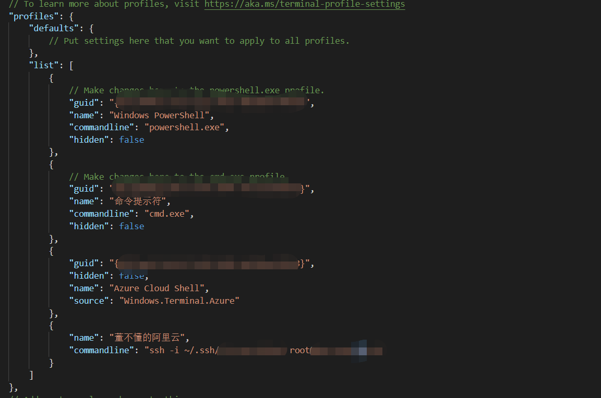
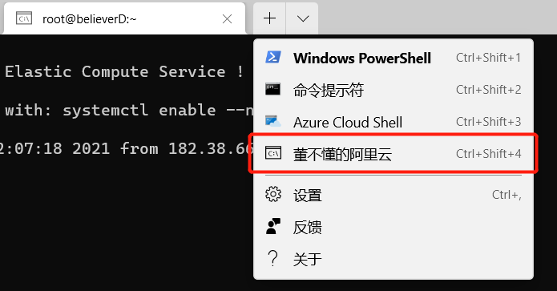

# Tool 1：Windows Terminal

Windows Terminal 是微软推出的一款终端程序。

## 快捷键

### 分屏快捷键

左右分屏：Alt+Shift+=

上下分屏：Alt+Shift+-

重点来了：

**取消分屏：Ctrl+Shift+w**

### 打开新实例

可以使用 wt.exe 从命令行打开 Windows 终端的新实例。 还可以改为使用执行别名 wt。

| 选项                       | 说明                   |
| :------------------------- | :--------------------- |
| `--help`、`-h`、`-?`、`/?` | 显示帮助消息。         |
| `--maximized`、`-M`        | 以最大化形式启动终端。 |
| `--fullscreen`、`-F`       | 以全屏形式启动终端。   |

> ` --maximized`、`-M` 和 `--fullscreen`、`-F` 仅在 [Windows 终端预览](https://aka.ms/terminal-preview/)中可用。

## 远程连接阿里云服务器

### 获取密钥

阿里云已提供完整的操作文档，此处不再赘述

### 创建密钥对

[创建密钥对](https://help.aliyun.com/document_detail/51793.html?spm=a2c4g.11186623.6.830.3daa11c8WGWklj)

### 绑定密钥对

[绑定密钥对](https://help.aliyun.com/document_detail/51796.html?spm=a2c4g.11186623.2.14.3afe4737iBFHff#concept-zzt-nl1-ydb)

### 远程连接

在 Windows Terminal 的 settings.json 配置文件账户功能添加连接的名称、命令等。

需要在 “profiles” 下的 “list” 中进行连接的相关信息添加，效果如图：



配置信息如下：

```json
{
	"name": "董不懂的阿里云",
	"commandline": "ssh -i ~/.ssh/{私钥文件名} root@{阿里云公网ip}"
}
```

连接参数：：

name：下拉框中按钮名称

commandline：远程连接命令，ssh -i {私钥地址}  {登陆名}@{阿里云公网ip}，例如

```shell
ssh -i ~/.ssh/rsa_pem root@123.123.12.12
```



## 参考内容

【1】[什么是 Windows 终端？](https://docs.microsoft.com/zh-cn/windows/terminal/)

【2】[Windows Terminal远程连接阿里云服务器](https://blog.csdn.net/qq_44486439/article/details/108184005)

