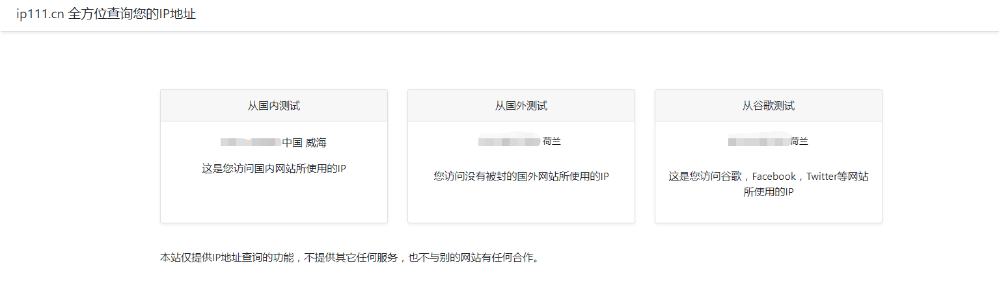

# Tool 2：v2rayN

> 科学上网工具。

## 项目地址

github地址：https://github.com/2dust/v2rayN

## 使用技巧

### 大陆白名单模式

>  v2ray版本3.13
>
> 1. *设置*-*基本设置*-*http proxy* 选全局
> 2. *设置*-*路由设置*-选IPifNonMatch，然后在下面的 *4.预定义规则* 中选择绕过局域网和大陆
> 3. 打开www.ip111.cn看看是否设置成功。如果从国外和谷歌测试是你的VPS的IP，说明应该可以了。

引自：https://github.com/2dust/v2rayN/issues/632

结果如图所示：

### 配置特定网站走代理

