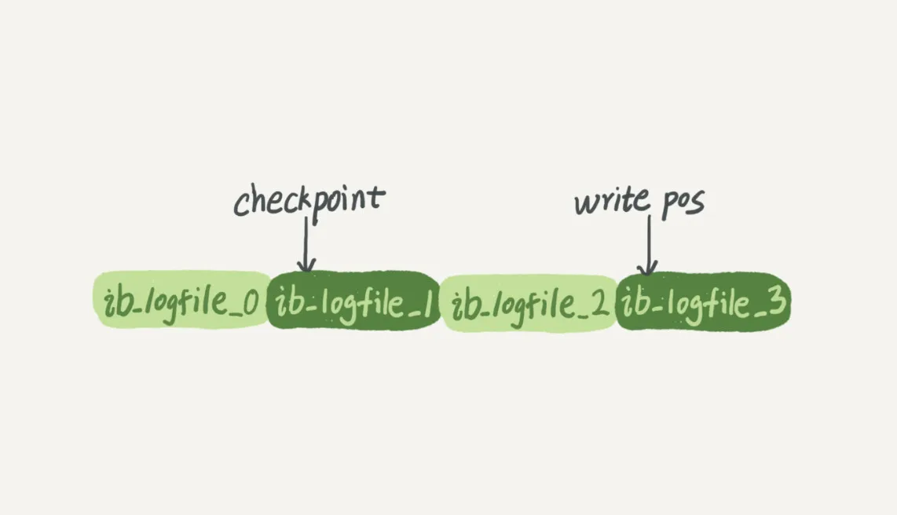
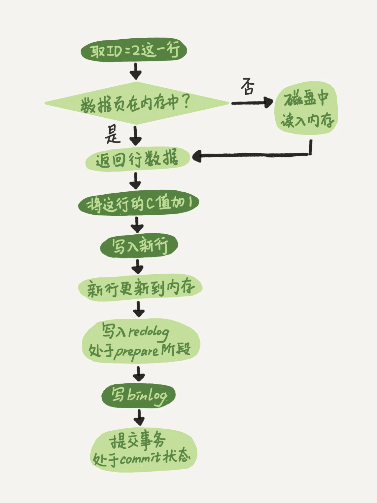

# 02讲日志系统：一条SQL更新语句是如何执行的

> 与查询流程不一样的是，更新流程还涉及两个重要的日志模块，它们正是我们今天要讨论的主角：redo log（重做日志）和 binlog（归档日志）。如果接触MySQL，那这两个词肯定是绕不过的，我后面的内容里也会不断地和你强调。不过话说回来，redo log和binlog在设计上有很多有意思的地方，这些设计思路也可以用到你自己的程序里。

本讲以一个 update 语句为例，描述了更新的过程细节。

```mysql
mysql> update T set c=c+1 where ID=2;
```

## 重要的日志模块：redo log

**redo log（重做日志）** 是Innodb 引擎特有的日志，记录了这个页“做了什么改动”。

在这一讲中，将 redo log 的记录过程类比为酒店掌柜的记账流程，工具是粉板和账本，粉板用来临时记账，会在空闲时合并到账本中。原因是如果掌柜没有粉板的帮助，每次记账都得翻账本，效率就会低的吓人。

同样，在MySQL里也有这个问题，如果每一次的更新操作都需要写进磁盘，然后磁盘也要找到对应的那条记录，然后再更新，整个过程IO成本、查找成本都很高。为了解决这个问题，MySQL的设计者就用了类似酒店掌柜粉板的思路来提升更新效率。

### WAL技术

而粉板和账本配合的整个过程，其实就是MySQL里经常说到的**WAL技术**，**WAL的全称是Write-Ahead Logging，它的关键点就是先写日志，再写磁盘**，也就是先写粉板，等不忙的时候再写账本。

具体来说，当有一条记录需要更新的时候，InnoDB引擎就会先把记录写到redo log（粉板）里面，并更新内存，这个时候更新就算完成了。同时，InnoDB引擎会在适当的时候，将这个操作记录更新到磁盘里面，而这个更新往往是在系统比较空闲的时候做，这就像打烊以后掌柜做的事。

### redo log 满了怎么办？

InnoDB的 redo log是固定大小的，比如可以配置为一组4个文件，每个文件的大小是1GB，那么这块“粉板”总共就可以记录4GB的操作。从头开始写，写到末尾就又回到开头循环写，如下面这个图所示。



**write pos** 是当前记录的位置，随着写入过程不断后移，写到3号文件末尾后就会回到0号文件开头。

**checkpoint** 是当前要擦除的位置，擦出记录前会把记更新到数据文件。

write pos 到 checkpoint 之间的部分就是可以进行记录的区间，如果 write pos 追上了 checkpoint，说明“粉板”满了，这时候就需要先擦掉一些记录，把 checkpoint 向前推进一下。

有了redo log，InnoDB就可以保证即使数据库发生异常重启，之前提交的记录都不会丢失，这个能力称为**crash-safe**。

要理解crash-safe这个概念，可以想想我们前面赊账记录的例子。只要赊账记录记在了粉板上或写在了账本上，之后即使掌柜忘记了，比如突然停业几天，恢复生意后依然可以通过账本和粉板上的数据明确赊账账目。

## 重要的日志模块：binlog

redo log 是 InnoDB 引擎特有的日志，而 Server 层也有自己的日志，**称为 binlog（归档日志）**。

### 为什么有两份日志？

因为最开始MySQL里并没有InnoDB引擎。

MySQL自带的引擎是MyISAM，但是MyISAM没有crash-safe的能力，binlog日志只能用于归档。而InnoDB是另一个公司以插件形式引入MySQL的，既然只依靠binlog是没有crash-safe能力的，所以InnoDB使用另外一套日志系统——也就是redo log来实现crash-safe能力。

这两种日志有以下三点不同。

1. redo log是InnoDB引擎特有的；binlog是MySQL的Server层实现的，所有引擎都可以使用。
2. redo log是物理日志，记录的是“在某个数据页上做了什么修改”；binlog是逻辑日志，记录的是这个语句的原始逻辑，比如“给ID=2这一行的c字段加1 ”。
3. redo log是循环写的，空间固定会用完；binlog是可以追加写入的。“追加写”是指binlog文件写到一定大小后会切换到下一个，并不会覆盖以前的日志。

## InnoDB 引擎执行更新语句的内部流程

1. 执行器先找引擎取ID=2这一行。ID是主键，引擎直接用树搜索找到这一行。如果ID=2这一行所在的数据页本来就在内存中，就直接返回给执行器；否则，需要先从磁盘读入内存，然后再返回。
2. 执行器拿到引擎给的行数据，把这个值加上1，比如原来是N，现在就是N+1，得到新的一行数据，再调用引擎接口写入这行新数据。
3. 引擎将这行新数据更新到内存中，同时将这个更新操作记录到redo log里面，此时redo log处于**prepare**状态。然后告知执行器执行完成了，随时可以提交事务。
4. 执行器生成这个操作的binlog，并把binlog写入磁盘。
5. 执行器调用引擎的提交事务接口，引擎把刚刚写入的redo log改成提交（commit）状态，更新完成。



最后三步看起来有点“绕”，将redo log 的写入拆成了两个步骤：prepare 和 commit，这就是“两阶段提交”。

### 两阶段提交

为什么必须有“两阶段提交”呢？这是为了让两份日志之间的逻辑一致。

**怎样让数据库恢复到半个月内任意一秒的状态？**

当需要恢复到指定的某一秒时，比如某天下午两点发现中午十二点有一次误删表，需要找回数据，那你可以这么做：

- 首先，找到最近的一次全量备份，如果你运气好，可能就是昨天晚上的一个备份，从这个备份恢复到临时库；
- 然后，从备份的时间点开始，将备份的binlog依次取出来，重放到中午误删表之前的那个时刻。

这样你的临时库就跟误删之前的线上库一样了，然后你可以把表数据从临时库取出来，按需要恢复到线上库去。

**为什么日志需要“两阶段提交”？**

由于redo log和binlog是两个独立的逻辑，如果不用两阶段提交，要么就是先写完redo log再写binlog，或者采用反过来的顺序。我们看看这两种方式会有什么问题。

以本讲的 update 语句来做例子，如果写完第一个日志之后发生了 crash，那么会出现什么样的情况？

1. **先写redo log 后写 binlog。**当redo log 写完，binlog没写完时，MySQL异常重启，由于redo log 已经记录，所以重启后依然可以把这个操作恢复过来。但是由于binlog没有写完，所以binlog日志中没有这个语句，因此通过binlog来恢复临时库的话，恢复的数据结果就会少了这一次更新。
2. **先写binlog后写redo log。**写完binlog后发生crash，由于redo log 还没有写，所以崩溃恢复后，该事务无效，但是binlog里面已经记录了，此时binlog恢复的数据就会比实际库多一次update操作。

**所以，如果不使用“两阶段提交”，name数据库的状态和它用binlog恢复出来的库的数据是不一致的。**

**“两阶段提交”下的崩溃恢复**

通过“两阶段提交”的方式，可以保证崩溃后能够有效恢复。将两阶段提交分成三个节点，崩溃恢复的逻辑如下。

1. prepare阶段 

2. 写binlog 

3. commit

当在2之前崩溃时

重启恢复：后发现没有commit，回滚。备份恢复：没有binlog 。
一致、

当在3之前崩溃

重启恢复：虽没有commit，但满足prepare和binlog完整，所以重启后会自动commit。备份：有binlog。一致

不只是误操作后需要用这个过程来恢复数据。当你需要扩容的时候，也就是需要再多搭建一些备库来增加系统的读能力的时候，现在常见的做法也是用全量备份加上应用binlog来实现的，这个“不一致”就会导致你的线上出现主从数据库不一致的情况。

简单说，redo log和binlog都可以用于表示事务的提交状态，而两阶段提交就是让这两个状态保持逻辑上的一致。

## 数据库参数

**innodb_flush_log_at_trx_commit**

这个参数设置成1的时候，表示每次事务的redo log都直接持久化到磁盘。这个参数我建议你设置成1，这样可以保证MySQL异常重启之后数据不丢失。

**sync_binlog**

这个参数设置成1的时候，表示每次事务的binlog都持久化到磁盘。这个参数我也建议你设置成1，这样可以保证MySQL异常重启之后binlog不丢失。

## 参考内容

【1】[MySQL 重要参数 innodb_flush_log_at_trx_commit 和 sync_binlog](https://www.cnblogs.com/klvchen/p/10861850.html)

【2】[揭秘redo log buffer](https://blog.csdn.net/qq_37286668/article/details/111273956)