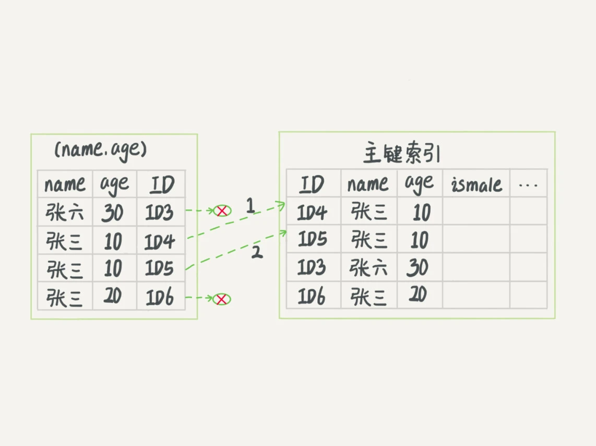

# 05讲：深入浅出索引（下）

## 回表过程

在下面这个表T中，如果我执行 select * from T where k between 3 and 5，需要执行几次树的搜索操作，会扫描多少行？

下面是这个表的初始化语句。

```mysql
mysql> create table T (
ID int primary key,
k int NOT NULL DEFAULT 0, 
s varchar(16) NOT NULL DEFAULT '',
index k(k))
engine=InnoDB;

insert into T values(100,1, 'aa'),(200,2,'bb'),(300,3,'cc'),(500,5,'ee'),(600,6,'ff'),(700,7,'gg');
```


现在，我们一起来看看这条SQL查询语句的执行流程：

1. 在k索引树上找到k=3的记录，取得 ID = 300；
2. 再到ID索引树查到ID=300对应的R3；
3. 在k索引树取下一个值k=5，取得ID=500；
4. 再回到ID索引树查到ID=500对应的R4；
5. 在k索引树取下一个值k=6，不满足条件，循环结束。

在这个过程中，**回到主键索引树搜索的过程，我们称为回表**。可以看到，这个查询过程读了k索引树的3条记录（步骤1、3和5），回表了两次（步骤2和4）。

## 覆盖索引

如果执行的语句是select ID from T where k between 3 and 5，这时只需要查ID的值，而ID的值已经在k索引树上了，因此可以直接提供查询结果，不需要回表。也就是说，在这个查询里面，索引k已经“覆盖了”我们的查询需求，我们称为覆盖索引。

**由于覆盖索引可以减少树的搜索次数，显著提升查询性能，所以使用覆盖索引是一个常用的性能优化手段。**

需要注意的是，在引擎内部使用覆盖索引在索引k上其实读了三个记录，R3~R5（对应的索引k上的记录项），但是对于MySQL的Server层来说，它就是找引擎拿到了两条记录，因此MySQL认为扫描行数是2。

## 最左前缀原则

**B+树这种索引结构，可以利用索引的“最左前缀”，来定位记录。**

为了直观地说明这个概念，我们用（name，age）这个联合索引来分析。


可以看到，索引项是按照索引定义里面出现的字段顺序排序的。

当你的逻辑需求是查到所有名字是“张三”的人时，可以快速定位到ID4，然后向后遍历得到所有需要的结果。

如果你要查的是所有名字第一个字是“张”的人，你的SQL语句的条件是"where name like ‘张%’"。这时，你也能够用上这个索引，查找到第一个符合条件的记录是ID3，然后向后遍历，直到不满足条件为止。

可以看到，不只是索引的全部定义，只要满足最左前缀，就可以利用索引来加速检索。这个最左前缀可以是联合索引的最左N个字段，也可以是字符串索引的最左M个字符。

## 索引下推

以市民表的联合索引（name, age）为例。如果现在有一个需求：检索出表中“名字第一个字是张，而且年龄是10岁的所有男孩”。那么，SQL语句是这么写的：

```mysql
mysql> select * from tuser where name like '张%' and age=10 and ismale=1;
```

你已经知道了前缀索引规则，所以这个语句在搜索索引树的时候，只能用 “张”，找到第一个满足条件的记录ID3。当然，这还不错，总比全表扫描要好。

在MySQL 5.6之前，只能从ID3开始一个个回表。到主键索引上找出数据行，再对比字段值。

而MySQL 5.6 引入的索引下推优化（index condition pushdown)， 可以在索引遍历过程中，对索引中包含的字段先做判断，直接过滤掉不满足条件的记录，减少回表次数。

无索引下推执行流程：


有索引下推的流程：



InnoDB在(name,age)索引内部就判断了age是否等于10，对于不等于10的记录，直接判断并跳过。在我们的这个例子中，只需要对ID4、ID5这两条记录回表取数据判断，就只需要回表2次。

