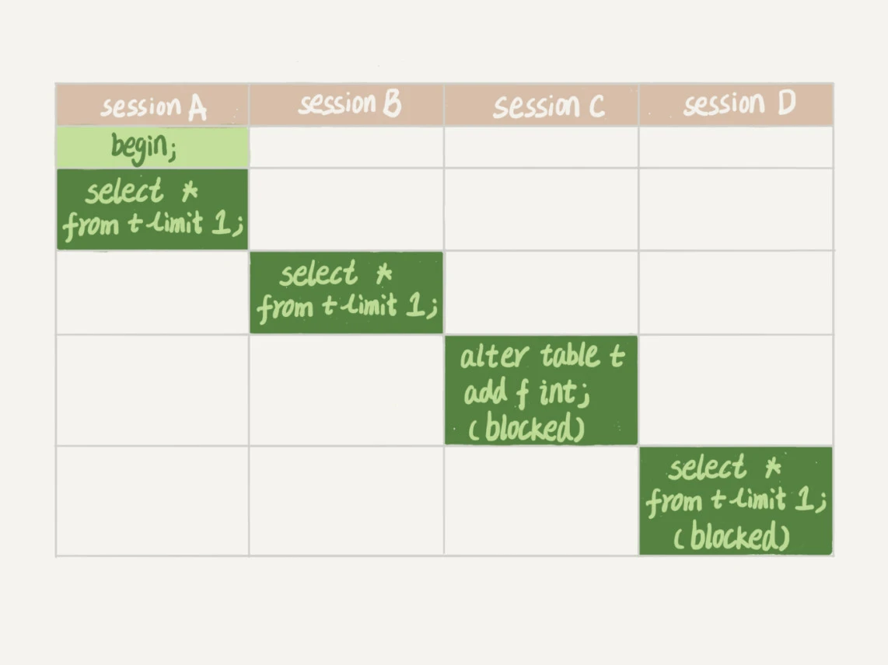

# 06讲全局锁和表锁

> 数据库锁设计的初衷是处理并发问题。作为多用户共享的资源，当出现并发访问的时候，数据库需要合理地控制资源的访问规则。而锁就是用来实现这些访问规则的重要数据结构。

**根据加锁的范围，MySQL里面的锁大致可以分成全局锁、表级锁和行锁三类**。

## 全局锁

顾名思义，全局锁就是对整个数据库实例加锁。MySQL提供了一个加全局读锁的方法，命令是 **Flush tables with read lock (FTWRL)**。当你需要让整个库处于只读状态的时候，可以使用这个命令，之后其他线程的以下语句会被阻塞：数据更新语句（数据的增删改）、数据定义语句（包括建表、修改表结构等）和更新类事务的提交语句。

**全局锁的典型使用场景是，做全库逻辑备份。**也就是把整库每个表都select出来存成文本。

### 原来的备份策略

以前有一种做法，是通过FTWRL确保不会有其他线程对数据库做更新，然后对整个库做备份。注意，在备份过程中整个库完全处于只读状态。

但是让整库都只读，听上去就很危险：

- 如果你在主库上备份，那么在备份期间都不能执行更新，业务基本上就得停摆；
- 如果你在从库上备份，那么备份期间从库不能执行主库同步过来的binlog，会导致主从延迟。

### 改进的备份策略

在可重复读隔离级别下开启一个事务。

官方自带的逻辑备份工具是mysqldump。当mysqldump使用参数–single-transaction的时候，导数据之前就会启动一个事务，来确保拿到一致性视图。而由于MVCC的支持，这个过程中数据是可以正常更新的。

你一定在疑惑，有了这个功能，为什么还需要FTWRL呢？**一致性读是好，但前提是引擎要支持这个隔离级别。**比如，对于MyISAM这种不支持事务的引擎，如果备份过程中有更新，总是只能取到最新的数据，那么就破坏了备份的一致性。这时，我们就需要使用FTWRL命令了。

所以，**single-transaction方法只适用于所有的表使用事务引擎的库。**如果有的表使用了不支持事务的引擎，那么备份就只能通过FTWRL方法。这往往是DBA要求业务开发人员使用InnoDB替代MyISAM的原因之一。

**既然要全库只读，为什么不使用set global readonly=true的方式呢**？确实readonly方式也可以让全库进入只读状态，但我还是会建议你用FTWRL方式，主要有两个原因：

- 一是，在有些系统中，readonly的值会被用来做其他逻辑，比如用来判断一个库是主库还是备库。因此，修改global变量的方式影响面更大，我不建议你使用。
- 二是，在异常处理机制上有差异。如果执行FTWRL命令之后由于客户端发生异常断开，那么MySQL会自动释放这个全局锁，整个库回到可以正常更新的状态。而将整个库设置为readonly之后，如果客户端发生异常，则数据库就会一直保持readonly状态，这样会导致整个库长时间处于不可写状态，风险较高。

业务的更新不只是增删改数据（DML)，还有可能是加字段等修改表结构的操作（DDL）。不论是哪种方法，一个库被全局锁上以后，你要对里面任何一个表做加字段操作，都是会被锁住的。

## 表级锁

MySQL里面表级别的锁有两种：一种是表锁，一种是元数据锁（meta data lock，MDL)。

### 表锁

**表锁的语法是 lock tables … read/write。**与FTWRL类似，可以用unlock tables主动释放锁，也可以在客户端断开的时候自动释放。需要注意，lock tables语法除了会限制别的线程的读写外，也限定了本线程接下来的操作对象。

举个例子, 如果在某个线程A中执行lock tables t1 read, t2 write; 这个语句，则其他线程写t1、读写t2的语句都会被阻塞。同时，线程A在执行unlock tables之前，也只能执行读t1、读写t2的操作。连写t1都不允许，自然也不能访问其他表。

在还没有出现更细粒度的锁的时候，表锁是最常用的处理并发的方式。而对于InnoDB这种支持行锁的引擎，一般不使用lock tables命令来控制并发，毕竟锁住整个表的影响面还是太大。

### 元数据锁（metadata lock，MDL)

MDL不需要显式使用，在访问一个表的时候会被自动加上。MDL的作用是，保证读写的正确性。你可以想象一下，如果一个查询正在遍历一个表中的数据，而执行期间另一个线程对这个表结构做变更，删了一列，那么查询线程拿到的结果跟表结构对不上，肯定是不行的。

因此，在MySQL 5.5版本中引入了MDL，当对一个表做增删改查操作的时候，加MDL读锁；当要对表做结构变更操作的时候，加MDL写锁。

- 读锁之间不互斥，因此你可以有多个线程同时对一张表增删改查。
- 读写锁之间、写锁之间是互斥的，用来保证变更表结构操作的安全性。因此，如果有两个线程要同时给一个表加字段，其中一个要等另一个执行完才能开始执行。

虽然MDL锁是系统默认会加的，但却是你不能忽略的一个机制。比如下面这个例子，我经常看到有人掉到这个坑里：给一个小表加个字段，导致整个库挂了。

你肯定知道，给一个表加字段，或者修改字段，或者加索引，需要扫描全表的数据。在对大表操作的时候，你肯定会特别小心，以免对线上服务造成影响。而实际上，即使是小表，操作不慎也会出问题。我们来看一下下面的操作序列，假设表t是一个小表。



我们可以看到session A先启动，这时候会对表t加一个MDL读锁。由于session B需要的也是MDL读锁，因此可以正常执行。

之后session C会被blocked，是因为session A的MDL读锁还没有释放，而session C需要MDL写锁，因此只能被阻塞。

如果只有session C自己被阻塞还没什么关系，但是之后所有要在表t上新申请MDL读锁的请求也会被session C阻塞。前面我们说了，所有对表的增删改查操作都需要先申请MDL读锁，就都被锁住，等于这个表现在完全不可读写了。

如果某个表上的查询语句频繁，而且客户端有重试机制，也就是说超时后会再起一个新session再请求的话，这个库的线程很快就会爆满。

你现在应该知道了，事务中的MDL锁，在语句执行开始时申请，但是语句结束后并不会马上释放，而会等到整个事务提交后再释放。

基于上面的分析，我们来讨论一个问题，**如何安全地给小表加字段？**

首先我们要解决长事务，事务不提交，就会一直占着MDL锁。在MySQL的information_schema 库的 innodb_trx 表中，你可以查到当前执行中的事务。如果你要做DDL变更的表刚好有长事务在执行，要考虑先暂停DDL，或者kill掉这个长事务。

但考虑一下这个场景。如果你要变更的表是一个热点表，虽然数据量不大，但是上面的请求很频繁，而你不得不加个字段，你该怎么做呢？

这时候kill可能未必管用，因为新的请求马上就来了。比较理想的机制是，在alter table语句里面设定等待时间，如果在这个指定的等待时间里面能够拿到MDL写锁最好，拿不到也不要阻塞后面的业务语句，先放弃。之后开发人员或者DBA再通过重试命令重复这个过程。

MariaDB已经合并了AliSQL的这个功能，所以这两个开源分支目前都支持DDL NOWAIT/WAIT n这个语法。

```mysql
ALTER TABLE tbl_name NOWAIT add column ...
ALTER TABLE tbl_name WAIT N add column ... 
```

