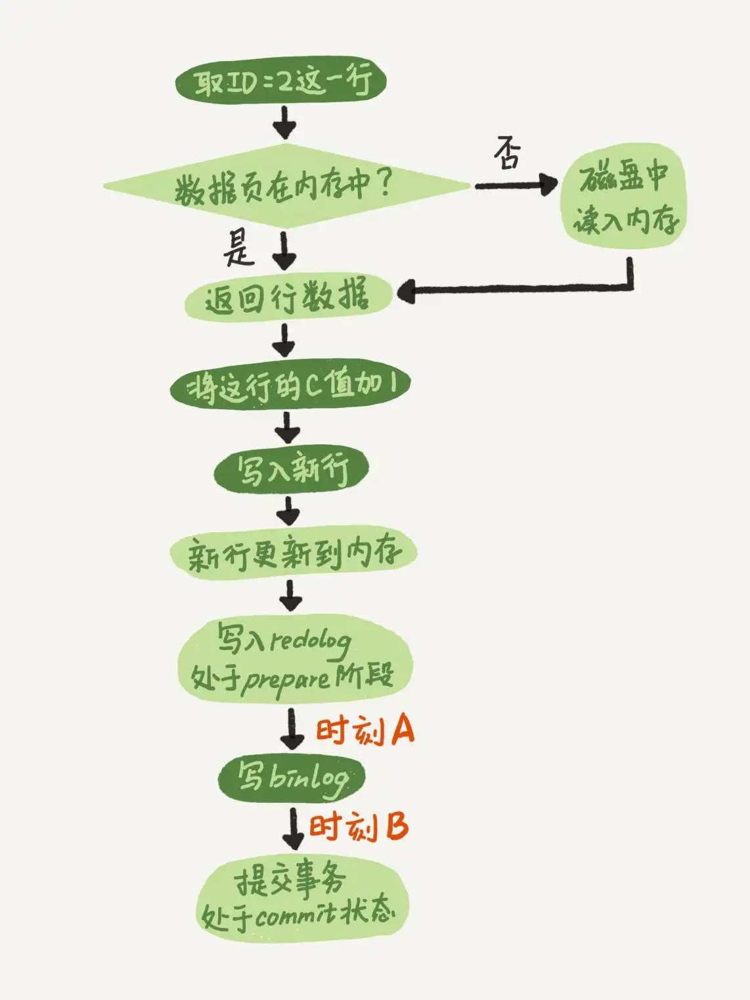

# 15讲答疑文章（一）：日志和索引相关问题

## 在两阶段提交的不同时刻，MySQL异常重启会出现什么现象

两阶段提交示意图如下：



其中时刻A和时刻B是“两阶段提交”可能出现 crash 的时刻。

如果在图中时刻A的地方，也就是写入redo log 处于prepare阶段之后、写binlog之前，发生了崩溃（crash），由于此时binlog还没写，redo log也还没提交，**所以崩溃恢复的时候，这个事务会回滚**。这时候，binlog还没写，所以也不会传到备库。

时刻B，也就是binlog写完，redo log还没commit前发生crash，那崩溃恢复的时候MySQL会怎么处理？

**崩溃恢复时的判断规则**

1. 如果redo log里面的事务是完整的，也就是已经有了commit标识，则直接提交；
2. 如果redo log里面的事务只有完整的prepare，则判断对应的事务binlog是否存在并完整：
   a. 如果是，则提交事务；
   b. 否则，回滚事务。

这里，时刻B发生crash对应的就是2(a)的情况，崩溃恢复过程中事务会被提交。

### 追问1：MySQL怎么知道binlog是完整的?

回答：一个事务的binlog是有完整格式的：

- statement格式的binlog，最后会有COMMIT；
- row格式的binlog，最后会有一个XID event。

另外，在MySQL 5.6.2版本以后，还引入了binlog-checksum参数，用来验证binlog内容的正确性。对于binlog日志由于磁盘原因，可能会在日志中间出错的情况，MySQL可以通过校验checksum的结果来发现。所以，MySQL还是有办法验证事务binlog的完整性的。

### 追问2：redo log 和 binlog是怎么关联起来的?

回答：它们有一个共同的数据字段，叫**XID**。崩溃恢复的时候，会按顺序扫描redo log：

- 如果碰到既有prepare、又有commit的redo log，就直接提交；
- 如果碰到只有parepare、而没有commit的redo log，就拿着XID去binlog找对应的事务。

### 追问3：处于prepare阶段的redo log加上完整binlog，重启就能恢复，MySQL为什么要这么设计?

回答：其实，这个问题还是跟我们在反证法中说到的数据与备份的一致性有关。在时刻B，也就是binlog写完以后MySQL发生崩溃，这时候binlog已经写入了，之后就会被从库（或者用这个binlog恢复出来的库）使用。

所以，在主库上也要提交这个事务。采用这个策略，主库和备库的数据就保证了一致性。

### 追问4：如果这样的话，为什么还要两阶段提交呢？干脆先redo log写完，再写binlog。崩溃恢复的时候，必须得两个日志都完整才可以。是不是一样的逻辑？

回答：其实，两阶段提交是经典的分布式系统问题，并不是MySQL独有的。

如果必须要举一个场景，来说明这么做的必要性的话，那就是事务的持久性问题。

对于InnoDB引擎来说，如果redo log提交完成了，事务就不能回滚（如果这还允许回滚，就可能覆盖掉别的事务的更新）。而如果redo log直接提交，然后binlog写入的时候失败，InnoDB又回滚不了，数据和binlog日志又不一致了。

两阶段提交就是为了给所有人一个机会，当每个人都说“我ok”的时候，再一起提交。

### 追问5：不引入两个日志，也就没有两阶段提交的必要了。只用binlog来支持崩溃恢复，又能支持归档，不就可以了？

binlog不能支持崩溃恢复。

binlog 没有能力恢复“数据页”。

### 追问6：那能不能反过来，只用redo log，不要binlog？

回答：如果只从崩溃恢复的角度来讲是可以的。你可以把binlog关掉，这样就没有两阶段提交了，但系统依然是crash-safe的。

但是，如果你了解一下业界各个公司的使用场景的话，就会发现在正式的生产库上，binlog都是开着的。因为binlog有着redo log无法替代的功能。

一个是归档。redo log是循环写，写到末尾是要回到开头继续写的。这样历史日志没法保留，redo log也就起不到归档的作用。

一个就是MySQL系统依赖于binlog。binlog作为MySQL一开始就有的功能，被用在了很多地方。其中，MySQL系统高可用的基础，就是binlog复制。

还有很多公司有异构系统（比如一些数据分析系统），这些系统就靠消费MySQL的binlog来更新自己的数据。关掉binlog的话，这些下游系统就没法输入了。

总之，由于现在包括MySQL高可用在内的很多系统机制都依赖于binlog，所以“鸠占鹊巢”redo log还做不到。你看，发展生态是多么重要。

### 追问7：redo log一般设置多大？

回答：redo log太小的话，会导致很快就被写满，然后不得不强行刷redo log，这样WAL机制的能力就发挥不出来了。

所以，如果是现在常见的几个TB的磁盘的话，就不要太小气了，直接将redo log设置为4个文件、每个文件1GB吧。

### 追问8：正常运行中的实例，数据写入后的最终落盘，是从redo log更新过来的还是从buffer pool更新过来的呢？

回答：这个问题其实问得非常好。这里涉及到了，“redo log里面到底是什么”的问题。

实际上，redo log并没有记录数据页的完整数据，所以它并没有能力自己去更新磁盘数据页，也就不存在“数据最终落盘，是由redo log更新过去”的情况。

1. 如果是正常运行的实例的话，数据页被修改以后，跟磁盘的数据页不一致，称为脏页。最终数据落盘，就是把内存中的数据页写盘。这个过程，甚至与redo log毫无关系。
2. 在崩溃恢复场景中，InnoDB如果判断到一个数据页可能在崩溃恢复的时候丢失了更新，就会将它读到内存，然后让redo log更新内存内容。更新完成后，内存页变成脏页，就回到了第一种情况的状态。

### 追问9：redo log buffer是什么？是先修改内存，还是先写redo log文件？

回答：这两个问题可以一起回答。

在一个事务的更新过程中，日志是要写多次的。比如下面这个事务：

```
begin;
insert into t1 ...
insert into t2 ...
commit;
```

这个事务要往两个表中插入记录，插入数据的过程中，生成的日志都得先保存起来，但又不能在还没commit的时候就直接写到redo log文件里。

所以，redo log buffer就是一块内存，用来先存redo日志的。也就是说，在执行第一个insert的时候，数据的内存被修改了，redo log buffer也写入了日志。

但是，真正把日志写到redo log文件（文件名是 ib_logfile+数字），是在执行commit语句的时候做的。

（这里说的是事务执行过程中不会“主动去刷盘”，以减少不必要的IO消耗。但是可能会出现“被动写入磁盘”，比如内存不够、其他事务提交等情况。这个问题我们会在后面第22篇文章《MySQL有哪些“饮鸩止渴”的提高性能的方法？》中再详细展开）。

单独执行一个更新语句的时候，InnoDB会自己启动一个事务，在语句执行完成的时候提交。过程跟上面是一样的，只不过是“压缩”到了一个语句里面完成。

## 参考内容

【1】[缓冲池(buffer pool)，这次彻底懂了！！！](https://blog.csdn.net/wuhenyouyuyouyu/article/details/93377605)

