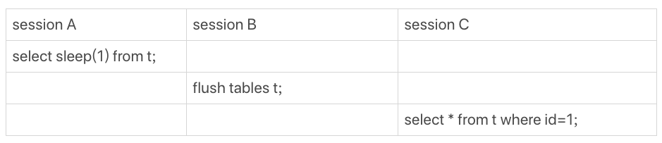
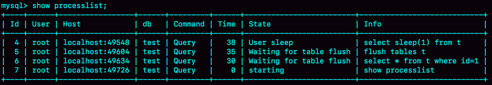
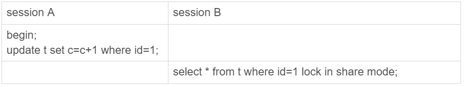
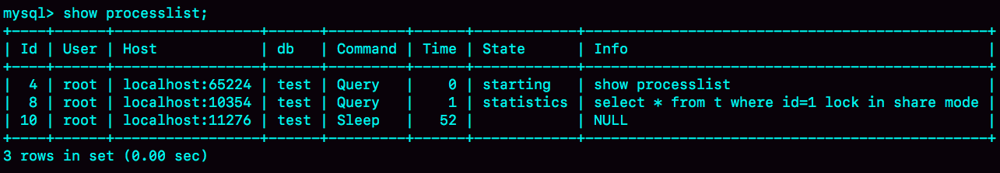
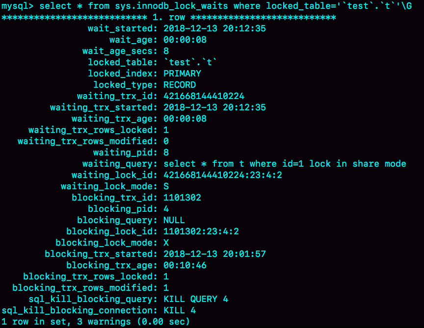
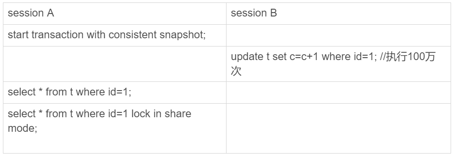
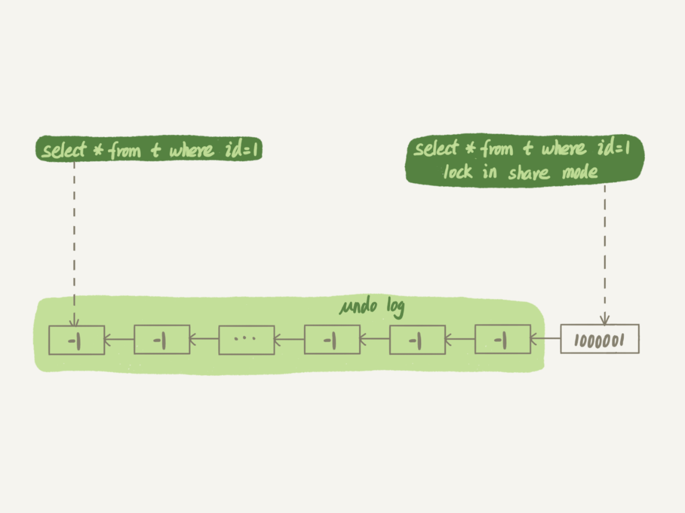

# 19讲 为什么我只查一行的语句，也执行这么慢

## 准备工作

建表语句

```mysql
mysql> CREATE TABLE `t` (
  `id` int(11) NOT NULL,
  `c` int(11) DEFAULT NULL,
  PRIMARY KEY (`id`)
) ENGINE=InnoDB;

delimiter ;;
create procedure idata()
begin
  declare i int;
  set i=1;
  while(i<=100000)do
    insert into t values(i,i);
    set i=i+1;
  end while;
end;;
delimiter ;

call idata();
```


## 第一类：查询长时间不返回

### 1.等MDL锁（ metadata lock）

复现方案：


手动创建MDL写锁 ：lock table table_name write;

### 2.等flush



1.session A 让表始终被使用

2.session B 被 A 阻塞

3.session C 被 B阻塞

效果如下：



### 3.等行锁



1. session A开启事务，更新 id为1的数据，占有写锁，未提交
2. session B尝试获取共享锁，会获取失败，提示： Lock wait timeout exceeded; try restarting transaction。

效果：



如果MySQL版本为5.7，可以通过sys.innodb_lock_waits 表查到谁在占有所

```mysql
mysql> select * from t sys.innodb_lock_waits where locked_table=`'test'.'t'`\G
```



## 第二类：查询慢

通过了表级锁、行级锁的阻塞之后，看一些查询慢的问题。

### 1.扫描行数过多

下面是一个简单的查询语句。

```
select * from t where c=50000 ;
```

由于c列没有索引，虽然只有一条记录是目标记录，但实际会扫描全表的数据（10w行）。

尽管它不是慢sql，但却是个坏sql

慢日志记录如下：

```
# Time: 2021-05-21T08:42:20.063436Z
# User@Host: root[root] @ localhost [127.0.0.1]  Id:     5
# Query_time: 0.024938  Lock_time: 0.000077 Rows_sent: 1  Rows_examined: 100000
SET timestamp=1621586540;
select * from t where c=50000;
```

如果此类业务很多的话，那么就有必要将c字段加索引了。

### 2.一致性读

若需要读取的记录被其他事务更新了多个版本，就会出现当前读比一致性读效率更高的情况。



其中，第二个select语句通过lock in share mode进行当前读，反而会比未加锁的语句更快。

原理如下：



session B更新完100万次，生成了100万个回滚日志(undo log)。

带lock in share mode的SQL语句，是当前读，因此会直接读到1000001这个结果，所以速度很快；而select * from t where id=1这个语句，是一致性读，因此需要从1000001开始，依次执行undo log，执行了100万次以后，才将1这个结果返回。

注意，undo log里记录的其实是“把2改成1”，“把3改成2”这样的操作逻辑，画成减1的目的是方便你看图。