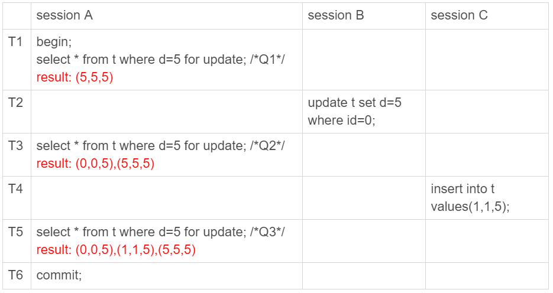
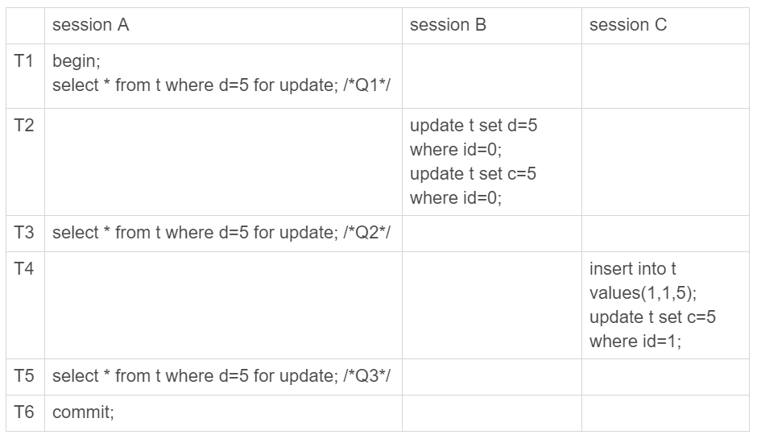
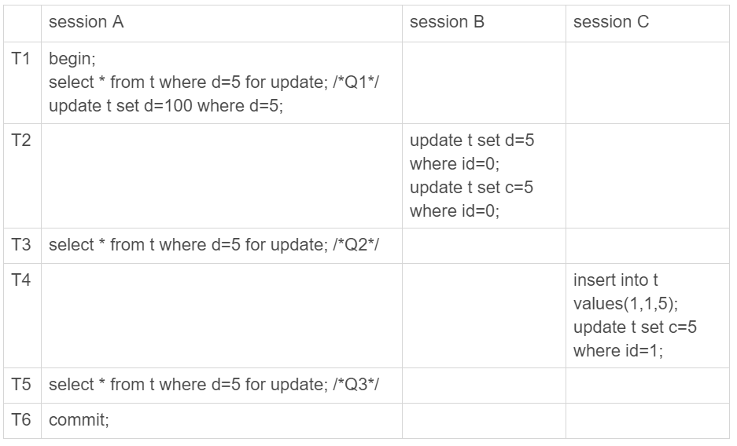
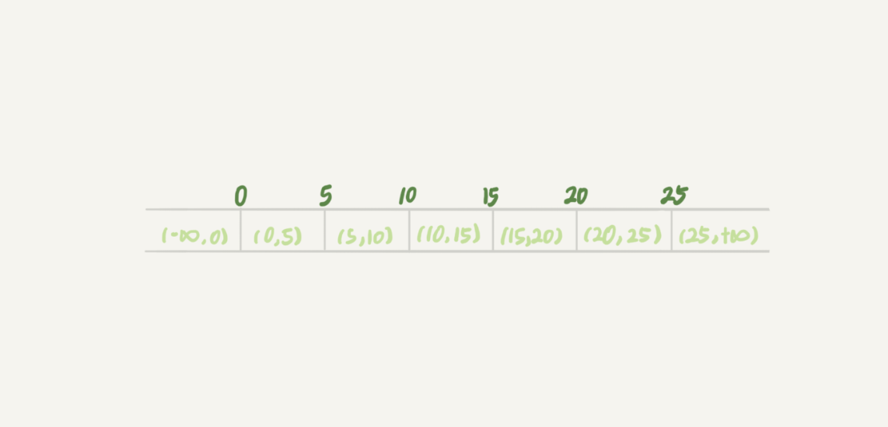
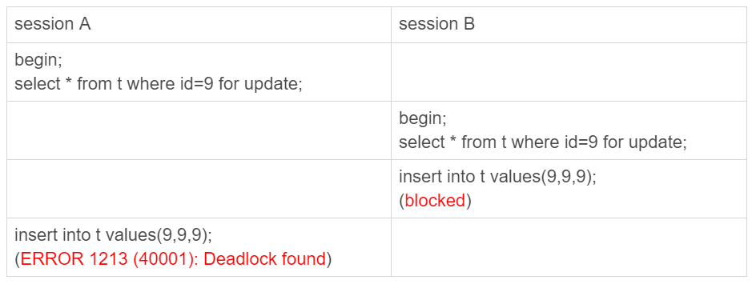

# 20讲：幻读是什么，幻读有什么问题

## 1.幻读的出现

看以下场景，讲述了幻读的出现。



可以看到，session A里执行了三次查询，分别是Q1、Q2和Q3。它们的SQL语句相同，都是select * from t where d=5 for update。这个语句的意思你应该很清楚了，查所有d=5的行，而且使用的是当前读，并且加上写锁。现在，我们来看一下这三条SQL语句，分别会返回什么结果。

1. Q1只返回id=5这一行；
2. 在T2时刻，session B把id=0这一行的d值改成了5，因此T3时刻Q2查出来的是id=0和id=5这两行；
3. 在T4时刻，session C又插入一行（1,1,5），因此T5时刻Q3查出来的是id=0、id=1和id=5的这三行。

其中，Q3读到id=1这一行的现象，被称为“幻读”。也就是说，幻读指的是一个事务在前后两次查询同一个范围的时候，后一次查询看到了前一次查询没有看到的行。

幻读的定义：

1. 在可重复读隔离级别下，普通的查询是快照读，是不会看到别的事务插入的数据的。因此，幻读在“当前读”下才会出现。
2. 上面session B的修改结果，被session A之后的select语句用“当前读”看到，不能称为幻读。幻读仅专指“新插入的行”。

## 2.幻读有什么问题

**1、首先是语义上的锁未能实现。**



session  A在T1声明要锁住所有d=5的行，但实际在session B和C中，对d为5的两条记录进行了修改。

**2.数据一致性的问题**



上述三个事务形成的binlog语序如下：

```mysql
update t set d=5 where id=0; /*(0,0,5)*/
update t set c=5 where id=0; /*(0,5,5)*/

insert into t values(1,1,5); /*(1,1,5)*/
update t set c=5 where id=1; /*(1,5,5)*/

update t set d=100 where d=5;/*所有d=5的行，d改成100*/
```

这个语句序列，不论是拿到备库去执行，还是以后用binlog来克隆一个库，这三行的结果，都变成了 (0,5,100)、(1,5,100)和(5,5,100)。

也就是说，id=0和id=1这两行，发生了数据不一致。这个问题很严重，是不行的。

**这是我们假设“select * from t where d=5 for update这条语句只给d=5这一行，也就是id=5的这一行加锁”导致的。**

**3.幻读产生的原因**

现在你知道了，产生幻读的原因是，行锁只能锁住行，但是新插入记录这个动作，要更新的是记录之间的“间隙”。因此，为了解决幻读问题，InnoDB只好引入新的锁，也就是**间隙锁(Gap Lock)**。

顾名思义，间隙锁，锁的就是两个值之间的空隙。比如文章开头的表t，初始化插入了6个记录，这就产生了7个间隙。



行锁，分成读锁和写锁。下图就是这两种类型行锁的冲突关系。


也就是说，跟行锁有冲突关系的是“另外一个行锁”。

但是间隙锁不一样，**跟间隙锁存在冲突关系的，是“往这个间隙中插入一个记录”这个操作。**间隙锁之间都不存在冲突关系。

间隙锁和行锁合称next-key lock，每个next-key lock是前开后闭区间。也就是说，我们的表t初始化以后，如果用select * from t for update要把整个表所有记录锁起来，就形成了7个next-key lock，分别是 (-∞,0]、(0,5]、(5,10]、(10,15]、(15,20]、(20, 25]、(25, +suprenum]。

这个suprenum从哪儿来的呢？这是因为+∞是开区间。实现上，InnoDB给每个索引加了一个不存在的最大值suprenum，这样才符合我们前面说的“都是前开后闭区间”。

**间隙锁和next-key lock的引入，帮我们解决了幻读的问题，但同时也带来了一些“困扰”。**

**4.间隙锁带来的困扰**

对应到我们这个例子的表来说，业务逻辑这样的：任意锁住一行，如果这一行不存在的话就插入，如果存在这一行就更新它的数据，代码如下：

```mysql
begin;
select * from t where id=N for update;

/*如果行不存在*/
insert into t values(N,N,N);
/*如果行存在*/
update t set d=N set id=N;

commit;
```

这个同学碰到的现象是，这个逻辑一旦有并发，就会碰到死锁。你一定也觉得奇怪，这个逻辑每次操作前用for update锁起来，已经是最严格的模式了，怎么还会有死锁呢？

这里，我用两个session来模拟并发，并假设N=9。



你看到了，其实都不需要用到后面的update语句，就已经形成死锁了。我们按语句执行顺序来分析一下：

1. session A 执行select ... for update语句，由于id=9这一行并不存在，因此会加上间隙锁(5,10);
2. session B 执行select ... for update语句，同样会加上间隙锁(5,10)，间隙锁之间不会冲突，因此这个语句可以执行成功；
3. session B 试图插入一行(9,9,9)，被session A的间隙锁挡住了，只好进入等待；
4. session A试图插入一行(9,9,9)，被session B的间隙锁挡住了。

至此，两个session进入互相等待状态，形成死锁。当然，InnoDB的死锁检测马上就发现了这对死锁关系，让session A的insert语句报错返回了。

你现在知道了，**间隙锁的引入，可能会导致同样的语句锁住更大的范围，这其实是影响了并发度的**。

间隙锁是在可重复读隔离级别下才会生效的。所以，你如果把隔离级别设置为读提交的话，就没有间隙锁了。但同时，你要解决可能出现的数据和日志不一致问题，需要把binlog格式设置为row。这，也是现在不少公司使用的配置组合。