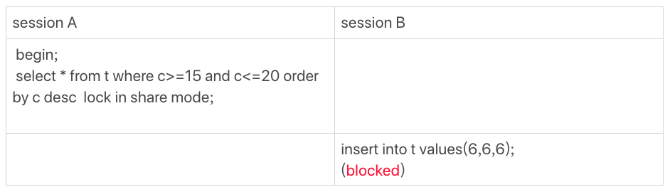

# 21讲：为什么我只改一行的语句，锁这么多

## 加锁规则

1. 原则1：加锁的基本单位是next-key lock。希望你还记得，next-key lock是前开后闭区间。
2. 原则2：查找过程中访问到的对象才会加锁。
3. 优化1：索引上的等值查询，给唯一索引加锁的时候，next-key lock退化为行锁。
4. 优化2：索引上的等值查询，向右遍历时且最后一个值不满足等值条件的时候，next-key lock退化为间隙锁。
5. 一个bug：唯一索引上的范围查询会访问到不满足条件的第一个值为止。

**在删除数据的时候尽量加limit**。这样不仅可以控制删除数据的条数，让操作更安全，还可以减小加锁的范围。会比不用limit少一个间隙锁。

也就是说，我们在分析加锁规则的时候可以用next-key lock来分析。但是要知道，具体执行的时候，是要分成间隙锁和行锁两段来执行的。

排序规则会影响到锁的范围，例如当以索引倒叙排列时，会以范围查询的最右边开始定位。

示例如下：下面这个图的执行序列中，为什么session B的insert语句会被堵住。

我们用上一篇的加锁规则来分析一下，看看session A的select语句加了哪些锁：

1. 由于是order by c desc，第一个要定位的是索引c上“最右边的”c=20的行，所以会加上间隙锁(20,25)和next-key lock (15,20]。
2. 在索引c上向左遍历，要扫描到c=10才停下来，所以next-key lock会加到(5,10]，这正是阻塞session B的insert语句的原因。
3. 在扫描过程中，c=20、c=15、c=10这三行都存在值，由于是select *，所以会在主键id上加三个行锁。

因此，session A 的select语句锁的范围就是：

1. 索引c上 (5, 25)；
2. 主键索引上id=10、15、20三个行锁。

这里，我再啰嗦下，你会发现我在文章中，每次加锁都会说明是加在“哪个索引上”的。因为，锁就是加在索引上的，这是InnoDB的一个基础设定，需要你在分析问题的时候要一直记得。