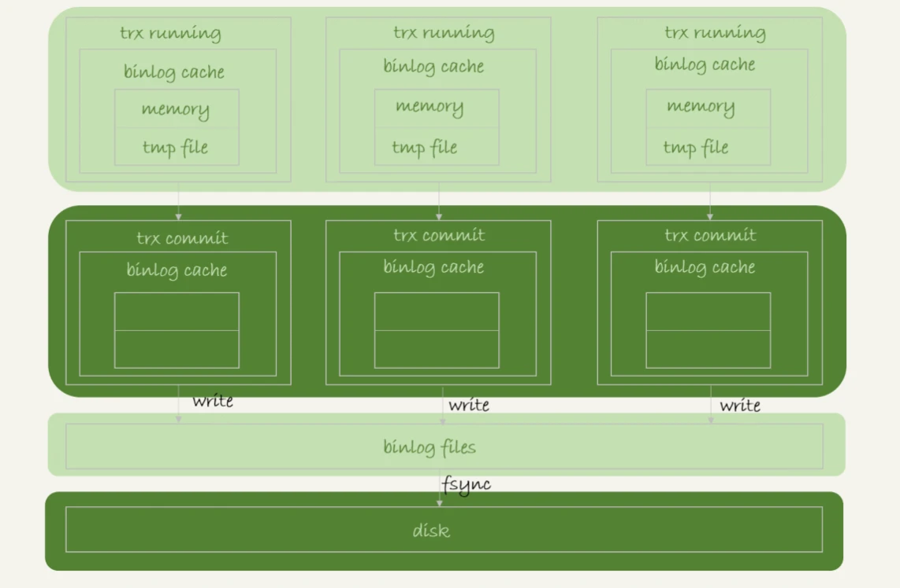
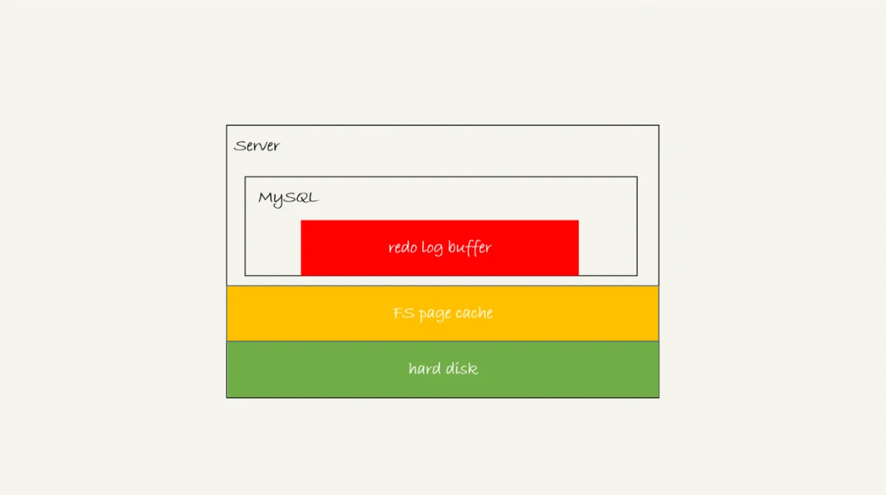

# 23讲 MySQL 是怎么保证数据不丢的

## WAL 机制

WAL，全称是Write-Ahead Logging， 预写日志系统。指的是 MySQL 的写操作并不是立刻更新到磁盘上，而是先记录在日志上，然后在合适的时间再更新到磁盘上。这样的好处是错开高峰期。

日志主要分为 undo log、redo log、binlog。作用分别是 " 完成MVCC从而实现 MySQL 的隔离级别 "、" 降低随机写的性能消耗（转成顺序写），同时防止写操作因为宕机而丢失 "、" 写操作的备份，保证主从一致 "。关于这三种日志的内容讲的比较分散且具体的执行过程没有提到，所以这里来总结一下这三种日志。

 

## binlog 写入机制

1. 事务执行中，日志写入到 binlog cache

2. 事务提交时，binlog cache 写到 binlog 文件，并清空 binlog cache
3. fsync操作将 binlog 持久化到硬盘，可以通过参数 sync_binlog 控制多少次事务才会进行 fsync

写入流程如图所示：

write 和fsync的时机，是由参数sync_binlog控制的：

1. sync_binlog=0的时候，表示每次提交事务都只write，不fsync；
2. sync_binlog=1的时候，表示每次提交事务都会执行fsync；
3. sync_binlog=N(N>1)的时候，表示每次提交事务都write，但累积N个事务后才fsync。

因此，在出现IO瓶颈的场景里，将sync_binlog设置成一个比较大的值，可以提升性能。在实际的业务场景中，考虑到丢失日志量的可控性，一般不建议将这个参数设成0，比较常见的是将其设置为100~1000中的某个数值。

但是，将sync_binlog设置为N，对应的风险是：如果主机发生异常重启，会丢失最近N个事务的binlog日志。

## redo log的写入机制

这三种状态分别是：

1. 存在redo log buffer中，物理上是在MySQL进程内存中，就是图中的红色部分；
2. 写到磁盘(write)，但是没有持久化（fsync)，物理上是在文件系统的page cache里面，也就是图中的黄色部分；
3. 持久化到磁盘，对应的是hard disk，也就是图中的绿色部分。

为了控制redo log的写入策略，InnoDB提供了innodb_flush_log_at_trx_commit参数，它有三种可能取值：

1. 设置为0的时候，表示每次事务提交时都只是把redo log留在redo log buffer中;
2. 设置为1的时候，表示每次事务提交时都将redo log直接持久化到磁盘；
3. 设置为2的时候，表示每次事务提交时都只是把redo log写到page cache。

事务还没提交的时候，redo log buffer中的部分日志有没有可能被持久化到磁盘呢

**InnoDB有一个后台线程，每隔1秒，就会把redo log buffer中的日志，调用write写到文件系统的page cache，然后调用fsync持久化到磁盘。**

实际上，除了后台线程每秒一次的轮询操作外，还有两种场景会让一个没有提交的事务的redo log写入到磁盘中。

1. **一种是，redo log buffer占用的空间即将达到 innodb_log_buffer_size一半的时候，后台线程会主动写盘。**注意，由于这个事务并没有提交，所以这个写盘动作只是write，而没有调用fsync，也就是只留在了文件系统的page cache。
2. **另一种是，并行的事务提交的时候，顺带将这个事务的redo log buffer持久化到磁盘。**假设一个事务A执行到一半，已经写了一些redo log到buffer中，这时候有另外一个线程的事务B提交，如果innodb_flush_log_at_trx_commit设置的是1，那么按照这个参数的逻辑，事务B要把redo log buffer里的日志全部持久化到磁盘。这时候，就会带上事务A在redo log buffer里的日志一起持久化到磁盘。

## 组提交

## 通过 WAL 机制解决 MySQL 性能瓶颈

**如果你的MySQL现在出现了性能瓶颈，而且瓶颈在IO上，可以通过哪些方法来提升性能呢？**

针对这个问题，可以考虑以下三种方法：

1. 设置 binlog_group_commit_sync_delay 和 binlog_group_commit_sync_no_delay_count参数，减少binlog的写盘次数。这个方法是基于“额外的故意等待”来实现的，**因此可能会增加语句的响应时间**，但没有丢失数据的风险。
2. 将sync_binlog 设置为大于1的值（比较常见是100~1000）。这样做的风险是，**主机掉电时会丢binlog日志**。
3. 将innodb_flush_log_at_trx_commit设置为2。这样做的风险是，**主机掉电的时候会丢数据**。

我不建议你把innodb_flush_log_at_trx_commit 设置成0。因为把这个参数设置成0，表示redo log只保存在内存中，这样的话MySQL本身异常重启也会丢数据，风险太大。而redo log写到文件系统的page cache的速度也是很快的，所以将这个参数设置成2跟设置成0其实性能差不多，但这样做MySQL异常重启时就不会丢数据了，相比之下风险会更小。

## crash-safe 的作用

实际上数据库的crash-safe保证的是：

1. 如果客户端收到事务成功的消息，事务就一定持久化了；
2. 如果客户端收到事务失败（比如主键冲突、回滚等）的消息，事务就一定失败了；
3. 如果客户端收到“执行异常”的消息，应用需要重连后通过查询当前状态来继续后续的逻辑。此时数据库只需要保证内部（数据和日志之间，主库和备库之间）一致就可以了。

## 涉及的 MySQL参数

### sync_binlog：控制write 和fsync的时机

1. sync_binlog=0的时候，表示每次提交事务都只write，不fsync；
2. sync_binlog=1的时候，表示每次提交事务都会执行fsync；
3. sync_binlog=N(N>1)的时候，表示每次提交事务都write，但累积N个事务后才fsync。

因此，在出现IO瓶颈的场景里，将sync_binlog设置成一个比较大的值，可以提升性能。在实际的业务场景中，考虑到丢失日志量的可控性，一般不建议将这个参数设成0，比较常见的是将其设置为100~1000中的某个数值。

但是，将sync_binlog设置为N，对应的风险是：如果主机发生异常重启，会丢失最近N个事务的binlog日志。

### binlog 延迟提交

binlog_group_commit_sync_delay ：表示延迟多少微秒后才调用fsync

binlog_group_commit_sync_no_delay_count :表示累积多少次以后才调用fsync

**这两个条件是或的关系，也就是说只要有一个满足条件就会调用fsync。**

所以，当binlog_group_commit_sync_delay设置为0的时候，binlog_group_commit_sync_no_delay_count也无效了。