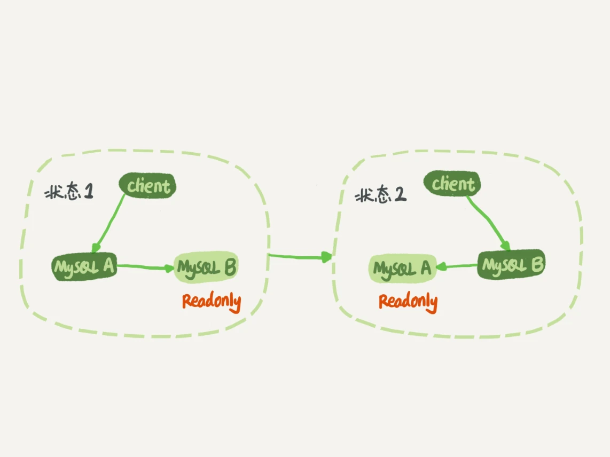
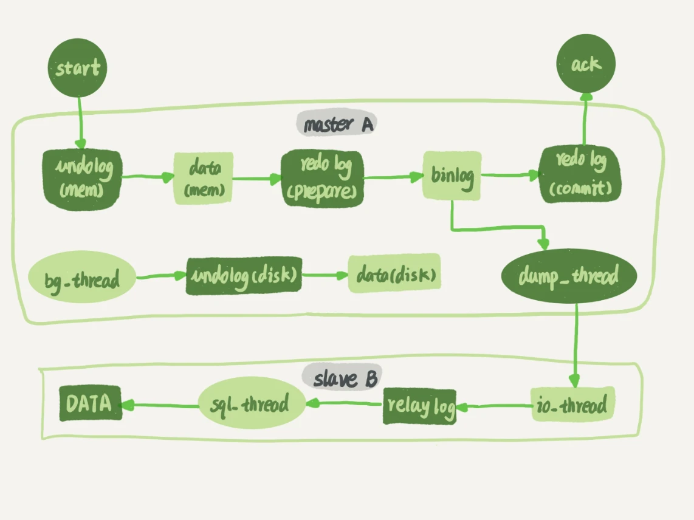
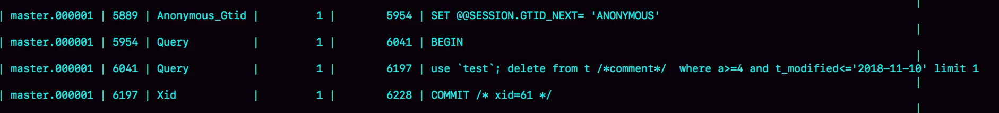
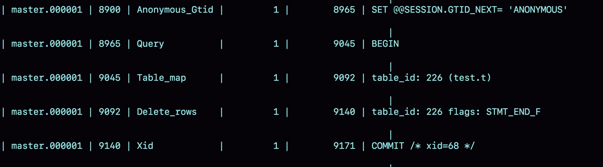
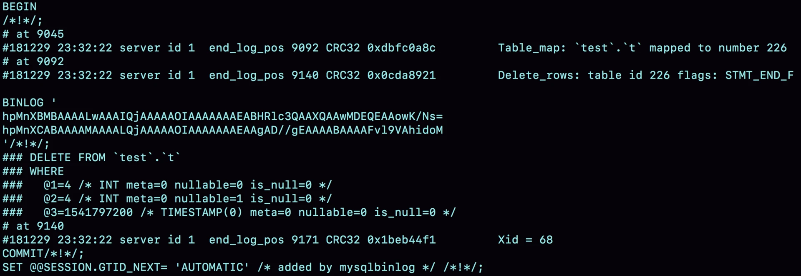
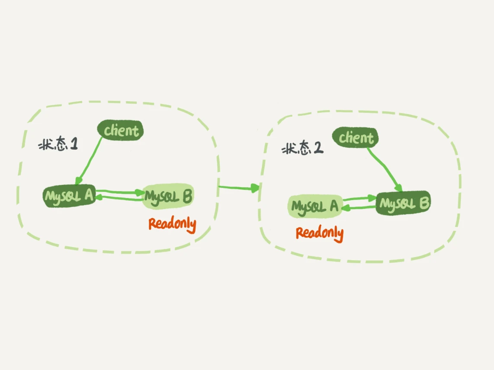

# 24讲 MySQL是怎么保证主备一致的

> 在最开始，MySQL是以容易学习和方便的高可用架构，被开发人员青睐的。而它的几乎所有的高可用架构，都直接依赖于binlog。虽然这些高可用架构已经呈现出越来越复杂的趋势，但都是从最基本的一主一备演化过来的。

## MySQL主备的基本原理

如图1所示就是基本的主备切换流程。



在状态1中，客户端的读写都直接访问节点A，而节点B是A的备库，只是将A的更新都同步过来，到本地执行。这样可以保持节点B和A的数据是相同的。

当需要切换的时候，就切成状态2。这时候客户端读写访问的都是节点B，而节点A是B的备库。

**把节点B（也就是备库）设置成只读（readonly）模式。这样做，有以下几个考虑**：

1. 有时候一些运营类的查询语句会被放到备库上去查，设置为只读可以防止误操作；
2. 防止切换逻辑有bug，比如切换过程中出现双写，造成主备不一致；
3. 可以用readonly状态，来判断节点的角色。

**备库设置成只读了，还怎么跟主库保持同步更新呢？**

这个问题，你不用担心。因为readonly设置对超级(super)权限用户是无效的，而用于同步更新的线程，就拥有超级权限。

接下来，我们再看看**节点A到B这条线的内部流程是什么样的**。图2中画出的就是一个update语句在节点A执行，然后同步到节点B的完整流程图。



图2中，包含了我在上一篇文章中讲到的binlog和redo log的写入机制相关的内容，可以看到：主库接收到客户端的更新请求后，执行内部事务的更新逻辑，同时写binlog。

备库B跟主库A之间维持了一个长连接。主库A内部有一个线程，专门用于服务备库B的这个长连接。一个事务日志同步的完整过程是这样的：

1. 在备库B上通过change master命令，设置主库A的IP、端口、用户名、密码，以及要从哪个位置开始请求binlog，这个位置包含文件名和日志偏移量。
2. 在备库B上执行start slave命令，这时候备库会启动两个线程，就是图中的io_thread和sql_thread。其中io_thread负责与主库建立连接。
3. 主库A校验完用户名、密码后，开始按照备库B传过来的位置，从本地读取binlog，发给B。
4. 备库B拿到binlog后，写到本地文件，称为**中转日志（relay log）**。
5. sql_thread读取中转日志，解析出日志里的命令，并执行。

这里需要说明，后来由于多线程复制方案的引入，sql_thread演化成为了多个线程，跟我们今天要介绍的原理没有直接关系，暂且不展开。

## binlog的三种格式对比

三种格式

1. statement
2. row
3. mixed

### statement格式

当binlog_format=statement时，binlog里面记录的就是SQL语句的原文。你可以用

```
mysql> show binlog events in 'master.000001';
```



命令看binlog中的内容。

statement格式下存储的是执行的原语句。执行该语句时会有一个warning存在，原因是当前binlog设置的是statement格式，并且语句中有limit，所以这个命令可能是unsafe的。

为什么这么说呢？这是因为delete 带limit，很可能会出现主备数据不一致的情况。比如上面这个例子：

1. 如果delete语句使用的是索引a，那么会根据索引a找到第一个满足条件的行，也就是说删除的是a=4这一行；
2. 但如果使用的是索引t_modified，那么删除的就是 t_modified='2018-11-09’也就是a=5这一行。

由于statement格式下，记录到binlog里的是语句原文，因此可能会出现这样一种情况：在主库执行这条SQL语句的时候，用的是索引a；而在备库执行这条SQL语句的时候，却使用了索引t_modified。因此，MySQL认为这样写是有风险的。

### row格式

当binlog_format=row时，binlog中并不记录原文，而是会记录真实删除行的主键id。



可以看到，与statement格式的binlog相比，前后的BEGIN和COMMIT是一样的。但是，row格式的binlog里没有了SQL语句的原文，而是替换成了两个event：Table_map和Delete_rows。

1. Table_map event，用于说明接下来要操作的表是test库的表t;
2. Delete_rows event，用于定义删除的行为。

借助mysqlbinlog工具，可以看到binlog中的内容

```
mysqlbinlog  -vv data/master.000001 --start-position=8900;
```



从这个图中，我们可以看到以下几个信息：

- server id 1，表示这个事务是在server_id=1的这个库上执行的。
- 每个event都有CRC32的值，这是因为我把参数binlog_checksum设置成了CRC32。
- Table_map event跟在图5中看到的相同，显示了接下来要打开的表，map到数字226。现在我们这条SQL语句只操作了一张表，如果要操作多张表呢？每个表都有一个对应的Table_map event、都会map到一个单独的数字，用于区分对不同表的操作。
- 我们在mysqlbinlog的命令中，使用了-vv参数是为了把内容都解析出来，所以从结果里面可以看到各个字段的值（比如，@1=4、 @2=4这些值）。
- binlog_row_image的默认配置是FULL，因此Delete_event里面，包含了删掉的行的所有字段的值。如果把binlog_row_image设置为MINIMAL，则只会记录必要的信息，在这个例子里，就是只会记录id=4这个信息。
- 最后的Xid event，用于表示事务被正确地提交了。

你可以看到，当binlog_format使用row格式的时候，binlog里面记录了真实删除行的主键id，这样binlog传到备库去的时候，就肯定会删除id=4的行，不会有主备删除不同行的问题。

### 为什么会有mixed格式的binlog？

基于上面的信息，我们来讨论一个问题：**为什么会有mixed这种binlog格式的存在场景？**推论过程是这样的：

- 因为有些statement格式的binlog可能会导致主备不一致，所以要使用row格式。
- 但row格式的缺点是，很占空间。比如你用一个delete语句删掉10万行数据，用statement的话就是一个SQL语句被记录到binlog中，占用几十个字节的空间。但如果用row格式的binlog，就要把这10万条记录都写到binlog中。这样做，不仅会占用更大的空间，同时写binlog也要耗费IO资源，影响执行速度。
- 所以，MySQL就取了个折中方案，也就是有了mixed格式的binlog。mixed格式的意思是，MySQL自己会判断这条SQL语句是否可能引起主备不一致，如果有可能，就用row格式，否则就用statement格式。

也就是说，mixed格式可以利用statment格式的优点，同时又避免了数据不一致的风险。

因此，如果你的线上MySQL设置的binlog格式是statement的话，那基本上就可以认为这是一个不合理的设置。**你至少应该把binlog的格式设置为mixed。**

比如我们这个例子，设置为mixed后，就会记录为row格式；而如果执行的语句去掉limit 1，就会记录为statement格式。

### 为什么更多的场景要求格式必须为row？

现在越来越多的场景要求把MySQL的binlog格式设置成row。这么做的理由有很多，我来给你举一个可以直接看出来的好处：**恢复数据**。

即使我执行的是delete语句，row格式的binlog也会把被删掉的行的整行信息保存起来。所以，如果你在执行完一条delete语句以后，发现删错数据了，可以直接把binlog中记录的delete语句转成insert，把被错删的数据插入回去就可以恢复了。

如果你是执行错了insert语句呢？那就更直接了。row格式下，insert语句的binlog里会记录所有的字段信息，这些信息可以用来精确定位刚刚被插入的那一行。这时，你直接把insert语句转成delete语句，删除掉这被误插入的一行数据就可以了。

如果执行的是update语句的话，binlog里面会记录修改前整行的数据和修改后的整行数据。所以，如果你误执行了update语句的话，只需要把这个event前后的两行信息对调一下，再去数据库里面执行，就能恢复这个更新操作了。

其实，由delete、insert或者update语句导致的数据操作错误，需要恢复到操作之前状态的情况，也时有发生。MariaDB的[Flashback](https://mariadb.com/kb/en/library/flashback/)工具就是基于上面介绍的原理来回滚数据的。

## 循环复制问题

图1中我画的是M-S结构，但实际生产上使用比较多的是双M结构，也就是图9所示的主备切换流程。



你可以发现，双M结构和M-S结构，其实区别只是多了一条线，即：节点A和B之间总是互为主备关系。这样在切换的时候就不用再修改主备关系。

双M会导致一个问题，业务逻辑在节点A上更新了一条语句，然后再把生成的binlog 发给节点B，节点B执行完这条更新语句后也会生成binlog。（**我建议你把参数log_slave_updates设置为on，表示备库执行relay log后生成binlog**）。

如果节点A同时是节点B的备库，相当于又把节点B新生成的binlog拿过来执行了一次，然后节点A和B间，会不断地循环执行这个更新语句，也就是循环复制了。这个要怎么解决呢？

MySQL在binlog中记录了这个命令第一次执行时所在实例的server id。因此，我们可以用下面的逻辑，来解决两个节点间的循环复制的问题：

1. 规定两个库的server id必须不同，如果相同，则它们之间不能设定为主备关系；
2. 一个备库接到binlog并在重放的过程中，生成与原binlog的server id相同的新的binlog；
3. 每个库在收到从自己的主库发过来的日志后，先判断server id，如果跟自己的相同，表示这个日志是自己生成的，就直接丢弃这个日志。

按照这个逻辑，如果我们设置了双M结构，日志的执行流就会变成这样：

1. 从节点A更新的事务，binlog里面记的都是A的server id；
2. 传到节点B执行一次以后，节点B生成的binlog 的server id也是A的server id；
3. 再传回给节点A，A判断到这个server id与自己的相同，就不会再处理这个日志。所以，死循环在这里就断掉了。

### 循环复制问题别根本上解决了么？

