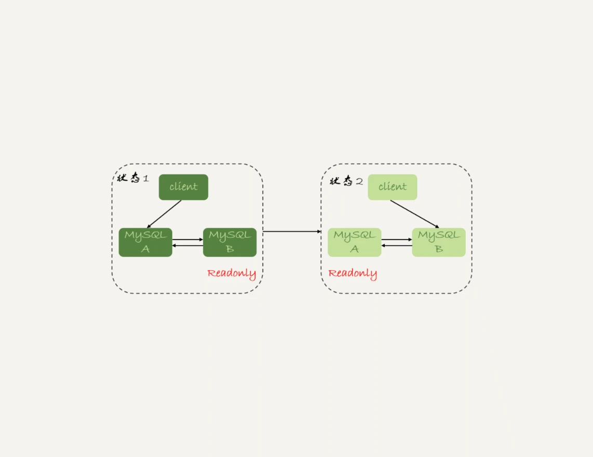

# 25讲MySQL是怎么保证高可用的

> 正常情况下，只要主库执行更新生成的所有binlog，都可以传到备库并被正确地执行，备库就能达到跟主库一致的状态，这就是最终一致性。但是，MySQL要提供高可用能力，只有最终一致性是不够的。

双M结构的主备切换流程图。

## 主备延迟

主备切换可能是一个主动运维动作，比如软件升级、主库所在机器按计划下线等，也可能是被动操作，比如主库所在机器掉电。

“同步延迟”。与数据同步有关的时间点主要包括以下三个：

1. 主库A执行完成一个事务，写入binlog，我们把这个时刻记为T1;
2. 之后传给备库B，我们把备库B接收完这个binlog的时刻记为T2;
3. 备库B执行完成这个事务，我们把这个时刻记为T3。

**所谓主备延迟，就是同一个事务，在备库执行完成的时间和主库执行完成的时间之间的差值，也就是T3-T1。**

你可以在备库上执行**show slave status**命令，它的返回结果里面会显示seconds_behind_master，用于表示当前备库延迟了多少秒。

seconds_behind_master的计算方法是这样的：

1. 每个事务的binlog 里面都有一个时间字段，用于记录主库上写入的时间；
2. 备库取出当前正在执行的事务的时间字段的值，计算它与当前系统时间的差值，得到seconds_behind_master。

可以看到，其实seconds_behind_master这个参数计算的就是T3-T1。所以，我们可以用seconds_behind_master来作为主备延迟的值，这个值的时间精度是秒。

### 主动切换