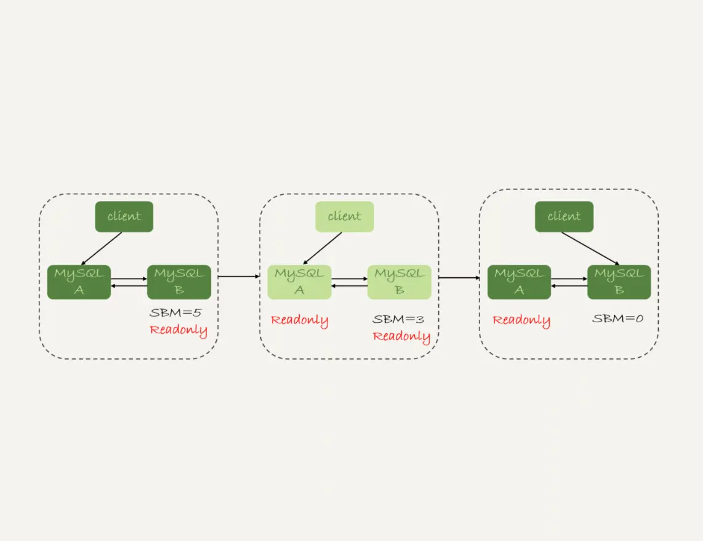
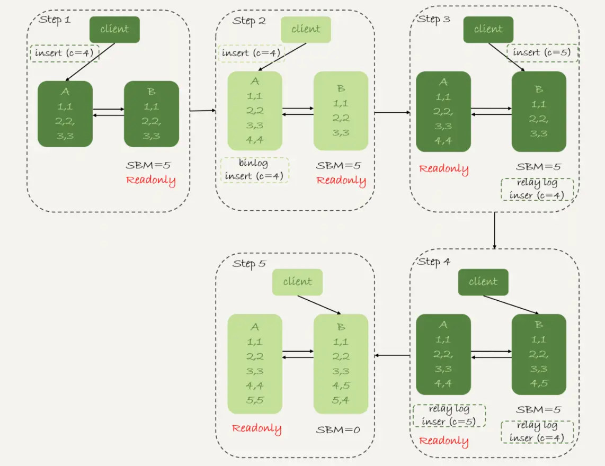
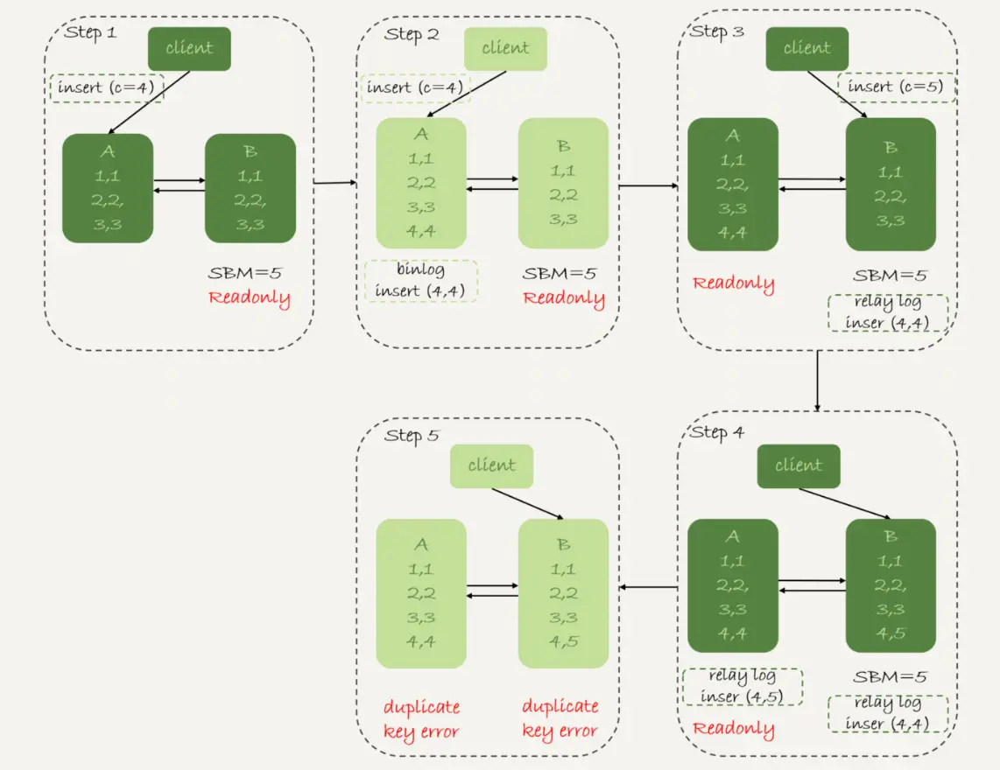
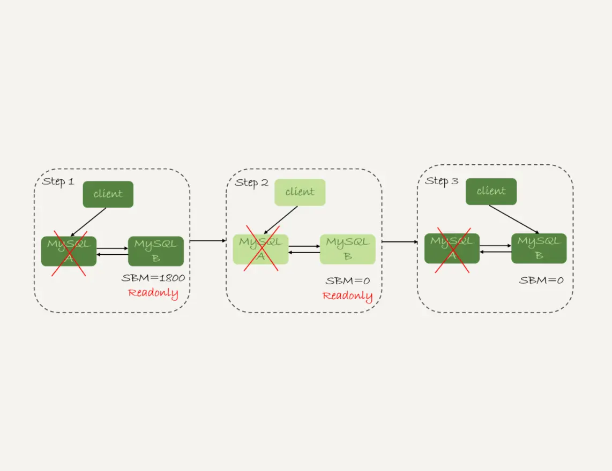
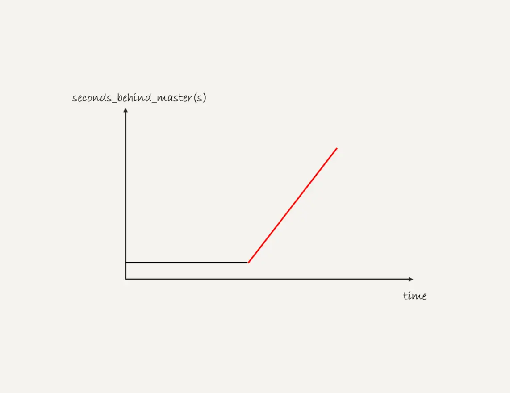

# 25讲MySQL是怎么保证高可用的

> 正常情况下，只要主库执行更新生成的所有binlog，都可以传到备库并被正确地执行，备库就能达到跟主库一致的状态，这就是最终一致性。但是，MySQL要提供高可用能力，只有最终一致性是不够的。


<center>图 1 MySQL主备切换流程--双M结构</center>

## 主备延迟

主备切换可能是一个主动运维动作，比如软件升级、主库所在机器按计划下线等，也可能是被动操作，比如主库所在机器掉电。

“同步延迟”。与数据同步有关的时间点主要包括以下三个：

1. 主库A执行完成一个事务，写入binlog，我们把这个时刻记为T1;
2. 之后传给备库B，我们把备库B接收完这个binlog的时刻记为T2;
3. 备库B执行完成这个事务，我们把这个时刻记为T3。

**所谓主备延迟，就是同一个事务，在备库执行完成的时间和主库执行完成的时间之间的差值，也就是T3-T1。**

你可以在备库上执行**show slave status**命令，它的返回结果里面会显示seconds_behind_master，用于表示当前备库延迟了多少秒。

seconds_behind_master的计算方法是这样的：

1. 每个事务的binlog 里面都有一个时间字段，用于记录主库上写入的时间；
2. 备库取出当前正在执行的事务的时间字段的值，计算它与当前系统时间的差值，得到seconds_behind_master。

可以看到，其实seconds_behind_master这个参数计算的就是T3-T1。所以，我们可以用seconds_behind_master来作为主备延迟的值，这个值的时间精度是秒。

**如果主备库机器的系统时间设置不一致，会不会导致主备延迟的值不准？**

其实不会的。因为，备库连接到主库的时候，会通过执行SELECT UNIX_TIMESTAMP()函数来获得当前主库的系统时间。如果这时候发现主库的系统时间与自己不一致，备库在执行seconds_behind_master计算的时候会自动扣掉这个差值。

需要说明的是，在网络正常的时候，日志从主库传给备库所需的时间是很短的，即T2-T1的值是非常小的。也就是说，网络正常情况下，主备延迟的主要来源是备库接收完binlog和执行完这个事务之间的时间差。

所以说，主备延迟最直接的表现是，备库消费中转日志（relay log）的速度，比主库生产binlog的速度要慢。

### 主备延迟的来源

1.**备库所在机器的性能要比主库所在的机器性能差**

2.**备库的压力大**

3.**大事务**。批量删除，大表DDL。

## 主动切换

在主动切换的场景中，有两类策略可选，可靠性优先策略和可用性优先策略。可靠指数据可靠，

### 可靠性优先策略

在图1的双M结构下，从状态1到状态2切换的详细过程是这样的：

1. 判断备库B现在的seconds_behind_master，如果小于某个值（比如5秒）继续下一步，否则持续重试这一步；
2. 把主库A改成只读状态，即把readonly设置为true；
3. 判断备库B的seconds_behind_master的值，直到这个值变成0为止；
4. 把备库B改成可读写状态，也就是把readonly 设置为false；
5. 把业务请求切到备库B。

这个切换流程，一般是由专门的HA系统来完成的，我们暂时称之为可靠性优先流程。



<center>图2 MySQL可靠性优先主备切换流程</center>

图中的SBM，是seconds_behind_master参数的简写。

可以看到，这个切换流程中是有不可用时间的。因为在步骤2之后，主库A和备库B都处于readonly状态，也就是说这时系统处于不可写状态，直到步骤5完成后才能恢复。

在这个不可用状态中，比较耗费时间的是步骤3，可能需要耗费好几秒的时间。这也是为什么需要在步骤1先做判断，确保seconds_behind_master的值足够小。

当然，系统的不可用时间，是由这个数据可靠性优先的策略决定的。你也可以选择可用性优先的策略，来把这个不可用时间几乎降为0。

### 可用性优先策略

如果我强行把步骤4、5调整到最开始执行，也就是说不等主备数据同步，直接把连接切到备库B，并且让备库B可以读写，那么系统几乎就没有不可用时间了。

我们把这个切换流程，暂时称作可用性优先流程。这个切换流程的代价，就是可能出现数据不一致的情况。



<center>图3 可用性优先策略，且binlog_format=mixed</center>

mixed时，由于binlog只记录执行语句，导致两边各插入错误数据，引起数据不一致。



<center>图4 可用性优先策略，且binlog_format=row</center>

在row模式下，由于binlog 记录的是所有字段值，会出现两边根据binlog恢复数据时出现主键冲突，引起数据不一致。

### 

## 异常切换

假设，主库A和备库B间的主备延迟是30分钟，这时候主库A掉电了，HA系统要切换B作为主库。我们在主动切换的时候，可以等到主备延迟小于5秒的时候再启动切换，但这时候已经别无选择了。



<center>图5 可靠性优先策略，主库不可用</center>

采用可靠性优先策略的话，你就必须得等到备库B的seconds_behind_master=0之后，才能切换。但现在的情况比刚刚更严重，并不是系统只读、不可写的问题了，而是系统处于完全不可用的状态。因为，主库A掉电后，我们的连接还没有切到备库B。

你可能会问，那能不能直接切换到备库B，但是保持B只读呢？

这样也不行。

因为，这段时间内，中转日志还没有应用完成，如果直接发起主备切换，客户端查询看不到之前执行完成的事务，会认为有“数据丢失”。

虽然随着中转日志的继续应用，这些数据会恢复回来，但是对于一些业务来说，查询到“暂时丢失数据的状态”也是不能被接受的。

聊到这里你就知道了，在满足数据可靠性的前提下，MySQL高可用系统的可用性，是依赖于主备延迟的。延迟的时间越小，在主库故障的时候，服务恢复需要的时间就越短，可用性就越高。

## 思考

一般现在的数据库运维系统都有备库延迟监控，其实就是在备库上执行 show slave status，采集seconds_behind_master的值。

假设，现在你看到你维护的一个备库，它的延迟监控的图像类似图6，是一个45°斜向上的线段，你觉得可能是什么原因导致呢？你又会怎么去确认这个原因呢？



产生这种现象典型的场景主要包括两种：

- 一种是大事务（包括大表DDL、一个事务操作很多行）；
- 还有一种情况比较隐蔽，就是备库起了一个长事务，比如

```sql
begin; 
select * from t limit 1;
```

然后就不动了。

这时候主库对表t做了一个加字段操作，即使这个表很小，这个DDL在备库应用的时候也会被堵住，也不能看到这个现象。