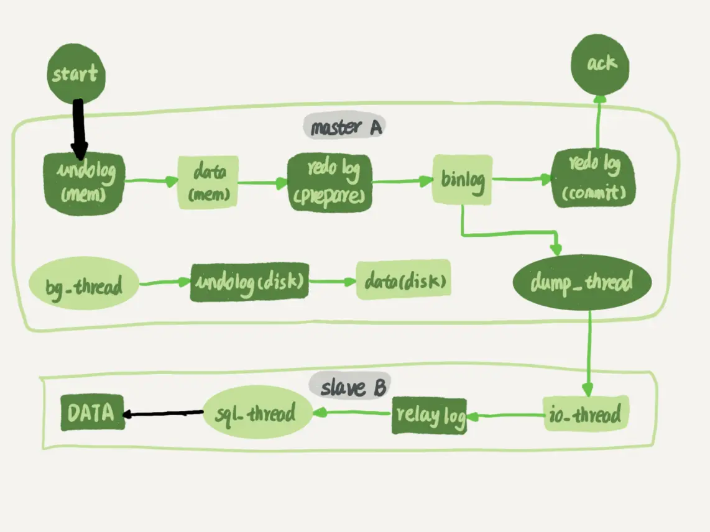
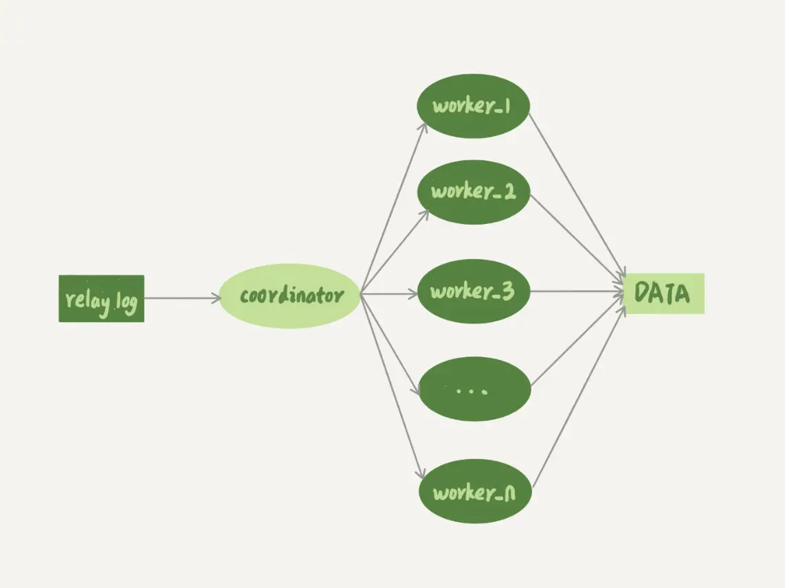
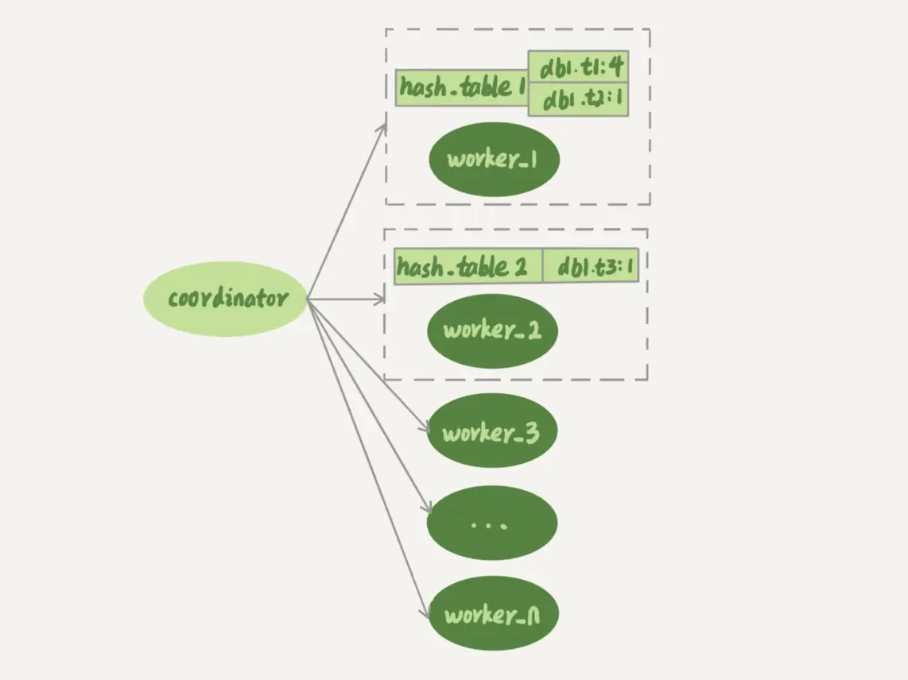
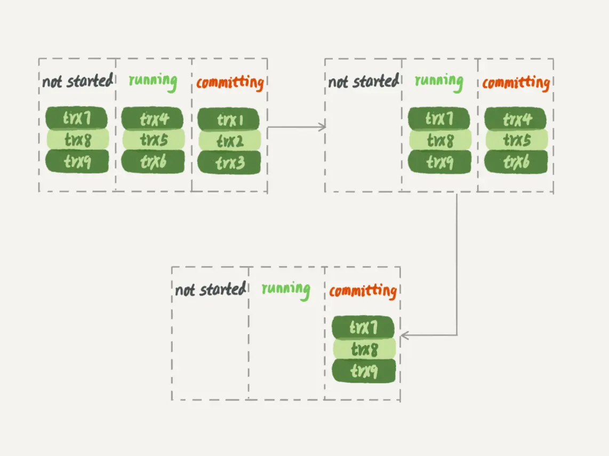
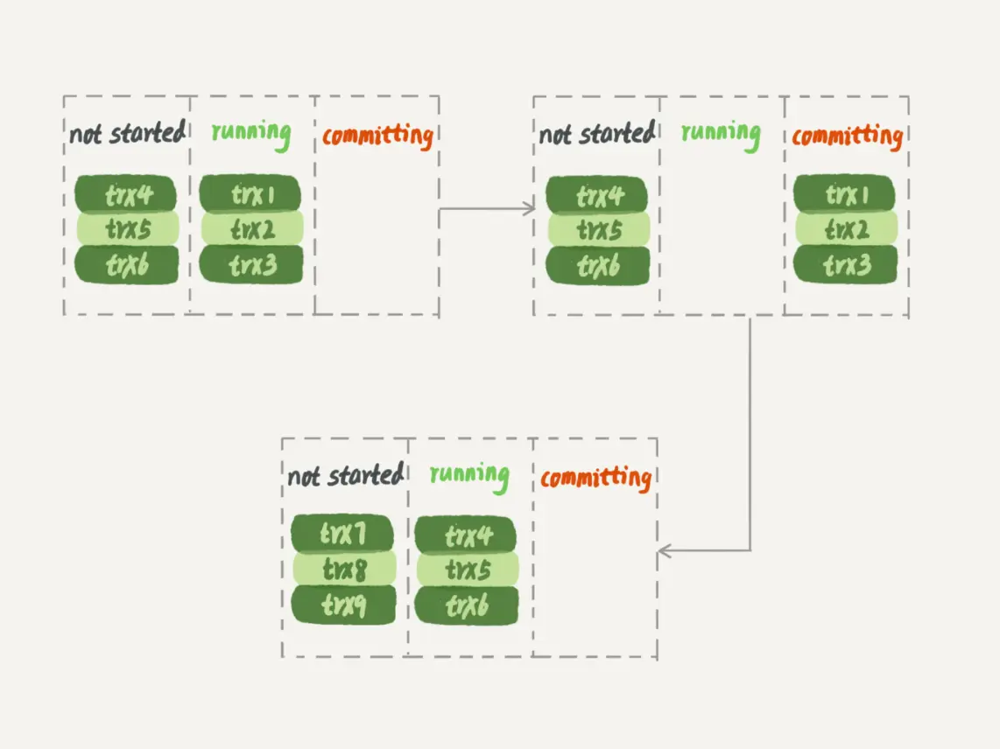

# 26讲：备库为什么会延迟好几个小时

> 通常情况下，主备延迟不会过长，但如果备库执行日志的速度持续低于主库生成日志的速度，那这个延迟就有可能成了小时级别。而且对于一个压力持续比较高的主库来说，备库很可能永远都追不上主库的节奏。这就涉及：**备库并行复制能力**。

## 高并发主库导致的主备延迟

## 

图1 主备流程图

谈到主备的并行复制能力，我们要关注的是图中黑色的两个箭头。一个箭头代表了客户端写入主库，另一箭头代表的是备库上sql_thread执行中转日志（relay log）。如果用箭头的粗细来代表并行度的话，那么真实情况就如图1所示，第一个箭头要明显粗于第二个箭头。

在官方的5.6版本之前，MySQL只支持单线程复制，由此在主库并发高、TPS高时就会出现严重的主备延迟问题。鉴于这样的情况，引入了MySQL多线程复制。

## MySQL多线程复制

所有的多线程复制机制，都是要把图1中只有一个线程的sql_thread，拆成多个线程，也就是都符合下面的这个模型：

 
图2 多线程模型

 

图2中，coordinator就是原来的sql_thread, 不过现在它不再直接更新数据了，只负责读取中转日志和分发事务。真正更新日志的，变成了worker线程。

worker线程的数量是由参数 **slave_parallel_workers** 决定的，建议设置为8~16之间最好（32核物理机的情况），毕竟备库还有可能要提供读查询，不能把CPU都吃光了。

### 待执行语句如何分配给多个 worker 呢？

coordinator在分发的时候，需要满足以下这两个基本要求：

1. 不能造成更新覆盖。这就要求更新同一行的两个事务，必须被分发到同一个worker中。
2. 同一个事务不能被拆开，必须放到同一个worker中。

各个版本的多线程复制，都遵循了这两条基本原则。接下来，我们就看看各个版本的并行复制策略。

1是避免由于执行顺序导致对同一行的更新操作出现不同结果。

2是为了避免出现事务执行不完全的语句被查询到，破坏了事务的原子性。

## 

## 

## 并行复制策略演进

### MySQL 5.5版本的并行复制策略

官方在 5.5 版本是不支持并行复制的。但业界是有拓展的并行策略的。

#### 按表分发策略

按表分发事务的基本思路是，如果两个事务更新不同的表，它们就可以并行。因为数据是存储在表里的，所以按表分发，可以保证两个worker不会更新同一行。

当然，如果有跨表的事务，还是要把两张表放在一起考虑的。如图3所示，就是按表分发的规则。

图3 按表并行复制程模型

这个按表分发的方案，在多个表负载均匀的场景里应用效果很好。但是，如果碰到热点表，比如所有的更新事务都会涉及到某一个表的时候，所有事务都会被分配到同一个worker中，就变成单线程复制了。

#### 按行分发策略

要解决热点表的并行复制问题，就需要一个按行并行复制的方案。按行复制的核心思路是：如果两个事务没有更新相同的行，它们在备库上可以并行执行。显然，这个模式要求binlog格式必须是row。

按行复制和按表复制的数据结构差不多，也是为每个worker，分配一个hash表。只是要实现按行分发，这时候的key，就必须是“库名+表名+唯一键的值”。

### MySQL 5.6版本的并行复制策略

官方MySQL5.6版本，支持了并行复制，只是支持的粒度是按库并行。理解了上面介绍的按表分发策略和按行分发策略，你就理解了，用于决定分发策略的hash表里，key就是数据库名。

理论上你可以创建不同的DB，把相同热度的表均匀分到这些不同的DB中，强行使用这个策略。不过据我所知，由于需要特地移动数据，这个策略用得并不多。

#### MariaDB的并行复制策略

利用了redo log组提交（group commit）优化：

1. 能够在同一组里提交的事务，一定不会修改同一行；
2. 主库上可以并行执行的事务，备库上也一定是可以并行执行的。

在实现上，MariaDB是这么做的：

1. 在一组里面一起提交的事务，有一个相同的commit_id，下一组就是commit_id+1；
2. commit_id直接写到binlog里面；
3. 传到备库应用的时候，相同commit_id的事务分发到多个worker执行；
4. 这一组全部执行完成后，coordinator再去取下一批。

当时，这个策略出来的时候是相当惊艳的。因为，之前业界的思路都是在“分析binlog，并拆分到worker”上。而MariaDB的这个策略，目标是“模拟主库的并行模式”。

但是，这个策略有一个问题，它并没有实现“真正的模拟主库并发度”这个目标。在主库上，一组事务在commit的时候，下一组事务是同时处于“执行中”状态的。

图5 主库并行事务

而按照MariaDB的并行复制策略，备库上的执行效果如图6所示。

图6 MariaDB 并行复制，备库并行效果

可以看到，在备库上执行的时候，要等第一组事务完全执行完成后，第二组事务才能开始执行，这样系统的吞吐量就不够。

另外，这个方案很容易被大事务拖后腿。假设trx2是一个超大事务，那么在备库应用的时候，trx1和trx3执行完成后，就只能等trx2完全执行完成，下一组才能开始执行。这段时间，只有一个worker线程在工作，是对资源的浪费。

不过即使如此，这个策略仍然是一个很漂亮的创新。因为，它对原系统的**改造非常少，实现也很优雅**。

### MySQL 5.7的并行复制策略

在MariaDB并行复制实现之后，官方的MySQL5.7版本也提供了类似的功能，由参数slave-parallel-type来控制并行复制策略：

1. 配置为DATABASE，表示使用MySQL 5.6版本的按库并行策略；
2. 配置为 LOGICAL_CLOCK，表示的就是类似MariaDB的策略。不过，MySQL 5.7这个策略，针对并行度做了优化。这个优化的思路也很有趣儿。