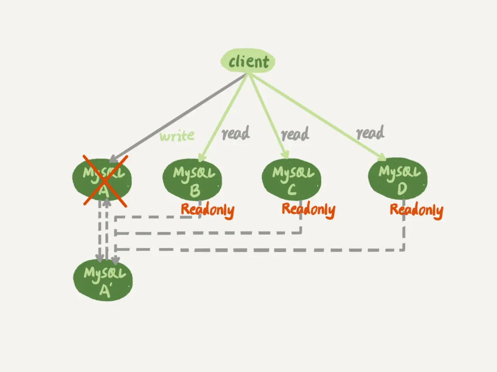

# 27讲：主库出问题了，从库怎么办

> 大多数的互联网应用场景都是读多写少，因此你负责的业务，在发展过程中很可能先会遇到读性能的问题。而在数据库层解决读性能问题，就要涉及到接下来两篇文章要讨论的架构：一主多从。

## 一主多从结构

如图1所示，就是一个基本的一主多从结构。


## 

<center>图1 一主多从基本结构</center>

图中，虚线箭头表示的是主备关系，也就是A和A’互为主备， 从库B、C、D指向的是主库A。一主多从的设置，一般用于读写分离，主库负责所有的写入和一部分读，其他的读请求则由从库分担。

今天我们要讨论的就是，在一主多从架构下，主库故障后的主备切换问题。

如图2所示，就是主库发生故障，主备切换后的结果。



<center>图2 一主多从基本结构--主备切换</center>

相比于一主一备的切换流程，一主多从结构在切换完成后，A’会成为新的主库，从库B、C、D也要改接到A’。正是由于多了从库B、C、D重新指向的这个过程，所以主备切换的复杂性也相应增加了。

## 基于位点的主备切换

考虑到切换过程中不能丢数据，所以我们找位点的时候，总是要找一个“稍微往前”的，然后再通过判断跳过那些在从库B上已经执行过的事务。

一种取同步位点的方法是这样的：

1. 等待新主库A’把中转日志（relay log）全部同步完成；
2. 在A’上执行show master status命令，得到当前A’上最新的File 和 Position；
3. 取原主库A故障的时刻T；
4. 用mysqlbinlog工具解析A’的File，得到T时刻的位点。

## 

```sql
mysqlbinlog File --stop-datetime=T --start-datetime=T
```


<center>图3 mysqlbinlog 部分输出结果</center>

图中，end_log_pos后面的值“123”，表示的就是A’这个实例，在T时刻写入新的binlog的位置。然后，我们就可以把123这个值作为$master_log_pos ，用在节点B的change master命令里。

当然这个值并不精确。为什么呢？

你可以设想有这么一种情况，假设在T这个时刻，主库A已经执行完成了一个insert 语句插入了一行数据R，并且已经将binlog传给了A’和B，然后在传完的瞬间主库A的主机就掉电了。

那么，这时候系统的状态是这样的：

1. 在从库B上，由于同步了binlog， R这一行已经存在；
2. 在新主库A’上， R这一行也已经存在，日志是写在123这个位置之后的；
3. 我们在从库B上执行change master命令，指向A’的File文件的123位置，就会把插入R这一行数据的binlog又同步到从库B去执行。

这时候，从库B的同步线程就会报告 Duplicate entry ‘id_of_R’ for key ‘PRIMARY’ 错误，提示出现了主键冲突，然后停止同步。

所以，**通常情况下，我们在切换任务的时候，要先主动跳过这些错误，有两种常用的方法。**

**一种做法是**，主动跳过一个事务。跳过命令的写法是：

```
set global sql_slave_skip_counter=1;
start slave;
```

因为切换过程中，可能会不止重复执行一个事务，所以我们需要在从库B刚开始接到新主库A’时，持续观察，每次碰到这些错误就停下来，执行一次跳过命令，直到不再出现停下来的情况，以此来跳过可能涉及的所有事务。

**另外一种方式是，**通过设置slave_skip_errors参数，直接设置跳过指定的错误。

在执行主备切换时，有这么两类错误，是经常会遇到的：

- 1062错误是插入数据时唯一键冲突；
- 1032错误是删除数据时找不到行。

因此，我们可以把slave_skip_errors 设置为 “1032,1062”，这样中间碰到这两个错误时就直接跳过。

这里需要注意的是，这种直接跳过指定错误的方法，针对的是主备切换时，由于找不到精确的同步位点，所以只能采用这种方法来创建从库和新主库的主备关系。

这个背景是，我们很清楚在主备切换过程中，直接跳过1032和1062这两类错误是无损的，所以才可以这么设置slave_skip_errors参数。等到主备间的同步关系建立完成，并稳定执行一段时间之后，我们还需要把这个参数设置为空，以免之后真的出现了主从数据不一致，也跳过了。

## 基于 GTID 的主备切换

### GTID

MySQL 5.6版本引入了GTID。

GTID的全称是Global Transaction Identifier，也就是全局事务ID，是一个事务在提交的时候生成的，是这个事务的唯一标识。它由两部分组成，格式是：

```
GTID=server_uuid:gno
```

其中：

- server_uuid是一个实例第一次启动时自动生成的，是一个全局唯一的值；
- gno是一个整数，初始值是1，每次提交事务的时候分配给这个事务，并加1。

在MySQL的官方文档里，GTID格式是这么定义的：

```
GTID=source_id:transaction_id
```

这里的source_id就是server_uuid；而后面的这个transaction_id，我觉得容易造成误导，所以我改成了gno。为什么说使用transaction_id容易造成误解呢？

因为，在MySQL里面我们说transaction_id就是指事务id，事务id是在事务执行过程中分配的，如果这个事务回滚了，事务id也会递增，而gno是在事务提交的时候才会分配。

从效果上看，GTID往往是连续的，因此我们用gno来表示更容易理解。

### 基于GTID的主备切换

我们在实例B上执行start slave命令，取binlog的逻辑是这样的：

1. 实例B指定主库A’，基于主备协议建立连接。
2. 实例B把set_b发给主库A’。
3. 实例A’算出set_a与set_b的差集，也就是所有存在于set_a，但是不存在于set_b的GITD的集合，判断A’本地是否包含了这个差集需要的所有binlog事务。
   a. 如果不包含，表示A’已经把实例B需要的binlog给删掉了，直接返回错误；
   b. 如果确认全部包含，A’从自己的binlog文件里面，找出第一个不在set_b的事务，发给B；
4. 之后就从这个事务开始，往后读文件，按顺序取binlog发给B去执行。

其实，这个逻辑里面包含了一个设计思想：在基于GTID的主备关系里，系统认为只要建立主备关系，就必须保证主库发给备库的日志是完整的。因此，如果实例B需要的日志已经不存在，A’就拒绝把日志发给B。

# 

## 思考

你在GTID模式下设置主从关系的时候，从库执行start slave命令后，主库发现需要的binlog已经被删除掉了，导致主备创建不成功。这种情况下，你觉得可以怎么处理呢？

1. 如果业务允许主从不一致的情况，那么可以在主库上先执行show global variables like ‘gtid_purged’，得到主库已经删除的GTID集合，假设是gtid_purged1；然后先在从库上执行reset master，再执行set global gtid_purged =‘gtid_purged1’；最后执行start slave，就会从主库现存的binlog开始同步。binlog缺失的那一部分，数据在从库上就可能会有丢失，造成主从不一致。
2. 如果需要主从数据一致的话，最好还是通过重新搭建从库来做。
3. 如果有其他的从库保留有全量的binlog的话，可以把新的从库先接到这个保留了全量binlog的从库，追上日志以后，如果有需要，再接回主库。
4. 如果binlog有备份的情况，可以先在从库上应用缺失的binlog，然后再执行start slave。