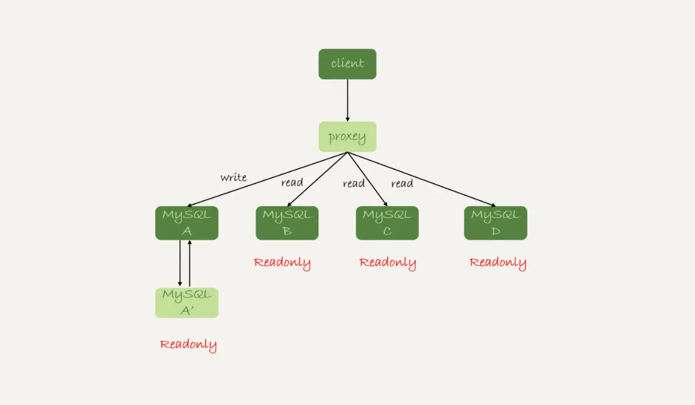

# 28讲：读写分离有哪些坑

> 读写分离的主要目标就是分摊主库的压力。

## 读写分离的架构

### 客户端直连的读写分离架构

图1 读写分离基本结构

图1中的结构是客户端（client）主动做负载均衡，这种模式下一般会把数据库的连接信息放在客户端的连接层。也就是说，由客户端来选择后端数据库进行查询。

### 带proxy的读写分离架构

在MySQL和客户端之间有一个中间代理层proxy，客户端只连接proxy， 由proxy根据请求类型和上下文决定请求的分发路由。

图2 带proxy的读写分离架构

### 两种架构的对比

1. 客户端直连方案，因为少了一层proxy转发，所以查询性能稍微好一点儿，并且整体架构简单，排查问题更方便。但是这种方案，由于要了解后端部署细节，所以在出现主备切换、库迁移等操作的时候，客户端都会感知到，并且需要调整数据库连接信息。
   你可能会觉得这样客户端也太麻烦了，信息大量冗余，架构很丑。其实也未必，一般采用这样的架构，一定会伴随一个负责管理后端的组件，比如Zookeeper，尽量让业务端只专注于业务逻辑开发。
2. 带proxy的架构，对客户端比较友好。客户端不需要关注后端细节，连接维护、后端信息维护等工作，都是由proxy完成的。但这样的话，对后端维护团队的要求会更高。而且，proxy也需要有高可用架构。因此，带proxy架构的整体就相对比较复杂。

**目前看，趋势是往带proxy的架构方向发展的。**

## "过期读"

但是，不论使用哪种架构，你都会碰到我们今天要讨论的问题：由于主从可能存在延迟，客户端执行完一个更新事务后马上发起查询，如果查询选择的是从库的话，就有可能读到刚刚的事务更新之前的状态。

**这种“在从库上会读到系统的一个过期状态”的现象，在这篇文章里，我们暂且称之为“过期读”。**

对应得解决方案包括：

- 强制走主库方案；
- sleep方案；
- 判断主备无延迟方案；
- 配合semi-sync方案；
- 等主库位点方案；
- 等GTID方案。

### 强制走主库方案

强制走主库方案其实就是，将查询请求做分类。通常情况下，我们可以将查询请求分为这么两类：

1. 对于必须要拿到最新结果的请求，强制将其发到主库上。比如，在一个交易平台上，卖家发布商品以后，马上要返回主页面，看商品是否发布成功。那么，这个请求需要拿到最新的结果，就必须走主库。
2. 对于可以读到旧数据的请求，才将其发到从库上。在这个交易平台上，买家来逛商铺页面，就算晚几秒看到最新发布的商品，也是可以接受的。那么，这类请求就可以走从库。

你可能会说，这个方案是不是有点畏难和取巧的意思，但其实这个方案是用得最多的。

当然，这个方案最大的问题在于，有时候你会碰到“所有查询都不能是过期读”的需求，比如一些金融类的业务。这样的话，你就要放弃读写分离，所有读写压力都在主库，等同于放弃了扩展性。

### Sleep 方案

