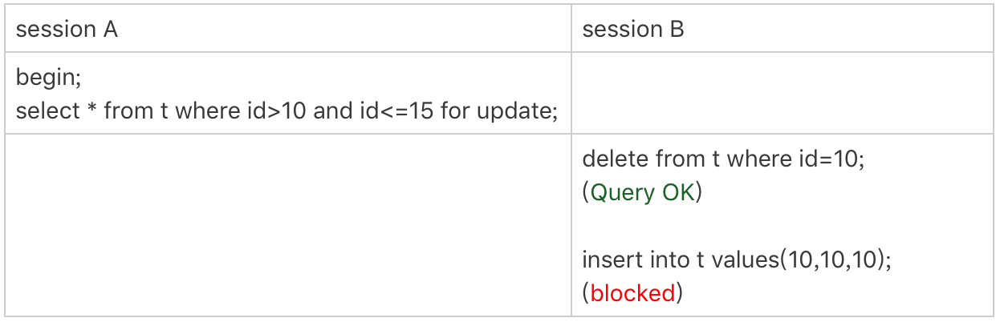
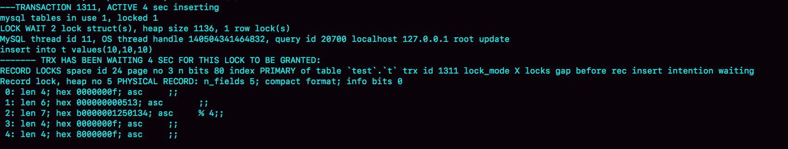
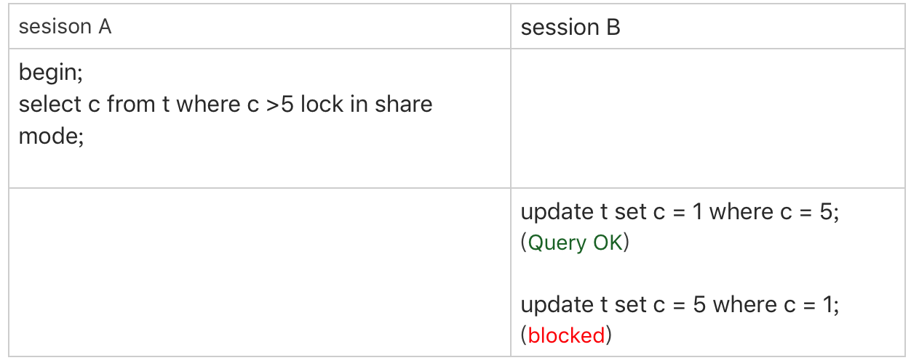
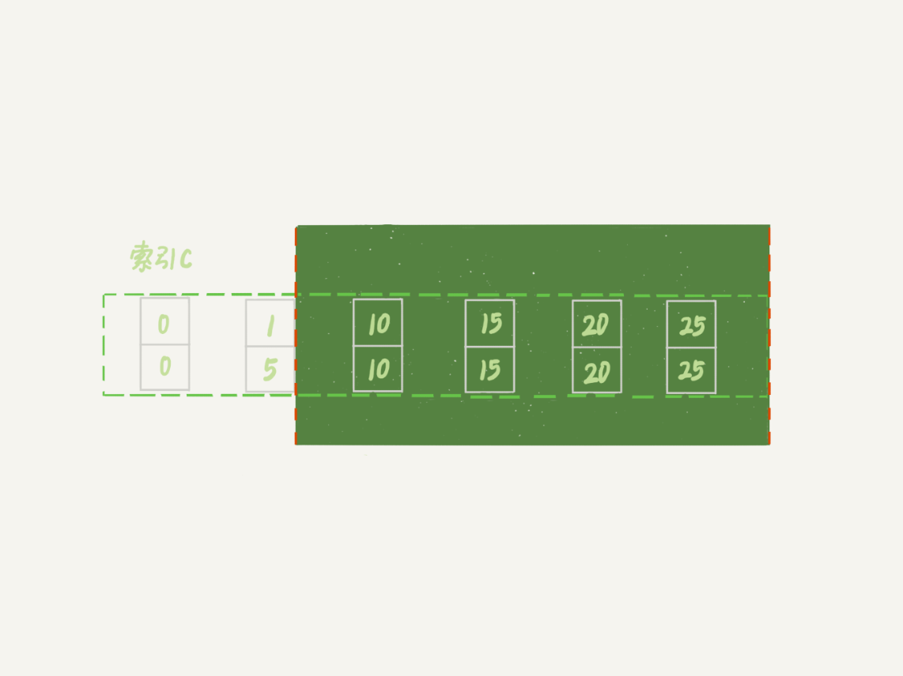

# 30讲：答疑文章（二）：用动态的观点看加锁

**加锁规则：包含了两个“原则”、两个“优化”和一个“bug”**

- 原则1：加锁的基本单位是next-key lock。希望你还记得，next-key lock是前开后闭区间。
- 原则2：查找过程中访问到的对象才会加锁。
- 优化1：索引上的等值查询，给唯一索引加锁的时候，next-key lock退化为行锁。
- 优化2：索引上的等值查询，向右遍历时且最后一个值不满足等值条件的时候，next-key lock退化为间隙锁。
- 一个bug：唯一索引上的范围查询会访问到不满足条件的第一个值为止。

本讲讨论基于下面的表t进行

```mysql
CREATE TABLE `t` (
  `id` int(11) NOT NULL,
  `c` int(11) DEFAULT NULL,
  `d` int(11) DEFAULT NULL,
  PRIMARY KEY (`id`),
  KEY `c` (`c`)
) ENGINE=InnoDB;

insert into t values(0,0,0),(5,5,5),
(10,10,10),(15,15,15),(20,20,20),(25,25,25);
```

## 不等号条件里的等值查询

```mysql
begin;
select * from t where id>9 and id<12 order by id desc for update;
```

利用上面的加锁规则，我们知道这个语句的加锁范围是主键索引上的 (0,5]、(5,10]和(10, 15)。也就是说，id=15这一行，并没有被加上行锁。为什么呢？

我们说加锁单位是next-key lock，都是前开后闭区间，但是这里用到了优化2，即索引上的等值查询，向右遍历的时候id=15不满足条件，所以next-key lock退化为了间隙锁 (10, 15)。

1. 首先这个查询语句的语义是order by id desc，要拿到满足条件的所有行，优化器必须先找到“第一个id<12的值”。
2. 这个过程是通过索引树的搜索过程得到的，在引擎内部，其实是要找到id=12的这个值，只是最终没找到，但找到了(10,15)这个间隙。
3. 然后向左遍历，在遍历过程中，就不是等值查询了，会扫描到id=5这一行，所以会加一个next-key lock (0,5]。

也就是说，在执行过程中，通过树搜索的方式定位记录的时候，用的是“等值查询”的方法。

## 等值查询的过程

下面这个语句的加锁范围是什么？

```mysql
begin;
select id from t where c in(5,20,10) lock in share mode;
```

1. 在查找c=5的时候，先锁住了（0,5]这个next-key lock。然后由于c不是唯一索引，为了确认是否还有别的记录c=5，所以要向右遍历，找到c=10才能够确认没有了，这个过程满足优化2，因此会加间隙锁（5,10）。综上加锁（0,10）。
2. 在执行c=10时，加锁范围逻辑同上，会锁（5,10]和（10,15）。
3. 在执行c=20时，加锁范围逻辑同上，会锁（15,20]和（20,25）。

加锁过程实际是：先加c=5的记录锁，再加c=10的记录锁，最后加c=20的记录锁。

值得强调的是：这些锁是“在执行过程中一个一个加的”，而不是一次性加上去的。

## 死锁的产生

如果在上节语句的基础上，再执行下列语句，就可以出现死锁了。

```mysql
select id from t where c in(5,20,10) order by c desc for update;
```

我们现在都知道间隙锁是不互锁的，但是这两条语句都会在索引c上的c=5、10、20这三行记录上加记录锁。

这里你需要注意一下，由于语句里面是order by c desc， 这三个记录锁的加锁顺序，是先锁c=20，然后c=10，最后是c=5。

也就是说，这两条语句要加锁相同的资源，但是加锁顺序相反。当这两条语句并发执行的时候，就可能出现死锁。

关于死锁的信息，MySQL只保留了最后一个死锁的现场，但这个现场还是不完备的。

因为上述死锁需要在并发情况下具有随机性，可操作性不强，因此提供一个更具操作性的实例。依旧是对表t进行操作。

| TRANSACTION 1                                                | TRANSACTION 2                                                |
| ------------------------------------------------------------ | ------------------------------------------------------------ |
| begin;<br/>select * from t where id = 9 for UPDATE;          |                                                              |
|                                                              | begin;<br/>select * from t where id = 9 for UPDATE;          |
|                                                              | insert into t values(9,9,9);<br><font color='red'> （blocked）</font> |
| insert into t values(9,9,9);<br/><font color='red'> [Err] 1213 - Deadlock found</font> |                                                              |

1. TRANSACTION 1 和 2分别通过select语句添加了间隙锁（5，10），由于间隙锁之间不冲突，两条语句均执行成功
2. TRANSACTION 2 试图插入（9,9,9），被TRANSACTION 1的间隙锁挡住，进入blocked状态
3. TRANSACTION 1 试图插入（9,9,9），被TRANSACTION 2的间隙锁挡住，死锁形成
4. InnoDB的死锁检测马上就发现了这对死锁关系，提示死锁并回滚TRANSACTION 1，TRANSACTION 2 的insert语句会由blocked状态变更为完成状态。

## 怎么看死锁？

出现死锁后，可以通过执行show engine innodb status命令得到的部分输出。这个命令会输出很多信息，有一节LATESTDETECTED DEADLOCK，就是记录的最后一次死锁信息。

```mysql
------------------------
LATEST DETECTED DEADLOCK
------------------------
2021-08-25 10:17:49 0x19bc
*** (1) TRANSACTION:
TRANSACTION 591626, ACTIVE 5 sec inserting
mysql tables in use 1, locked 1
LOCK WAIT 3 lock struct(s), heap size 1136, 2 row lock(s)
MySQL thread id 68, OS thread handle 12652, query id 541080 localhost 127.0.0.1 root update
insert into t values(9,9,9)
*** (1) WAITING FOR THIS LOCK TO BE GRANTED:
RECORD LOCKS space id 1786 page no 3 n bits 80 index PRIMARY of table `test`.`t` trx id 591626 lock_mode X locks gap before rec insert intention waiting
Record lock, heap no 4 PHYSICAL RECORD: n_fields 5; compact format; info bits 0
 0: len 4; hex 8000000a; asc     ;;
 1: len 6; hex 0000000906f1; asc       ;;
 2: len 7; hex a50000020e012a; asc       *;;
 3: len 4; hex 8000000a; asc     ;;
 4: len 4; hex 8000000a; asc     ;;

*** (2) TRANSACTION:
TRANSACTION 591625, ACTIVE 11 sec inserting, thread declared inside InnoDB 5000
mysql tables in use 1, locked 1
3 lock struct(s), heap size 1136, 2 row lock(s)
MySQL thread id 65, OS thread handle 6588, query id 541084 localhost 127.0.0.1 root update
insert into t values(9,9,9)
*** (2) HOLDS THE LOCK(S):
RECORD LOCKS space id 1786 page no 3 n bits 80 index PRIMARY of table `test`.`t` trx id 591625 lock_mode X locks gap before rec
Record lock, heap no 4 PHYSICAL RECORD: n_fields 5; compact format; info bits 0
 0: len 4; hex 8000000a; asc     ;;
 1: len 6; hex 0000000906f1; asc       ;;
 2: len 7; hex a50000020e012a; asc       *;;
 3: len 4; hex 8000000a; asc     ;;
 4: len 4; hex 8000000a; asc     ;;

*** (2) WAITING FOR THIS LOCK TO BE GRANTED:
RECORD LOCKS space id 1786 page no 3 n bits 80 index PRIMARY of table `test`.`t` trx id 591625 lock_mode X locks gap before rec insert intention waiting
Record lock, heap no 4 PHYSICAL RECORD: n_fields 5; compact format; info bits 0
 0: len 4; hex 8000000a; asc     ;;
 1: len 6; hex 0000000906f1; asc       ;;
 2: len 7; hex a50000020e012a; asc       *;;
 3: len 4; hex 8000000a; asc     ;;
 4: len 4; hex 8000000a; asc     ;;

*** WE ROLL BACK TRANSACTION (2)
```

这个结果分成三部分：

- (1) TRANSACTION，是第一个事务的信息；
- (2) TRANSACTION，是第二个事务的信息；
- WE ROLL BACK TRANSACTION (1)，是最终的处理结果，表示回滚了第一个事务。

这里，我们可以得到两个结论：

1. 由于锁是一个个加的，要避免死锁，对同一组资源，要按照尽量相同的顺序访问；
2. 在发生死锁的时刻，所以InnoDB选择了占有的资源更少，回滚成本更小的语句，来回滚。

## 怎么看锁等待？

看完死锁，我们再来看一个锁等待的例子。



可以看到，由于session A并没有锁住c=10这个记录，所以session B删除id=10这一行是可以的。但是之后，session B再想insert id=10这一行回去就不行了。

现在我们一起看一下此时show engine innodb status的结果，看看能不能给我们一些提示。锁信息是在这个命令输出结果的TRANSACTIONS这一节。



我们来看几个关键信息。

1. index PRIMARY of table `test`.`t` ，表示这个语句被锁住是因为表t主键上的某个锁。
2. lock_mode X locks gap before rec insert intention waiting 这里有几个信息：
   - insert intention表示当前线程准备插入一个记录，这是一个插入意向锁。为了便于理解，你可以认为它就是这个插入动作本身。
   - gap before rec 表示这是一个间隙锁，而不是记录锁。
3. 那么这个gap是在哪个记录之前的呢？接下来的0~4这5行的内容就是这个记录的信息。
4. n_fields 5也表示了，这一个记录有5列：
   - 0: len 4; hex 0000000f; asc ;;第一列是主键id字段，十六进制f就是id=15。所以，这时我们就知道了，这个间隙就是id=15之前的，因为id=10已经不存在了，它表示的就是(5,15)。
   - 1: len 6; hex 000000000513; asc ;;第二列是长度为6字节的事务id，表示最后修改这一行的是trx id为1299的事务。
   - 2: len 7; hex b0000001250134; asc % 4;; 第三列长度为7字节的回滚段信息。可以看到，这里的acs后面有显示内容(%和4)，这是因为刚好这个字节是可打印字符。
   - 后面两列是c和d的值，都是15。

因此，我们就知道了，由于delete操作把id=10这一行删掉了，原来的两个间隙(5,10)、(10,15）变成了一个(5,15)。

说到这里，你可以联合起来再思考一下这两个现象之间的关联：

1. session A执行完select语句后，什么都没做，但它加锁的范围突然“变大”了；
2. 第21篇文章的课后思考题，当我们执行select * from t where c>=15 and c<=20 order by c desc lock in share mode; 向左扫描到c=10的时候，要把(5, 10]锁起来。

**也就是说，所谓“间隙”，其实根本就是由“这个间隙右边的那个记录”定义的。即间隙锁的开区间并不是一成不变的，而是实际上由索引上的相邻元素决定的，动态变化的。**

## update的例子



session A的加锁范围是索引c上的 (5,10]、(10,15]、(15,20]、(20,25]和(25,suprenum]。

之后session B的第一个update语句，要把c=5改成c=1，你可以理解为两步：

1. 插入(c=1, id=5)这个记录；
2. 删除(c=5, id=5)这个记录。

按照我们上一节说的，索引c上(5,10)间隙是由这个间隙右边的记录，也就是c=10定义的。所以通过这个操作，session A的加锁范围变成了图7所示的样子：



好，接下来session B要执行 update t set c = 5 where c = 1这个语句了，一样地可以拆成两步：

1. 插入(c=5, id=5)这个记录；
2. 删除(c=1, id=5)这个记录。

第一步试图在已经加了间隙锁的(1,10)中插入数据，所以就被堵住了。

这里再给update语句做一个延伸。

| SESSION A                                                    | SESSION B                                                    |
| ------------------------------------------------------------ | ------------------------------------------------------------ |
| begin;<br/>select * from t where c >= 15 <br>and c<=20 order by c desc lock in share mode; |                                                              |
|                                                              | update t set id = 8 where id = 5;<br><font color="red">(blocked)</font> |
|                                                              | update t set id = 8,c=3 where id = 5;<br><font color="red">(success)</font> |

分析一下执行过程：

分析一下处理过程：

SESSION A 开启事务，执行select语句。

1. 因为加了读锁（共享锁）且为倒叙查询，所以会从c<=20这里开始找锁的范围，首先寻找的是第一个>20的数，因此会加(20,25]的next-key lock，此时符合优化2，next-key lock 退化成间隙锁（20,25），还会加next-key lock （15,20]
2. 对c>=15,会在索引c上扫描到第一个小于15的元素，因此会扫描到10，加next-key lock（5,10]和（10,15],还会加间隙锁(15,20)
3. 扫描过程中，由于是select * ，所以返回值中有id，因此主键索引上的在扫描范围内的id=10,15,20的三个行锁也被加锁了。

综上，session A的 select 语句锁的范围是：

1. 索引c上(5,25)
2. 主键索引上id=10、15、20三个行锁。

看SESSION B的两个update语句

1. 第一个语句执行时不能成功，因为执行这个语句需要用到的锁如下：

   1. 主键索引上的id = 8；
   2. 索引c上的（0,10)

   由于SESSION A 已经获取到的锁有冲突，所以 update 被blocked；

2. 第二个语句执行成功，执行所需的锁为索引c上的（0,5]，所以和SESSION A不冲突，可以完成更新操作。

## 思考

所谓“间隙”，其实根本就是由“这个间隙右边的那个记录”定义的。

那么，一个空表有间隙吗？这个间隙是由谁定义的？你怎么验证这个结论呢？