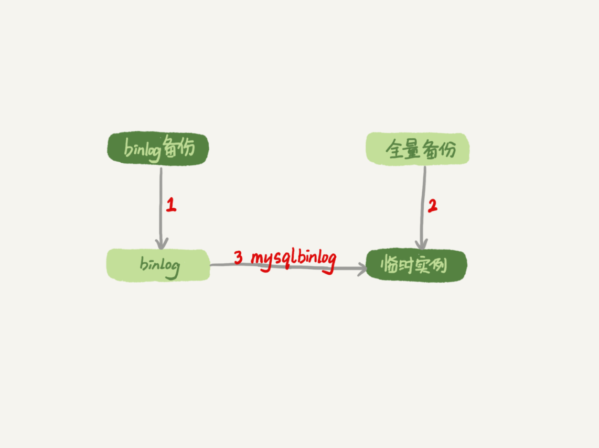
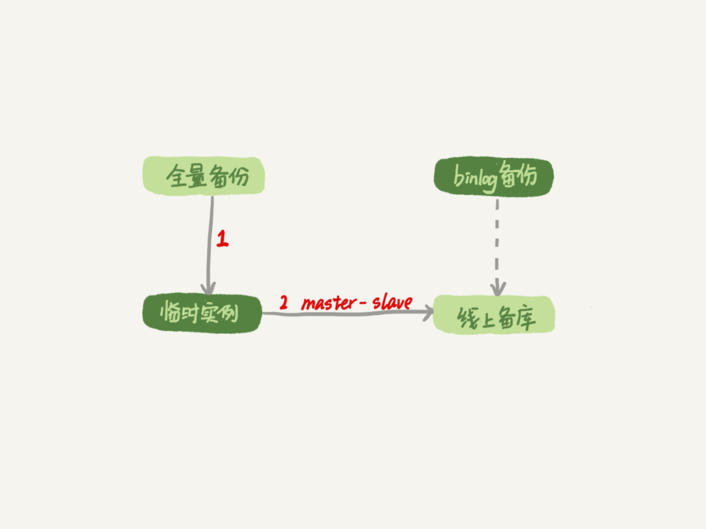

# 31讲：误删数据后除了跑路，还能怎么办

> 传统的高可用架构是不能预防误删数据的，因为主库的一个drop table命令，会通过binlog传给所有从库和级联从库，进而导致整个集群的实例都会执行这个命令。

## 勿删数据操作的分类

1. 使用delete语句误删数据行；
2. 使用drop table或者truncate table语句误删数据表；
3. 使用drop database语句误删数据库；
4. 使用rm命令误删整个MySQL实例。

## 误删行

### 通过Flashback工具恢复

Flashback恢复数据的原理，是修改binlog的内容，拿回原库重放。而能够使用这个方案的前提是，需要确保binlog_format=row 和 binlog_row_image=FULL。

具体恢复数据时，对单个事务做如下处理：

1. 对于insert语句，对应的binlog event类型是Write_rows event，把它改成Delete_rows event即可；
2. 同理，对于delete语句，也是将Delete_rows event改为Write_rows event；
3. 而如果是Update_rows的话，binlog里面记录了数据行修改前和修改后的值，对调这两行的位置即可。

如果误删数据涉及到了多个事务的话，需要将事务的顺序调过来再执行。

**需要说明的是，我不建议你直接在主库上执行这些操作。**

使用delete命令删除的数据，你还可以用Flashback来恢复。而使用truncate /drop table和drop database命令删除的数据，就没办法通过Flashback来恢复了。为什么呢？

这是因为，即使我们配置了binlog_format=row，执行这三个命令时，记录的binlog还是statement格式。binlog里面就只有一个truncate/drop 语句，这些信息是恢复不出数据的。

### 误删行的预防

1. 把sql_safe_updates参数设置为on。这样一来，如果我们忘记在delete或者update语句中写where条件，或者where条件里面没有包含索引字段的话，这条语句的执行就会报错。
2. 代码上线前，必须经过SQL审计。

## 误删库/表

这种情况下，要想恢复数据，就需要使用全量备份，加增量日志的方式了。这个方案要求线上有定期的全量备份，并且实时备份binlog。

### 通过mysqlbinlog方法进行恢复

在这两个条件都具备的情况下，假如有人中午12点误删了一个库，恢复数据的流程如下：

1. 取最近一次全量备份，假设这个库是一天一备，上次备份是当天0点；
2. 用备份恢复出一个临时库；
3. 从日志备份里面，取出凌晨0点之后的日志；
4. 把这些日志，除了误删除数据的语句外，全部应用到临时库。

这个流程的示意图如下所示：

### 通过master-slave进行修复

用备份恢复出临时实例之后，将这个临时实例设置成线上备库的从库，这样：

1. 在start slave之前，先通过执行
   change replication filter replicate_do_table = (tbl_name) 命令，就可以让临时库只同步误操作的表；
2. 这样做也可以用上并行复制技术，来加速整个数据恢复过程。

这个过程的示意图如下所示。

另外，我建议你不论使用上述哪种方式，都要把这个数据恢复功能做成自动化工具，并且经常拿出来演练。为什么这么说呢？

这里的原因，主要包括两个方面：

1. 虽然“发生这种事，大家都不想的”，但是万一出现了误删事件，能够快速恢复数据，将损失降到最小，也应该不用跑路了。
2. 而如果临时再手忙脚乱地手动操作，最后又误操作了，对业务造成了二次伤害，那就说不过去了。

### 延迟复制备库

如果有非常核心的业务，不允许太长的恢复时间，我们可以考虑**搭建延迟复制的备库。**这个功能是MySQL 5.6版本引入的。

延迟复制的备库是一种特殊的备库，通过 CHANGE MASTER TO MASTER_DELAY = N命令，可以指定这个备库持续保持跟主库有N秒的延迟。

### 预防误删库/表的方法

第一条建议是，账号分离。这样做的目的是，避免写错命令。比如：

- 我们只给业务开发同学DML权限，而不给truncate/drop权限。而如果业务开发人员有DDL需求的话，也可以通过开发管理系统得到支持。
- 即使是DBA团队成员，日常也都规定只使用只读账号，必要的时候才使用有更新权限的账号。

第二条建议是，制定操作规范。这样做的目的，是避免写错要删除的表名。比如：

- 在删除数据表之前，必须先对表做改名操作。然后，观察一段时间，确保对业务无影响以后再删除这张表。
- 改表名的时候，要求给表名加固定的后缀（比如加_to_be_deleted)，然后删除表的动作必须通过管理系统执行。并且，管理系删除表的时候，只能删除固定后缀的表。

## rm删除数据

其实，对于一个有高可用机制的MySQL集群来说，最不怕的就是rm删除数据了。只要不是恶意地把整个集群删除，而只是删掉了其中某一个节点的数据的话，HA系统就会开始工作，选出一个新的主库，从而保证整个集群的正常工作。

这时，你要做的就是在这个节点上把数据恢复回来，再接入整个集群。

当然了，现在不止是DBA有自动化系统，SA（系统管理员）也有自动化系统，所以也许一个批量下线机器的操作，会让你整个MySQL集群的所有节点都全军覆没。

应对这种情况，我的建议只能是说尽量把你的备份跨机房，或者最好是跨城市保存。

