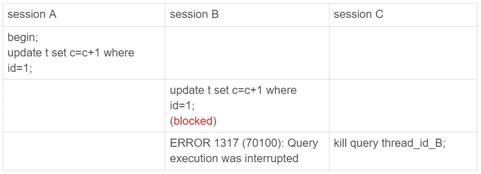

# 32讲：为什么还有kill不掉的语句

在MySQL中有两个kill命令：

一个是kill query +线程id，表示终止这个线程中正在执行的语句；

一个是kill connection +线程id，这里connection可缺省，表示断开这个线程的连接，当然如果这个线程有语句正在执行，也是要先停止正在执行的语句的。

## kill实例

其实大多数情况下，kill query/connection命令是有效的。比如，执行一个查询的过程中，发现执行时间太久，要放弃继续查询，这时我们就可以用kill query命令，终止这条查询语句。

还有一种情况是，语句处于锁等待的时候，直接使用kill命令也是有效的。我们一起来看下这个例子：

可以看到，session C 执行kill query以后，session B几乎同时就提示了语句被中断。这，就是我们预期的结果。

## 收到kill以后，线程做什么？

和Java的终止线程一样，数据库的kill也不是直接进行中止操作的，原因和要中止的线程持有的资源有关，当对一个表做增删改查操作时，会在表上加MDL读锁。所以，session B虽然处于blocked状态，但还是拿着一个MDL读锁的。如果线程被kill的时候，就直接终止，那之后这个MDL读锁就没机会被释放了。