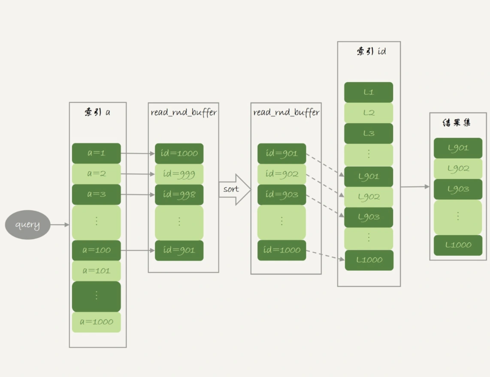
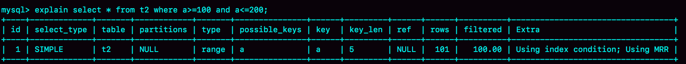
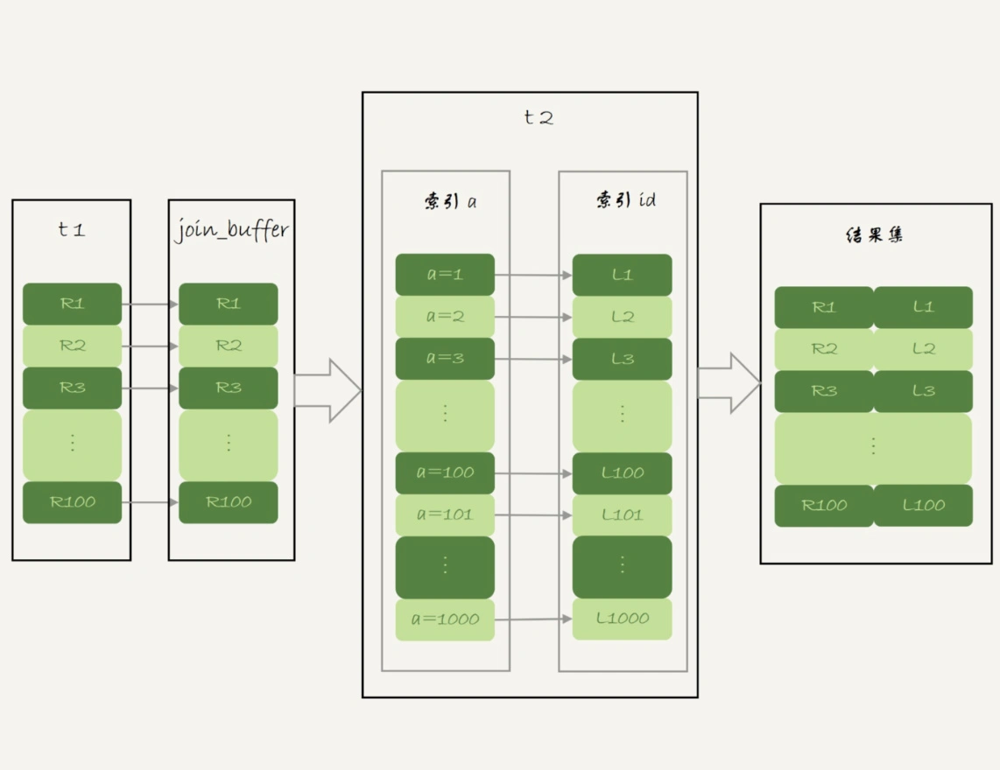

# 35讲：join语句怎么优化

## 测试表的创建

```
create table t1(id int primary key, a int, b int, index(a));
create table t2 like t1;
drop procedure idata;
delimiter ;;
create procedure idata()
begin
  declare i int;
  set i=1;
  while(i<=1000)do
    insert into t1 values(i, 1001-i, i);
    set i=i+1;
  end while;
  
  set i=1;
  while(i<=1000000)do
    insert into t2 values(i, i, i);
    set i=i+1;
  end while;

end;;
delimiter ;
call idata();
```

为了便于后面量化说明，我在表t1里，插入了1000行数据，每一行的a=1001-id的值。也就是说，表t1中字段a是逆序的。同时，我在表t2中插入了100万行数据。

## Multi-Range Read优化

在介绍join语句的优化方案之前，我需要先和你介绍一个知识点，即：Multi-Range Read优化(MRR)。这个优化的主要目的是尽量使用顺序读盘。

```mysql
select * from t1 where a>=1 and a<=100;
```

如果随着a的值递增顺序查询的话，id的值就变成随机的，那么就会出现随机访问，性能相对较差。虽然“按行查”这个机制不能改，但是调整查询的顺序，还是能够加速的。

**因为大多数的数据都是按照主键递增顺序插入得到的，所以我们可以认为，如果按照主键的递增顺序查询的话，对磁盘的读比较接近顺序读，能够提升读性能。**

这，就是MRR优化的设计思路。此时，语句的执行流程变成了这样：

1. 根据索引a，定位到满足条件的记录，将id值放入read_rnd_buffer中;
2. 将read_rnd_buffer中的id进行递增排序；
3. 排序后的id数组，依次到主键id索引中查记录，并作为结果返回。

这里，read_rnd_buffer的大小是由read_rnd_buffer_size参数控制的。如果步骤1中，read_rnd_buffer放满了，就会先执行完步骤2和3，然后清空read_rnd_buffer。之后继续找索引a的下个记录，并继续循环。

另外需要说明的是，如果你想要稳定地使用MRR优化的话，需要设置`set optimizer_switch="mrr_cost_based=off"`。（官方文档的说法，是现在的优化器策略，判断消耗的时候，会更倾向于不使用MRR，把mrr_cost_based设置为off，就是固定使用MRR了。）

下面两幅图就是使用了MRR优化后的执行流程和explain结果。





从图3的explain结果中，我们可以看到Extra字段多了Using MRR，表示的是用上了MRR优化。而且，由于我们在read_rnd_buffer中按照id做了排序，所以最后得到的结果集也是按照主键id递增顺序的，也就是与图1结果集中行的顺序相反。

**MRR能够提升性能的核心**在于，这条查询语句在索引a上做的是一个范围查询（也就是说，这是一个多值查询），可以得到足够多的主键id。这样通过排序以后，再去主键索引查数据，才能体现出“顺序性”的优势。

## Batched Key Access

MySQL在5.6版本后开始引入的Batched Key Acess(BKA)算法了。这个BKA算法，其实就是对NLJ算法的优化。

BKA算法的流程。



## BNL算法的性能问题

如果一个使用BNL算法的join语句，多次扫描一个冷表，而且这个语句执行时间超过1秒，就会在再次扫描冷表的时候，把冷表的数据页移到LRU链表头部。

这种情况对应的，是冷表的数据量小于整个Buffer Pool的3/8，能够完全放入old区域的情况。

如果这个冷表很大，就会出现另外一种情况：业务正常访问的数据页，没有机会进入young区域。

由于优化机制的存在，一个正常访问的数据页，要进入young区域，需要隔1秒后再次被访问到。但是，由于我们的join语句在循环读磁盘和淘汰内存页，进入old区域的数据页，很可能在1秒之内就被淘汰了。这样，就会导致这个MySQL实例的Buffer Pool在这段时间内，young区域的数据页没有被合理地淘汰。

**大表join操作虽然对IO有影响，但是在语句执行结束后，对IO的影响也就结束了。但是，对Buffer Pool的影响就是持续性的，需要依靠后续的查询请求慢慢恢复内存命中率。**

为了减少这种影响，你可以考虑增大join_buffer_size的值，减少对被驱动表的扫描次数。

也就是说，BNL算法对系统的影响主要包括三个方面：

1. 可能会多次扫描被驱动表，占用磁盘IO资源；
2. 判断join条件需要执行M*N次对比（M、N分别是两张表的行数），如果是大表就会占用非常多的CPU资源；
3. 可能会导致Buffer Pool的热数据被淘汰，影响内存命中率。

我们执行语句之前，需要通过理论分析和查看explain结果的方式，确认是否要使用BNL算法。如果确认优化器会使用BNL算法，就需要做优化。优化的常见做法是，给被驱动表的join字段加上索引，把BNL算法转成BKA算法。

## BNL转BKA

考虑使用临时表。使用临时表的大致思路是：

1. 把表t2中满足条件的数据放在临时表tmp_t中；
2. 为了让join使用BKA算法，给临时表tmp_t的字段b加上索引；
3. 让表t1和tmp_t做join操作。

此时，对应的SQL语句的写法如下：

```
create temporary table temp_t(id int primary key, a int, b int, index(b))engine=innodb;
insert into temp_t select * from t2 where b>=1 and b<=2000;
select * from t1 join temp_t on (t1.b=temp_t.b);
```

一起看一下这个过程的消耗：

1. 执行insert语句构造temp_t表并插入数据的过程中，对表t2做了全表扫描，这里扫描行数是100万。
2. 之后的join语句，扫描表t1，这里的扫描行数是1000；join比较过程中，做了1000次带索引的查询。相比于优化前的join语句需要做10亿次条件判断来说，这个优化效果还是很明显的。

总体来看，不论是在原表上加索引，还是用有索引的临时表，我们的思路都是让join语句能够用上被驱动表上的索引，来触发BKA算法，提升查询性能。

## 扩展-hash join

看到这里你可能发现了，其实上面计算10亿次那个操作，看上去有点儿傻。如果join_buffer里面维护的不是一个无序数组，而是一个哈希表的话，那么就不是10亿次判断，而是100万次hash查找。这样的话，整条语句的执行速度就快多了吧？

这，也正是MySQL的优化器和执行器一直被诟病的一个原因：不支持哈希join。并且，MySQL官方的roadmap，也是迟迟没有把这个优化排上议程。

实际上，这个优化思路，我们可以自己实现在业务端。实现流程大致如下：

1. `select * from t1;`取得表t1的全部1000行数据，在业务端存入一个hash结构，比如C++里的set、PHP的dict这样的数据结构。
2. `select * from t2 where b>=1 and b<=2000;` 获取表t2中满足条件的2000行数据。
3. 把这2000行数据，一行一行地取到业务端，到hash结构的数据表中寻找匹配的数据。满足匹配的条件的这行数据，就作为结果集的一行。

理论上，这个过程会比临时表方案的执行速度还要快一些。如果你感兴趣的话，可以自己验证一下。