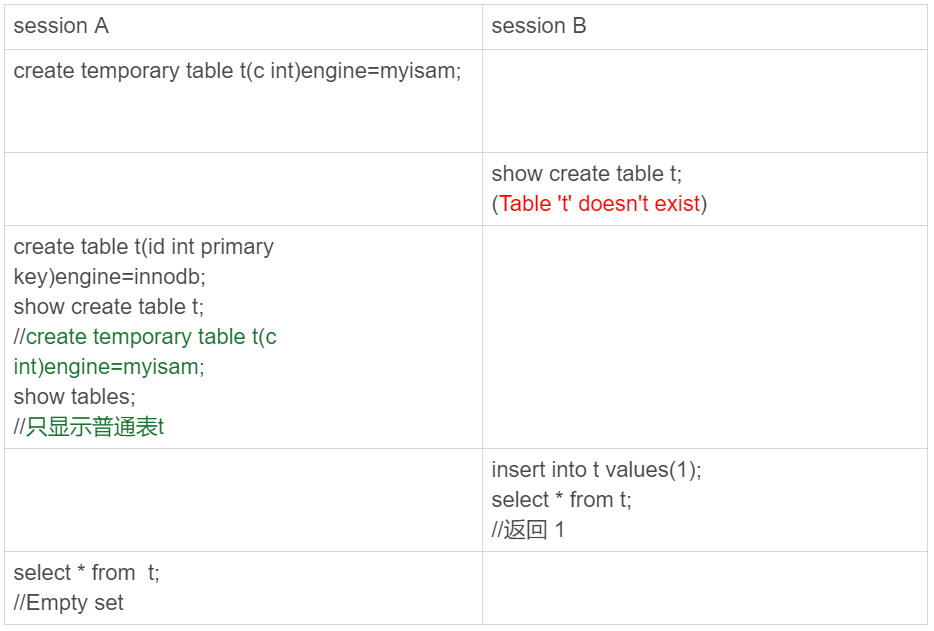
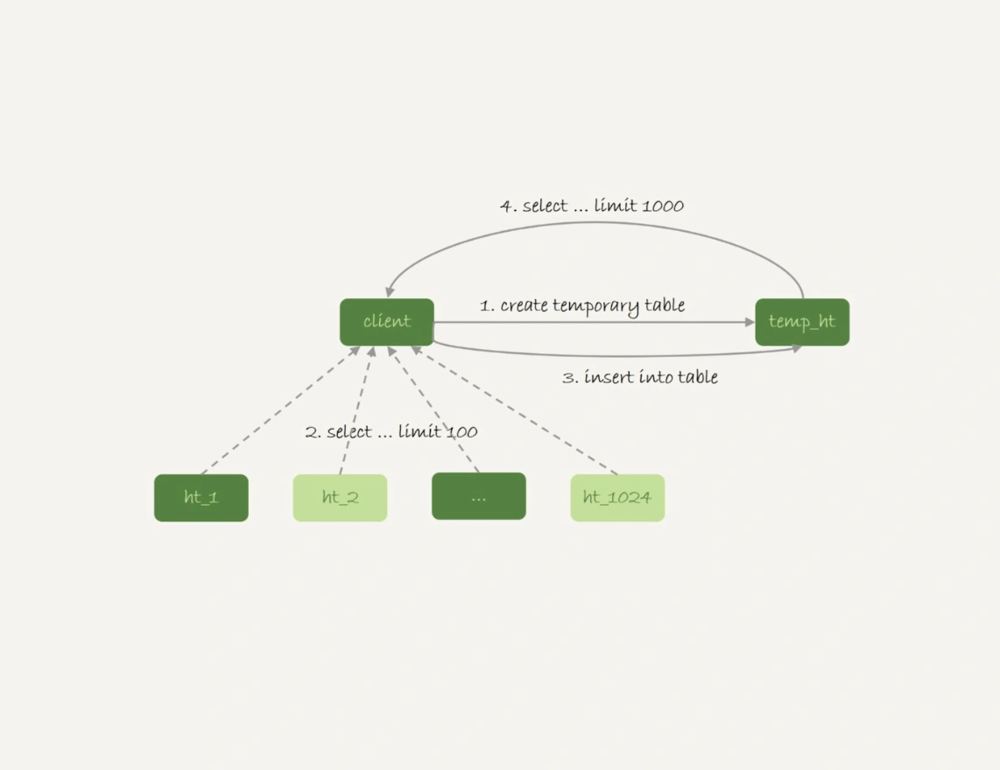

# 36讲为什么临时表可以重名

有的人可能会认为，临时表就是内存表。但是，这两个概念可是完全不同的。

- 内存表，指的是使用Memory引擎的表，建表语法是create table … engine=memory。这种表的数据都保存在内存里，系统重启的时候会被清空，但是表结构还在。除了这两个特性看上去比较“奇怪”外，从其他的特征上看，它就是一个正常的表。
- 而临时表，可以使用各种引擎类型 。如果是使用InnoDB引擎或者MyISAM引擎的临时表，写数据的时候是写到磁盘上的。当然，临时表也可以使用Memory引擎。

## 临时表的特性

为了便于理解，我们来看下下面这个操作序列：



可以看到，临时表在使用上有以下几个特点：

1. 建表语法是create temporary table …。
2. 一个临时表只能被创建它的session访问，对其他线程不可见。所以，图中session A创建的临时表t，对于session B就是不可见的。
3. 临时表可以与普通表同名。
4. session A内有同名的临时表和普通表的时候，show create语句，以及增删改查语句访问的是临时表。
5. show tables命令不显示临时表。

由于临时表只能被创建它的session访问，所以在这个session结束的时候，会自动删除临时表。也正是由于这个特性，**临时表就特别适合我们文章开头的join优化这种场景**。为什么呢？

原因主要包括以下两个方面：

1. 不同session的临时表是可以重名的，如果有多个session同时执行join优化，不需要担心表名重复导致建表失败的问题。
2. 不需要担心数据删除问题。如果使用普通表，在流程执行过程中客户端发生了异常断开，或者数据库发生异常重启，还需要专门来清理中间过程中生成的数据表。而临时表由于会自动回收，所以不需要这个额外的操作。

## 临时表的应用

由于不用担心线程之间的重名冲突，临时表经常会被用在复杂查询的优化过程中。其中，分库分表系统的跨库查询就是一个典型的使用场景。

一般分库分表的场景，就是要把一个逻辑上的大表分散到不同的数据库实例上。比如。将一个大表ht，按照字段f，拆分成1024个分表，然后分布到32个数据库实例上。如下图所示：


一般情况下，这种分库分表系统都有一个中间层proxy。不过，也有一些方案会让客户端直接连接数据库，也就是没有proxy这一层。

在这个架构中，分区key的选择是以“减少跨库和跨表查询”为依据的。如果大部分的语句都会包含f的等值条件，那么就要用f做分区键。这样，在proxy这一层解析完SQL语句以后，就能确定将这条语句路由到哪个分表做查询。

比如下面这条语句：

```
select v from ht where f=N;
```

这时，我们就可以通过分表规则（比如，N%1024)来确认需要的数据被放在了哪个分表上。这种语句只需要访问一个分表，是分库分表方案最欢迎的语句形式了。

但是，如果这个表上还有另外一个索引k，并且查询语句是这样的：

```
select v from ht where k >= M order by t_modified desc limit 100;
```

这时候，由于查询条件里面没有用到分区字段f，只能到所有的分区中去查找满足条件的所有行，然后统一做order by 的操作。这种情况下，有两种比较常用的思路。

**第一种思路是，**在proxy层的进程代码中实现排序。

这种方式的优势是处理速度快，拿到分库的数据以后，直接在内存中参与计算。不过，这个方案的缺点也比较明显：

1. 需要的开发工作量比较大。我们举例的这条语句还算是比较简单的，如果涉及到复杂的操作，比如group by，甚至join这样的操作，对中间层的开发能力要求比较高；
2. 对proxy端的压力比较大，尤其是很容易出现内存不够用和CPU瓶颈的问题。

**另一种思路就是，**把各个分库拿到的数据，汇总到一个MySQL实例的一个表中，然后在这个汇总实例上做逻辑操作。

比如上面这条语句，执行流程可以类似这样：

- 在汇总库上创建一个临时表temp_ht，表里包含三个字段v、k、t_modified；
- 在各个分库上执行

```
select v,k,t_modified from ht_x where k >= M order by t_modified desc limit 100;
```

- 把分库执行的结果插入到temp_ht表中；
- 执行

```
select v from temp_ht order by t_modified desc limit 100; 
```

得到结果。

这个过程对应的流程图如下所示：



**在实践中，我们往往会发现每个分库的计算量都不饱和，所以会直接把临时表temp_ht放到32个分库中的某一个上。**

## 为什么临时表可以重名？

你可能会问，不同线程可以创建同名的临时表，这是怎么做到的呢？

接下来，我们就看一下这个问题。

我们在执行

```
create temporary table temp_t(id int primary key)engine=innodb;
```

这个语句的时候，MySQL要给这个InnoDB表创建一个frm文件保存表结构定义，还要有地方保存表数据。

**这个frm文件放在临时文件目录下，文件名的后缀是.frm，前缀是“#sql{进程id}_{线程id}_序列号”**。你可以使用select @@tmpdir命令，来显示实例的临时文件目录。

而关于表中数据的存放方式，在不同的MySQL版本中有着不同的处理方式：

- 在5.6以及之前的版本里，MySQL会在临时文件目录下创建一个相同前缀、以.ibd为后缀的文件，用来存放数据文件；
- 而从 5.7版本开始，MySQL引入了一个临时文件表空间，专门用来存放临时文件的数据。因此，我们就不需要再创建ibd文件了。

从文件名的前缀规则，我们可以看到，其实创建一个叫作t1的InnoDB临时表，MySQL在存储上认为我们创建的表名跟普通表t1是不同的，因此同一个库下面已经有普通表t1的情况下，还是可以再创建一个临时表t1的。

在实现上，每个线程都维护了自己的临时表链表。这样每次session内操作表的时候，先遍历链表，检查是否有这个名字的临时表，如果有就优先操作临时表，如果没有再操作普通表；在session结束的时候，对链表里的每个临时表，执行 “DROP TEMPORARY TABLE +表名”操作。

这时候你会发现，binlog中也记录了DROP TEMPORARY TABLE这条命令。你一定会觉得奇怪，临时表只在线程内自己可以访问，为什么需要写到binlog里面？

## 临时表和主备复制

既然写binlog，就意味着备库需要。

你可以设想一下，在主库上执行下面这个语句序列：

```
create table t_normal(id int primary key, c int)engine=innodb;/*Q1*/
create temporary table temp_t like t_normal;/*Q2*/
insert into temp_t values(1,1);/*Q3*/
insert into t_normal select * from temp_t;/*Q4*/
```

如果关于临时表的操作都不记录，那么在备库就只有create table t_normal表和insert into t_normal select * from temp_t这两个语句的binlog日志，备库在执行到insert into t_normal的时候，就会报错“表temp_t不存在”。

你可能会说，如果把binlog设置为row格式就好了吧？因为binlog是row格式时，在记录insert into t_normal的binlog时，记录的是这个操作的数据，即：write_row event里面记录的逻辑是“插入一行数据（1,1)”。

确实是这样。如果当前的binlog_format=row，那么跟临时表有关的语句，就不会记录到binlog里。也就是说，只在binlog_format=statment/mixed 的时候，binlog中才会记录临时表的操作。

这种情况下，创建临时表的语句会传到备库执行，因此备库的同步线程就会创建这个临时表。主库在线程退出的时候，会自动删除临时表，但是备库同步线程是持续在运行的。所以，这时候我们就需要在主库上再写一个DROP TEMPORARY TABLE传给备库执行。

**之前有人问过我一个有趣的问题：**MySQL在记录binlog的时候，不论是create table还是alter table语句，都是原样记录，甚至于连空格都不变。但是如果执行drop table t_normal，系统记录binlog就会写成：

```
DROP TABLE `t_normal` /* generated by server */
```

也就是改成了标准的格式。为什么要这么做呢 ？

现在你知道原因了，那就是：drop table命令是可以一次删除多个表的。比如，在上面的例子中，设置binlog_format=row，如果主库上执行 "drop table t_normal, temp_t"这个命令，那么binlog中就只能记录：

```
DROP TABLE `t_normal` /* generated by server */
```

因为备库上并没有表temp_t，将这个命令重写后再传到备库执行，才不会导致备库同步线程停止。

所以，drop table命令记录binlog的时候，就必须对语句做改写。“/* generated by server */”说明了这是一个被服务端改写过的命令。

说到主备复制，**还有另外一个问题需要解决**：主库上不同的线程创建同名的临时表是没关系的，但是传到备库执行是怎么处理的呢？

现在，我给你举个例子，下面的序列中实例S是M的备库。


主库M上的两个session创建了同名的临时表t1，这两个create temporary table t1 语句都会被传到备库S上。

但是，备库的应用日志线程是共用的，也就是说要在应用线程里面先后执行这个create 语句两次。（即使开了多线程复制，也可能被分配到从库的同一个worker中执行）。那么，这会不会导致同步线程报错 ？

显然是不会的，否则临时表就是一个bug了。也就是说，备库线程在执行的时候，要把这两个t1表当做两个不同的临时表来处理。这，又是怎么实现的呢？

MySQL在记录binlog的时候，会把主库执行这个语句的线程id写到binlog中。这样，在备库的应用线程就能够知道执行每个语句的主库线程id，并利用这个线程id来构造临时表的table_def_key：

1. session A的临时表t1，在备库的table_def_key就是：库名+t1+“M的serverid”+“session A的thread_id”;
2. session B的临时表t1，在备库的table_def_key就是 ：库名+t1+“M的serverid”+“session B的thread_id”。

由于table_def_key不同，所以这两个表在备库的应用线程里面是不会冲突的。

## 小结

今天这篇文章，我和你介绍了临时表的用法和特性。

在实际应用中，临时表一般用于处理比较复杂的计算逻辑。由于临时表是每个线程自己可见的，所以不需要考虑多个线程执行同一个处理逻辑时，临时表的重名问题。在线程退出的时候，临时表也能自动删除，省去了收尾和异常处理的工作。

在binlog_format='row’的时候，临时表的操作不记录到binlog中，也省去了不少麻烦，这也可以成为你选择binlog_format时的一个考虑因素。

需要注意的是，我们上面说到的这种临时表，是用户自己创建的 ，也可以称为用户临时表。与它相对应的，就是内部临时表，在[第17篇文章](https://time.geekbang.org/column/article/73795)中我已经和你介绍过。