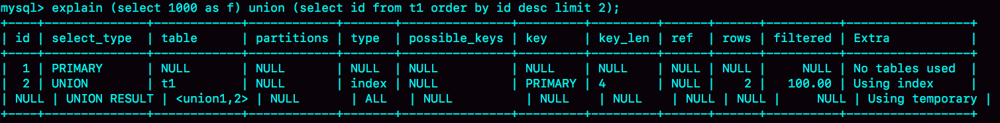
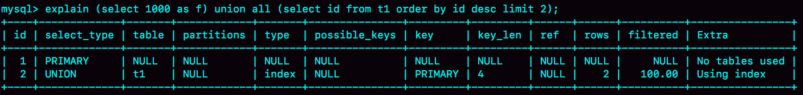
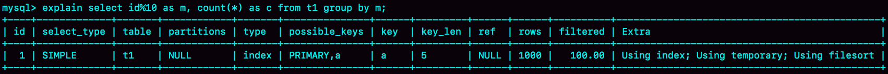
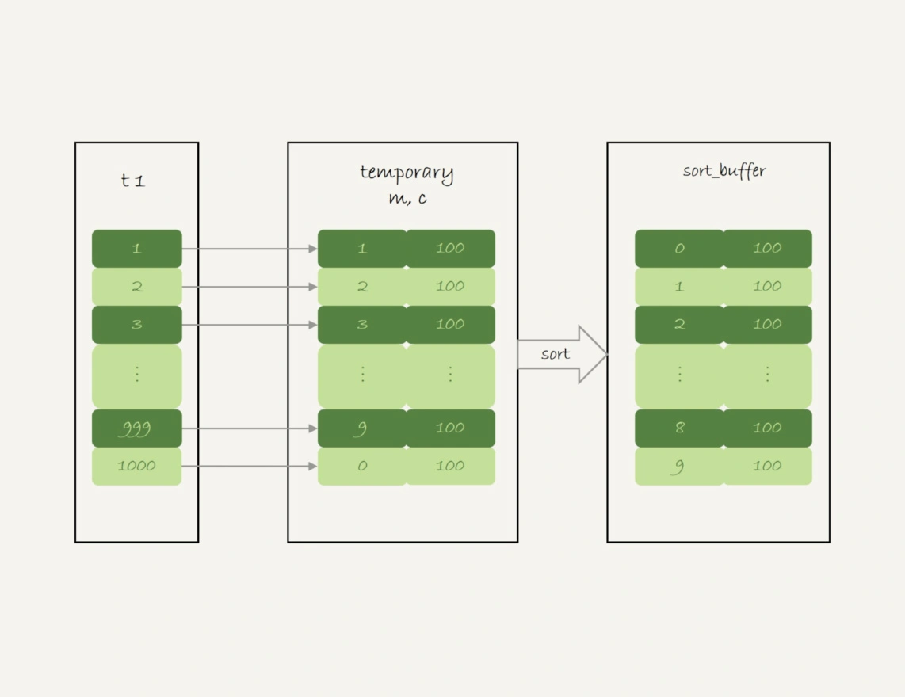
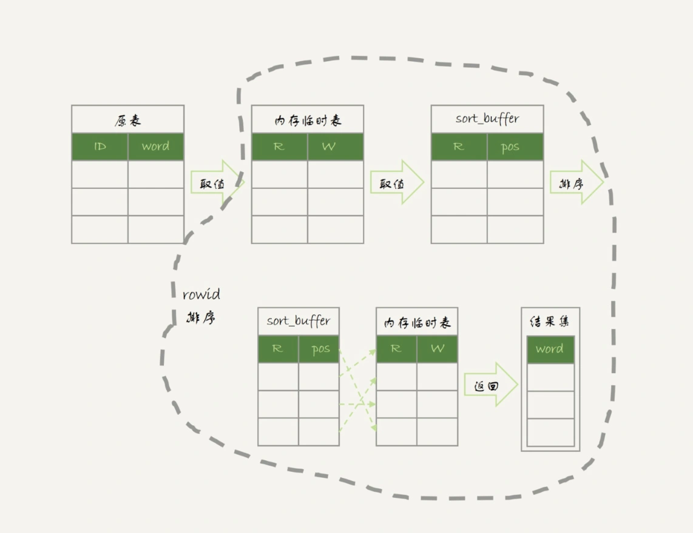
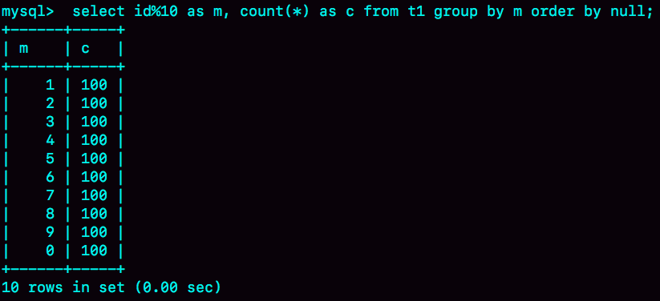
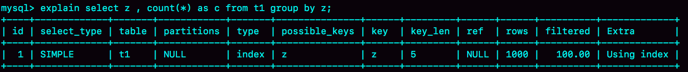
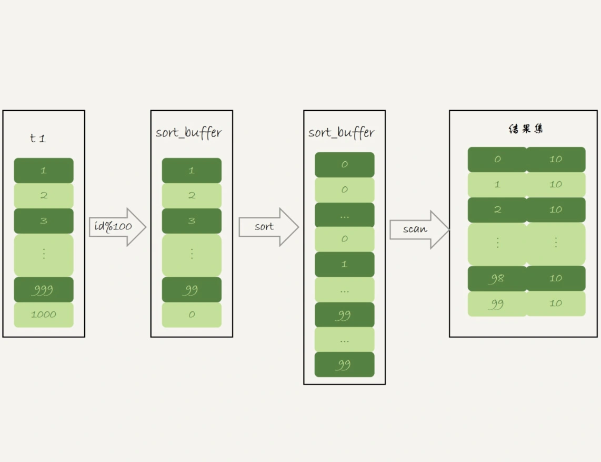
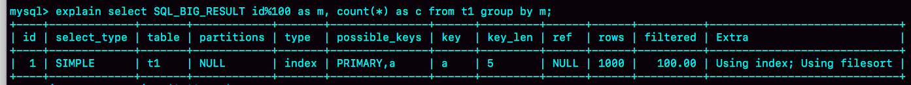

# 37讲什么时候会使用内部临时表

sort buffer、内存临时表和join buffer。这三个数据结构都是用来存放语句执行过程中的中间数据，以辅助SQL语句的执行的。其中，我们在排序的时候用到了sort buffer，在使用join语句的时候用到了join buffer。

## union 执行流程

为了便于量化分析，我用下面的表t1来举例。

```
create table t1(id int primary key, a int, b int, index(a));
delimiter ;;
create procedure idata()
begin
  declare i int;

  set i=1;
  while(i<=1000)do
    insert into t1 values(i, i, i);
    set i=i+1;
  end while;
end;;
delimiter ;
call idata();
```

然后，我们执行下面这条语句：

```
(select 1000 as f) union (select id from t1 order by id desc limit 2);
```

这条语句用到了union，它的语义是，取这两个子查询结果的并集。并集的意思就是这两个集合加起来，重复的行只保留一行。

下图是这个语句的explain结果。



可以看到：

- 第二行的key=PRIMARY，说明第二个子句用到了索引id。
- 第三行的Extra字段，表示在对子查询的结果集做union的时候，使用了临时表(Using temporary)。

这个语句的执行流程是这样的：

1. 创建一个内存临时表，这个临时表只有一个整型字段f，并且f是主键字段。
2. 执行第一个子查询，得到1000这个值，并存入临时表中。
3. 执行第二个子查询：
   - 拿到第一行id=1000，试图插入临时表中。但由于1000这个值已经存在于临时表了，违反了唯一性约束，所以插入失败，然后继续执行；
   - 取到第二行id=999，插入临时表成功。
4. 从临时表中按行取出数据，返回结果，并删除临时表，结果中包含两行数据分别是1000和999。

这个过程的流程图如下所示：


**可以看到，这里的内存临时表起到了暂存数据的作用，而且计算过程还用上了临时表主键id的唯一性约束，实现了union的语义。**

顺便提一下，如果把上面这个语句中的union改成union all的话，就没有了“去重”的语义。这样执行的时候，就依次执行子查询，得到的结果直接作为结果集的一部分，发给客户端。因此也就不需要临时表了。



可以看到，第二行的Extra字段显示的是Using index，表示只使用了覆盖索引，没有用临时表了。

# group by 执行流程

另外一个常见的使用临时表的例子是group by，我们来看一下这个语句：

```
select id%10 as m, count(*) as c from t1 group by m;
```

这个语句的逻辑是把表t1里的数据，按照 id%10 进行分组统计，并按照m的结果排序后输出。它的explain结果如下：



在Extra字段里面，我们可以看到三个信息：

- Using index，表示这个语句使用了覆盖索引，选择了索引a，不需要回表；
- Using temporary，表示使用了临时表；
- Using filesort，表示需要排序。

这个语句的执行流程是这样的：

1. 创建内存临时表，表里有两个字段m和c，主键是m；
2. 扫描表t1的索引a，依次取出叶子节点上的id值，计算id%10的结果，记为x；
   - 如果临时表中没有主键为x的行，就插入一个记录(x,1);
   - 如果表中有主键为x的行，就将x这一行的c值加1；
3. 遍历完成后，再根据字段m做排序，得到结果集返回给客户端。

这个流程的执行图如下：



图中最后一步，对内存临时表的排序，



其中，临时表的排序过程就是图6中虚线框内的过程。

如果你的需求并不需要对结果进行排序，那你可以在SQL语句末尾增加order by null，也就是改成：

```
select id%10 as m, count(*) as c from t1 group by m order by null;
```

这样就跳过了最后排序的阶段，直接从临时表中取数据返回。返回的结果如图8所示。



如果这个表t1的数据量很大，很可能这个查询需要的磁盘临时表就会占用大量的磁盘空间。、

## group by 优化方法 --索引

可以看到，不论是使用内存临时表还是磁盘临时表，group by逻辑都需要构造一个带唯一索引的表，执行代价都是比较高的。如果表的数据量比较大，上面这个group by语句执行起来就会很慢，我们有什么优化的方法呢？

要解决group by语句的优化问题，你可以先想一下这个问题：执行group by语句为什么需要临时表？

group by的语义逻辑，是统计不同的值出现的个数。但是，由于每一行的id%100的结果是无序的，所以我们就需要有一个临时表，来记录并统计结果。

如果可以确保输入的数据是有序的，那么计算group by的时候，就只需要从左到右，顺序扫描，依次累加。也就是下面这个过程：

- 当碰到第一个1的时候，已经知道累积了X个0，结果集里的第一行就是(0,X);
- 当碰到第一个2的时候，已经知道累积了Y个1，结果集里的第二行就是(1,Y);

按照这个逻辑执行的话，扫描到整个输入的数据结束，就可以拿到group by的结果，不需要临时表，也不需要再额外排序。

你一定想到了，InnoDB的索引，就可以满足这个输入有序的条件。

在MySQL 5.7版本支持了generated column机制，用来实现列数据的关联更新。你可以用下面的方法创建一个列z，然后在z列上创建一个索引（如果是MySQL 5.6及之前的版本，你也可以创建普通列和索引，来解决这个问题）。

```
alter table t1 add column z int generated always as(id % 100), add index(z);
```

这样，索引z上的数据就是类似图10这样有序的了。上面的group by语句就可以改成：

```
select z, count(*) as c from t1 group by z;
```

优化后的group by语句的explain结果，如下图所示：



从Extra字段可以看到，这个语句的执行不再需要临时表，也不需要排序了。

# group by优化方法 --直接排序

所以，如果可以通过加索引来完成group by逻辑就再好不过了。但是，如果碰上不适合创建索引的场景，我们还是要老老实实做排序的。那么，这时候的group by要怎么优化呢？

如果我们明明知道，一个group by语句中需要放到临时表上的数据量特别大，却还是要按照“先放到内存临时表，插入一部分数据后，发现内存临时表不够用了再转成磁盘临时表”，看上去就有点儿傻。

那么，我们就会想了，MySQL有没有让我们直接走磁盘临时表的方法呢？

答案是，有的。

在group by语句中加入SQL_BIG_RESULT这个提示（hint），就可以告诉优化器：这个语句涉及的数据量很大，请直接用磁盘临时表。

MySQL的优化器一看，磁盘临时表是B+树存储，存储效率不如数组来得高。所以，既然你告诉我数据量很大，那从磁盘空间考虑，还是直接用数组来存吧。

因此，下面这个语句

```
select SQL_BIG_RESULT id%100 as m, count(*) as c from t1 group by m;
```

的执行流程就是这样的：

1. 初始化sort_buffer，确定放入一个整型字段，记为m；
2. 扫描表t1的索引a，依次取出里面的id值, 将 id%100的值存入sort_buffer中；
3. 扫描完成后，对sort_buffer的字段m做排序（如果sort_buffer内存不够用，就会利用磁盘临时文件辅助排序）；
4. 排序完成后，就得到了一个有序数组。

根据有序数组，得到数组里面的不同值，以及每个值的出现次数。这一步的逻辑，你已经从前面的图10中了解过了。

下面两张图分别是执行流程图和执行explain命令得到的结果。





从Extra字段可以看到，这个语句的执行没有再使用临时表，而是直接用了排序算法。

基于上面的union、union all和group by语句的执行过程的分析，我们来回答文章开头的问题：MySQL什么时候会使用内部临时表？

1. 如果语句执行过程可以一边读数据，一边直接得到结果，是不需要额外内存的，否则就需要额外的内存，来保存中间结果；
2. join_buffer是无序数组，sort_buffer是有序数组，临时表是二维表结构；
3. 如果执行逻辑需要用到二维表特性，就会优先考虑使用临时表。比如我们的例子中，union需要用到唯一索引约束， group by还需要用到另外一个字段来存累积计数。

# 小结

通过今天这篇文章，我重点和你讲了group by的几种实现算法，从中可以总结一些使用的指导原则：

1. 如果对group by语句的结果没有排序要求，要在语句后面加 order by null；
2. 尽量让group by过程用上表的索引，确认方法是explain结果里没有Using temporary 和 Using filesort；
3. 如果group by需要统计的数据量不大，尽量只使用内存临时表；也可以通过适当调大tmp_table_size参数，来避免用到磁盘临时表；
4. 如果数据量实在太大，使用SQL_BIG_RESULT这个提示，来告诉优化器直接使用排序算法得到group by的结果。

