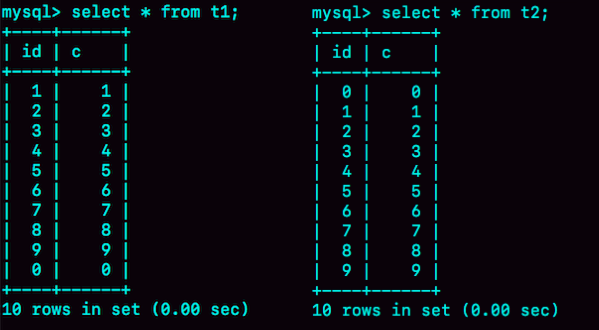
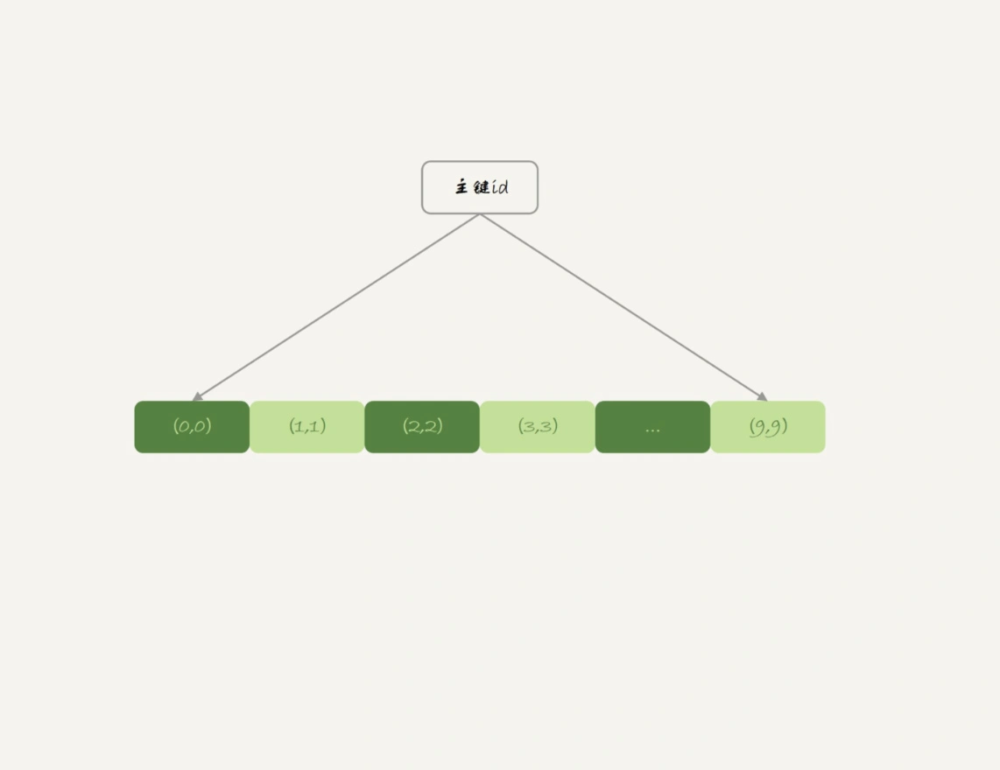
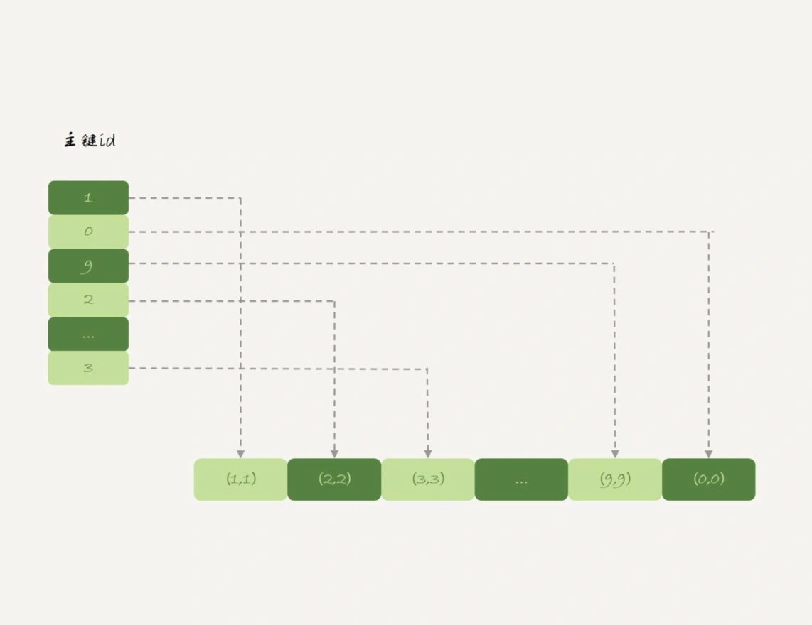
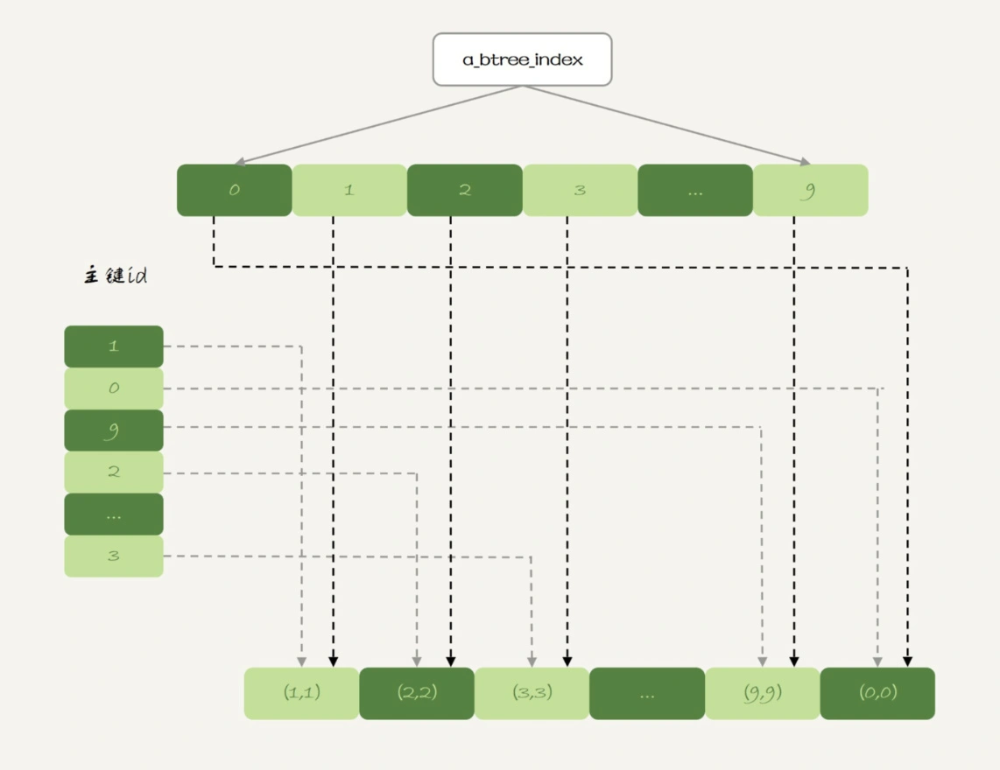
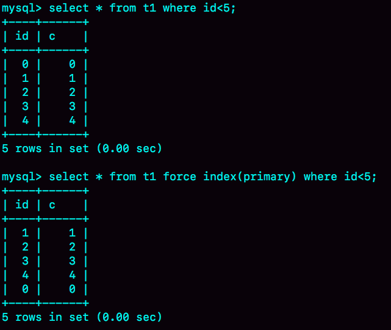
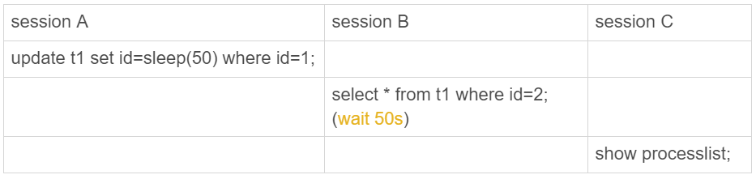
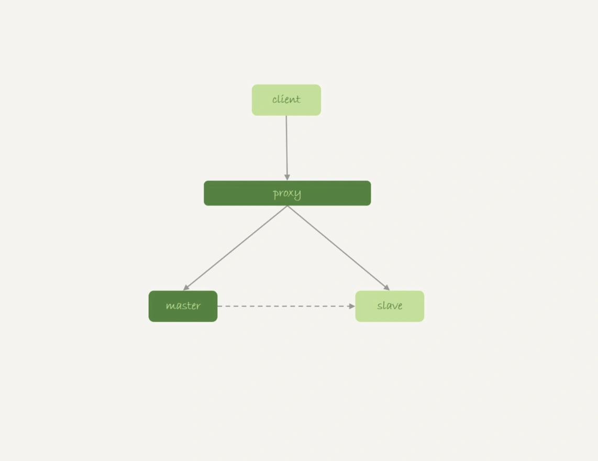

# 38讲都说InnoDB好，那还要不要使用Memory引擎

## 内存表的数据组织结构

为了便于分析，我来把这个问题简化一下，假设有以下的两张表t1 和 t2，其中表t1使用Memory 引擎， 表t2使用InnoDB引擎。

```
create table t1(id int primary key, c int) engine=Memory;
create table t2(id int primary key, c int) engine=innodb;
insert into t1 values(1,1),(2,2),(3,3),(4,4),(5,5),(6,6),(7,7),(8,8),(9,9),(0,0);
insert into t2 values(1,1),(2,2),(3,3),(4,4),(5,5),(6,6),(7,7),(8,8),(9,9),(0,0);
```

然后，我分别执行select * from t1和select * from t2。



可以看到，内存表t1的返回结果里面0在最后一行，而InnoDB表t2的返回结果里0在第一行。

出现这个区别的原因，要从这两个引擎的主键索引的组织方式说起。

表t2用的是InnoDB引擎，它的主键索引id的组织方式，你已经很熟悉了：InnoDB表的数据就放在主键索引树上，主键索引是B+树。所以表t2的数据组织方式如下图所示：



主键索引上的值是有序存储的。在执行select *的时候，就会按照叶子节点从左到右扫描，所以得到的结果里，0就出现在第一行。

与InnoDB引擎不同，Memory引擎的数据和索引是分开的。我们来看一下表t1中的数据内容。



可以看到，内存表的数据部分以数组的方式单独存放，而主键id索引里，存的是每个数据的位置。主键id是hash索引，可以看到索引上的key并不是有序的。

在内存表t1中，当我执行select *的时候，走的是全表扫描，也就是顺序扫描这个数组。因此，0就是最后一个被读到，并放入结果集的数据。

可见，InnoDB和Memory引擎的数据组织方式是不同的：

- InnoDB引擎把数据放在主键索引上，其他索引上保存的是主键id。这种方式，我们称之为**索引组织表**（Index Organizied Table）。
- 而Memory引擎采用的是把数据单独存放，索引上保存数据位置的数据组织形式，我们称之为**堆组织表**（Heap Organizied Table）。

## 两个引擎的一些典型不同

1. InnoDB表的数据总是有序存放的，而内存表的数据就是按照写入顺序存放的；
2. 当数据文件有空洞的时候，InnoDB表在插入新数据的时候，为了保证数据有序性，只能在固定的位置写入新值，而内存表找到空位就可以插入新值；
3. 数据位置发生变化的时候，InnoDB表只需要修改主键索引，而内存表需要修改所有索引；
4. InnoDB表用主键索引查询时需要走一次索引查找，用普通索引查询的时候，需要走两次索引查找。而内存表没有这个区别，所有索引的“地位”都是相同的。
5. InnoDB支持变长数据类型，不同记录的长度可能不同；内存表不支持Blob 和 Text字段，并且即使定义了varchar(N)，实际也当作char(N)，也就是固定长度字符串来存储，因此内存表的每行数据长度相同。

由于内存表的这些特性，每个数据行被删除以后，空出的这个位置都可以被接下来要插入的数据复用。比如，如果要在表t1中执行：

```
delete from t1 where id=5;
insert into t1 values(10,10);
select * from t1;
```

就会看到返回结果里，id=10这一行出现在id=4之后，也就是原来id=5这行数据的位置。

需要指出的是，表t1的这个主键索引是哈希索引，因此如果执行范围查询，比如

```
select * from t1 where id<5;
```

是用不上主键索引的，需要走全表扫描。

## hash索引和B-Tree索引

实际上，内存表也是支B-Tree索引的。在id列上创建一个B-Tree索引，SQL语句可以这么写：

```
alter table t1 add index a_btree_index using btree (id);
```

这时，表t1的数据组织形式就变成了这样：



新增的这个B-Tree索引你看着就眼熟了，这跟InnoDB的b+树索引组织形式类似。

作为对比，你可以看一下这下面这两个语句的输出：



可以看到，执行select * from t1 where id<5的时候，优化器会选择B-Tree索引，所以返回结果是0到4。 使用force index强行使用主键id这个索引，id=0这一行就在结果集的最末尾了。

其实，一般在我们的印象中，内存表的优势是速度快，其中的一个原因就是Memory引擎支持hash索引。当然，更重要的原因是，内存表的所有数据都保存在内存，而内存的读写速度总是比磁盘快。

## 内存表的问题

但是，接下来我要跟你说明，为什么我不建议你在生产环境上使用内存表。这里的原因主要包括两个方面：

1. 锁粒度问题；
2. 数据持久化问题。

### 内存表的锁

我们先来说说内存表的锁粒度问题。

内存表不支持行锁，只支持表锁。因此，一张表只要有更新，就会堵住其他所有在这个表上的读写操作。

需要注意的是，这里的表锁跟之前我们介绍过的MDL锁不同，但都是表级的锁。接下来，我通过下面这个场景，跟你模拟一下内存表的表级锁。



在这个执行序列里，session A的update语句要执行50秒，在这个语句执行期间session B的查询会进入锁等待状态。

跟行锁比起来，表锁对并发访问的支持不够好。所以，内存表的锁粒度问题，决定了它在处理并发事务的时候，性能也不会太好。

### 数据持久性问题

数据放在内存中，是内存表的优势，但也是一个劣势。因为，数据库重启的时候，所有的内存表都会被清空。

你可能会说，如果数据库异常重启，内存表被清空也就清空了，不会有什么问题啊。但是，在高可用架构下，内存表的这个特点简直可以当做bug来看待了。为什么这么说呢？

**我们先看看M-S架构下，使用内存表存在的问题。**



我们来看一下下面这个时序：

1. 业务正常访问主库；
2. 备库硬件升级，备库重启，内存表t1内容被清空；
3. 备库重启后，客户端发送一条update语句，修改表t1的数据行，这时备库应用线程就会报错“找不到要更新的行”。

这样就会导致主备同步停止。当然，如果这时候发生主备切换的话，客户端会看到，表t1的数据“丢失”了。

在图8中这种有proxy的架构里，大家默认主备切换的逻辑是由数据库系统自己维护的。这样对客户端来说，就是“网络断开，重连之后，发现内存表数据丢失了”。

你可能说这还好啊，毕竟主备发生切换，连接会断开，业务端能够感知到异常。

但是，接下来内存表的这个特性就会让使用现象显得更“诡异”了。由于MySQL知道重启之后，内存表的数据会丢失。所以，担心主库重启之后，出现主备不一致，MySQL在实现上做了这样一件事儿：在数据库重启之后，往binlog里面写入一行DELETE FROM t1。

### 结论

基于上面的分析，你可以看到，内存表并不适合在生产环境上作为普通数据表使用。

1. 如果你的表更新量大，那么并发度是一个很重要的参考指标，InnoDB支持行锁，并发度比内存表好；
2. 能放到内存表的数据量都不大。如果你考虑的是读的性能，一个读QPS很高并且数据量不大的表，即使是使用InnoDB，数据也是都会缓存在InnoDB Buffer Pool里的。因此，使用InnoDB表的读性能也不会差。

所以，**我建议你把普通内存表都用InnoDB表来代替。**但是，有一个场景却是例外的。

这个场景就是，我们在第35和36篇说到的用户临时表。在数据量可控，不会耗费过多内存的情况下，你可以考虑使用内存表。

内存临时表刚好可以无视内存表的两个不足，主要是下面的三个原因：

1. 临时表不会被其他线程访问，没有并发性的问题；
2. 临时表重启后也是需要删除的，清空数据这个问题不存在；
3. 备库的临时表也不会影响主库的用户线程。