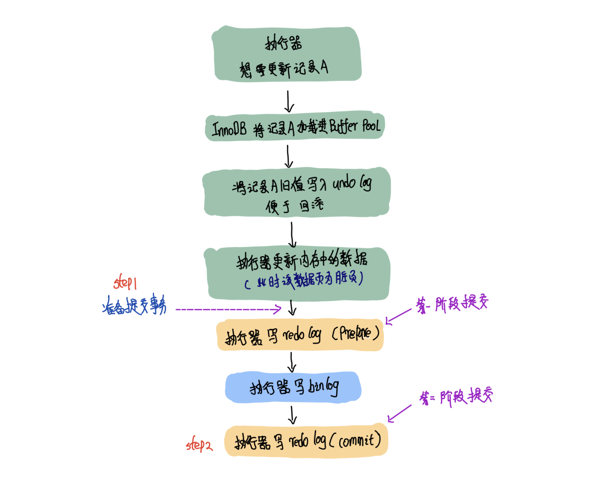

# 两阶段提交

> mysql中依靠

## 流程

两阶段包括

1. prepare 阶段：写 redo log 并将其标记为 prepare 状态
2. 写 binlog 日志
3. commit 阶段：写 redo log 并将其标记为 commit 状态

## 原因

**为了保证redolog和binlog数据的安全一致性。**

redo log可以被用来做崩溃恢复，他可以把内存中的数据页恢复过来，在一个事物未提交之前，已经有 redo log 进行了记录，将数据页变为脏页。binlog则对这个过程无任何感知，也就无法修复。

binlog常被用来做归档备份的工作，而 redo log 是循环写的，在写满时要进行刷盘，写到末尾后要从头开始继续写，因此也就做不了备份的工作了。

**能只用 binlog 么？**

不能，binlog不能支持崩溃恢复，binlog 没有能力恢复“数据页”。

**能只用 redo log 么？**

如果只从崩溃恢复的角度来讲是可以的。你可以把binlog关掉，这样就没有两阶段提交了，但系统依然是crash-safe的。

但是，如果你了解一下业界各个公司的使用场景的话，就会发现在正式的生产库上，binlog都是开着的。因为binlog有着redo log无法替代的功能。

一个是归档。redo log是循环写，写到末尾是要回到开头继续写的。这样历史日志没法保留，redo log也就起不到归档的作用。

一个就是MySQL系统依赖于binlog。binlog作为MySQL一开始就有的功能，被用在了很多地方。其中，MySQL系统高可用的基础，就是binlog复制。

还有很多公司有异构系统（比如一些数据分析系统），这些系统就靠消费MySQL的binlog来更新自己的数据。关掉binlog的话，这些下游系统就没法输入了。

**既然又要 redo log 做崩溃恢复，又要 bin log 做数据备份恢复，所以必须 通过两阶段提交的方案来保证两者的一致性。**

只有在这两个日志文件逻辑上高度一致了。你才能放心的使用redolog帮你将数据库中的状态恢复成crash之前的状态，使用binlog实现数据备份、恢复、以及主从复制。而两阶段提交的机制可以保证这两个日志文件的逻辑是高度一致的。没有错误、没有冲突。

## redo log 的写入机制

## binlog 的落盘机制

