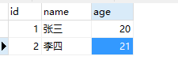
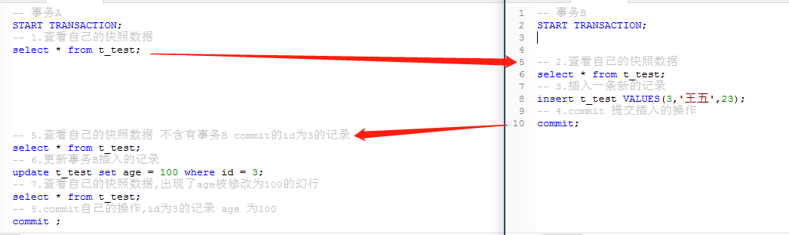

# 幻读

> 一个事务按相同的查询条件重新读取以前检索过的数据，
> 却发现其他事务插入了满足其查询条件的新数据，这种现象就称为幻读。

建表语句：

```sql
CREATE TABLE `t_test` (
  `id` int NOT NULL AUTO_INCREMENT,
  `name` varchar(5) DEFAULT NULL COMMENT '名称',
  `age` int DEFAULT NULL COMMENT '年龄',
  PRIMARY KEY (`id`)
) ENGINE=InnoDB AUTO_INCREMENT=4 DEFAULT CHARSET=utf8mb4 COLLATE=utf8mb4_0900_ai_ci;

INSERT INTO `test`.`t_test` (`id`, `name`, `age`) VALUES ('1', '张三', '20');
INSERT INTO `test`.`t_test` (`id`, `name`, `age`) VALUES ('2', '李四', '21');

```

执行结果如下：



事务A

```sql
-- 事务A
START TRANSACTION;
-- 1.查看自己的快照数据
select * from t_test;


-- 5.查看自己的快照数据 不含有事务B commit的id为3的记录
select * from t_test;
-- 6.更新事务B插入的记录
update t_test set age = 100 where id = 3;
-- 7.查看自己的快照数据,出现了age被修改为100的幻行
select * from t_test;
-- 8.commit自己的操作,id为3的记录 age 为100
commit ;
```

事务B：

```
-- 事务B
START TRANSACTION;


-- 2.查看自己的快照数据
select * from t_test;
-- 3.插入一条新的记录
insert t_test VALUES(3,'王五',23);
-- 4.commit 提交插入的操作
commit;
```

按所标顺序执行，可以看到幻读的出现。



