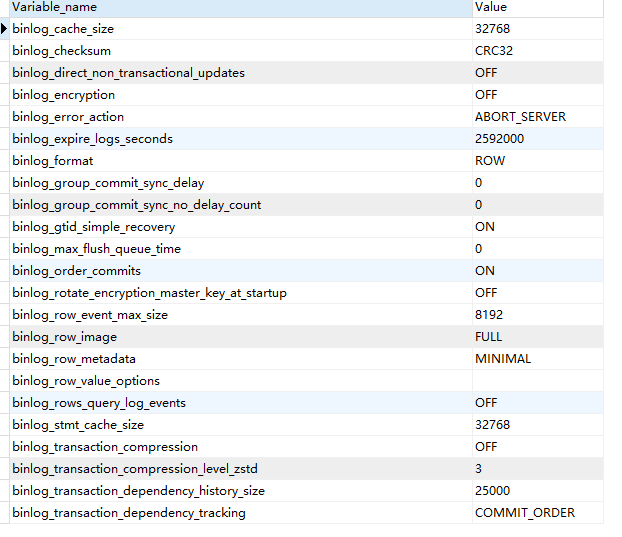

# binlog查看

## binlog相关设置查看

### 查看binlog配置项

```
show VARIABLES like '%log_bin%';
```


**log_bin:**binlog是否开启

**log_bin_basename:** 定义binary log所在的目录及bin log以什么名字开始。

**log_bin_index**：binlog的index文件位置

### binlog全局变量

```
show global variables like "binlog%";
```



binlog_format:binlog的模式，默认使用ROW。

## binlog文件操作

### 查看binlog文件列表

```
show binary logs;
```


### 查看指定binlog文件的内容

1. ```
   show binlog events in 'binlog.000004';
   ```


### 查看当前正在写入的binlog

```
show master status;
```


### 启用新binlog

关闭当前使用的binary log，然后打开一个新的binary log文件，文件的序号加1

```
flush logs;
```

## 通过mysqlbinlog查看binlog日志

mysqlbinlog是mysql自带的binlog日志查看工具，不需要另外安装，可以通过参数进行筛选等等。

注意:

1. 不要查看当前正在写入的binlog文件
2. 不要加--force参数强制访问
3. 如果binlog格式是行模式的,请加 -vv参数

### 常见参数

| 参数                            | 描述                                                         |
| ------------------------------- | ------------------------------------------------------------ |
| -d                              | 指定库的binlog                                               |
| -r                              | 相当于重定向到指定文件                                       |
| --start-position--stop-position | 按照指定位置精确解析binlog日志（精确），如不接--stop-positiion则一直到binlog日志结尾 |
| --start-datetime--stop-datetime | 按照指定时间解析binlog日志（模糊，不准确），如不接--stop-datetime则一直到binlog日志结尾 |
| -v                              | 显示sql 语句，对于ROW格式是必须的，加上才能看到sql语句       |
|                                 | -显示sql 语句加 字段类型                                     |

**备注：**mysqlbinlog分库导出binlog，如使用-d参数，那么在导入更新数据时需要在mysql命令行使用use database命令进入到相应的数据库中。因为bin-log里记录了在改mysql上面存储的所有数据库的增量操作信息，但是实际使用中我们常常需要针对某一个数据库分别进行，所以通常需要使用mysqlbinlog将binlog分库导出。

1. 基于开始/结束时间

   ```
   mysqlbinlog --start-datetime='2013-09-10 00:00:00' --stop-datetime='2013-09-10 01:01:01' -d 库名 二进制文件
   ```

2. 基于pos值

   ```
   mysqlbinlog --start-postion=107 --stop-position=1000 -d 库名 二进制文件
   ```

### 本地查看

1. 基于开始/结束时间

   ```
   mysqlbinlog --start-datetime='2013-09-10 00:00:00' --stop-datetime='2013-09-10 01:01:01' -d 库名 二进制文件
   ```

2. 基于pos值

   ```
   mysqlbinlog --start-postion=107 --stop-position=1000 -d 库名 二进制文件
   ```

### 远程查看

1. 指定开始/结束时间,并把结果重定向到本地t.binlog文件中.

   ```
   mysqlbinlog -u username -p password -hl-db1.dba.beta.cn6.qunar.com -P3306 \
   --read-from-remote-server --start-datetime='2013-09-10 23:00:00' --stop-datetime='2013-09-10 23:30:00' mysql-bin.000001 > t.binlog
   ```