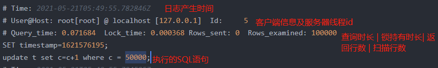

# 慢查询日志

## 1.查看是否开启慢查询日志

```mysql
-- 查看慢查询日志是否开启及日志地址
show variables like 'slow_query%';
```

结果如下：

| Variable_name       | Value            |
| ------------------- | ---------------- |
| slow_query_log      | ON               |
| slow_query_log_file | XXXXXXX-slow.log |

慢日志所在目录是MySQL的数据文件夹。

## 2.查看慢查询日志的阈值

```
show VARIABLES like 'long_query_time';
```

结果如下：

| Variable_name   | Value     |
| --------------- | --------- |
| long_query_time | 10.000000 |

默认情况下，执行超过10s的MySQL命令会被计入慢日志文件。

## 3.设置慢查询日志阈值

```
set long_query_time=0;
```

设置完成后，所有的sql都将被记录到慢日志中。

### 4.永久设置慢日志时间

3中通过命令设置慢查询日志的阈值，是临时的。

set global是全局的，除了当前链接会话，其他新产生的会话会立即生效，而set只是会话级别的，当前会话立即生效，别的会话不会有有影响。

但当数据库重启后，动态设置的参数就失效了，因此想要永久的设置它，windows下需要修改my.ini文件中的long_query_time值。

若linux下，则需要修改mysql.cnf文件。

## 5.慢日志文件内容

以下为执行一条select的sql语句的慢日志输出。

```mysql
select * from t where c=50000;
```

形式如下：

```log
# Time: 2021-05-21T05:41:16.909567Z
# User@Host: root[root] @ localhost [127.0.0.1]  Id:     5
# Query_time: 0.000265  Lock_time: 0.000000 Rows_sent: 0  Rows_examined: 0
SET timestamp=1621575676;
SET PROFILING=1;
# Time: 2021-05-21T05:41:16.911069Z
# User@Host: root[root] @ localhost [127.0.0.1]  Id:     5
# Query_time: 0.001222  Lock_time: 0.000133 Rows_sent: 357  Rows_examined: 714
SET timestamp=1621575676;
SHOW STATUS;
# Time: 2021-05-21T05:41:16.913238Z
# User@Host: root[root] @ localhost [127.0.0.1]  Id:     5
# Query_time: 0.001263  Lock_time: 0.000100 Rows_sent: 357  Rows_examined: 714
SET timestamp=1621575676;
SHOW STATUS;
# Time: 2021-05-21T05:41:16.947971Z
# User@Host: root[root] @ localhost [127.0.0.1]  Id:     5
# Query_time: 0.022712  Lock_time: 0.000119 Rows_sent: 1  Rows_examined: 100000
SET timestamp=1621575676;
select * from t where c=50000;
# Time: 2021-05-21T05:41:16.957565Z
# User@Host: root[root] @ localhost [127.0.0.1]  Id:     5
# Query_time: 0.001526  Lock_time: 0.000153 Rows_sent: 357  Rows_examined: 714
SET timestamp=1621575676;
SHOW STATUS;
# Time: 2021-05-21T05:41:16.960256Z
# User@Host: root[root] @ localhost [127.0.0.1]  Id:     5
# Query_time: 0.001279  Lock_time: 0.000124 Rows_sent: 15  Rows_examined: 318
SET timestamp=1621575676;
SELECT QUERY_ID, SUM(DURATION) AS SUM_DURATION FROM INFORMATION_SCHEMA.PROFILING GROUP BY QUERY_ID;
# Time: 2021-05-21T05:41:16.965083Z
# User@Host: root[root] @ localhost [127.0.0.1]  Id:     5
# Query_time: 0.004487  Lock_time: 0.000207 Rows_sent: 16  Rows_examined: 320
SET timestamp=1621575676;
SELECT STATE AS `状态`, ROUND(SUM(DURATION),7) AS `期间`, CONCAT(ROUND(SUM(DURATION)/0.022773*100,3), '%') AS `百分比` FROM INFORMATION_SCHEMA.PROFILING WHERE QUERY_ID=49 GROUP BY STATE ORDER BY SEQ;
# Time: 2021-05-21T05:41:17.166712Z
# User@Host: root[root] @ localhost [127.0.0.1]  Id:     5
# Query_time: 0.000229  Lock_time: 0.000128 Rows_sent: 0  Rows_examined: 0
SET timestamp=1621575677;
SELECT * FROM `test`.`t` LIMIT 0;
# Time: 2021-05-21T05:41:17.167705Z
# User@Host: root[root] @ localhost [127.0.0.1]  Id:     5
# Query_time: 0.000707  Lock_time: 0.000443 Rows_sent: 2  Rows_examined: 2
SET timestamp=1621575677;
SHOW COLUMNS FROM `test`.`t`;

```

构成大致如下：

